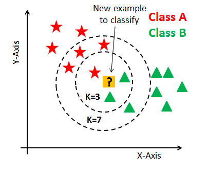
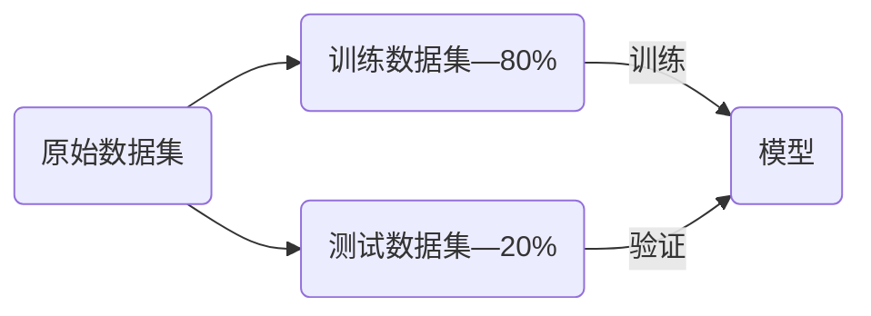
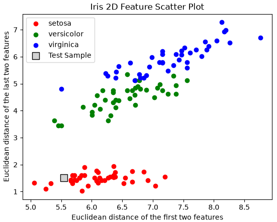
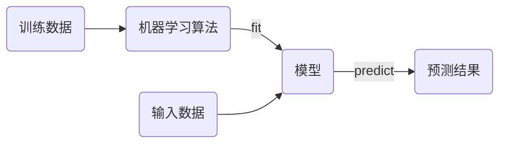
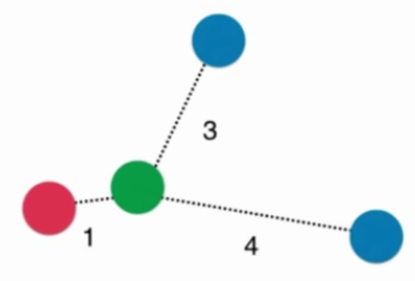
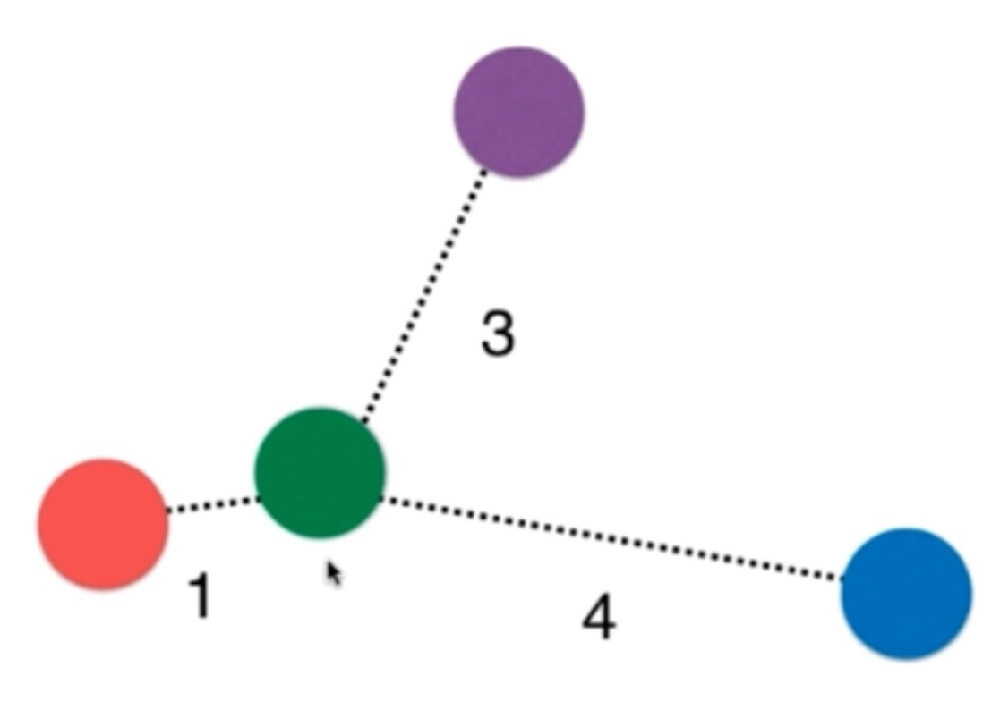
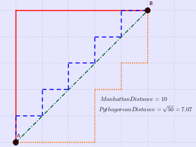

# K近邻 （KNN）

K近邻算法K-Nearest Neighbors（KNN）

1. 存在一定量的数据，包括特征和类别。
2. 计算未知类别的数据与所有已知数据的距离。
3. 选择K个距离最小的样本，以最近的K个样本进行投票。
4. 未知样本与票数最多的样本一致。



KNN的基本思想是样本距离只够接近，样本的类型可以划分为一类。使用欧拉距离来表示两个样本点之间的差异，对于 $n$ 维向量 $x$​ 其距离公式为，欧拉距离为：

$$
\sqrt{\sum_{i=1}^n\left(x_i^{(a)}-x_i^{(b)} \right)^2}
$$

1. 计算样本间所有距离
1. 对全部距离进行排序
1. 选择最近的K个样本，并获取相应的监督数据
1. 统计监督数据结果

KNN算法的特点：

* KNN算法是一个不需要训练过程的算法，可以认为KNN算法的模型就是全部训练数据本身。
* KNN算法的复杂度都集中在算法的预测过程，要从所有的样本数据中选出最小的K个距离。

## KNN算法实践

> [!tip]
>
> 对于已知数据集，如何测试机器学习算法性能的优劣？



使用测试数据解可以客观的评价算法和模型的性能。

> [!note]
>
> 1. 将二维鸢尾花数据，划分为训练集和测试集。
> 2. 将训练数据集绘制在二维平面上。

### KNN算法实现

根据上面的数据集划分，可以看到训练数据的分布如下



> [!note]
>
> 使用上面的数据实现鸢尾花的KNN算法。

### sk-learn中的算法

scikit-learn机器学习算法的流程



1. `fit`函数是训练模型，需要传入训练数据。
2. `predict`是预测函数，可以同时预测多个结果，传入数据必须为矩阵。`t.reshape`就是将预测数据转换为矩阵形式。
3. 预测结果也为二维矩阵。

### 练习

1. 使用二维鸢尾花数据，编程实践KNN算法。
2. 使用Scikit-Learn中的KNN算法，验证鸢尾花数据集。

## 超参数

* **超参数**是指运行指定机器学习算法之前需要指定的参数。KNN算法中的K是典型的超参数。
* **模型参数**是指机器学习算法中学习的参数。KNN算法中没有模型参数。

### 近邻数K

寻找好的超参数：

1. 结合各领域知识、经验数值。
2. **实验搜索。**

```python
best_score = 0.0
best_k = -1
for k in range(1, 11):
    knn_clf = KNeighborsClassifier(n_neighbors=k)
    knn_clf.fit(x_train, y_train)
    score = knn_clf.score(x_test, y_test)
    if score > best_score:
        best_k = k
        best_score = score
        
print('best_k =', best_k)
print('best_score =', best_score)
```

* K值过小：容易受到异常点的影响。
* K值过大：受到样本均衡问题的影响。

### 距离权重

对于一般KNN算法，预测的点属于蓝色类。但是一般KNN算法忽略了，样本点之间的距离的影响。



考虑到距离对预测样本的影响，增加了距离权重的参数，权重等于距离的倒数（距离越近对位置样本的影响越大，距离越远对未知样本的影响越小）。
$$
\text{Red}=1\\
\text{Blue}=\frac{1}{3}+\frac{1}{4}=\frac{7}{12}
$$

计算距离权重之后，样本预测点属于红色。



使用距离权重后，可以有效的解决多分类数据中平票的情况。

在`KNeighborsClassifier`中通过参数`weights`可以选择是否计算权重。

```python
best_method = ''
best_score = 0.0
best_k = -1
for method in ['uniform', 'distance']:
    for k in range(1, 11):
        knn_clf = KNeighborsClassifier(n_neighbors=k, weights=method)
        knn_clf.fit(x_train, y_train)
        score = knn_clf.score(x_test, y_test)
        if score > best_score:
            best_k = k
            best_score = score
            best_method = method

print('best_k =', best_k)
print('best_score =', best_score)
print('best_method =', best_method)
```

### 距离类型

距离度量（distance measure），需满足如下基本性质：

1. 非负性：$\text{Dist}(X_i,X_j) \ge 0$；
2. 同一性：$\text{Dist}(X_i,X_j) = 0$。当且仅当$X_i=X_j$。
3. 对称性：$\text{Dist}(X_i,X_j) = \text{Dist}(X_j,X_i)$。
4. 三角不等式：$\text{Dist}(X_i,X_j) \le \text{Dist}(X_j,X_k) + \text{Dist}(X_k,X_j)$

评价两个向量的相似程度有多种标准，前面只用了简单的欧式距离。



1. 曼哈顿距离

$$
d=\sum_{i=1}^N|x_i-y_i|
$$

2. 欧拉距离

$$
d=\sqrt{\sum_{i=1}^n\left(x_i^{(a)}-x_i^{(b)} \right)^2}
$$

3. 明可夫斯基距离

$$
d=\left(\sum_{i=1}^N|x_i-y_i|^p\right)^{\frac{1}{p}}
$$

这里就获得了，距离计算的超参数 $p$，用来选择不同距离的标准。

```python
best_p = -1
best_k = -1
best_score = 0.0

for k in range(1, 11):
    for p in range(1, 6):
        knn_clf = KNeighborsClassifier(n_neighbors=k, weights='distance', p=p)
        knn_clf.fit(x_train, y_train)
        score = knn_clf.score(x_test, y_test)
        if score > best_score:
            best_k = k
            best_score = score
            best_p = p
            
print('best_k =', best_k)
print('best_p =', best_p)
print('best_score =', best_score)
```

对超参数p和K进行了搜索，只有计算距离权重的情况下才会引入超参数 p。

其他距离（在sklearn中使用其它距离有特殊的api）

* 切比雪夫距离 Chebyshev Distance
* 向量空间余弦相似度 Cosine Similarity
* 调整余弦相似度 Adjust Cosine Similarity
* 皮尔逊相关系数 Pearson Correlation Coefficient
* Jaccard相似系数 Jaccard Coefficient

### 网格搜索

使用sklearn的网格搜索工具[`GridSearchCV`](https://scikit-learn.org/stable/modules/generated/sklearn.model_selection.GridSearchCV.html)，可以更便捷的进行参数搜索。

```python
%%time
x_train, x_test, y_train, y_test = train_test_split(x, y, test_size=0.2, random_state=100)
param_grid = [
    {
        'weights': ['distance'],
        'n_neighbors': [i for i in range(1, 11)],
        'p': [i for i in range(1, 6)]
    },
    {
        'weights': ['uniform'],
        'n_neighbors': [i for i in range(1, 11)]
    },
]

knn_clf = KNeighborsClassifier()

from sklearn.model_selection import GridSearchCV
grid_search = GridSearchCV(knn_clf, param_grid)

grid_search.fit(x_train, y_train)
print(grid_search.best_estimator_)
print(grid_search.best_score_)
print(grid_search.best_params_)
```

1. `param_grid`中的参数名称应该与函数名称一致，值是一个列表。
2. `grid_search.best_estimator_`最佳分类器，返回一个输入的分类器。
3. `grid_search.best_score_`最佳分类器的准确率。
4. `grid_search.best_params_`最佳分类器的相关参数。

`GridSearchCV`的参数搜索是采用**交叉验证**的方式进行的，参数预测结果和简单的变量会有出入。使用最佳模型对测试集进行预测

```python
knn_clf = grid_search.best_estimator_
knn_clf.score(x_test, y_test)
```

`GridSearchCV`中两个常用的参数

1. `n_jobs`设置参数搜索是使用的CPU核心数量，值为-1时使用全部处理器。
2. `verbose`打印搜索过程中的信息，值越大信息越详细。

```python
grid_search = GridSearchCV(knn_clf, param_grid, n_jobs=-1)
grid_search.fit(x_train, y_train)
print(grid_search.best_score_)
```

## KD树

KNN每次需要预测一个点时，都需要计算训练数据集里每个点到这个点的距离，然后选出距离最近的K个点进行投票。当数据集很大时，这个计算成本非常高。

为了避免每次都重新计算一遍距离，算法会把距离信息保存在一棵树里，这样在计算之前从树里查询距离信息，尽量避免重新计算。构造的这个树叫KD树。

[KD树详解](https://search.bilibili.com/all?vt=11410619&keyword=kd%E6%A0%91&from_source=webtop_search&spm_id_from=333.1007&search_source=5)

## KNN算法特点

K近邻算法的优点：

* 可以解决分类问题（包括多分类问题）

* 使用k近邻算法可以解决回归问题，取K个近邻的平均值，或加权平均值。


K近邻算法的缺点：

* K近邻算法的计算效率低。如果训练集有 $m$ 个样本，$n$ 维特征，每预测一个新样本需要 $O(m\times n )$​ 的时间复杂度。

* K紧邻算法对异常点过于敏感。

* K近邻算法预测结果不具有可解释性。

* k近邻算法容易陷入位数灾难。维数灾难的一个特点是，随着维度的增加，数据点之间的距离也会变得越来越大。

| 维度    | 点                         | 距离值 |
| ------- | -------------------------- | ------ |
| 1维     | 0到1                       | 1      |
| 2维     | (0, 0)到(1, 1)             | 1.414  |
| 3维     | (0, 0, 0)到(1, 1, 1)       | 1.73   |
| 64维    | (0, 0, …, 0)到(1, 1, …, 1) | 8      |
| 10000维 | (0, 0, …, 0)到(1, 1, …, 1) | 100    |
