# 梯度下降法

梯度下降法（Gradient Descent）是一种，用于优化目标函数的**迭代算法**。

* 是一种基于搜索的最优化方法。
* 最小化损失函数（最大化效用函使用梯度上升法）。

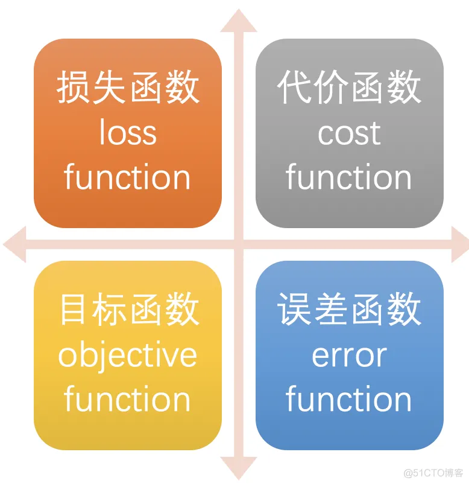

对于简单线性回归来说，损失函数如下：
$$
L=\sum_{i=1}^m \left ( y^{(i)}-ax^{(i)}-b \right )^2
$$
函数中$a$和$b$是变量

> [!important]
>
> 数学上可以证明，损失函数$L$一定是凸函数，所以损失函数可以看做开口向上的碗形。

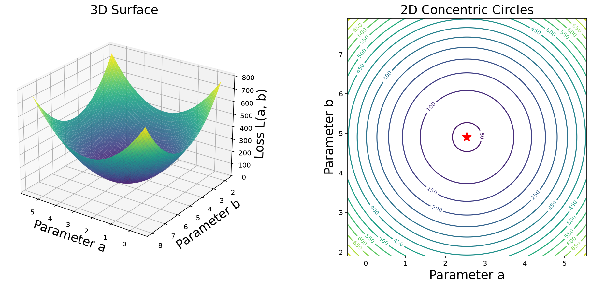

固定变量$b$（$b=0$），只考虑与特征相关的变量$a$，所以损失函数可以表示为
$$
L=f(a)=Aa^2+Ba+C
$$
对于只有一个参数的损失函数图像如下

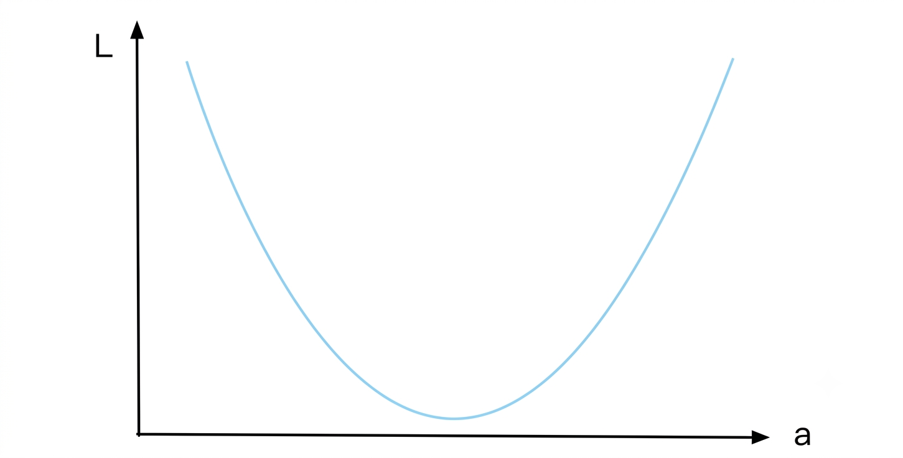

纵坐标表示损失函数$L_1$的值，横坐标表示系数$a_1$。每一个$a$值都会对应一个损失函数$L$的值，使损失函数$L$​最小，就是找到曲线的最小值点。

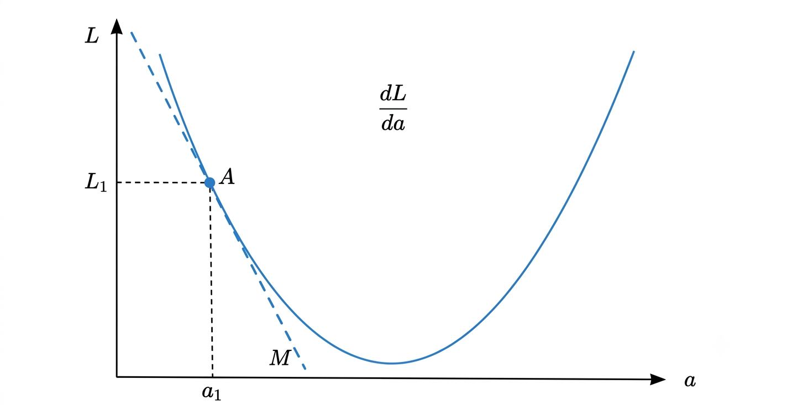

对于曲线上任意一点A，直线M是点A的切线，A的导数就是直线M的斜率，切线的斜率即为导数的符号。而导数的正负，可以指出损失函数$L$增加的方向。

* 如果${f}' (a_1) <0$，沿横坐标负方向上损失函数值增大。
* 如果${f}' (a_1) >0$，沿横坐标正方向上损失函数值增大。

对于任意一点A的取值其横坐标为$a_1$，对应的损失函数值为$L_1=f(a_1)$​，对改点的损失函数值，加一个导数值，则有
$$
a_1 + {f}' (a_1)\Rightarrow L=f(a_1 + {f}' (a_1))
$$
* 损失函数值$L$增大。

> [!important]
>
> 无论在几维空间中，一个可微函数，任一点的梯度向量，总是指向函数值增长最快的方向。（梯度是导数概念，在多元函数中的推广）

如果希望损失函数值不断变小，可以在$a_1$的基础上减小一个导数值，则有
$$
a_2=a_1 - \eta  {f}' (a_1)
$$
上式在移动过程中增加了一个比例参数$\eta$，可以更好的控制移动的幅度，

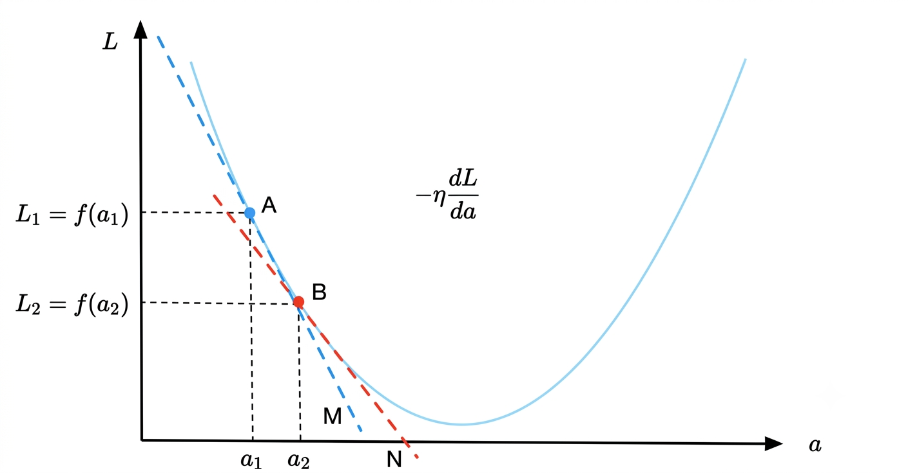

$a_1$减小后移动到$a_2$的位置，可以看出损失函数在减小，但是并没有达到极值点，因为B点的导数也不为0。在$a_2$的基础上继续减小系数，可以得到

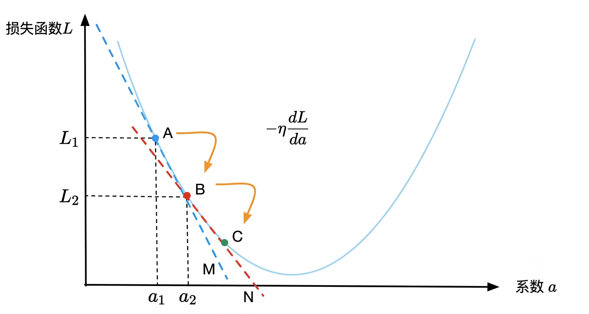

通过迭代可以找到损失函数的极小值，在上面的曲线中，极小值就是最小值。

$\eta$在机器学习中称为学习率：

* $\eta$的取值影响获得最优解的速度。
* $\eta$取值不合适时甚至得不到最优解。
* $\eta$是一个超参数。

$\eta$适当：损失函数可以快速收敛。

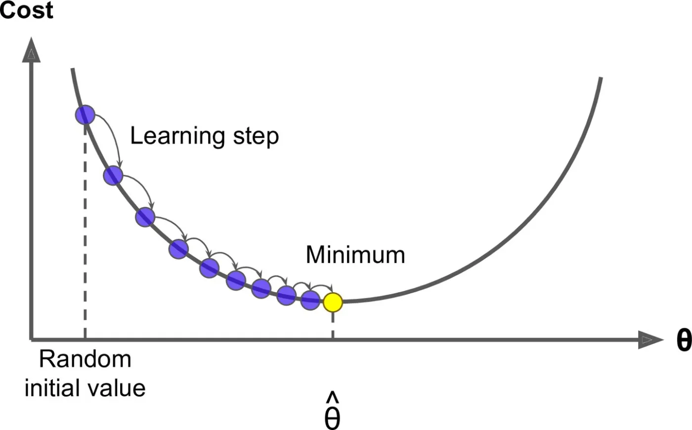

$\eta$过小：损失函数收敛速度过慢。

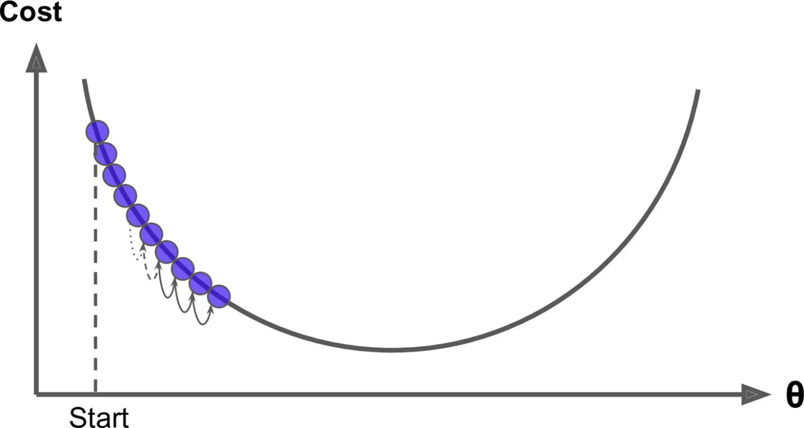

$\eta$过大：损失函数不收敛。

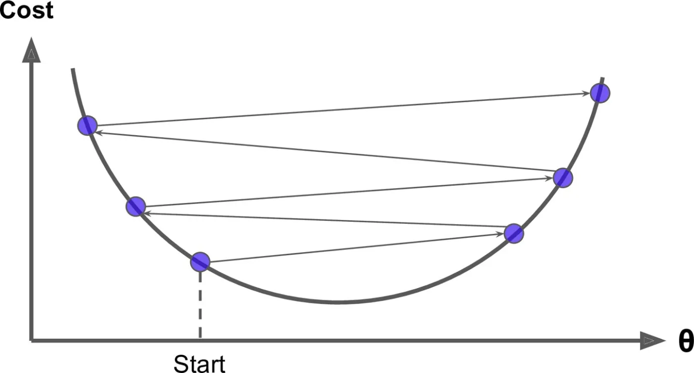

对于更一般的情况，通过减去一个微小的梯度值，迭代搜索损失函数最小值的方法，称为梯度下降法。

* 使用梯度下降法，需要计算损失函数$L$对参数的梯度。
* 梯度是一个向量，它把多元函数对所有自变量的偏导数，按照顺序汇总到一个向量里。

梯度下降法的计算过程

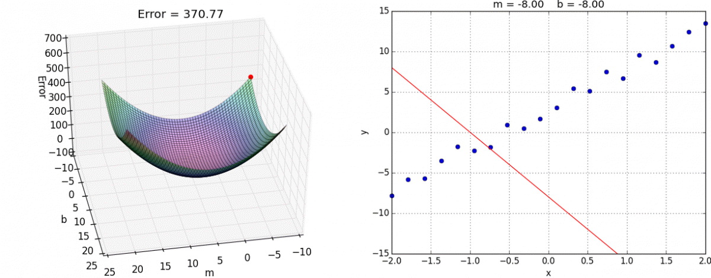

如果损失函数是非凸函数，如：深度神经网络、带有非线性约束的优化问题。假设损失函数图形如下：

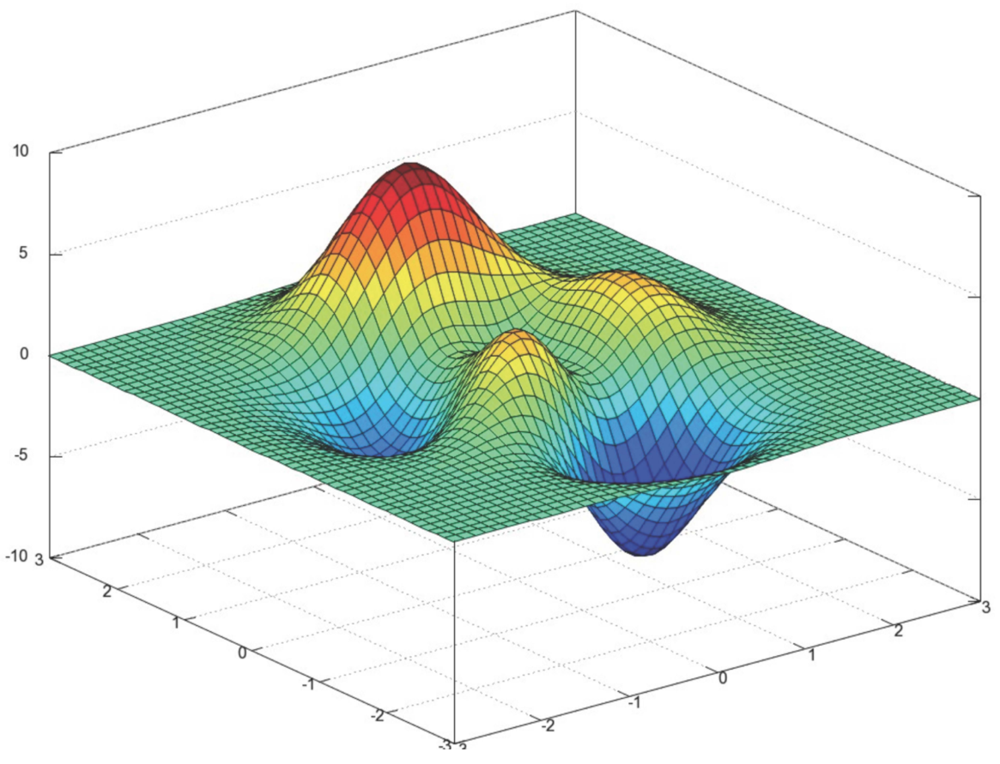

* 垂直方向是损失函数$L$的值。
* 水平面是参数的值，如：$a$和$b$。
* 假设图形上，存在损失函数的全局最小值点。
* 损失函数的极值点不唯一。
* 使用梯度下降算法，收敛的点不一定是全局最小值点。

解决的方法：随机初始化起始点，多次运行。

* 梯度下降法的初始点也是一个超参数。
* 对于简单线性回归的损失函数具有唯一的最优解。

## 模拟梯度下降法

函数
$$
y = x^2-4x+3 \Rightarrow y_{\min}=\frac{4ac-b^2}{4a}=-1, \quad x=-\frac{b}{2a}=2
$$

上式中的变量$x$，实际可以理解为损失函数$L$的参数，图像为

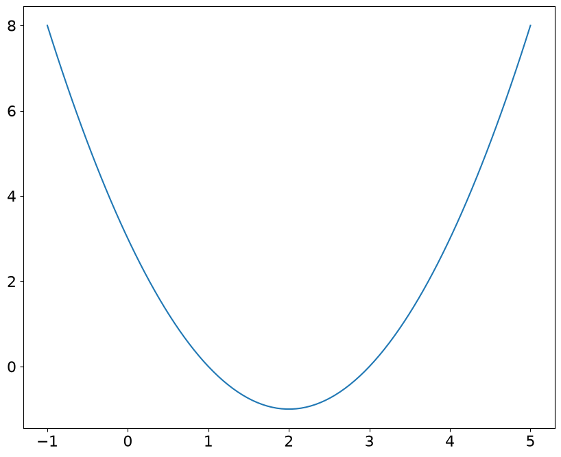

> [!note]
>
> 使用梯度下降算法计算函数的最小值，梯度计算使用解析解。

导数的定义如下
$$
\frac{df(x)}{dx}=\lim_{h\rightarrow0}\frac{f(x+h)-f(x)}{h}
$$
在程序中计算导数时，可以使用中心差分
$$
\frac{df(x)}{dx}=\lim_{h \to 0} \frac{f(x+h)-f(x-h)}{2h}
$$

> [!note]
>
> 使用中心差分来计算梯度。

## 多元函数的梯度下降法

对于一般的线性回归参数为
$$
w=\begin{bmatrix}
w_0 \\
w_1 \\
\vdots \\
w_n
\end{bmatrix}
$$

线性回归的估计值为
$$
\hat{y}^{(i)}=w_0+w_1x_1^{(i)}+w_2x_2^{(i)}+\cdots+w_nx_n^{(i)}
$$
损失函数为
$$
L=\sum_{i=1}^m \left ( y^{(i)}-\hat{y}^{(i)} \right )^2
$$
损失函数可以表示为
$$
L=\sum_{i=1}^m \left ( y^{(i)}-w_0-w_1x_1^{(i)}-w_2x_2^{(i)}-\cdots-w_nx_n^{(i)} \right )^2
$$
损失函数的梯度为$\nabla L$，在高维空间中代替导数
$$
\nabla L = \begin{bmatrix}
\frac{\partial L}{\partial w_0} \\
\frac{\partial L}{\partial w_1} \\
\vdots \\
\frac{\partial L}{\partial w_n}
\end{bmatrix}
$$
在高维空间中，通过梯度下降值，来移动$w$的值，以便找到损失函数的最小值点。梯度下降的值
$$
-\eta\nabla L
$$
对于估计值$\hat{y}^{(i)}$可以表示为
$$
\hat{y}^{(i)} =X^{(i)}_b \cdot w
$$
所以损失函数$L$可以表示为
$$
L=\sum_{i=1}^m \left ( y^{(i)}- X^{(i)}_b \cdot w \right )^2
$$
根据符合函数求导法则
$$
\frac{\partial L}{\partial w_j }=\sum_{i=1}^m 2\left ( y^{(i)}-X_b^{(i)}\cdot w \right )(-x_j^{(i)})
$$
所以$\nabla L$，可以表示为
$$
\nabla L = 
\begin{bmatrix}
\frac{\partial L}{\partial w_0 } \\
\frac{\partial L}{\partial w_1 } \\
\frac{\partial L}{\partial w_2 } \\
\vdots \\
\frac{\partial L}{\partial w_n } 
\end{bmatrix} = 
\begin{bmatrix}
\sum_{i=1}^m 2\left ( y^{(i)}-X_b^{(i)}\cdot w \right )(-1) \\
\sum_{i=1}^m 2\left ( y^{(i)}-X_b^{(i)}\cdot w \right )(-x_1^{(i)}) \\
\sum_{i=1}^m 2\left ( y^{(i)}-X_b^{(i)}\cdot w \right )(-x_2^{(i)}) \\
\vdots \\
\sum_{i=1}^m 2\left ( y^{(i)}-X_b^{(i)}\cdot w \right )(-x_n^{(i)})
\end{bmatrix} = 
2\begin{bmatrix}
\sum_{i=1}^m \left ( X_b^{(i)}w - y^{(i)} \right ) \\
\sum_{i=1}^m \left ( X_b^{(i)}w - y^{(i)} \right )x_1^{(i)} \\
\sum_{i=1}^m \left ( X_b^{(i)}w - y^{(i)} \right )x_2^{(i)} \\
\vdots \\
\sum_{i=1}^m \left ( X_b^{(i)}w - y^{(i)} \right )x_n^{(i)}
\end{bmatrix}
$$
上式中梯度计算与$m$相关，为了使梯度计算与$m$无关，则目标函数可以转换为
$$
\frac{1}{m}\sum_{i=1}^m \left ( y^{(i)}-\hat{y}^{(i)} \right )^2
$$
所以梯度计算可以表示为
$$
\nabla L = 
\begin{bmatrix}
\frac{\partial L}{\partial w_0 } \\
\frac{\partial L}{\partial w_1 } \\
\frac{\partial L}{\partial w_2 } \\
\vdots \\
\frac{\partial L}{\partial w_n } 
\end{bmatrix} =
\frac{2}{m}
\begin{bmatrix}
\sum_{i=1}^m \left ( X_b^{(i)}\cdot w - y^{(i)} \right ) \\
\sum_{i=1}^m \left ( X_b^{(i)}\cdot w - y^{(i)} \right )x_1^{(i)} \\
\sum_{i=1}^m \left ( X_b^{(i)}\cdot w - y^{(i)} \right )x_2^{(i)} \\
\vdots \\
\sum_{i=1}^m \left ( X_b^{(i)}\cdot w - y^{(i)} \right )x_n^{(i)}
\end{bmatrix}
$$
令$x_0^{(i)}\equiv 1$，上式可以整理为
$$
\nabla L = 
\frac{2}{m}
\begin{bmatrix}
\sum_{i=1}^m \left ( X_b^{(i)}\cdot w - y^{(i)} \right ) \\
\sum_{i=1}^m \left ( X_b^{(i)}\cdot w - y^{(i)} \right )x_1^{(i)} \\
\sum_{i=1}^m \left ( X_b^{(i)}\cdot w - y^{(i)} \right )x_2^{(i)} \\
\vdots \\
\sum_{i=1}^m \left ( X_b^{(i)}\cdot w - y^{(i)} \right )x_n^{(i)}
\end{bmatrix}
= 
\frac{2}{m}
\begin{bmatrix}
\sum_{i=1}^m \left ( X_b^{(i)}\cdot w - y^{(i)} \right )x_0^{(i)} \\
\sum_{i=1}^m \left ( X_b^{(i)}\cdot w - y^{(i)} \right )x_1^{(i)} \\
\sum_{i=1}^m \left ( X_b^{(i)}\cdot w - y^{(i)} \right )x_2^{(i)} \\
\vdots \\
\sum_{i=1}^m \left ( X_b^{(i)}\cdot w - y^{(i)} \right )x_n^{(i)}
\end{bmatrix} \tag{1}
$$
样本的预测误差可以表示为
$$
e=\begin{bmatrix}
X_b^{(1)}\cdot w - y^{(1)} \\
X_b^{(2)}\cdot w - y^{(2)} \\
\vdots  \\
X_b^{(m)}\cdot w - y^{(m)}
\end{bmatrix} \tag{2}
$$
则公式 $(1)$ 中第$j$个元素可以表示为
$$
\sum_{i=1}^m e_ix_j^{(i)}= e_1x_j^{(1)}+e_2x_j^{(2)}+\cdots+e_mx_j^{(m)}
$$
其中$i$表示样本的索引，$j$表示导数分量的索引。使用上面的式子整理公式 $(1)$ 可得
$$
\nabla L = 
\frac{2}{m}
\begin{bmatrix}
\sum_{i=1}^m e_ix_0^{(i)} \\
\sum_{i=1}^m e_ix_1^{(i)} \\
\vdots  \\
\sum_{i=1}^m e_ix_n^{(i)}
\end{bmatrix}
=
\frac{2}{m}
\begin{bmatrix}
x_0^{(1)}  & x_0^{(2)}  & \cdots & x_0^{(m)} \\
x_1^{(1)}  & x_1^{(2)}  & \cdots & x_1^{(m)}\\
\vdots & \vdots & \ddots & \vdots \\
x_n^{(1)}  & x_n^{(2)}  & \cdots & x_n^{(m)}
\end{bmatrix}
\begin{bmatrix}
e_1 \\
e_2 \\
\vdots \\
e_m
\end{bmatrix}
=
\frac{2}{m}
X_b^Te \tag{3}
$$
根据矩阵乘法可得
$$
X_bw=
\begin{bmatrix}
X_b^{(1)} \\
X_b^{(2)} \\
\vdots \\
X_b^{(m)}
\end{bmatrix}w
=
\begin{bmatrix}
X_b^{(1)} \cdot w \\
X_b^{(2)} \cdot w \\
\vdots \\
X_b^{(m)} \cdot w
\end{bmatrix}
$$
使用上面的式子整理公式 $(3)$ 可得
$$
e=\begin{bmatrix}
X_b^{(1)}\cdot w - y^{(1)} \\
X_b^{(2)}\cdot w - y^{(2)} \\
\vdots  \\
X_b^{(m)}\cdot w - y^{(m)}
\end{bmatrix}
=
\begin{bmatrix}
X_b^{(1)} \cdot w \\
X_b^{(2)} \cdot w \\
\vdots \\
X_b^{(m)} \cdot w
\end{bmatrix}
-
\begin{bmatrix}
y^{(1)} \\
y^{(2)} \\
\vdots \\
y^{(m)}
\end{bmatrix}
=
X_bw-y
X_b^Te 
$$
将上式的结果带入公式 $(3)$ 可得梯度的向量化计算公式
$$
\nabla L = \frac{2}{m}X_b^T \left( X_b w -y \right) \tag{4}
$$
其中$w$是未知数，该公式可以计算出任意的$w$，损失函数$L$在改点的梯度：

1. 随机初始化一个向量$w$。
2. 把向量带入公式 $(4)$ 中可以计算出$\nabla L$ 
3. 更新$w = w - \eta\nabla L$。
4. 返回第2步把新的$w$带入公式 $(4)$ ，如此循环。
5. 当$\nabla L$ 接近于零或迭代的次数足够多时停止计算。

### 梯度的调试

公式 $(4)$ 可以是梯度计算的解析解，同时梯度的计算也可以根据定义，使用中心差分公式
$$
\frac{\partial L}{\partial w_j}\approx\frac{L(w_j+\epsilon)-L(w_j-\epsilon )}{2\epsilon } \tag{5}
$$
其中$\epsilon$是一个极小数，比如$10^5$，而$L(w_j+\epsilon)$计算公式为
$$
L(w_j+\epsilon)=
\sum_{i=1}^m \left ( y^{(i)}-w_0-w_1x_1^{(i)}-\cdots-(w_j+\epsilon)x_2^{(i)}-\cdots-w_nx_n^{(i)} \right )^2
$$

* $L(w_j-\epsilon )$计算与上式类似。

公式 $(4)$ 是损失函数$L$基于均方误差（MSE）计算
$$
L_{\text{MSE}}=\frac{1}{m}\sum_{i=1}^m \left ( y^{(i)}-\hat{y}^{(i)} \right )^2
$$
> [!caution]
>
> 公式 $(4)$ 是"MSE损失函数 + 线性回归"的特定结果，不能直接套用到其他模型或损失函数上。只要损失函数或模型结构变了，梯度计算公式就需要重新推导。

当损失函数发生变化时，需要重新推导。如：损失函数改为平均绝对误差（MAE）
$$
L_{\text{MAE}}=\frac{1}{m}\sum_{i=1}^m \left | y^{(i)}-\hat{y}^{(i)} \right |
$$

* 损失函数$L_{\text{MAE}}$由于绝对值不可导，梯度会引入符号函数 $\text{sign}(\cdot)$，公式完全不同。

公式 $(5)$ 可以计算任意损失函数的梯度，所以公式 $(5)$ 可以作为梯度验证工具。

> [!note]
>
> 比较梯度向量化计算和中心差分计算的结果是否接近。

假设样本数为$m$，特征维度为$n$，比较向量化计算和中心差分计算的时间复杂度：

* 向量化计算：
  1. 计算预测值 $X_b w$：矩阵与向量相乘$(m \times n) (n \times 1)$，运算量为$O(mn)$。
  2. 计算残差$X_b w - y$：向量减法，运算量为$O(m)$。
  3. 计算梯度$X_b^T \left( X_b w -y \right)$：转置矩阵与向量相乘$(n \times m)(m \times 1)$，运算量为$O(nm)$。
  4. 标量乘法$\frac{2}{m}$：运算量为 $O(n)$。
  5. 总时间复杂度：$O(mn) + O(m) + O(mn) + O(n) = O(mn)$
* 中心差分计算
  1. $\hat{y} = X_b w$时间复杂度为$O(nm)$。
  2. 计算$L(w_j+\epsilon)$的时间复杂度为$O(m)$
  3. 所以中心差分的时间复杂度为$2\times (O(nm)+O(m))=O(nm)$
  4. 计算完整$n$维梯度的总开销：需要对$n$个参数分别求偏导，共需进行$n$次损失函数评估。
  5. 总时间复杂度：$n \times O(mn) = O(mn^2)$

> [!important]
>
> 使用向量化方法计算梯度，通常比中心差分方法的时间复杂度要低，所以编程中通常采用向量化计算方法。

### 梯度下降算法实践

> [!note]
>
> 使用梯度下降算法，计算Ames Housing Dataset采样数据的线性回归模型，比较梯度下降算法和sk-learn中线性回归模型的参数差异。

## 特征归一化

Ames Housing Dataset的采样数据

* Overall Qual：对房屋整体材料和完成度的评分，分值从1（非常差）到10（优秀）。
* Overall Cond：对房屋整体状况的评分，分值从1（非常差）到10（优秀）。
* Total Bsmt SF：地面及以上居住面积，以平方英尺为单位。
* Central Air：是否有中央空调，N=否、Y=是。
* Gr Liv Area：地下室总面积，以平方英尺为单位。
* SalePrice：销售价格，以美元为单位。

|       | Overall Qual | Overall Cond | Total Bsmt SF | Central Air | Gr Liv Area | SalePrice（预测值） |
| ----- | ------------ | ------------ | ------------- | ----------- | ----------- | ------------------- |
| 样本1 | 7            | 5            | 1092.0        | Y（1）      | 1550        | 241000              |
| 样本2 | 5            | 5            | 768.0         | N（0）      | 789         | 96500               |

数据不同维度的量纲不同，大尺度特征（如：Total Bsmt SF）是小尺度特征（如：Central Air）的数千倍，这会影响梯度下降的收敛效果：

* 如果学习率$\eta$设得稍大：大尺度特征方向更新幅度过大，容易直接“飞出”峡谷，导致梯度爆炸或损失函数发散。
* 如果学习率$\eta$ 设得极小（为了照顾大特征）：虽然能保证不发散，但小尺度特征方向的更新会非常缓慢。
* 最终，权重参数$w$会在峡谷两壁之间来回剧烈震荡（走“锯齿”路线），需要非常多的迭代次数才能缓慢接近极小值点。

解决上面问题的方法是数据归一化，数据归一化是将所有不同量纲的数据，映射在一个尺度下。

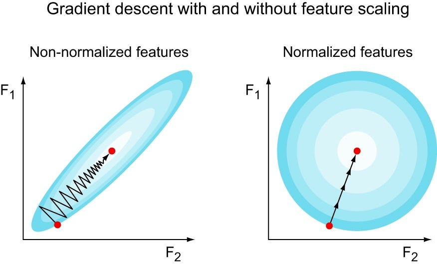

> [!important]
>
> 理论上可以证明，归一化数据不影响分类结果，但可以加快学习速率。

### 最值归一化

把所有的数据映射到0~1之间
$$
x_{\text{sacle}}=\frac{x-x_{\min}}{x_{\max}-x_{\min}}
$$
适用于分布有明显边界特征，受异常值影响比较大，如：数据集 $1,2,3, 1000, …$

* 学生考试成绩 $[0, 100]$
* 图像像素点 $[0, 255]$​

### 均值方差归一化

把所有的数据归一到平均值为0方差为1的分布中，适用于数据分布没有明显边界
$$
x_{\text{sacle}}=\frac{x-\mu}{\sigma}
$$

> [!important]
>
> 如果数据没有明显的边界，一般都采用均值方差归一化方法。

### `Scaler`归一化工具

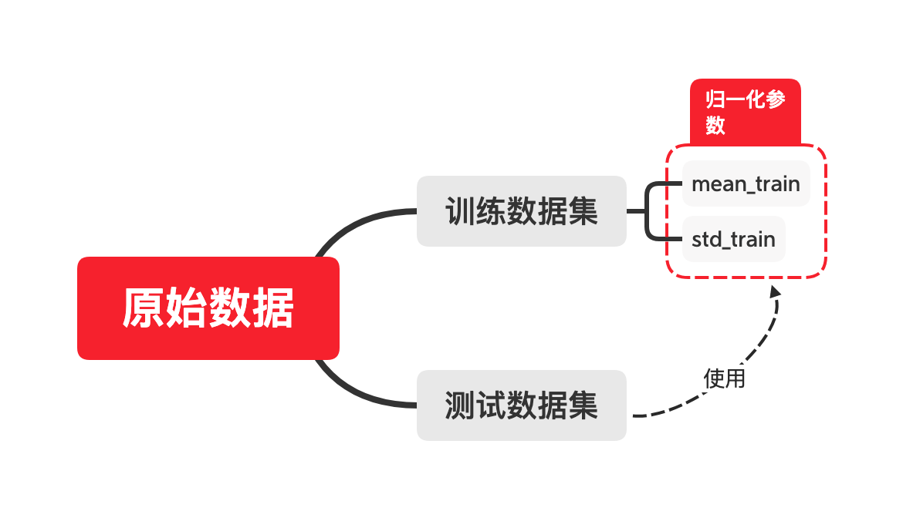

1. 真实数据无法获得均值和方差。
2. 采用均值方差归一化，要保留训练数据的均值和方差，用于处理预测数据。
3. 预测时，预测数据同样需要用测试数据的均值和方差归一化。

> [!warning]
>
> 对数据的归一化，也可以理解为算法的一部分。

在sk-learn中可以借助`Scaler`工具完成特征值归一化和均值方差保存的工作。

> [!note]
>
> 对Ames Housing Dataset采样数据进行归一化，比较梯度下降算法和sk-learn中线性回归模型的差别。

> [!important]
>
> 在线性回归中，用解析解（正规方程）求参数时，特征是否归一化不影响最终模型；但用梯度下降时，特征尺度会严重影响收敛速度和稳定性，因此必须归一化。

## 随机梯度下降法

计算梯度的过程中，对于向量化计算来说，是将全部$m$个样本，用于梯度计算
$$
\nabla L = \frac{2}{m}X_b^T \left( X_b w -y \right)
$$
假设计算过程中每次只取一个样本则有
$$
\nabla L_i = 2\left(X_b^{(i)}\right)^T \left( X_b^{(i)} w - y^{(i)} \right)
$$

* $\left(X_b^{(i)}\right)^T$是形状为 $(n \times 1)$ 的列向量；
* $\left( X_b^{(i)} w - y^{(i)} \right)$是标量；
* 计算结果仍是一个 $(n \times 1)$ 的梯度列向量。

如果每次迭代随机选择一个样本用于最小化迭代，则称为随机梯度下降。

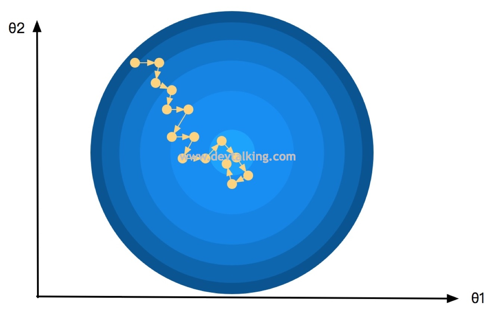

* 每次只用**单个样本**计算梯度，单个样本的梯度方向包含很大的噪声和随机性。导致更新路径不是一条笔直指向圆心的直线，而是不断发生曲折、甚至有时会向远离圆心的偏斜方向走。
* 从统计期望来看，单样本梯度的期望等于真实的全量梯度。因此，只要迭代次数足够多，噪声会被相互抵消，总体方向依然能向最小值靠拢。
* 到了优化后期，全量梯度已经接近于$0$，但由于单个样本带来的梯度噪声依然存在，哪怕到了极小值附近，更新步长也不会自动变为$0$，从而导致参数在极小值点周围徘徊。

> [!note]
>
> 使用sk-learn中的随机梯度下降算法，对Ames Housing Dataset采样数据进行拟合，比较算法与另外两种算法的差异。

随机计算在机器学习领域的优势主要表现在

* 跳出局部最优解
* 更快的运算速度

### 关于梯度下降法

* 批量梯度下降法（Batch Gradient Descent）
* 随机梯度下降法（Stohastic Gradient Descent）
* 小批量梯度下降法（Mini-Batch Gradient Descent）

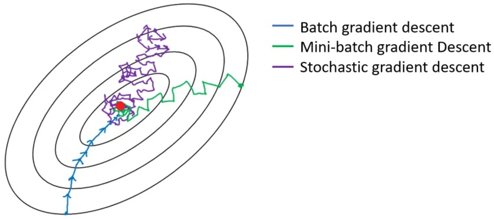

小批量梯度下降法的梯度计算公式为
$$
\nabla L = \frac{2}{B}X_b^T \left( X_b w -y \right)
$$

* 其中$B$是每个批次随机选择的样本数量，$B<m$。
* $X_b$中的行数为$B$，形状为$B\times(n+1)$。
