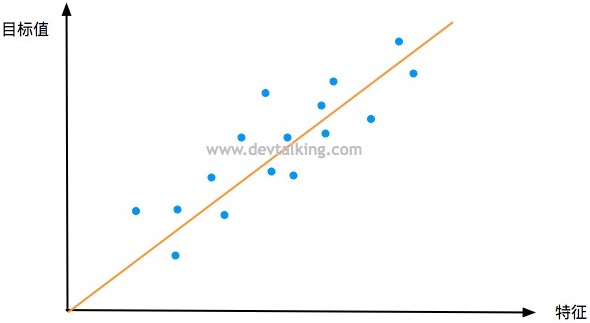
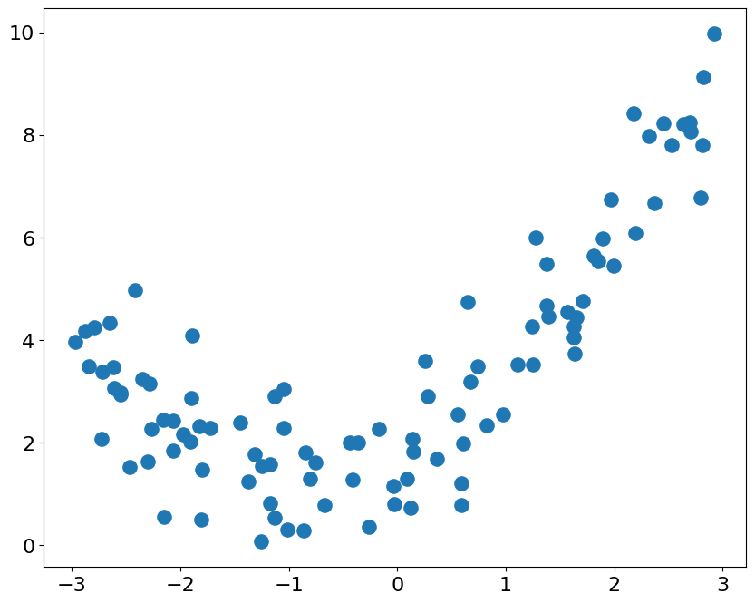
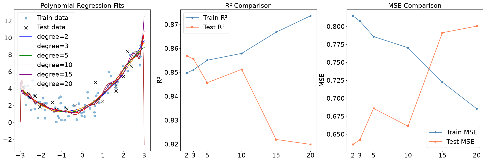
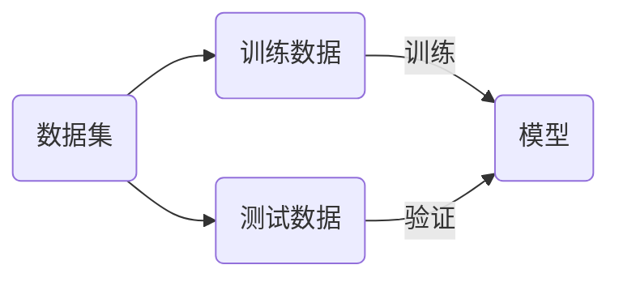
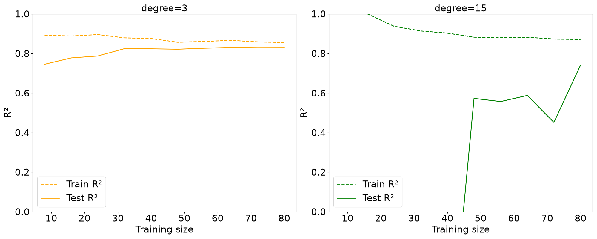
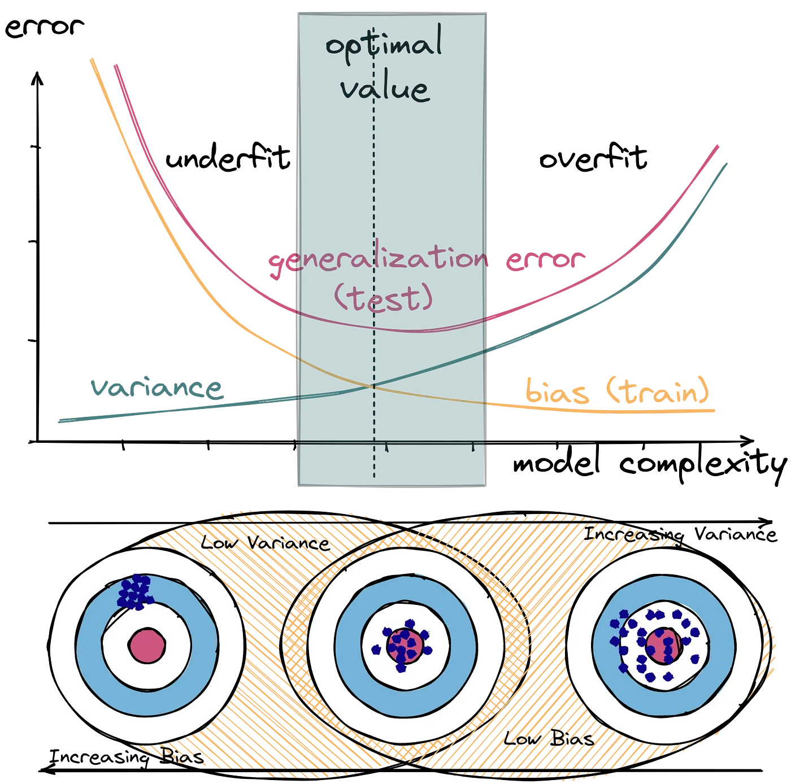

# 多项式回归与模型泛化

使用线性回归去拟合样本数据，要数据存在一定线性关系的。但现实情况是，大多数的样本数据都没有明显的线性关系，所以需要模型可以处理非线性数据。

## 多项式回归

在线性回归中，使用一条直线来拟合数据。



线性模型为
$$
y=ax+b
$$
假设数据分布情况如下


如果要更好的拟合上图中的数据，则需要选择一条曲线，模型为
$$
y = ax^2+bx+c
$$
如果将$x^2$看做特征$x_1$，$x$看做特征$x_2$，则上述模型可以表示为
$$
y=ax_1+bx_2+c
$$

> [!warning]
>
> 低维的非线性模型，在高维特征空间中，可以表示为线性模型。

生成二维曲线的模拟数据

```python
import numpy as np
import matplotlib.pyplot as plt

np.random.seed(42)
x = np.random.uniform(-3, 3, size=100)
X = x.reshape(-1, 1)
y = 0.5 * x ** 2 + x + 2 + np.random.normal(0, 1, 100)

plt.figure(figsize=(10, 8))
plt.scatter(x, y, s=120)
plt.xticks(fontsize=16)
plt.yticks(fontsize=16)
plt.show()
```

数据的分布为



> [!note]
>
> 使用线性回归来拟合上面的曲线，比较使用基本特征和多项式特征，比较两种拟合的$R^2$差异。

根据麦克劳林公式（Maclaurin Series）有，麦克劳林公式是泰勒公式的特例
$$
f(x)=f(0)+{f(0)}'x+\frac{{f(0)}'' }{2!}x^2+…+\frac{f^{(n)}(0)}{n!}x^n+R_n(X)
$$
在多项式回归中上式可以表示为
$$
y=w_1x+w_2x^2+w_3x^3+…+w_nx^n+w_0
$$
通过机器学习的方式，可以学习出参数$(w_1, w_2, w_3, …, w_n)$。

> [!important]
>
> 理论上任何形式的函数，都可以通过多项式回归来模拟。

### sklearn中多项式回归

sk-learn中`PolynomialFeatures`可以对数据进行升维（对数据进行预处理），然后使用线模型训练数据。

> [!note]
>
> 使用sk-learn中的工具，拟合二次函数的模型。

原始特征有一个，使用三次多项式对特征进行拓展
$$
x \Rightarrow 1,\quad x, \quad x^2, \quad x^3
$$
原始特征有两个，使用三次多项式对特征进行拓展
$$
x, \quad  y \Rightarrow \begin{matrix}
1, \quad x, \quad y \\
x^2, \quad y^2, \quad xy \\
x^3, \quad y^3, \quad x^2y \quad xy^2 \\
\end{matrix}
$$

随着输入特征数量的增加，使用多项式对特征进行拓展后，特征数量增长非常快。通过多个特征的组合，来丰富样本数据。

### Pipeline

sk-learn中的`Pipeline`工具，可以将若干步骤打包成一个对象（相当于制作一个流程模板）：

* `Pipeline`参数接收的是一个列表，对应多个处理步骤。
* 对于不同的样本数据只需用`Pipeline`统一处理。

> [!note]
>
> 使用`Pipeline`对多项式回归的流程进行封装。

## 过拟合与欠拟合

拟合就是让模型，去学习训练数据中的规律的过程。针对模拟数据

```python
y = 0.5 * x ** 2 + x + 2 + np.random.normal(0, 1, 100)
```

划分训练集和测试集

* 分别是2、3、5、10、15和20次多项式对训练数据进行拓展。
* 比较训练集和测试集的$R^2$指标与MSE指标的变化。



> [!tip]
>
> 上面的模型，训练集的误差越来越小，但这表示模型更好吗？

1. 随着多项式次数的增加，拟合的曲线越来越复杂。
2. 训练集的$R^2$指标不断靠近1，但是测试集的指标不断减少。
3. 训练集的MSE指标不断减小，但是测试集的指标不断增加。

过拟合（overfitting）是指过于紧密或精确地匹配特定数据集，以致于无法良好地拟合其他数据或预测未来的观察结果的现象。 过拟合模型指的是参数过多或者结构过于复杂的统计模型。

最经典的过拟合例子


欠拟合（Underfitting）是指机器学习模型在训练数据上不能很好地拟合数据的现象。模型过于简单，无法捕捉到数据中的内在规律和特征，导致在训练数据和测试数据上都表现出较差的性能。

欠拟合一般的情况：

* 模型太简单，如：用线性回归去拟合明显是二次曲线的数据。
* 特征太少，如：预测房价只用“面积”一个特征，忽略了地段、楼层等。

### 训练集合与测试集

当模型出现过拟合现象时，对于新的数据，无法准确的预测，这说明模型的泛化能力较差。模型的泛化能力，就是模型在未知数据集上的预测能力。

> [!warning]
>
> 模型训练的目的是最好的预测未知数据，而不是拟合所有的已知数据。



使用测试集来评价模型的泛华能力：

* 模型在测试数据集上，表现出很好的结果，说明泛化能力强。
* 模型在测试数据上，表现不好，说明泛化能力差。

训练准确率与测试集评价标准差异：

1. 如果差值 > 10%，通常表示严重过拟合。
2. 如果差值在5% - 10%，表示轻微过拟合。
3. 如果差值 < 5%，模型泛化能力较好。

特征的多项式次数不断增加的过程中，模型的复杂度也在不断增加。模型的复杂度和预测的错误率之间曲线如下


### 学习曲线

学习曲线是模型在训练集和验证集上的性能随训练样本量增加而变化的趋势图，用于诊断模型是欠拟合还是过拟合。

* 横轴（X轴）：训练数据量的大小。
* 纵轴（Y轴）：模型的误差（MSE）或准确率（$R^2$）。



随着样本数量的增加

* 训练集和测试集的评价标准差距不大，表示模型拟合较好。
* 训练集和测试集的评价标准差距较大，表示存在过拟合。

## 偏差和方差的平衡


$$
模型误差=偏差+方差
$$

1. 偏差大表示模型预测的不准确。导致偏差的主要原因是：对问题的假设不正确、欠拟合等。
2. 方差大表示数据的一点点扰动都会较大的影响模型。导致方差的主要原因是：使用太复杂的模型、过拟合等。

有些算法天生是高方差算法：

* KNN算法。
* 非参数学习通常都是高方差算法。因为不对数据进行任何假设。

有些算法天生是高偏差算法：

* 线性回归算法。
* 参数学习通常是高偏差的算法。因为对数据有极强的假设。

大多数算法具有相应的参数，可以调解偏差和方差。在机器学习算法中，偏差和方差是相互制约：

* 降低偏差，会提高方差。
* 降低方差，会提高偏差。

> [!important]
>
> 机器学习的主要挑战，来自于方差。

解决高方差问题的通常手段：

* 降低模型复杂度。
* 减少数据维度，降噪。
* 增加样本数量。
* 增加样本的多样性，更符合真实环境。
* 使用验证集。
* 模型正则化。

## 模型正则化

模型正则化是通过限制参数的大小，来防止模型过拟合。生成线性数据如下

```python
np.random.seed(42)
x = np.random.uniform(-3, 3, size=100)
X = x.reshape(-1, 1)
y = 0.5 * x + 3 + np.random.normal(0, 1, 100)
plt.scatter(x, y)
plt.show()
```

使用多元线性回归来训练上述模型

```python
lin_reg = LinearRegression()

def PolynomialRegression(degree):
    return Pipeline([
        ('poly', PolynomialFeatures(degree=degree)),
        ('std_scaler', StandardScaler()),
        ('lin_reg', lin_reg)
    ])

np.random.seed(666)
X_train, X_test, y_train, y_test = train_test_split(X, y)

poly10_reg = PolynomialRegression(degree=20)
poly10_reg.fit(X_train, y_train)
y10_predict = poly10_reg.predict(X_test)
mean_squared_error(y_test, y10_predict)
```

绘制拟合曲线

```python
def plot_model(model):
    X_plot = np.linspace(-3, 3, 100).reshape(100, 1)
    y_plot = model.predict(X_plot)
    plt.figure(figsize=(10, 8))
    plt.scatter(x, y, s=120)
    plt.plot(X_plot[:, 0], y_plot, color='r')
    plt.axis([-3, 3, 0, 6])
    plt.xticks(fontsize=16)
    plt.yticks(fontsize=16)
    plt.show()

plot_model(poly10_reg)
```

打印模型参数值

```python
lin_reg.coef_
```

> [!warning]
>
> 当`lin_reg.coef_`的值足够大，特征微小的变化最终的分类值都会变化比较大，相当于将误差放大。如：当 $\theta_1,\theta_2,\theta_0\rightarrow 10\theta_1, 10\theta_2, 10\theta_0$ 时，不影响分类结果，输出的波动会增加。
>

### 岭回归

多项式回归的目标函数
$$
\sum_{i=1}^m \left (y^{(i)}-\theta_0-\theta_1X_1^{(i)}-\theta_2X^{(i)}-…-\theta_nX_n^{(i)} \right)^2
$$
使上面的目标函数最小即
$$
J(\theta)=MSE(y, \hat y; \theta)
$$
上述函数最小，为使上述$\theta$的值不会特别大，目标函数转换为如下形式
$$
J(\theta)=MSE(y, \hat y; \theta)+\alpha\frac{1}{2}\sum_{i=1}^{n}\theta_i^2
$$

* 模型正则化部分去掉了$\theta_0$。
* $\alpha$表示超参数。
* $\frac{1}{2}$可以加，也可以不加用于抵消微分。

上面的模型正则化称为岭回归。抑制$\theta$在分类正确情况下，按比例无限增大。使用sklearn来模拟岭回归过程。参数$\alpha=0.0001$

```python
from sklearn.linear_model import Ridge

def RidgeRegression(degree, alpha):
    return Pipeline([
        ('poly', PolynomialFeatures(degree=degree)),
        ('std_scaler', StandardScaler()),
        ('ridge_reg', Ridge(alpha=alpha))
    ])

ridge1_reg = RidgeRegression(20, 0.0001)
ridge1_reg.fit(X_train, y_train)
y1_predict = ridge1_reg.predict(X_test)
mean_squared_error(y_test, y1_predict)
```

绘制上述岭回归曲线

```python
plot_model(ridge1_reg)
```

修改参数$\alpha=1$训练模型，并绘制曲线。

```python
ridge2_reg = RidgeRegression(20, 1)
ridge2_reg.fit(X_train, y_train)
y2_predict = ridge2_reg.predict(X_test)
print(mean_squared_error(y_test, y2_predict))
plot_model(ridge2_reg)
```

修改参数$\alpha=100$训练模型，并绘制曲线。

```python
ridge3_reg = RidgeRegression(20, 100)
ridge3_reg.fit(X_train, y_train)
y3_predict = ridge3_reg.predict(X_test)
print(mean_squared_error(y_test, y3_predict))
plot_model(ridge3_reg)
```

修改参数$\alpha=1000000$训练模型，并绘制曲线。

```python
ridge4_reg = RidgeRegression(20, 1000000)
ridge4_reg.fit(X_train, y_train)
y4_predict = ridge4_reg.predict(X_test)
print(mean_squared_error(y_test, y4_predict))
plot_model(ridge4_reg)
```

当$\alpha$非常大时仅有正则化部分起作用，即使得参数$\theta$最小，变成一条直线。

### LASSO回归

lasso会的目标函数为
$$
J(\theta)=MSE(y, \hat y; \theta)+\alpha\sum_{i=1}^{n} \left| \theta_i \right|
$$
使其最小。

使用sk-learn来模拟LASSO回归过程。参数$\alpha=0.01$训练模型，并绘制曲线。

```python
from sklearn.linear_model import Lasso

def LassoRegression(degree, alpha):
    return Pipeline([
        ('poly', PolynomialFeatures(degree=degree)),
        ('std_scaler', StandardScaler()),
        ('lasso_reg', Lasso(alpha=alpha))
    ])

lasso1_reg = LassoRegression(20, 0.01)
lasso1_reg.fit(X_train, y_train)
y1_predict = lasso1_reg.predict(X_test)
print(mean_squared_error(y_test, y1_predict))
plot_model(lasso1_reg)
```

参数$\alpha=0.1$训练模型，并绘制曲线。

```python
lasso2_reg = LassoRegression(20, 0.1)
lasso2_reg.fit(X_train, y_train)
y2_predict = lasso2_reg.predict(X_test)
print(mean_squared_error(y_test, y2_predict))
plot_model(lasso2_reg)
```

参数$\alpha=1$训练模型，并绘制曲线。

```python
lasso3_reg = LassoRegression(20, 1)
lasso3_reg.fit(X_train, y_train)
y3_predict = lasso3_reg.predict(X_test)
print(mean_squared_error(y_test, y3_predict))
plot_model(lasso3_reg)
```

> [!warning]
>
> * LASSO回归正则化部分倾向于让$\theta$值变为0，LASSO回归可以用于特征选择。
> * 岭回归正则化部分倾向于让$\theta$值变为一个极小的值，但不为0。

### L1、L2正则

P范数公式如下
$$
\left \| X \right \|_p  = \left ( \sum_{i=1}^n \left | x_i \right |^p  \right )^{\frac{1}{p}}
$$

* 岭回归的正则项，在上式中$p=2$，称为L2正则。
* LASSO回归的正则项，在上式中$p=1$，称为L1正则。

### 弹性网络

目标函数
$$
J(\theta)=MSE(y, \hat y; \theta)+r\alpha\sum_{i=1}^{n} \left| \theta_i \right|+\frac{1-r}{2}\alpha\sum_{i=1}^{n}\theta_i^2
$$
正则项优先选择岭回归，其次是弹性网络，最后是LASSO回归。

