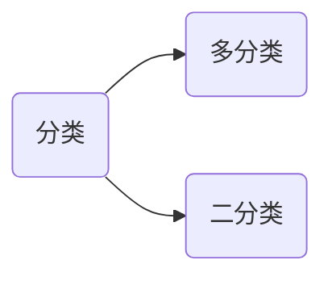
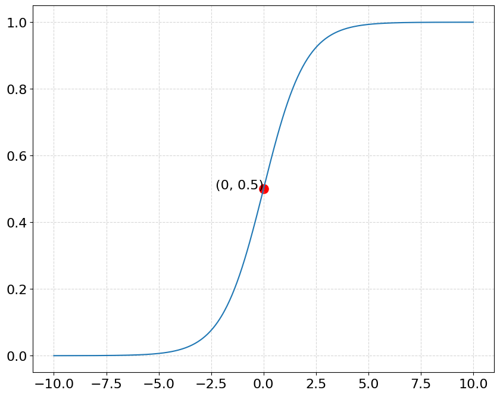
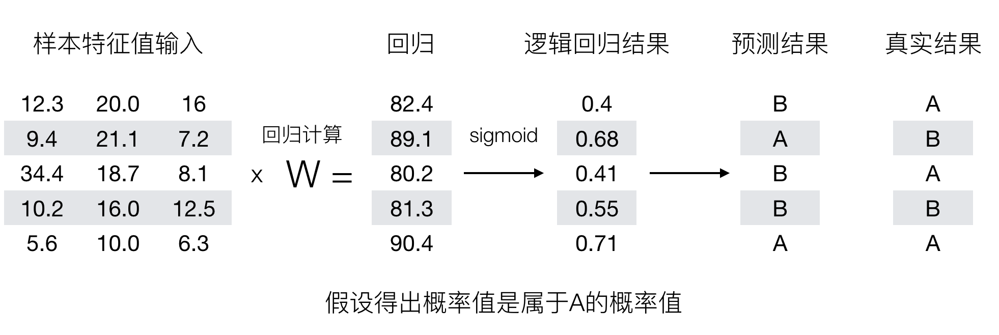
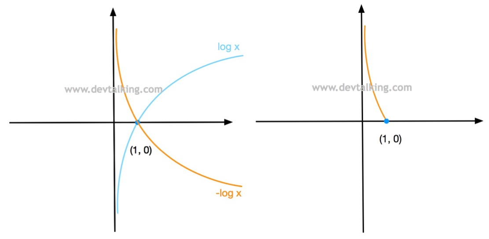
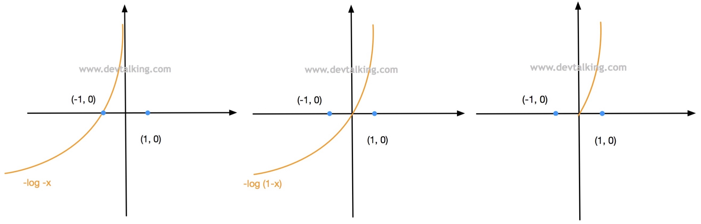
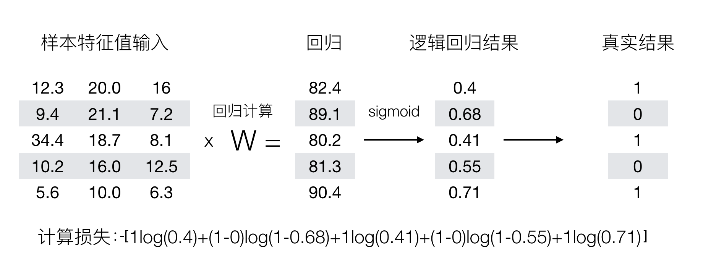
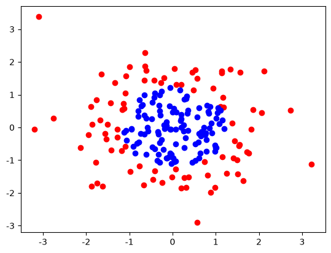
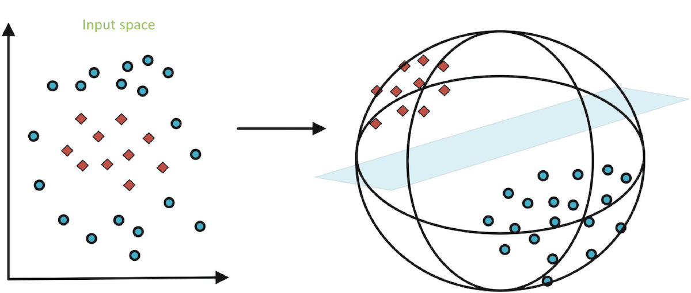
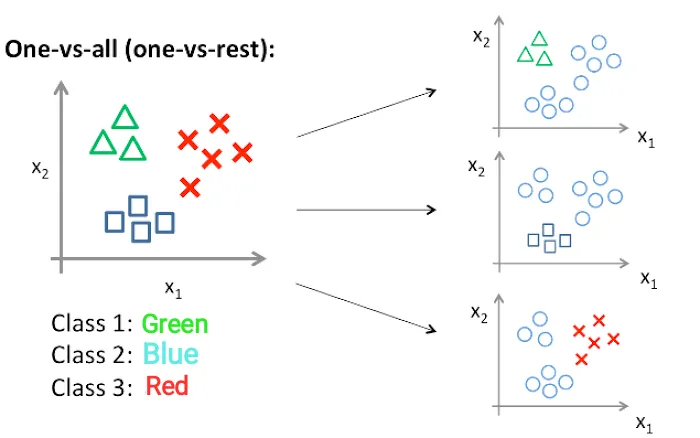
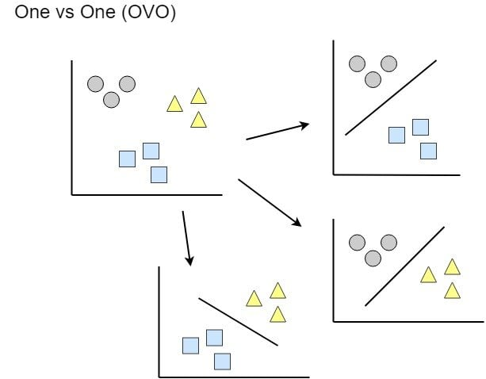

# 逻辑回归

逻辑回归是一个二元分类的概率模型，用于解决二分类问题。



对于二分类问题，假设其中一个类别的概率为 $P_1$，不属于该类的概率是 $P_2$，则有：
$$
P_1+P_2=1
$$
二分类要求两个类别是互斥的。逻辑回归将样本的特征和样本发生的概率联系起来

$$
\hat{p}=f(x) \qquad 
\hat{y}=\begin{cases}
 1, & \hat{p}\ge 0.5\\
 0, & \hat{p}< 0.5\\
\end{cases}
$$
* $\hat{p}$表示模型预测的概率。
* $\hat{y}$表格根据概率判断类别的标签。

> [!note]
>
> 标准的逻辑回归用于分类，只能解决二分类问题。

在线性回归中
$$
\hat{y}=f(x) \Rightarrow \hat{y}= X_bw
$$
其中$\hat{y}\in \left [ -\infty, + \infty \right ]$ ，为了使结果映射到概率的值域$\left [0, 1\right ]$，存在函数
$$
\hat{p}=\sigma \left( X_b w \right)
$$
其中
$$
\sigma(t)=\frac{1}{1+e^{-t}}
$$
称为sigmod函数。该函数的曲线为



sigmod函数曲线的特点

* 值域是在$\left [0, 1\right ]$之间。
* 当$t>0$时，$p>0.5$；当$t<0$时，$p<0.5$；当$t=0$时，$p=0.5$。

所以概率$\hat{p}$可以表示为
$$
\hat{p}=\sigma \left( X_b w \right)=\frac{1}{1+e^{-(X_b w)}} \qquad
\hat{y}=\begin{cases}
 1, & \hat{p}\ge 0.5\\
 0, & \hat{p}< 0.5\\
\end{cases}
$$

线性回归和逻辑回归的区别：

1. 线性回归用于预测连续的值。
2. 逻辑回归用于分类。

逻辑回归的预测过程



> [!tip]
>
> 如何去衡量，逻辑回归的预测结果与真实结果的差异呢？

## 逻辑回归的损失函数

逻辑回归损失函数的特点：

* 如果$y=1$，$p$越小损失越大。
* 如果$y=0$，$p$越大损失越大。

根据上述特点定义损失函数
$$
L = \begin{cases}
-\log(\hat{p})    & \text{ if } y=1 \\
-\log(1-\hat{p})  & \text{ if } y=0
\end{cases}
$$
* 根据概率定义$\hat{p}$和$1-\hat{p}$的取值范围都在$\left [0, 1\right ]$之间。

当$y=1$时，损失函数为$-\log(\hat{p})$



* 函数在$\left [0, 1\right ]$之间单调递减。
* $p$越小损失越大；$p$越大损失越小。
* 当$p=1$时，损失函数为0。

当$y=0$时，损失函数为$-\log(1-\hat{p})$，所以$-\log(1-\hat{p})$的曲线为



* 函数在$\left [0, 1\right ]$之间单调递增。
* $p$越大损失越大；$p$越小损失越小。
* 当$p=0$时，损失函数为0。

将上面的分段函数整合为一个函数
$$
L=-y\log(\hat{p})-(1-y)\log(1-\hat{p})
$$
* 当$y=1$时，函数$-y\log(\hat{p})$有效。
* 当$y=0$时，函数$(1-y)\log(1-\hat{p})$有效。

所以m个样本的逻辑回归的损失函数为
$$
L=-\frac{1}{m}\sum_i^{m}\left (y^{(i)}\log(\hat{p}^{(i)})+(1-y^{(i)})\log(1-\hat{p}^{(i)})\right)
$$
其中
$$
\hat{p}^{(i)}=\sigma \left( \mathbf{x}^{(i)} \cdot w \right)=\frac{1}{1+e^{-(\mathbf{x}_b^{(i)} \cdot w)}}
$$

二分类问题中，使用的损失函数称为**对数损失函数**。损失函数的计算如下



逻辑回归的优化目标也是使得损失函数值最小：

* 求损失函数的最小值，没有解析解。
* 上述函数是凸函数，存在唯一的一个全局最优解。
* 可以使用梯度下降法求解。

### 逻辑回归的梯度计算

根据上面的公式逻辑回归的损失函数表示为如下式子：
$$
L=-\frac{1}{m}\sum_i^{m}\left (y^{(i)}\log \left(\sigma \left( t \right)\right)+(1-y^{(i)})\log \left(1-\sigma \left( t \right)\right)\right) \quad t=\mathbf{x}_b^{(i)} \cdot w
$$
其中对sigmod函数的导数，该倒数可以用其自身表示
$$
\sigma(t)=\frac{1}{1+e^{-t}} \Rightarrow 
{\sigma(t)}' =\sigma(t)(1-\sigma(t))
$$
所以$\log\sigma(t)$的导数可以表示为
$$
{\log}'\sigma(t) = 1-\sigma(t)
$$
$\log(1-\sigma(t))$的导数可以表示为
$$
{\log}'(1-\sigma(t)) = -\sigma(t)
$$
整理可得
$$
\begin{aligned} 
\frac{\partial L}{\partial t_j }
&= {\left(-\frac{1}{m}\sum_i^{m}\left (y^{(i)}\log \left(\sigma \left( t \right)\right)+(1-y^{(i)})\log \left(1-\sigma \left( t \right)\right)\right) \right)}' \\ 
&= -\frac{1}{m}\sum_i^{m}\left (y^{(i)}(1-\sigma(t))+(1-y^{(i)})\left(-\sigma(t)\right)\right) \\
&= -\frac{1}{m}\sum_i^{m}\left (y^{(i)}(1-\sigma(t))-(1-y^{(i)})\sigma(t)\right) \\
&= -\frac{1}{m}\sum_i^{m}\left (y^{(i)}- \sigma(t) \right)
\end{aligned}
$$
根据链式法则可以得到
$$
\frac{\partial L}{\partial w_j }= \frac{\partial L}{\partial t_j } \frac{\partial t_j}{\partial w_j }=\frac{\partial L}{\partial t_j } x_j^{(i)}
$$
所以
$$
\frac{\partial L}{\partial w_j }= 
\frac{1}{m}\sum_{i=1}^{m}\left(\sigma(\mathbf{x}_b^{(i)}\cdot w)-y^{(i)}\right) x^{(i)}_j=
\frac{1}{m}\sum_{i=1}^{m}\left(\hat{y}^{(i)}-y^{(i)}\right) x^{(i)}_j \\
$$
所以逻辑回归的梯度可以表示为
$$
\nabla J=
\begin{bmatrix}
\frac{\partial J}{\partial w_0 } \\
\frac{\partial J}{\partial w_1 } \\
\frac{\partial J}{\partial w_2 } \\
\vdots\\
\frac{\partial J}{\partial w_n } 
\end{bmatrix}
=\frac{1}{m} 
\begin{bmatrix}
\sum_{i=1}^{m}(\hat{y}^{(i)}-y^{(i)}) x_0^{(i)}\\
\sum_{i=1}^{m}(\hat{y}^{(i)}-y^{(i)}) x_1^{(i)} \\
\sum_{i=1}^{m}(\hat{y}^{(i)}-y^{(i)}) x_2^{(i)} \\
\vdots \\
\sum_{i=1}^{m}(\hat{y}^{(i)}-y^{(i)}) x_n^{(i)} \\
\end{bmatrix}
=\frac{1}{m} X_b^T  (\sigma(X_b w)-y)
$$

* 其中$x_0^{(i)}\equiv 1$。
* 推导过程中可以模仿线性回归中误差$e$的定义。

## sk-learn的逻辑回归

sk-learn中逻辑回归使用了正则化的处理方式
$$
C L + L_1 \\
C L + L_2
$$
* 正则化系数$C$在损失函数前面，$C$越大损失函数越重要。
* $L_1$表示L1正则，$L_2$表示L2正则。

使用sk-learn中的癌症数据集[`load_breast_cancer`](https://scikit-learn.org/stable/modules/generated/sklearn.datasets.load_breast_cancer.html#sklearn.datasets.load_breast_cancer)测试逻辑回归分类模型，数据集的基本特征

```python
:Number of Instances: 569
:Attribute Information:
    - radius                        # 半径
    - texture                       # 纹理
    - perimeter                     # 周长
    - area                          # 面积
    - smoothness                    # 平滑度
    - compactness                   # 紧密度
    - concavity                     # 凹陷度
    - concave points                # 凹点数
    - symmetry                      # 对称性
    - fractal dimension             # 分形维数
    - class:
            - WDBC-Malignant        # 0 代表恶性
            - WDBC-Benign           # 1 代表良性
```

* 数据集的实际特征是由10个原始图像特征分别计算其平均值、标准误和最坏值/最大值，共30个特征。
* 数据集中的特征并没有标准化。

### 逻辑回归的准确率

衡量逻辑回归模型性能的标准，可以使用错误率
$$
\text{error}=\frac{\sum_{i=1}^m\left|y^{(i)}-\hat{y^{(i)}} \right|}{m} \times 100\%
$$
也可以使用正确率
$$
\text{Accuracy}=1-\text{error}=\frac{m-\sum_{i=1}^m\left|y^{(i)}-\hat{y^{(i)}} \right|}{m} \times 100\%
$$

> [!note]
>
> 使用逻辑回归模型对癌症数据集进行分类，并使用准确率评价模型性能。

## 逻辑回归的多项式特征

升维可以使线性不可分的数据变为线性可分，使用程序生成模拟数据

```python
import numpy as np
import matplotlib.pyplot as plt

np.random.seed(666)
X = np.random.normal(0, 1, size=(200, 2))
y = np.array(X[:, 0]**2 + X[:, 1]**2 < 1.5, dtype=int)

plt.scatter(X[y==0, 0], X[y==0, 1], color='red')
plt.scatter(X[y==1, 0], X[y==1, 1], color='blue')
plt.show()
```

上面的数据分布图为



> [!note]
>
> 使用逻辑回归和多项式拓展上面数据进行分类。

在低维不可分的数据，在高维空间可以分开



> [!important]
>
> 逻辑回归本质上是找到一条直线、平面和超平面，来分割样本的类别。通过对数据进行多项式拓展，可以使得逻辑回归对非线性的数据同时起作用。

## 逻辑回归的多分类问题

### OvR（One vs Rest）



如果有$n$个类别，使用$n$个模型，对数据进行$n$次分类，选择分类得分最高的。

1. Model A：样本1，A类别概率95%，其他5%。
2. Model B：样本1，B类别概率90%，其他10%。
3. Model C：样本1，C类别概率92%，其他8%。
4. 最终：样本1，类别为A。

### OvO（One vs One）



需要训练$C_n^2$个模型，样本在每个模型上进行分类，选择分类数量最多的类别。

1. Model A-B：样本1，A类别概率95%，B的概率5%。
2. Model A-C：样本1，A类别概率90%，C的概率10%。
3. Model B-C：样本1，B类别概率92%，C的概率8%。
4. 把各个模型预测该类别的概率进行累加
   * $\text{Score}(A) = 0.95 + 0.9 = 1.85$
   * $\text{Score}(B) = 0.5 + 0.92 = 0.97$
   * $\text{Score}(C) = 0.10 + 0.08 = 0.18$
   * 最终得分对比：$1.85 > 0.97 > 0.18$，最终类别为A。

### sk-learn中的多分类

sk-learn中逻辑回归多分类默认采用`atuo`模式，回自动适配分类模型，采用One vs Rest模式进行多分类。

> [!note]
>
> 使用sk-learn逻辑回归模型，对鸢尾花数据进行多分类。

## 模型的保存和加载

使用`joblib`包，可以保存训练的模型。默认安装sk-learn是自动安装该包，如果没有可以使用命令`pip install joblib`单独安装。

> [!note]
>
> 保存和加载鸢尾花逻辑分类模型。

