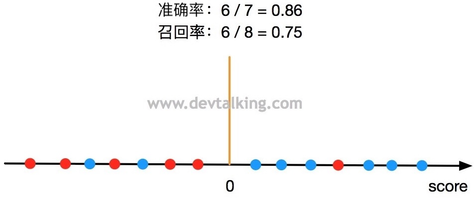
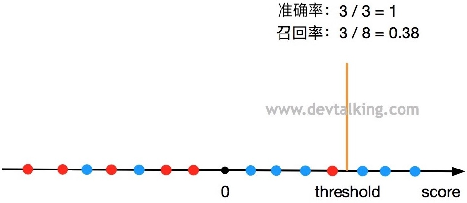
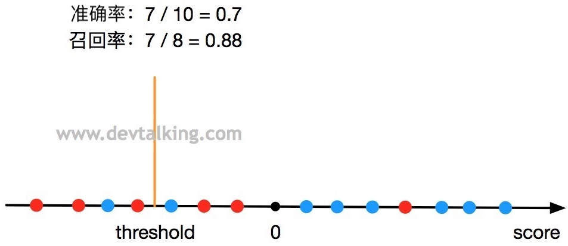
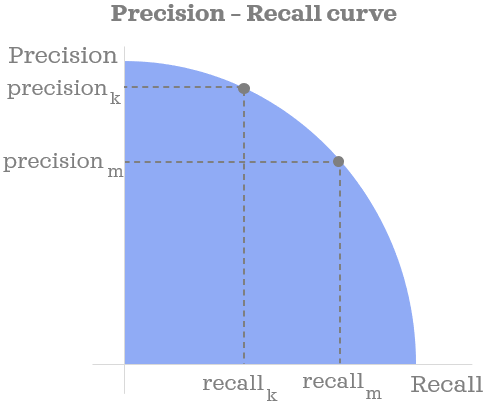
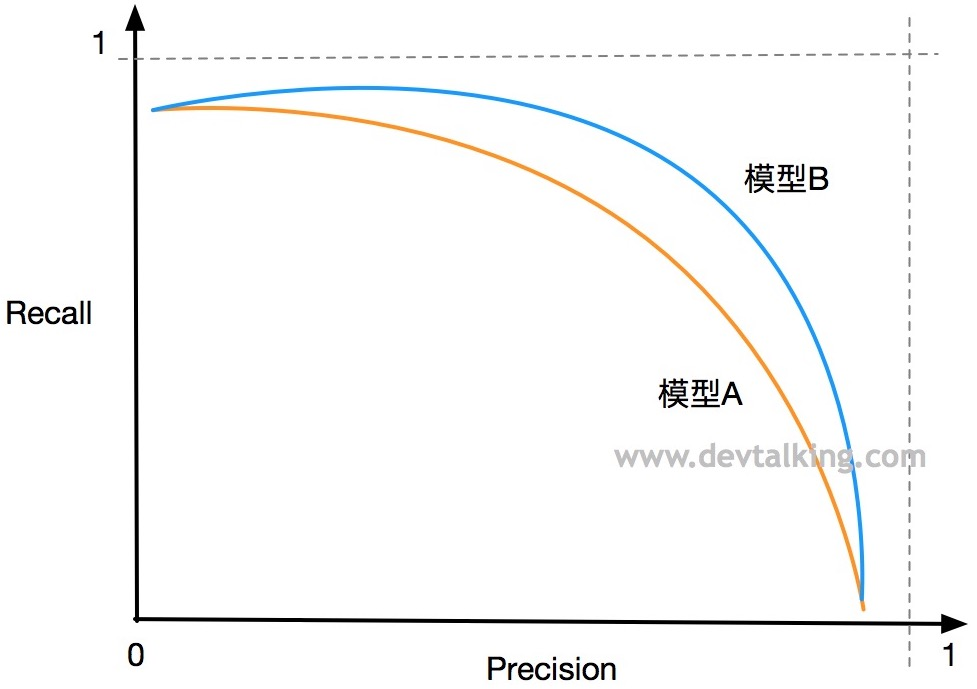
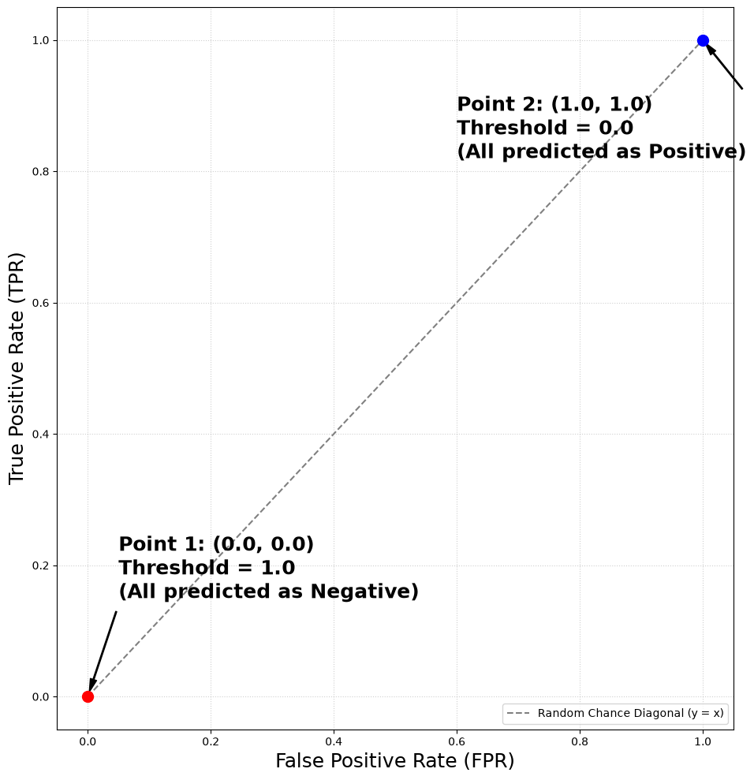
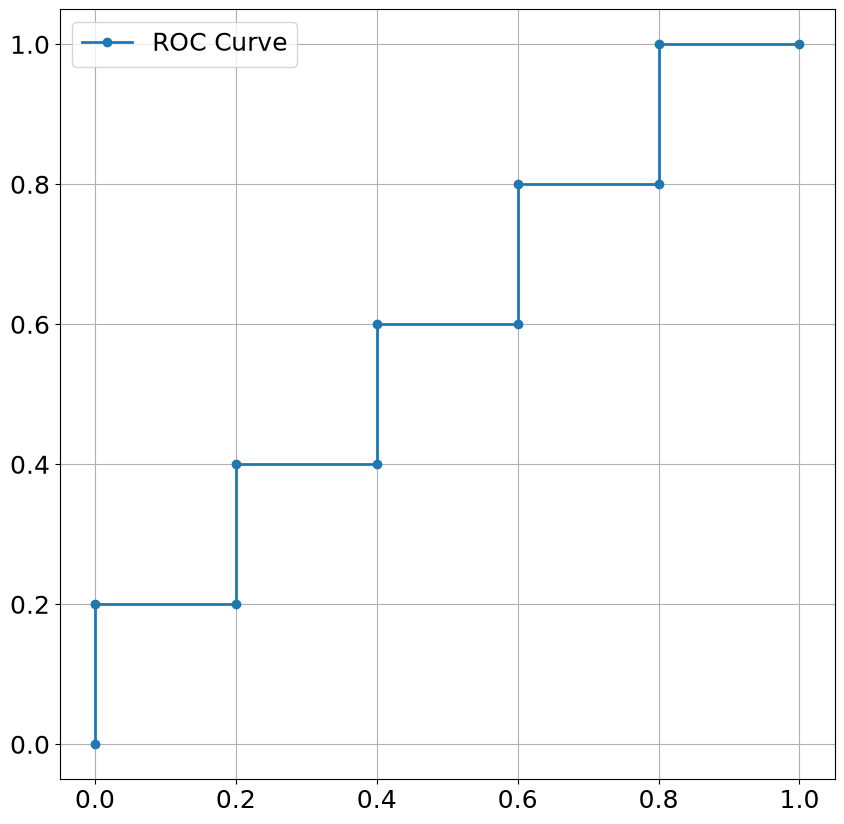
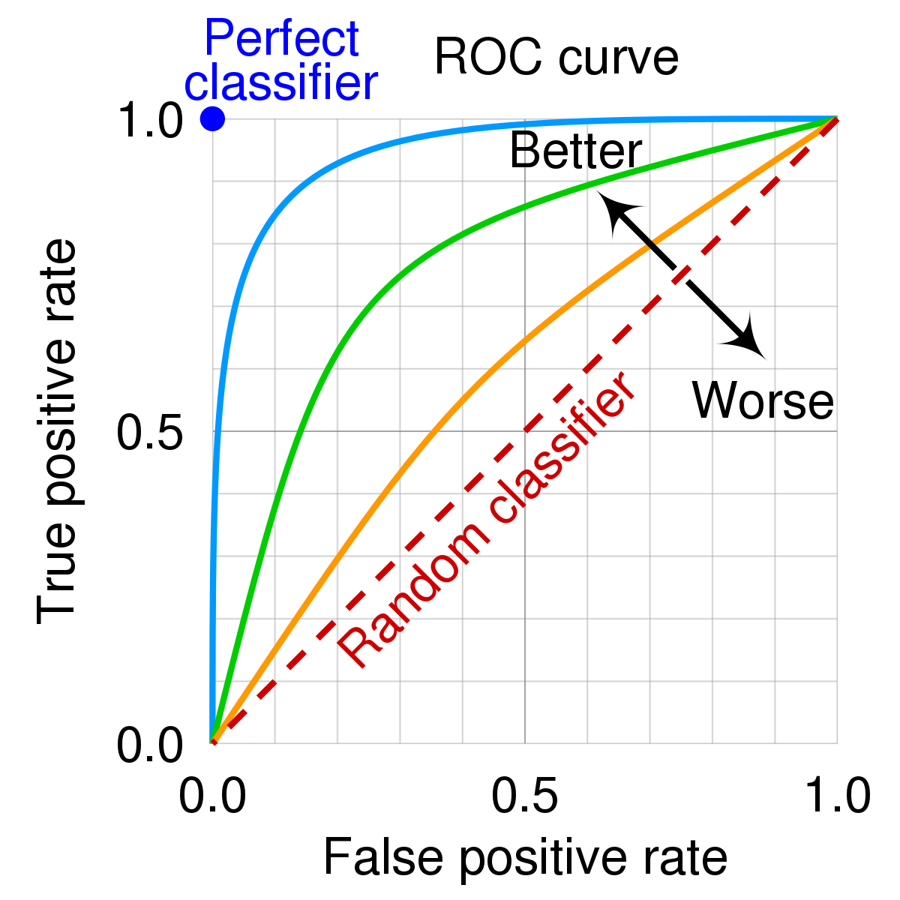
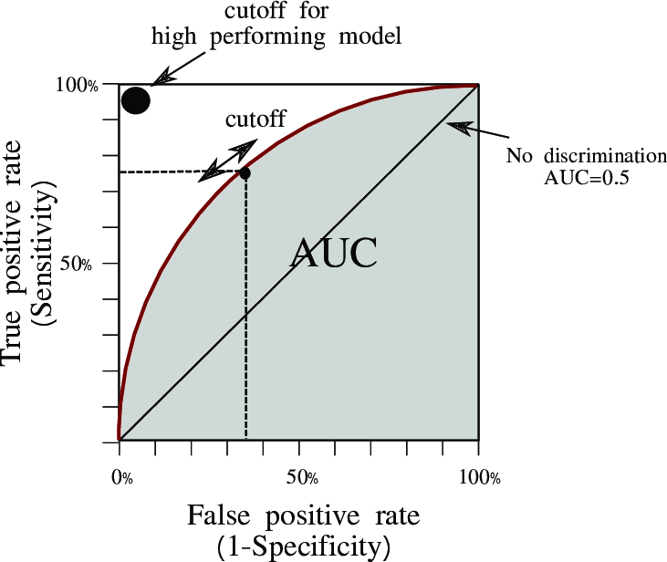
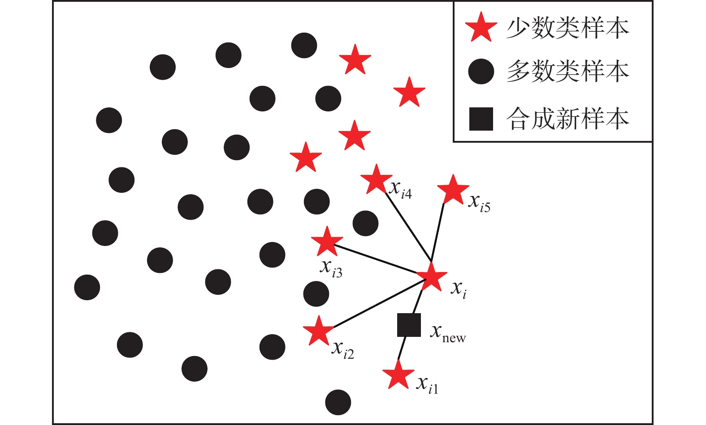

# 评价分类结果

> [!tip]
>
> 一个癌症预测系统，输入体检信息，可以判断是否有癌症，该系统的预测准确率（Accuracy）是$99.9\%$。

如果该癌症的发病率是$0.1\%$。只要系统预测所以人都是健康的，系统的准确率即可达到$99.9\%$；如果该癌症的发病率是$0.01\%$。只要系统预测所以人都是健康的，系统的准确率即可达到$99.99\%$

> [!warning]
>
> 上述情况的数据称为极度偏斜（Skewed Data）。所以分类准确率远远不能表示分类器性能。

## 混淆矩阵

混淆矩阵（Confusion Matrix），对于二分类问题，混淆矩阵如下。

|                            | 预测为$\hat P$       | 预测为$\hat N$       |
| -------------------------- | -------------------- | -------------------- |
| 真实$P$（正样本 Positive） | TP（True Positive）  | FN（False Negative） |
| 真实$N$（负样本 Negative） | FP（False Positive） | TN（True Negative）  |

假设有10000人，其癌症预测结果的混淆矩阵如下

|      | $\hat P$ | $\hat N$ |
| ---- | -------- | -------- |
| $P$  | 8        | 2        |
| $N$  | 12       | 9978     |

sk-learn[`metrics`](https://scikit-learn.org/stable/api/sklearn.metrics.html)包中，包含各种评价指标的计算，包括混淆矩阵。

> [!note]
>
> 使用逻辑回归模型，对sk-learn中的癌症数据进行分类，并打印测试数据集的混淆矩阵。

### 多分类问题的混淆矩阵

sk-learn中函数可以计算多分类数据的的混淆矩阵。

> [!note]
>
> 使用逻辑回归，对鸢尾花数据进行分类，并打印测试集的混淆矩阵。

## 精确率和召回率

使用混淆矩阵可以计算精确率和召回率指标

|      | $\hat P$                                                     | $\hat N$ |                                                              |
| ---- | ------------------------------------------------------------ | -------- | ------------------------------------------------------------ |
| $P$  | TP                                                           | FN       | 召回率$\text{Recall} = \frac{\text{TP}}{\text{TP} + \text{FN}}$ |
| $N$  | FP                                                           | TN       |                                                              |
|      | 精确率$\text{Precision} = \frac{\text{TP}}{\text{TP} + \text{FP}}$ |          | 准确率$\text{Accuracy}=\frac{\text{TP+TN}}{\text{ALL}}$      |

1. 通常在有偏数据中将分类为正样本作为关注的对象。
2. 精确率表示预测关注的事件有多准。
3. 召回率表示关注的事件，真实发生后，被成功预测的有多少。

在癌症预测中计算精确率和召回率

|      | $\hat P$                                   | $\hat N$ |                                                |
| ---- | ------------------------------------------ | -------- | ---------------------------------------------- |
| $P$  | 8                                          | 2        | $\text{Recall} = \frac{8}{8 + 2}=80\%$         |
| $N$  | 12                                         | 9978     |                                                |
|      | $\text{Precision} = \frac{8}{12 + 8}=40\%$ |          | $\text{Accuracy}=\frac{8+9978}{10000}=99.86\%$ |

1. 上述预测的精确率表示预测癌症的成功率。
2. 召回率表示癌症患者被成功找到的概率。

对于10000个人，癌症的发病率为$0.1\%$，预测所以人为健康的

|      | $\hat P$                             | $\hat N$ |                                             |
| ---- | ------------------------------------ | -------- | ------------------------------------------- |
| $P$  | 0                                    | 10       | $\text{Recall} = \frac{0}{10 + 0}=0$        |
| $N$  | 0                                    | 9990     |                                             |
|      | $\text{Precision} = \frac{0}{0 + 0}$ |          | $\text{Accuracy}=\frac{9990}{10000}=99.9\%$ |

1. 精确率的计算无意义。
2. 召回率为0。

> [!note]
>
> 使用sk-learn中的工具，计算癌症分类模型的准确率和召回率。

### 精确率和召回率的选择

在现实应用中不同的算法精确率和召回率，表现不尽相同：

* 算法一，精确率高，召回率低。
* 算法二，精确率低，召回率高。

> [!tip]
>
> 如何选择合适的算法？

算法的选择需要依据实际问题确定。

* 股票涨跌的分类问题，需要高的精确率。
* 癌症病人的分类问题，需要高的召回率。

如果需要同时兼顾精确率和召回率，使用评价标准F1-Score。
$$
F_1=\frac{2\cdot\text{Precision}\cdot\text{Recall}}{\text{Precision}+\text{Recall}}
$$
F1-Score本质描述的是精确率和召回率的**调和平均值**。F1-Score的特性是如果精确率和召回率不平衡，F1-Score的计算值会非常低。

> [!note]
>
> 使用sk-learn中的工具，计算癌症分类模型的F1-Score。

### 精确率和召回率的关系

逻辑回归的数学表示如下
$$
\hat{p}=
\sigma \left(  \mathbf{x}_b^{(i)} \cdot w\right)=\frac{1}{1+e^{\mathbf{x}_b^{(i)} \cdot w}} \qquad
\hat{y}=
\begin{cases}
 1, & \hat{p}\ge 0.5 \Rightarrow \mathbf{x}_b^{(i)} \cdot w \ge 0\\
 0, & \hat{p}< 0.5 \Rightarrow \mathbf{x}_b^{(i)} \cdot w < 0 \\
\end{cases}
$$
其中$w \cdot x_b^{(i)}=0$为二者的决策边界，假设决策边界的阈值可以修改

$$
\mathbf{x}_b^{(i)} \cdot w=\text{threshold}
$$
上述改动相当于给算法引入一个新的超参数threshold，通过修改该参数，可以平移决策边界。从而影响分类结果。

1. 当$\text{threshold}=0\Rightarrow p_{\text{t}}=0.5$，时精确率和召回率的示意图



2. 当$\text{threshold}>0\Rightarrow p_{\text{t}}>0.5$，时精确率和召回率的示意图



3. 当$\text{threshold}<0\Rightarrow p_{\text{t}}<0.5$，时精确率和召回率的示意图



精确率和召回率的变化根据分类阈值变化而变化：

1. 阈值越高精确率越高，召回率越低。
2. 阈值越低精确率越低，召回率越高。

精确率和召回率变化示意图



> [!note]
>
> 使用sk-learn工具，绘制癌症分类模型的准确率和召回率曲线。

使用精确率和召回率曲线（Precision-Recall，PR曲线）可以比较不同模型的性能



模型B要比模型A好，因为模型B无论是精准率还是召回率都要比模型A的高。

## ROC曲线

ROC曲线是Receiver Operation Characteristic Curve缩写，最早在统计学领域使用。ROC用来描述分类模型的TPR和FPR之间的关系，从而确定分类模型的好坏。

|      | $\hat P$ | $\hat N$ |                                                        | 坐标轴 |
| ---- | -------- | -------- | ------------------------------------------------------ | ------ |
| $P$  | TP       | FN       | $\text{TPR} = \frac{\text{TP}}{\text{TP} + \text{FN}}$ | y轴    |
| $N$  | FP       | TN       | $\text{FPR} = \frac{\text{FP}}{\text{FP} + \text{TN}}$ | x轴    |

* TPR是预测正确的正样本，占**真实正样本**的比例（把好人成功找出的比例）。
* FPR是预测错误的正样本，占**真实负样本**的比例（把坏人错判成好人的比例）。

绘制ROC曲线时，要不断的变化概率阈值，否则TPR和FPR的值是不会发生变化的。

* 不同的阈值，对应固定的混淆矩阵。阈值不变的，计算出来的TPR和FPR就只有一个固定的值，无法形成一条“曲线”。
* 核心原理就是通过不断改变概率阈值，来观察模型在不同严格程度下的表现。

> [!tip]
>
> 概率阈值是如何变化的，是从$0\rightarrow1$还是从$1\rightarrow0$ ？

|                                       | $P$共A个样本                                         | $N$共B个样本                                         |
| ------------------------------------- | ---------------------------------------------------- | ---------------------------------------------------- |
| $\hat P$                              | a                                                    | b                                                    |
|                                       | $\text{TPR} = \frac{\text{a}}{\text{A}}$             | $\text{FPR} = \frac{\text{b}}{\text{B}}$             |
| 概率阈值为0时，所以样本都预测为正样本 | $a=A \rightarrow \frac{a}{A}=1$<br>预测对的正样本为A | $b=B \rightarrow \frac{b}{B}=1$<br>预测错的正样本为B |
| 概率阈值为1时，所以样本都预测为负样本 | $a=0 \rightarrow \frac{a}{A}=0$<br>预测对的正样本为0 | $b=0 \rightarrow \frac{b}{B}=0$<br>预测错的正样本为0 |



* 在绘制 ROC 曲线时，概率阈值通常是从高到低$1\rightarrow0$。
* 对角线表示：在每一个阈值下$\text{TPR} = \text{FPR}$，这意味着模型每正确识别一个正样本，就会按相同的比例误判一个负样本。说明模型完全没有识别能力。

计算下面10个样本的预计结果的ROC曲线

| 样本编号 | 1    | 2    | 3    | 4    | 5    | 6    | 7    | 8    | 9    | 10   |
| -------- | ---- | ---- | ---- | ---- | ---- | ---- | ---- | ---- | ---- | ---- |
| 真实标签 | 1    | 0    | 1    | 0    | 1    | 0    | 1    | 0    | 1    | 0    |
| 预测概率 | 0.9  | 0.8  | 0.75 | 0.7  | 0.6  | 0.55 | 0.4  | 0.3  | 0.2  | 0.1  |

阈值为1时：所有预测标签均为0，所以TPR和FPR均为0。ROC曲线的计算过程如下

| 阈值 | TP   | FP   | FN   | TN   | TPR  | FPR  |
| ---- | ---- | ---- | ---- | ---- | ---- | ---- |
| 1.0  | 0    | 0    | 5    | 5    | 0.0  | 0.0  |
| 0.9  | 1    | 0    | 4    | 5    | 0.2  | 0.0  |
| 0.8  | 1    | 1    | 4    | 4    | 0.2  | 0.2  |
| 0.75 | 2    | 1    | 3    | 4    | 0.4  | 0.2  |
| 0.7  | 2    | 2    | 3    | 3    | 0.4  | 0.4  |
| 0.6  | 3    | 2    | 2    | 3    | 0.6  | 0.4  |
| 0.55 | 3    | 3    | 2    | 2    | 0.6  | 0.6  |
| 0.4  | 4    | 3    | 1    | 2    | 0.8  | 0.6  |
| 0.3  | 4    | 4    | 1    | 1    | 0.8  | 0.8  |
| 0.2  | 5    | 4    | 0    | 1    | 1.0  | 0.8  |
| 0.1  | 5    | 5    | 0    | 0    | 1.0  | 1.0  |

上面计算结果的ROC曲线为



通过ROC曲线分析模型性能



ROC曲线下面的面积称为AUC面积，面积越大分类性能越好。



AUC的最大值是1。[ROC-AUC的数学原理](https://rogerspy.github.io/2021/07/29/roc-auc/)

> [!note]
>
> 使用sk-learn工具，绘制癌症分类模型的准确率和召回率曲线。

### 评价标准的比较

| 评价标准       | 问题                                                       |
| -------------- | ---------------------------------------------------------- |
| 准确率         | 1. 容易被样本不均衡性<br />2. 指标被阈值影响               |
| 精确率和召回率 | 1. 每个指标只反映一类预测结果的指标<br />2. 指标被阈值影响 |
| ROC曲线和AUC值 | 用于比较两个模型的性能                                     |

* 对于多分类问题，通常绘制“一对多”（One-vs-Rest）的ROC曲线，所有类别绘制在同一幅图中，这样便于直观比较每个类别的分类性能（K个类别就会生成K条ROC曲线）。
* 多分类的PR曲线和ROC曲线逻辑完全一致，也是每个类别绘制一条，采用“一对多”策略。

## 分类不平衡的处理

[imbalanced-learn](https://imbalanced-learn.org/stable/)工具包用于处里数据不平衡问题。安装命令

```shell
pip install imbalanced-learn
```

### 过采样法

增加一些少数类样本使得正、反例数目接近。

1. 随机过采样方法：随机复制少数类的样本，将它扩大到与多少类样本数量接近。该方法容易造成模型的过拟合问题。
1. SMOTE算法（Synthetic Minority Oversampling）合成少数类过采样技术。



### 欠采样方法

移除一些多数类中的样本，使得正例、反例数目接近。

* 随机欠采样方法：随机选择一些多数量样本从训练数据中移除。该方法可能会造成重要信息丢失。

