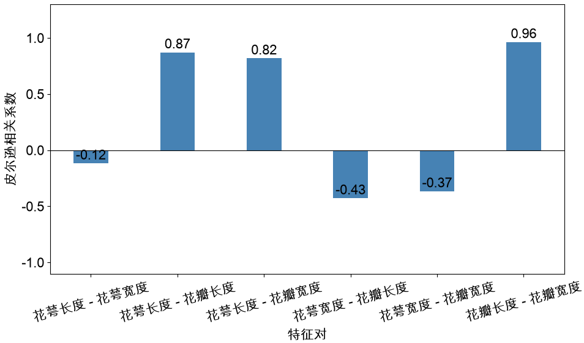
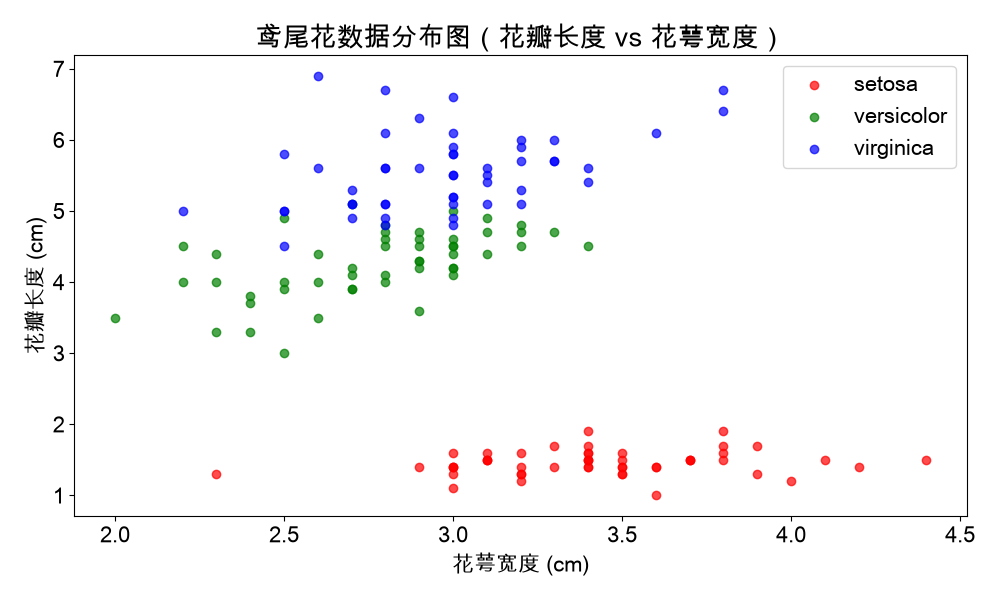
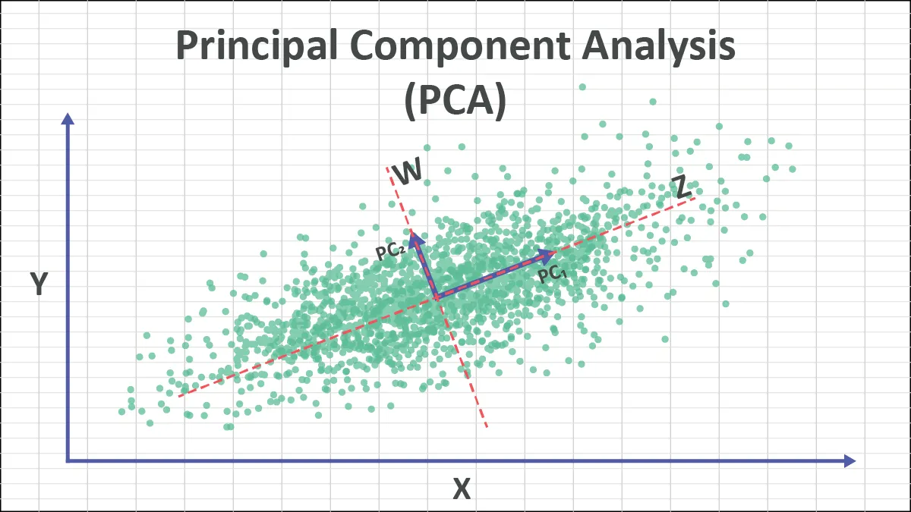
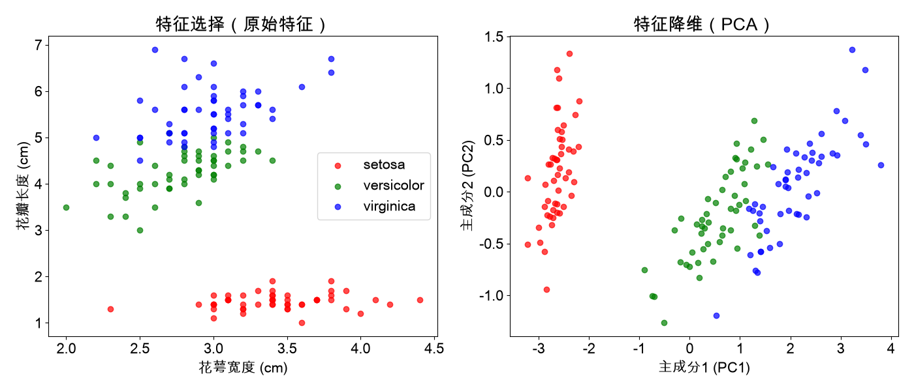

# 维度分析

## 维度可扩展性

> [!note]
>
> 优秀的机器学习算法应当具备良好的维度适应性，能够接受不同维度特征向量。

不同的分类问题：

* 鸢尾花数据集4维特征。
* 癌症数据集30维特征。
* 手写数字识别64维特征。

针对上述问题使用KNN和逻辑回归都可以解决，而训练和预测的过程不受特征维度的影响。

### KNN的维度

KNN算法是使用“距离“来衡量两个样本之间的差异
$$
d=\sqrt{\sum_{i=1}^n\left(x_i^{(a)}-x_i^{(b)} \right)^2}
$$
无论特征向量的维度$n$如何，一个映射函数能作为度量空间中的“距离”，必须满足三条度量公理：

1. 非负性：$\text{Dist}(\mathbf{x}^{(a)},\mathbf{x}^{(b)}) \ge 0$。
2. 对称性：$\text{Dist}(\mathbf{x}^{(a)},\mathbf{x}^{(b)}) = \text{Dist}(\mathbf{x}^{(b)},\mathbf{x}^{(a)})$。
3. 三角不等式：$\text{Dist}(\mathbf{x}^{(a)},\mathbf{x}^{(c)}) \le \text{Dist}(\mathbf{x}^{(a)},\mathbf{x}^{(b)}) + \text{Dist}(\mathbf{x}^{(b)},\mathbf{x}^{(c)})$

数学逻辑链条：

* 距离映射将高维向量差映射到实数集$\mathbb{R}$上，根据实数的性质，确保了任意两点间的距离可以严格地比较大小。
* 三角不等式确保了高维空间中距离的可传递性（若A离B很近，B离C很近，则A离C绝不可能无限远），赋予了高维空间稳固的拓扑邻域结构。

结论：KNN算法依靠计算出的距离进行Top-K排序分类，其数学基础建立在完备的度量空间之上，因此在数学抽象逻辑上对任意维度的特征都成立。

### 逻辑回归的维度

逻辑回归的维度适应性可以分为预测的适应性和训练的适应性。

#### 预测的维度

逻辑回归的计算公式为
$$
\hat{p}^{(i)}=\frac{1}{1+e^{-(\mathbf{x}_b^{(i)} \cdot w)}}
$$

* 特征向量与权重向量的内积运算$\mathbf{x}_b^{(i)} \cdot w$，满足线性代数的封闭性。无论维度$n$是多少，内积运算均将$n$维向量空间映射为一个唯一的实数值$z \in \mathbb{R}$。
* Sigmoid函数的严格单调性，保证了线性评分$z$的大小顺序与预测概率 $\hat p$ 的大小顺序一致。

结论：只要权重向量$w$的维度与输入特征$x$一致，模型就能将高维特征点，映射为实数概率进行决策。

#### 训练的维度

逻辑回归的损失函数
$$
L=-\frac{1}{m}\sum_i^{m}\left (y^{(i)}\log \left(\sigma \left( t \right)\right)+(1-y^{(i)})\log \left(1-\sigma \left( t \right)\right)\right) \quad t=\mathbf{x}_b^{(i)} \cdot w
$$

* 交叉熵损失函数在$n$维参数空间中是一个凸函数，只有唯一的全局最小值。
* 对于任意复杂的非线性函数，只要它是可微的，那么在极小的邻域内，它都可以被线性函数近似。
* 梯度的方向表示了函数最快速的增长方向。

损失函数$L$对参数的梯度是一个与特征维度同维的向量
$$
\nabla L
=\frac{1}{m} X_b^T  (\sigma(X_b w)-y)
$$
梯度下降算法利用梯度向量的每个分量，同时更新各个参数
$$
w_i^{(t+1)} = w_i^{(t)} - \eta \frac{\partial L}{\partial w_i}
$$

* $t$和$t+1$表示不同时刻。

结论：对于逻辑回归的凸优化问题，只要能够计算梯度，梯度下降法原则上都适用于任意维度的参数求解。

> [!note]
>
> 不同的机器学习算法，其维度适应性背后的数学原理各不相同。但在本质上，它们都必须具备对不同维度特征的兼容性，如此才具备解决现实问题的实用价值。

## 降维

> [!tip]
>
> 虽然机器学习算，法理论上可以适用于$n$维空间，但是不是特征维度越高越好呢？

特征维度$n$不断增大时，会出现一系列问题，这些问题统称为维度灾难：

1. 距离度量逐渐失效：“近”与“远”的概念变得模糊，距离不再具有足够的区分能力。
2. 数据变得越来越稀疏：维度增加时，空间体积会呈指数级增长，而训练样本的数量往往增长得没有那么快，于是样本就会变得越来越稀疏。
3. 计算成本迅速上升。
4. 特征之间容易出现冗余和共线性，如：身高、腿长、臂展。

> [!warning]
>
> 高维机器学习面临的是一个矛盾：
>
> * 维度增加，意味着获得更多信息。
> * 维度增加，也意味着有限的数据被摊薄到了更大的空间之中。

针对高维特征可以使用特征选项和主成分分析，适当降低特征维度。

### 特征选择

特征选择（Feature Selection）是从原始特征集中挑选出与预测目标最相关、最有价值的子集。

特征选择的方法：

* 过滤式：主要探究特征本身特点、特征与特征和目标值之间关联。如：低方差特征过滤、相关系数。
* 嵌入式：算法自动选择特征。如：正则化。

#### 低方差特征过滤

删除低方差的一些特征

* 特征方差小：某个特征大多样本的值比较相近。
* 特征方差大：某个特征很多样本的值都有差别。

#### 相关系数

皮尔逊相关系数，用于衡量两个连续变量之间的线性相关程度。对于$m$个样本，两个特征$\mathbf{x_1}$和$\mathbf{x_2}$的观测值的皮尔逊相关系数为

$$
r_{\mathbf{x}_1, \mathbf{x}_2} 
= 
\frac{\sum_{i=1}^{m} (x_{1}^{(i)} - \overline{x}_1)(x_{2}^{(i)} - \overline{x}_2)}{\sqrt{\sum_{i=1}^{m} (x_{1}^{(i)} - \overline{x}_1)^2} \sqrt{\sum_{i=1}^{m} (x_{2}^{(i)} - \overline{x}_2)^2}}
= 
\frac{\text{Cov}(\mathbf{x}_1, \mathbf{x}_2)}{\text{Var}(\mathbf{x}_1) \text{Var}(\mathbf{x}_2)}
$$

* $\bar{x}_1 = \frac{1}{m} \sum_{i=1}^{m} x_{1}^{(i)}$是特征$\mathbf{x_1}$的样本均值，$\bar{x}_2 = \frac{1}{m} \sum_{i=1}^{m} x_{2}^{(i)}$是特征$\mathbf{x_2}$的样本均值。
* 皮尔逊相关系数的取值范围
  1. $r = 1$完全正线性相关。
  2. $0 < r < 1$正线性相关。
  3. $r = 0$无线性相关。
  4. $-1 < r < 0$负线性相关。
  5. $r = -1$完全负线性相关。
  6. 绝对值越大越相关。

根据上面的分布可以选择花瓣的长度和花萼的宽度作为特征，绘制数据分布图

### 主成分分析

主成分分析（Principal Component Analysis）是一种多变量统计分析技术。它的主要目的是通过线性变换，将原始数据的$n$特征换为一组新$k$维特征，其中$k<n$，这些新特征被称为主成分。

* 非监督的机器学习算法。
* 主要用于数据降维。
* 可视化（把特征降为的二维或三维）
* 去除冗余信息或噪声。

主成分分析并不只应用在机器学习领域，也是**统计分析领域**的重要方法。

对于$m$个样本和$n$为特征矩阵表示为

$$
X_{mn}=
\begin{bmatrix}
x_1^{(1)}  & x_2^{(1)} & \cdots & x_n^{(1)} \\
x_1^{(2)}  & x_2^{(2)} & \cdots & x_n^{(2)} \\
\vdots  & \vdots & \ddots & \vdots \\
x_1^{(m)}  & x_2^{(m)} & \cdots & x_n^{(m)}
\end{bmatrix}
$$
对于特征矩阵$X_{mn}$减去每个特征维度本身的平均值
$$
\overline{X}_{mn} = 
\begin{bmatrix}
x_1^{(1)} - \overline{x}_1 & x_2^{(1)} - \overline{x}_2 & \cdots & x_n^{(1)} - \overline{x}_n \\
x_1^{(2)} - \overline{x}_1  & x_2^{(2)} - \overline{x}_2 & \cdots & x_n^{(2)} - \overline{x}_n \\
\vdots  & \vdots & \ddots & \vdots \\
x_1^{(m)} - \overline{x}_1  & x_2^{(m)} - \overline{x}_2 & \cdots & x_n^{(m)} - \overline{x}_n
\end{bmatrix} = 
\begin{bmatrix}
\widetilde{x}_1^{(1)}  & \widetilde{x}_2^{(1)}  & \cdots & \widetilde{x}_n^{(1)}  \\
\widetilde{x}_1^{(2)}  & \widetilde{x}_2^{(2)} & \cdots & \widetilde{x}_n^{(2)}  \\
\vdots  & \vdots & \ddots & \vdots \\
\widetilde{x}_1^{(m)}  & \widetilde{x}_2^{(m)} & \cdots & \widetilde{x}_n^{(m)}
\end{bmatrix}
$$

* 其中$\overline{x}_j$是特征$\mathbf{x}_j$的样本均值。
* 其中$\widetilde{x}_j^{(i)}=x_j^{(i)} - \overline{x}_j$。
* $\overline{X}_{mn}$为特征矩阵$X_{mn}$中心化的矩阵。

根据中心化矩阵$\overline{X}_{mn}$可以计算协方差矩阵
$$
S=\frac{1}{m-1}A^TA
$$
对于二维向量的协方差矩阵为
$$
\begin{aligned} 
\frac{1}{m-1}\overline{X}_{mn}^T\overline{X}_{mn} 
&= 
\frac{1}{m-1}
\begin{bmatrix}
\widetilde{x}_1^{(1)} & \widetilde{x}_1^{(2)} & \widetilde{x}_1^{(3)} & \widetilde{x}_1^{(4)} \\
\widetilde{x}_2^{(1)} & \widetilde{x}_2^{(2)} & \widetilde{x}_2^{(3)} & \widetilde{x}_2^{(4)} 
\end{bmatrix}
\begin{bmatrix}
\widetilde{x}_1^{(1)} & \widetilde{x}_2^{(1)} \\
\widetilde{x}_1^{(2)} & \widetilde{x}_2^{(2)} \\
\widetilde{x}_1^{(3)} & \widetilde{x}_2^{(3)} \\
\widetilde{x}_1^{(4)} & \widetilde{x}_2^{(4)}
\end{bmatrix} \\
&= 
\frac{1}{m-1}
\begin{bmatrix}
\sum_{i=1}^{m} \left(\widetilde{x}_1^{(i)}\right)^2 & \sum_{i=1}^{m} \widetilde{x}_1^{(i)}\widetilde{x}_2^{(i)}  \\
\sum_{i=1}^{m} \widetilde{x}_1^{(i)}\widetilde{x}_2^{(i)}  & \sum_{i=1}^{m} \left(\widetilde{x}_2^{(i)}\right)^2
\end{bmatrix}
\end{aligned}
$$
将$\widetilde{x}_j^{(i)}=x_j^{(i)} - \overline{x}_j$带回到上面的公式
$$
\begin{aligned} 
S
&=
\frac{1}{m-1}
\begin{bmatrix}
\sum_{i=1}^{m} \left(x_1^{(i)} - \overline{x}_1\right)^2 & \sum_{i=1}^{m} \left(x_1^{(i)} - \overline{x}_1\right)\left(x_2^{(i)} - \overline{x}_2\right)  \\
\sum_{i=1}^{m} \left(x_1^{(i)} - \overline{x}_1\right)\left(x_2^{(i)} - \overline{x}_2\right) & \sum_{i=1}^{m} \left(x_2^{(i)} - \overline{x}_2\right)^2
\end{bmatrix} \\
&=
\begin{bmatrix}
\text{Var}(\mathbf{x}_1) & \text{Cov}(\mathbf{x}_1,\mathbf{x}_2)  \\ 
\text{Cov}(\mathbf{x}_1,\mathbf{x}_2) & \text{Var}(\mathbf{x}_2)
\end{bmatrix}
\end{aligned}
$$
计算$S$对应的特征值和特征向量，并对特征值大小排序，根据线性代数知识有如下结论：

1. 第一大特征值$\lambda_1$，对应的特征向量$v_1$，是数据分布最显著、方差最大的方向。
2. 第二大特征值$\lambda_2$，对应的特征向量$v_2$，是数据沿主方向的扩散程度（在与$v_1$正交（垂直）的约束下，数据方差第二大的方向）。
3. 第三大特征值$\lambda_3$，对应的特征向量$v_3$，在与$v_1, v_2$ 均正交的约束下，数据方差第三大的方向。
4. 以此类推直到特征值$\lambda_n$，对应的特征向量$v_n$。
5. 使用特征向量$V=[v_1, v_2, \cdots, v_n]$，可以用于空间变换$Z=XV$，其中$Z$满足在逐个正交方向上，取得的方差最大。
6. 特征值由大到小排序：
   * 前几个大特征值，包含了数据的主要信息。
   * 尾部极小或接近0的特征值，通常代表数据中的冗余信息或高频噪声。

上述变换过程称为PCA，二维特征向量的PCA变换为

借助PCA变换可以进行特征降维，PAC降维的基本步骤如下：

1. 归一化特征集。
2. 构造协方差矩阵。
3. 将协方差矩阵分解为特征值和特征向量。
4. 按降序对特征值进行排序，对应的特征向量也形成相同的排列。
5. 选择$k(k<n)$个最大特征值对应的特征向量，其中$k$是新特征子空间的维数。
6. 用$k$个特征向量构造一个投影矩阵$V$。
7. 使用投影矩阵$V$对数据集$X$进行变换$Z=XV$，$Z$就新的特征空间。

> [!important]
>
> * PCA降维的过程是，在降维过程中信息损失最小，即方差最大。
> * 某些情况下，PCA降维后，分类性能有所提升，这是在降维的过程中对数据进行了降噪。
> * PCA的核心目标是寻找方差最大的方向，测量单位（量纲）会严重影响数据方差的大小。在PCA降维之前，需要对数据进行归一化。

> [!note]
>
> 对sk-learn中的癌症数据进行降维，绘制在二维平面上。

> [!tip]
>
> PCA降维的维度$k$应该如何选择？

前$k$个主成分的累计方差贡献率
$$
\text{Cumulative Ratio}(k) = \frac{\sum_{i=1}^{k} \lambda_i}{\sum_{j=1}^{n} \lambda_j}
$$
对于特征值$\lambda_i$可以计算其方差稀释比
$$
\text{Explained Variance Ratio}_i = \frac{\lambda_i}{\sum_{j=1}^{n} \lambda_j}
$$

> [!note]
>
> 对sk-learn中的癌症数据进行PCA处理，比较不同累计方差贡献率下的分类结果。绘制不同维度特征方差稀释比。

### 绘制决策边界

逻辑回归的数学表示如下
$$
\hat{p}=
\sigma \left(  \mathbf{x}_b^{(i)} \cdot w\right)=\frac{1}{1+e^{\mathbf{x}_b^{(i)} \cdot w}} \qquad
\hat{y}=
\begin{cases}
 1, & \hat{p}\ge 0.5 \Rightarrow \mathbf{x}_b^{(i)} \cdot w \ge 0\\
 0, & \hat{p}< 0.5 \Rightarrow \mathbf{x}_b^{(i)} \cdot w < 0 \\
\end{cases}
$$
其中$w \cdot \mathbf{x}_b^{(i)}=0$为二者的决策边界。当特征维度为2时，决策边界可以表示为
$$
w_0+w_1x_1+w_2x_2=0
$$
在二维平面上，逻辑回归可以看做预测一个点相对于一条直线的位置。

> [!warning]
>
> 使用PCA对逻辑鸢尾花数据进行降维，使用回归对进行分类，并绘制逻辑回归的决策边界。

