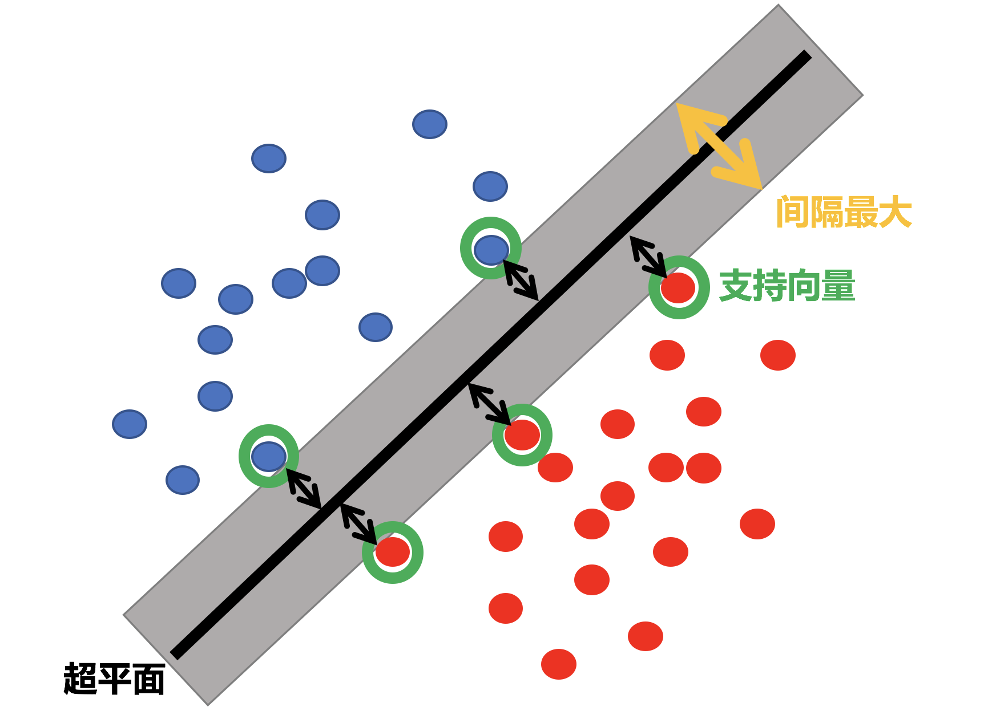
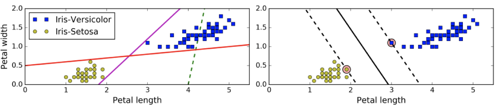
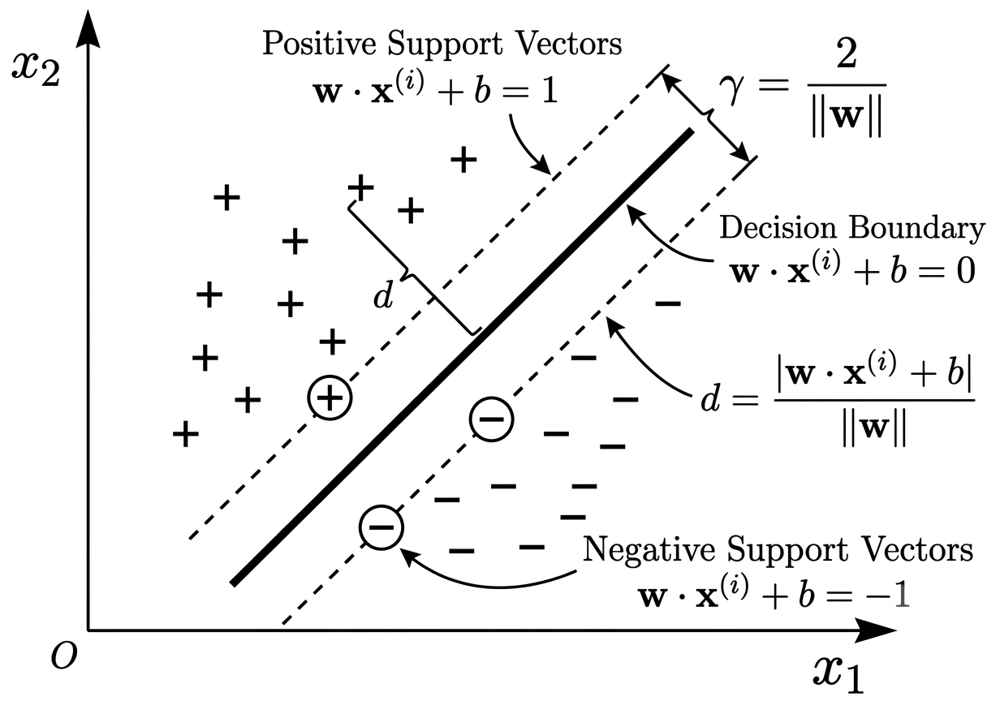
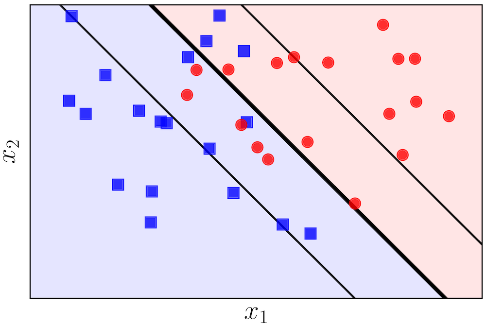
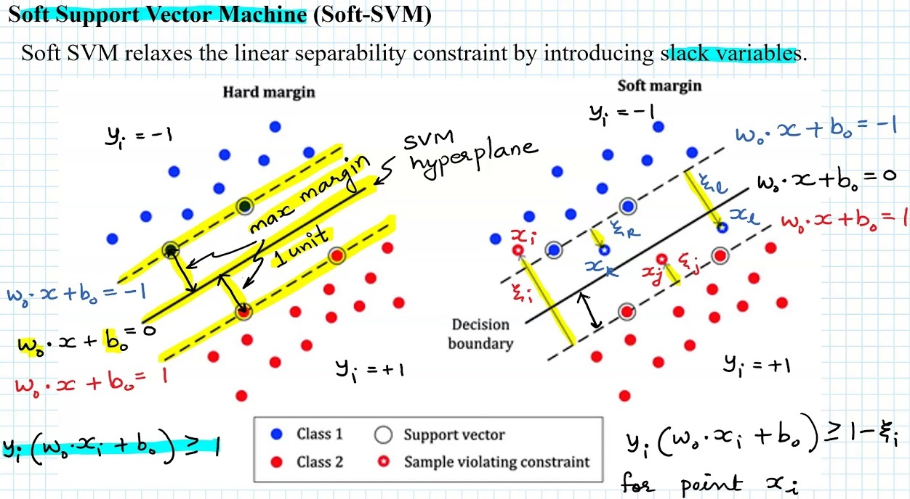
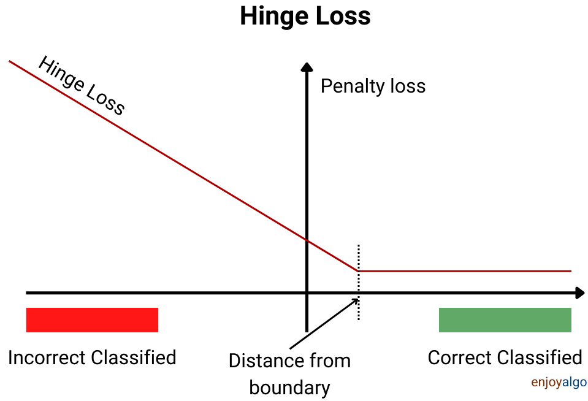
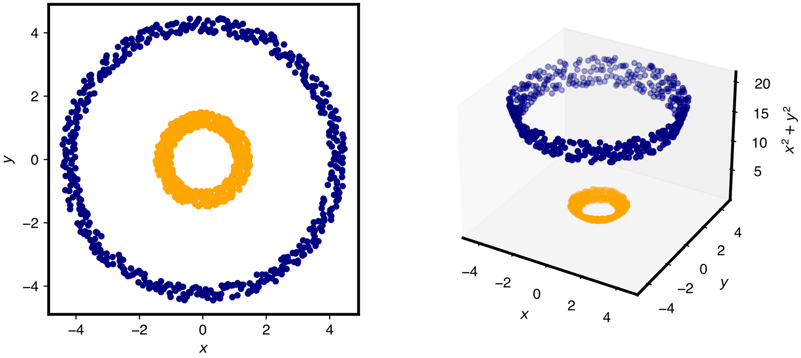
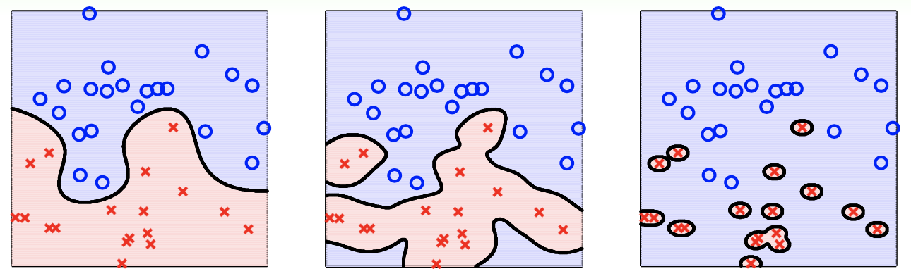
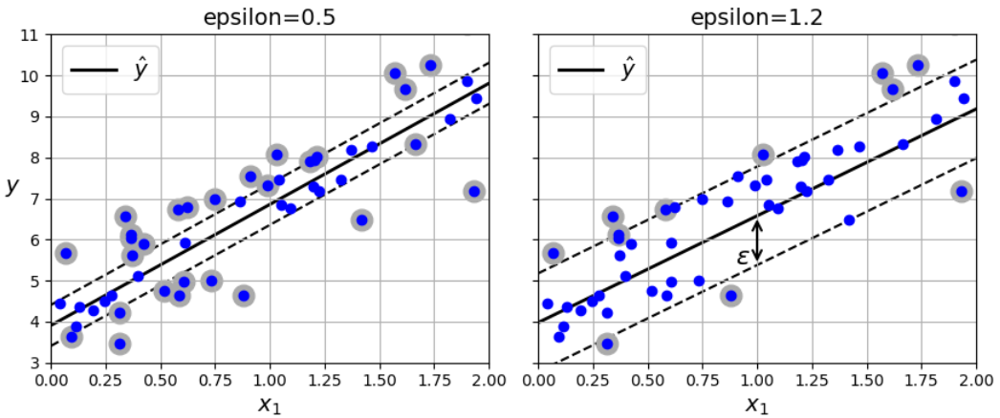

# 支持向量机

支持向量机（supported vector machine，简称：SVM）的算法的本质是找到一个在两类样本中间位置的分界线。等价于两个类别距离分界线最近的点，到分界线的距离相等。

* 两个类别距离分界线最近的点，构成一个区域，理想条件下，这个区域内没有样本点。
* 两个类别距离分界线最近的点，被称为支撑向量。
* SVM特别适用于中小型复杂数据集的分类。

当两类数据间可以选择多条分类边界时，称为不适定问题。

> [!important]
>
> 支撑向量机算法的优化目标为：
>
> 1. 找到支撑向量。
> 2. 最大化Margin（分类间隔）。

## SVM分类器

在$n$维空间中直线方程可以表示为$w \cdot \mathbf{x}+b=0$。设正样本$1$表示，负样本用$-1$表示。上述式子可以化简为
$$
\left\{\begin{matrix}
w \cdot \mathbf{x}+b \ge 1 & \forall y=1 \\
w \cdot \mathbf{x}+b \le -1  & \forall y=-1
\end{matrix}\right. \tag{1}
$$
中间分界线的方程为
$$
w \cdot \mathbf{x}+b=0
$$
直线的示意图如下

所以上面公式 $(1)$ 的分类器可以统一为
$$
y(w \cdot \mathbf{x}+b) \ge 1
$$
根据点到超平面距离公式
$$
d=\frac{|w \cdot \mathbf{x}+b|}{\Vert{}w\Vert{}}, \quad \Vert{}w\Vert{} = \sqrt{w_1^2 + w_2^2 + \dots + w_n^2}
$$
所有的都是支撑向量$\mathbf{x}$，有$|w\cdot \mathbf{x}+b|=1$，对于所有的支持向量的其距离可以表示为
$$
d=\frac{1}{\Vert{}w\Vert{}}
$$
所以分类间隔可以表示为
$$
\gamma = \frac{2}{\Vert{}w\Vert{}}
$$
支持向量机的算法目标是最大化间隔$\gamma$
$$
\max \frac{2}{\Vert{}w\Vert{}} \Rightarrow  \frac{1}{\min\frac{1}{2}\Vert{}w\Vert{}} \Rightarrow \min\frac{1}{2}\Vert{}w\Vert{}
$$
所以SVM的优化目标为
$$
\begin{cases}
y(w \cdot \mathbf{x}+b) \ge 1\\
\min \frac{1}{2}\Vert{}w\Vert{}^2 \\
\end{cases}
$$

在这个优化目标函数之间没有任何样本点，称为硬间隔（Hard Margin SVM）。

> [!important]
>
> 支持向量机的最优化，是有条件的最优化问题，可以使用拉格朗日乘子法求解。

### 决策函数

使用拉格朗日乘子法，可以求解出拉格朗日乘子向量
$$
\alpha = \begin{bmatrix}
\alpha^{(1)} \\
\alpha^{(2)} \\
\vdots \\
\alpha^{(m)}
\end{bmatrix}
$$

* 其中$\alpha^{(i)}$的大小代表了该样本对超平面的“作用力”强度：
  * $\alpha^{(i)}=0$表示样本$x^{(i)}$不是支持向量。
  * $\alpha^{(i)}>0$表示样本$x^{(i)}$是支持向量。

根据向量$\alpha$可以计算出权重向$w$
$$
\begin{aligned} 
w = 
& \alpha^{(1)}y^{(1)} 
\begin{bmatrix} x_1^{(1)} \\ x_2^{(1)} \\ \vdots \\ x_n^{(1)} 
\end{bmatrix} + 
\alpha^{(2)}y^{(2)} 
\begin{bmatrix} x_1^{(2)} \\ x_2^{(2)} \\ \vdots \\ x_n^{(2)} 
\end{bmatrix} + \dots + 
\alpha^{(m)}y^{(m)} \begin{bmatrix} x_1^{(m)} \\ x_2^{(m)} \\ \vdots \\ x_n^{(m)} 
\end{bmatrix} \\
= &
\begin{bmatrix}
\sum_{i=1}^m\alpha^{(i)}y^{(i)}x_1^{(i)}  \\
\sum_{i=1}^m\alpha^{(i)}y^{(i)}x_2^{(i)}  \\
\vdots \\
\sum_{i=1}^m\alpha^{(i)}y^{(i)}x_n^{(i)}
\end{bmatrix}
=\sum_{i=1}^m\alpha^{(i)}y^{(i)}\mathbf{x}^{(i)}
\end{aligned}
$$
任选一个$\alpha^{(i)}>0$的样本，不妨设$i=1$（即第1个样本就是支持向量）则有
$$
\begin{aligned} 
y^{(1)}(w \cdot \mathbf{x}^{(1)} +b ) = 1 
& \Rightarrow w \cdot \mathbf{x}^{(1)} + b = y^{(1)}  \\
& \Rightarrow b=y^{(1)}- w \cdot \mathbf{x}^{(1)}
\end{aligned}
$$

定义$\text{sign}(\cdot)$符号函数，可以表示为
$$
\text{sign}(t) = \begin{cases} +1, & \text{若 } t > 0 \\ -1, & \text{若 } t < 0 \end{cases}
$$
则SVM决策函数可以表示为
$$
f(\mathbf{x}) = \text{sign}(w \cdot \mathbf{x} + b)
$$

* 其中：$w \cdot \mathbf{x} + b > 0$样本为正；$w \cdot \mathbf{x} + b < 0$样本为负；$w \cdot \mathbf{x} + b = 0$根据编程者喜好划分。

将$w$值带回到决策函数可得
$$
f(\mathbf{x}) 
= \text{sign}(\sum_{i=1}^m\alpha^{(i)}y^{(i)}\mathbf{x}^{(i)} \cdot \mathbf{x} + b)
$$

## 软间隔

一般的情况下，大部分数据是线性不可分的

针对线性不可分问题，SVM引入了软间隔的概念。允许部分样本被错误分类（或落入间隔边界内），这类样本称为间隔违例。

> [!important]
>
> 软分类的目标是，尽可能在保持最大间隔和限制间隔违例之间找到平衡。

SVM分类器的分类公式为
$$
y(w \cdot \mathbf{x}+b) \ge 1
$$

对于样本无法满足上述公式，引入松弛变量 $\xi_j \ge 0$，上面的公式可以表示为
$$
y(w \cdot \mathbf{x} + b) \ge 1 - \xi_j
$$

* 刚好落在间隔边界上$\xi_j = 0$，满足 $y(w \cdot \mathbf{x} + b) = 1$，属于正确分类且位于标准间隔边界上的点。
* 侵入间隔但分类正确$0 < \xi_j \le 1$，位于间隔边界与决策超平面之间，虽然没有达到标准的间隔要求，但依然被正确分类。
* 跨越决策边界且分类错误$\xi_j > 1$，越过了$w \cdot \mathbf{x} + b = 0$ 决策面，属于被错误分类的样本，这些点同样被定义为支持向量。

> [!important]
>
> 对于线性不可分的情况，支持向量是由边界点和错误点共同组成。

对于每个支持向量存在不同$\xi_j$：

* 如果不对$\xi_j$作出任何限制，优化问题就会崩溃，如：$\xi_j = 10000$，此时无论$w$和$b$怎么取，限制条件永远成立。这就失去了分类和寻找超平面的意义。
* 所有样本违反间隔程度的总和为$\sum_j^m\xi_j$

为控制$\xi_j$的范围，增加正则项
$$
\min \left(\frac{1}{2}\Vert{}w\Vert{}^2+C\sum_j^m\xi_j\right), \quad \xi_j \ge 0
$$
* 其中$C$是超参数，用于平衡超参数的比例。

软间隔分类器目标函数表示如下
$$
\begin{cases}
y(w \cdot \mathbf{x} + b) \ge 1 - \xi_j\\
\min \left(\frac{1}{2}\Vert{}w\Vert{}^2+C\sum_j^m\xi_j\right), \quad \xi_j \ge 0 \\
\end{cases}
$$
上面的目标函数相当于增加了L1正则。L2正则的目标函数表示如下
$$
\begin{cases}
y(w \cdot \mathbf{x} + b) \ge 1 - \xi_j\\
\min \left(\frac{1}{2}\Vert{}w\Vert{}^2+C\sum_j^m\xi_j^2\right) \\
\end{cases}
$$

超参数$C$用于调节惩罚权重的杠杆

* 若$C$极小，对违反约束的容忍度极高，模型倾向于追求更大间隔，但容易欠拟合。
* 若$C$极大，对违反约束的惩罚极重，相当于迫使$\xi_j \to 0$，模型退化为硬间隔，容易过拟合。
* $C$的搜索范围通常在对数尺度上设定，如：$C \in \{10^{-3}, 10^{-2}, 10^{-1}, 1, 10^1, 10^2, 10^3\}$。
* sk-learn中的svm模型$C$越小惩罚与高，与上面的公式正好相反。

### 决策函数

软间隔的决策函数在形式上与硬间隔是一致的
$$
f(\mathbf{x}) 
= \text{sign}(\sum_{i=1}^m\alpha^{(i)}y^{(i)}\mathbf{x}^{(i)} \cdot \mathbf{x} + b)
$$
在软间隔中$\alpha^{(i)}$满足的条件是$0<\alpha^{(i)}\le C$

* $\alpha^{(i)}=0$表示样本$x^{(i)}$不是支持向量。
* $0<\alpha^{(i)}< C$表示样本$x^{(i)}$正好落在间隔边界上，相当于松弛变换$\xi_j = 0$。
* $\alpha^{(i)}=C$表示样本$x^{(i)}$穿过间隔边界，相当于松弛变换$\xi_j > 0$。

求解$b$时，只能选择满足$0<\alpha^{(i)}< C$的样本计算，不妨设第2个样本满足条件
$$
b=y^{(2)}- w \cdot \mathbf{x}^{(2)}
$$

> [!note]
>
> 将癌症数据降维为2维，使用SVM分类器对其分类，并绘制超平面和支持向量平面。测试不同C值。

### 损失函数

松弛变换公式为$y(w \cdot \mathbf{x} + b) \ge 1 - \xi_j$且$\xi_j \ge 0$，所以可以表示为
$$
\xi_j \ge \max\left(0, 1 - y(w\cdot\mathbf{x}+b)\right)
$$
根据优化条件
$$
\min \left(\frac{1}{2}\Vert{}w\Vert{}^2+C\sum_j^m\xi_j\right)
$$
所以优化公式可以整理为
$$
\min \left(\sum_j^m\max\left(0, 1 - y(w\cdot\mathbf{x}+b)\right)+\frac{1}{2C}\Vert{}w\Vert{}^2\right)
$$
所以SVM的损失函数为
$$
\sum_j^m
\underbrace{\max\left(0, 1 - y(w\cdot\mathbf{x}+b)\right)}_{\text{Hinge Loss}}+
\underbrace{\frac{1}{2C}\Vert{}w\Vert{}^2}_{\text{正则化项}}
$$

* Hinge Loss损失函数称为合页损失

## 核函数

核函数的作用就是一个从低维空间到高维空间的映射，而这个映射可以把低维空间中线性不可分的两类点变成线性可分的。

根据决策函数有
$$
\begin{aligned} 
\sum_{i=1}^m\alpha^{(i)}y^{(i)}\mathbf{x}^{(i)} \cdot \mathbf{x}
&=(\alpha^{(1)}y^{(1)}\mathbf{x}^{(1)}+\alpha^{(2)}y^{(2)}\mathbf{x}^{(2)} + \cdots + \alpha^{(m)}y^{(m)}\mathbf{x}^{(m)})\cdot \mathbf{x}  \\
&=\alpha^{(1)}y^{(1)}\mathbf{x}^{(1)} \cdot \mathbf{x}+\alpha^{(2)}y^{(2)}\mathbf{x}^{(2)} \cdot \mathbf{x} + \cdots + \alpha^{(m)}y^{(m)}\mathbf{x}^{(m)} \cdot \mathbf{x} \\ 
&=\alpha^{(1)}y^{(1)}\langle\mathbf{x}^{(1)}, \mathbf{x} \rangle + \alpha^{(2)}y^{(2)}\langle \mathbf{x}^{(2)}, \mathbf{x} \rangle + \cdots + \alpha^{(m)}y^{(m)}\langle \mathbf{x}^{(m)}, \mathbf{x} \rangle \\
&=\sum_{i=1}^m\alpha^{(i)}y^{(i)}\langle\mathbf{x}^{(i)}, \mathbf{x} \rangle
\end{aligned}
$$

* $\langle\mathbf{x}^{(i)}, \mathbf{x} \rangle$表示向量的内积（向量的点乘）。

所以决策函数可以整理为
$$
f(\mathbf{x}) 
= \text{sign}(\sum_{i=1}^m\alpha^{(i)}y^{(i)}\langle\mathbf{x}^{(i)}, \mathbf{x} \rangle + b)
$$
假设$\mathbf{x}$向高位空间映射的函数为$\phi(\mathbf{x})$，所以决策函数可以表示为
$$
f(\mathbf{x}) 
= \text{sign}(\sum_{i=1}^m\alpha^{(i)}y^{(i)}\langle\phi(\mathbf{x}^{(i)}), \phi(\mathbf{x}) \rangle + b)
$$
假设存在函数$K$可以表示为如下形式
$$
K(\mathbf{x}^{(i)}, \mathbf{x})=\langle\phi(\mathbf{x}^{(i)}), \phi(\mathbf{x}) \rangle
$$
函数$K$称为核函数，所以决策函数可以整理为
$$
f(\mathbf{x}) 
= \text{sign}(\sum_{i=1}^m\alpha^{(i)}y^{(i)}K(\mathbf{x}^{(i)}, \mathbf{x}) + b)
$$

> [!warning]
>
> 核函数这种转换方式，不止限于SVM分类器中。

常用的核函数

| 核函数                          | 公式                                                         | 参数       | 对应升维空间 |
| ------------------------------- | ------------------------------------------------------------ | ---------- | ------------ |
| 线性核 Linear Kernel       | $K(\mathbf{x}^{(i)}, \mathbf{x})=\langle \mathbf{x}^{(i)}, \mathbf{x} \rangle$ |            | 原始特征空间 |
| 多项式核 Polynomial Kernel | $K(\mathbf{x}^{(i)}, \mathbf{x})=(a\langle \mathbf{x}^{(i)}, \mathbf{x} \rangle+b)^d$ | $a, b , d$ | 多项式空间   |
| 高斯核 Gaussian Kernel     | $K(\mathbf{x}^{(i)}, \mathbf{x})=\exp{(-\frac{\Vert{} \mathbf{x}^{(i)}-\mathbf{x} \Vert{}^2 }{2\sigma^2})}$ | $\sigma$   | 希尔伯特空间 |

⾼斯核函数就是在属性空间中找到⼀些点，这些点可以是也可以不是样本的样本点。把这些点当做圆⼼向外扩展，扩展半径即为带宽即可划分数据（在特征空间中找到⼀些超圆，⽤这些超圆来判定正反类）。

工程实践中高斯核函数通常表示为
$$
K(\mathbf{x}^{(i)}, \mathbf{x})=\exp{(\gamma\Vert{} \mathbf{x}^{(i)}-\mathbf{x} \Vert{}^2 )}
$$

* $\gamma$越大：单个样本的影响范围越“窄”，高精细，容易过拟合。
* $\gamma$越小：单个样本的影响范围越“宽”，高平滑，容易欠拟合。
* $\gamma$的取值范围一般是$\gamma \in \{10^{-4}, 10^{-3}, 10^{-2}, 10^{-1}, 10^0, 10^1\}$

核函数的选择

1. 数据的特征维度多，样本数量小，一般线性可分，选择线性核。
2. 其他线性不可分情况选择高斯核函数。
3. 多项式核⼀般很少使⽤，效率不⾼，结果也不优于高斯核函数。

> [!note]
>
> 使用SVM分类器对sk-learn中的`load_digits`数据进行分类，使用高斯核函数。

## SVM解决回归问题

SVM解决回归问题
$$
f(\mathbf{x}) = w \cdot \mathbf{x} + b
$$

* 分类问题：尽量让样本点留在 Margin 区域外侧。
* 回归问题：希望构建一个宽度为$2\varepsilon$的间隔带，让尽可能多的样本点落在Margin区域内，同时惩罚落在Margin区域外侧的点。

