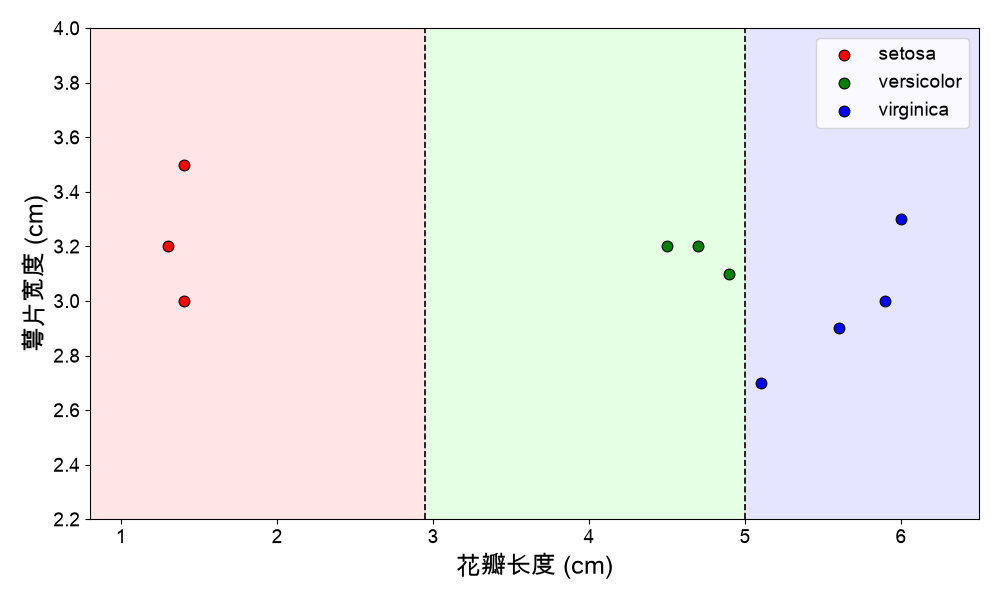
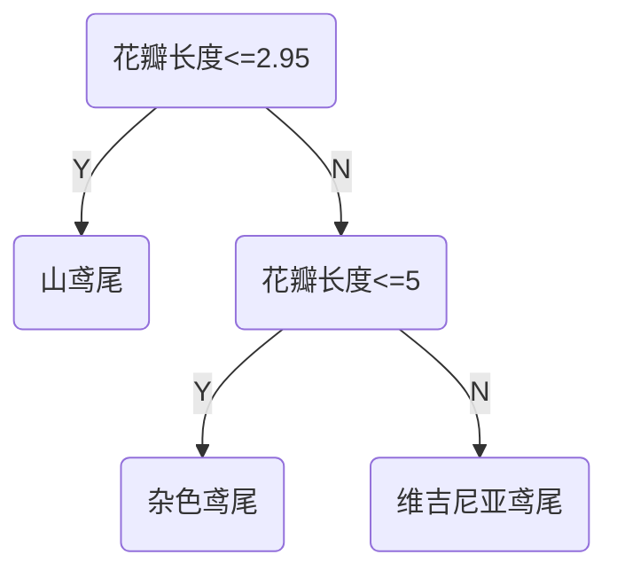
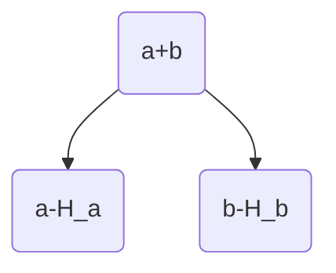
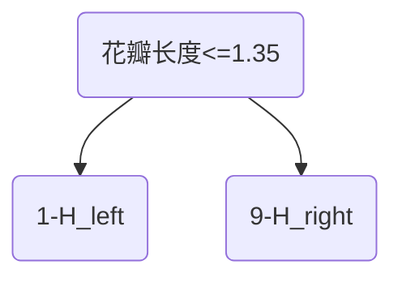
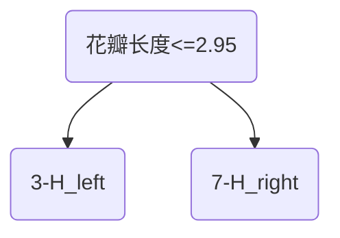
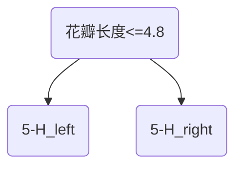
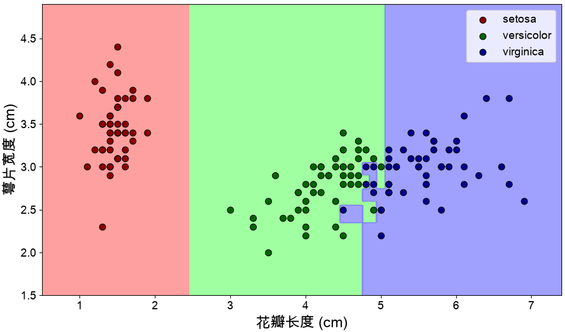
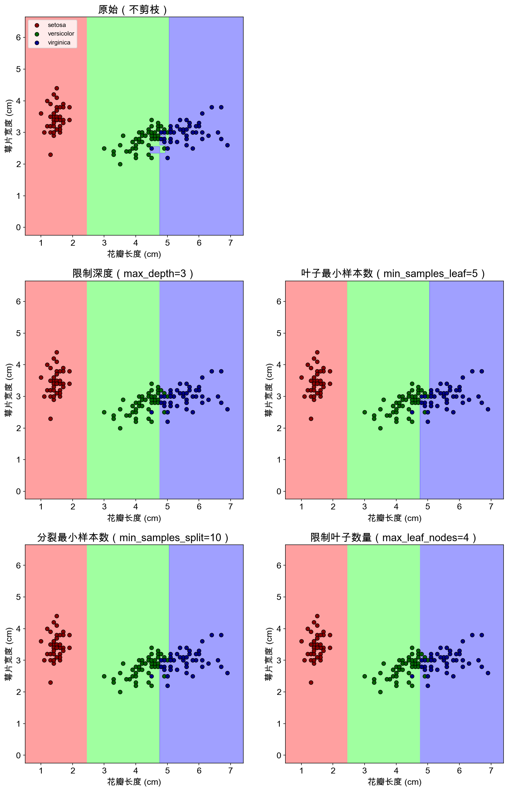
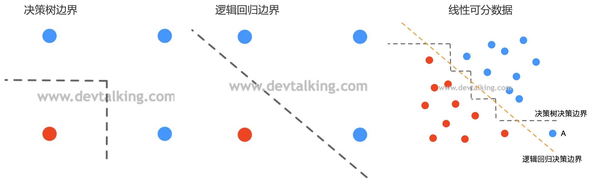

# 决策树

决策树模型是一个树状结构，本质是一颗由多个判断节点组成的树。使用花瓣的长度和萼片的宽度对鸢尾花数据进行划分

使用二叉树对鸢尾花数据进行分类

* 决策树模型包含所有计算机树模型的特征：包括根节点、叶子节点和深度等。
* 决策树的判断条件可以是：连续值、离散值（有大小）和离散值（没有大小）。
* 决策树的特点：
  * 决策树可以构建二叉树也可以构建多叉树。
  * 决策树是非参数学习算法：
    * 天然的可以用于多分类问题。
    * 可以解决回归问题，解决回归问题可以使用所有叶子节点的平均值，作为预测值。
  * 决策树的决策流程符合`if-else`的条件模式，有很好的可解释性。

## 决策树的计算

> [!tip]
>
> 决策树模型的目标是使两个类别可以分开，决策树构建的核心问题：
>
> 1. 如何度量两个类别数据的区分度？
> 2. 在哪个特征，哪个值上，进行划分构建决策树？

### 划分标准

#### 信息熵

信息熵代表随机变量的不确定度：

* 熵越大，数据的不确定性越高；
* 熵越小，数据的不确定性越低。

$$
H=-\sum_{i=1}^{k}p_i\log_2(p_i)
$$
$k$表示信息的种类，$p_i$表示每类信息占的比例，

| 概率                                           | 信息熵                                                       |
| ---------------------------------------------- | ------------------------------------------------------------ |
| $\{ \frac{3}{10},\frac{3}{10},\frac{4}{10} \}$ | $H=-\frac{3}{10}\log_2(\frac{3}{10})-\frac{3}{10}\log_2(\frac{3}{10})-\frac{4}{10}\log_2(\frac{4}{10})=1.571$ |
| $\{ 0,\frac{3}{7},\frac{4}{7}\}$               | $H=-\frac{3}{7}\log_2(\frac{3}{7})-\frac{4}{7}\log_2(\frac{4}{7})=0.985$ |
| $\{ 0,0,1 \}$                                  | $H=-1\log_2(1)=0$                                            |

#### 加权信息熵

加权信息熵：将多个子节点的信息熵，按照各自的样本量占总样本量的比例，进行加权平均，得到的综合不纯度度量。

> [!important]
>
> 加权信息熵，反映了分裂后整体数据的不确定性。

$$
H_{\text{split}}=\sum_{v=1}^V\frac{N_v}{N} H_v
$$

* $V$子节点数量。
* $N_v$第$v$个子节点的样本数。
* $N$父节点总样本数。
* $H_v$第$v$个子节点的信息熵。

使用二叉树对数据集进行划分

加权信息熵的计算公式为
$$
H_{\text{split}}=\frac{a}{a+b}H_a+\frac{b}{a+b}H_b
$$
第一种划分的加权信息熵

* $H_{\text{left}}=0$因为其中只有一个样本
* $H_{\text{right}}=-\frac{2}{9}\log_2(\frac{2}{9})-\frac{3}{9}\log_2(\frac{3}{9})-\frac{4}{9}\log_2(\frac{4}{9})=1.531$
* $H_{\text{split}}=\frac{1}{10}H_{\text{left}}+\frac{9}{10}H_{\text{right}}=1.377$

第二种划分的加权信息熵

* $H_{\text{left}}=0$因为其中三个样本属于一类。
* $H_{\text{right}}=-\frac{3}{7}\log_2(\frac{3}{7})-\frac{4}{7}\log_2(\frac{4}{7})=0.985$
* $H_{\text{split}}=\frac{3}{10}H_{\text{left}}+\frac{7}{10}H_{\text{right}}=0.690$

第三种划分的加权信息熵

* $H_{\text{left}}=-\frac{3}{5}\log_2(\frac{3}{5})-\frac{2}{5}\log_2(\frac{2}{5})=0.971$
* $H_{\text{right}}=-\frac{1}{5}\log_2(\frac{1}{5})-\frac{4}{5}\log_2(\frac{4}{5})=0.7219$
* $H_{\text{split}}=\frac{5}{10}H_{\text{left}}+\frac{5}{10}H_{\text{right}}=0.846$

#### 信息增益

信息增益：以某特征划分数据集前后的熵的差值，使⽤划分前后集合熵的差值来衡量，划分效果的好坏。

> [!important]
>
> 信息增益越⼤，则意味着划分所获得的"纯度提升"越⼤，这个划分越好。

$$
\text{Gain}=H-H_{\text{split}}
$$

决策树的划分过程：

* 第一次划分前总信息熵为$H=1.571$
  * 花瓣长度<=1.35：$\text{Gain}=H-H_{\text{split}}=1.571-1.377= 0.194$
  * 花瓣长度<=2.95：$\text{Gain}=H-H_{\text{split}}=1.571-0.690=0.881$
  * 花瓣长度<=4.8：$\text{Gain}=H-H_{\text{split}}=1.571-0.846=0.725$
  * 选择信息增益最大的划分，花瓣长度<=2.95。
* 第二次划分：
  * 左子树信息熵为0，不用划分。
  * 右子树的信息熵为0.985，不为0，需要划分，划分前总信息熵为$H=0.985$
  * 搜索过程同上，在花瓣长度<=5时：
    * 加权熵$H_{\text{split}}=\frac{2}{10}H_{\text{left}}+\frac{5}{10}H_{\text{right}}=0$，左右子树都只有一种样本。
    * $\text{Gain}=H-H_{\text{split}}=0.985$是信息增益最大划分。

> [!warning]
>
> 决策树的划分过程不能保证得到全局最优解，它采用的是贪心策略，只能保证找到局部最优解。

### 基尼系数

$$
G=1-\sum_{i=1}^kp_i^2
$$

| 概率                                           | 基尼系数                                                     |
| ---------------------------------------------- | ------------------------------------------------------------ |
| $\{ \frac{3}{10},\frac{3}{10},\frac{4}{10} \}$ | $G=1-(\frac{3}{10})^2-(\frac{3}{10})^2-(\frac{4}{10})^2=0.66$ |
| $\{ 0,\frac{3}{7},\frac{4}{7}\}$               | $G=1-(\frac{3}{7})^2-(\frac{4}{7})^2=0.49$                   |
| $\{ 0,0,1 \}$                                  | $G=1-1^2=0$                                                  |

使用基尼系数创建决策树的过程与使用信息熵类似，只是在计算信息熵时替换成基尼系数函数。

* 大多情况下，使用信息熵和基尼系数划分决策树差别不大。
* 信息熵计算比基尼系数稍慢，sk-learn中默认使用基尼系数创建决策树。

### 决策树的分类

常见的决策树算法划分为如下几类

| 名称 | 时间 | 划分标准   | 树结构     | 现状                         |
| ---- | ---- | ---------- | ---------- | ---------------------------- |
| ID3  | 1986 | 信息增益   | 多叉树     | 过时，基本不用               |
| C4.5 | 1993 | 信息增益比 | 多叉树     | 较少单独使用                 |
| CART | 1984 | 基尼系数   | 严格二叉树 | 最主流（sk-learn默认决策树） |

对于包含$m$个样本，$n$个特征的数据集：

* 训练时间复杂度$O(nm\log m)$
* 预测平均复杂度为$O(\log m)$

## 决策树的剪枝

决策树通过将特征空间划分为矩形来建立复杂的决策边界。

* 决策树越深，其决策边界就越复杂，这容易导致过拟合。
* 上面的决策树边界过度复杂，表明模型在“死记硬背离群点”。

> [!important]
>
> 决策树剪枝：通过主动去掉⼀些分⽀来降低过拟合的⻛险。

决策树剪枝的基本策略有预剪枝（pre-pruning）和后剪枝（post- pruning）：

* 预剪枝是在决策树的生成过程中剪枝。
* 后剪枝是生成一个完整的决策树后进行剪枝。
* 工程实践中，首选预剪枝方法（占比 >90%）。

sk-learn中常用的剪枝方法为：

1. 限制决策树的深度。
   * 包含$m$个样本的满二叉树，深度约为$\log_2(m)$。
   * 上限设为$\log_2(m)$，起点设为2~3，中间按等差数列采样：$[3, 5, 8, 12, \dots,\log_2(m)]$
2. 控制叶子中节点中数据的数量。
   * 以样本总数$m$的百分比对数序列来设定。
   * 类似比例形式：$[0.001, 0.005, 0.01, 0.02, 0.05]$（即样本量的0.1%到5%）。
3. 控制节点拆分的数据数量，即节点的数据量超过一定阈值，才会进一步拆分。
   * 通常设置为最少叶子节点值的2到5倍。
   * 类似比例形式：$[0.005, 0.01, 0.02, 0.05, 0.1]$。
4. 控制叶子节点的数量。
   * 叶节点数量无需超过$\frac{m}{10}$，近似于每个叶子节点包含10个样本。

决策树剪枝的策略：

1. 可以使用网格搜索进行决策树剪枝。
2. 优先使用参数：
   * 限制决策树的深度。
   * 控制叶子中节点中数据的数量。
3. 次级使用
   * 控制节点拆分的数据数量（配合控制叶子中节点中数据的数量使用）。
   * 控制叶子节点的数量。

> [!note]
>
> 使用sk-learn的决策树对手写数字识别数据进行分类。

## 决策树的拓展和局限

### 回归问题

计算叶子节点中数据的平均值，可以用于回归问题的预测。

| 名称               | ID3  | C4.5 | CART |
| ------------------ | ---- | ---- | ---- |
| 是否能用于回归计算 | 否   | 否   | 是   |

### 决策树的局限性

1. 决策树的分类曲线通常都是直线。
2. 决策树对特殊数据比较敏感。

