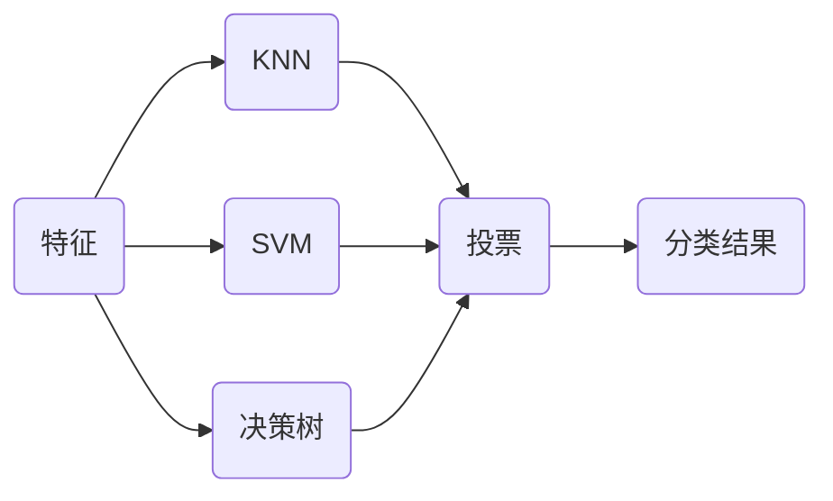
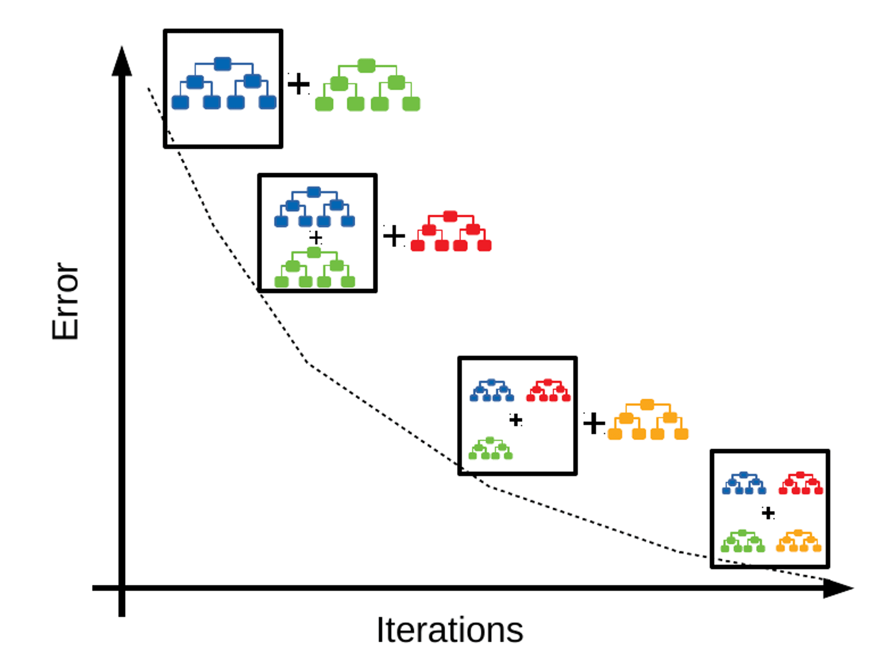
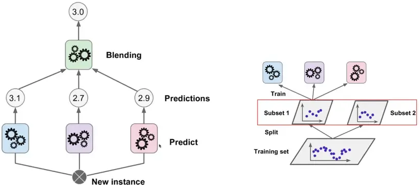
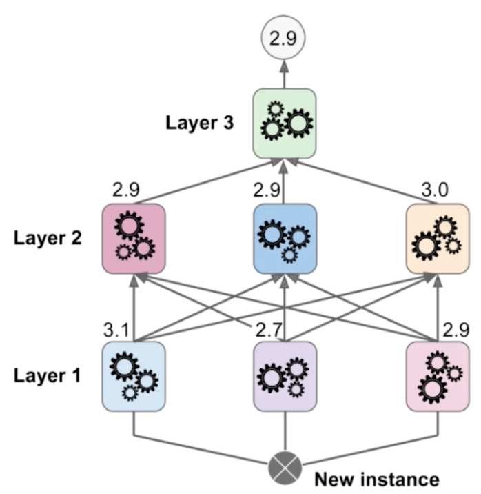

# 集成学习

集成学习是一种机器学习方法，通过组合多个基本模型，以达到更好的整体性能。



* 使用不同的算法训练模型，如：逻辑回归、KNN和SVM。
* 最后用投票（少数服从多数）的方式确定分类。

> [!tip]
>
> 思考如下二分类问题？

|      | 模型1 | 模型2 | 模型3 | 模型4 | 模型5 |
| ---- | ----- | ----- | ----- | ----- | ----- |
| A    | 99%   | 49%   | 40%   | 90%   | 30%   |
| B    | 1%    | 51%   | 60%   | 10%   | 70%   |

* 模型 1，4投票A（两票），模型2，3，5投票B（三票）。
* 模型 1，4投票A的概率更高，更确定；模型2，3，5投票B概率低，不确定。

> [!important]
>
> 为了是集成方式更合理，使用概率作为投票的权重（计算概率的平均值）。

投票权重的计算：

* $A=\frac15(0.99+0.49+0.4+0.9+0.3)=0.616$。
* $B=\frac15(0.01+0.51+0.6+0.1+0.7)=0.384$。
* A的概率更高，选择A类更合理。

> [!warning]
>
> 投票的权重方式：要求每一个模型都能评估概率。

获得分离概率

1. 逻辑回归：计算Sigmod函数值。
2. KNN：可以计算加权值的比重。
3. 决策树：叶子节点中数据的比例。
4. SVM：计算点到分界面的距离。

> [!note]
>
> 使用集成学习对sk-learn癌症数据进行分类：
>
> 1. 集成的模型包括：KNN、逻辑回归、决策树和SVM。
> 2. 比较投票式和权重式两种模型。

## 集成更多模型

> [!tip]
>
> 每个模型的准确率为75%，集成用投票的方式集成11个模型后，准确率是多少？

假设各模型预测互相独立且为二分类问题：

* 11个模型投票时由于是奇数，不会出现平局。
* 只要有至少 6 个模型预测正确。

$$
P(X \ge 6) = \sum_{k=6}^{11} \binom{11}{k} (0.75)^k (0.25)^{11-k}=95.22\%
$$

> [!attention]
>
> 训练模型时，不能保证每个模型都正确。

在训练子模型时，模型之间差异越大越好。反映在模型训练时，即数据和特征的随机性越大越好。

1. 需要创建更多的子模型。
2. 子模型之间应该有差异性。

> [!important]
>
> 每个子模型只训练一部分样本数据。

训练子模型的抽样方式：

1. 放回取样（Bagging），更常用。
2. 不放回取样（Pasting）。如果数据量有限，只能分很少的模型。
3. 训练子模型可以针对样本抽样，也可以针对特征抽样，还可以针对样本和特征同时抽样。

放回取样将导致一部分样本很有可能没有被取到：

* 可以证明平均约有37%的样本没有取到。
* 可以使用这部分样本来做测试数据集。

> [!warning]
>
> 虽然可以集成很多机器学习算法，但是从投票角度看，仍然不够多。

### 随机森林

使用决策树进行集成学习的方式被称作随机森林。

* 随机森林方法，可以有效抑制单棵决策树的噪音，所以不需要剪枝。
* 随机森林方法唯一关心的是决策树个数$k$。

决策树个数范围

1. 数量过少`[2, 10]`：模型方差较高，随机抽样带来的波动大，预测结果不稳定。
2. 数量适中`[50, 200]`：准确率快速提升，性能提升显著。
3. 数量足够多大于300。
4. 决策树增长可以按10~20棵为单位。
5. 观察决策树个数和准确率稳定的区域。


> [!note]
>
> 使用随机森林方法对sk-learn中的手写数字识别进行分类，使用网格搜索测试决策树的个数。

> [!warning]
>
> 集成学习也可以解决回归问题。

## Boosting

集成多个模型，每个模型逐步增加模型的效果


Boosting算法在1990年提出，其步骤如下：

1. 从训练数据集$D$中，无放回的随机抽取样本，组成样本子集$d_1$。
2. 使用$d_1$训练弱分类器$C_1$。
3. 使用分类器$C_1$对子集$d_1$进行分类。
4. 分类器$C_1$对子集$d_1$分类错误的样本$d_1^{\text{False}}$。
5. 从训练数据集$D$中，无放回的随机抽取样本，抽取完成后加入一半的$d_1^{\text{False}}$，构成数据集$d_2$。
6. 使用$d_2$训练弱分类器$C_2$
7. 找出模型$C_1, C_2$预测不同的样本，构成$d_3$。
8. 使用$d_3$训练分类器$C_3$。
9. 通过绝对多数投标机制组合若分类器$C_1, C_1, C_3$。


### AdaBoosting

AdaBoosting使用完整的训练数据训练若分类器，每次迭代中重定义训练样本权重，不断从错误中学习，以此构建一个强学习器。


1. 初始训练AdaBoosting分类器
   * 所有训练样本具有相同的权重。
   * 


### Gradient Boosting

Gradient Boosting通过添加新模型来修正前一个模型的错误。



Gradient Boosting是以决策树为参数进行模型拟合

```python
from sklearn.ensemble import GradientBoostingClassifier

gb_clf = GradientBoostingClassifier(max_depth=2, n_estimators=30)
gb_clf.fit(x_train, y_train)
print(gb_clf.score(x_test, y_test))
```

Boosting算法也可以解决回归问题

* `from sklearn.ensemble import AdaBoostRegressor`
* `from sklearn.ensemble import GradientBoostingRegressor`

## Stacking

堆叠集成学习（Stacking）的策略，在于将多个预测模型的输出值作为训练集输入到另一个预测模型并将该模型的输入结果作为最后的集成学习输出。



训练过程

1. 原始数据拆出两个训练集。
2. 第一个训练集用来训练第一层预测模型。
3. 第二个训练集将分别传入第一层每个分类器后，产生的预测结果，用于训练第二层预测模型。

多层模型



神经网络的组建策略类似于Stacking模型。
