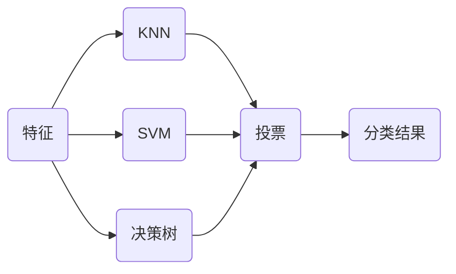
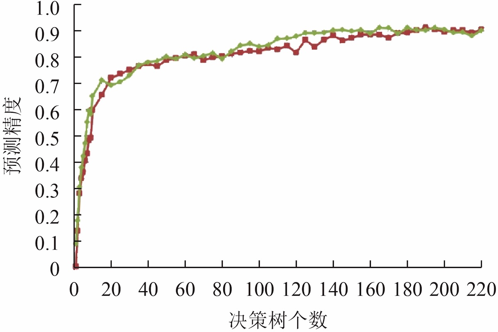
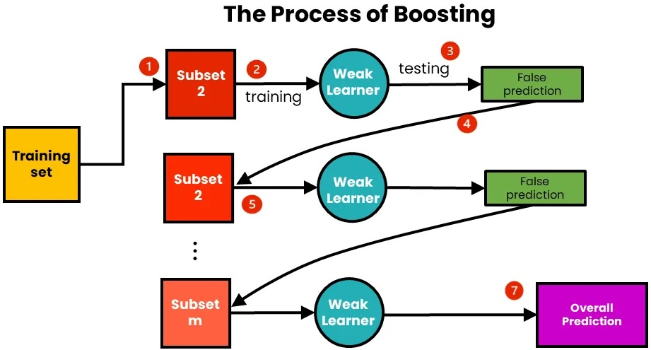
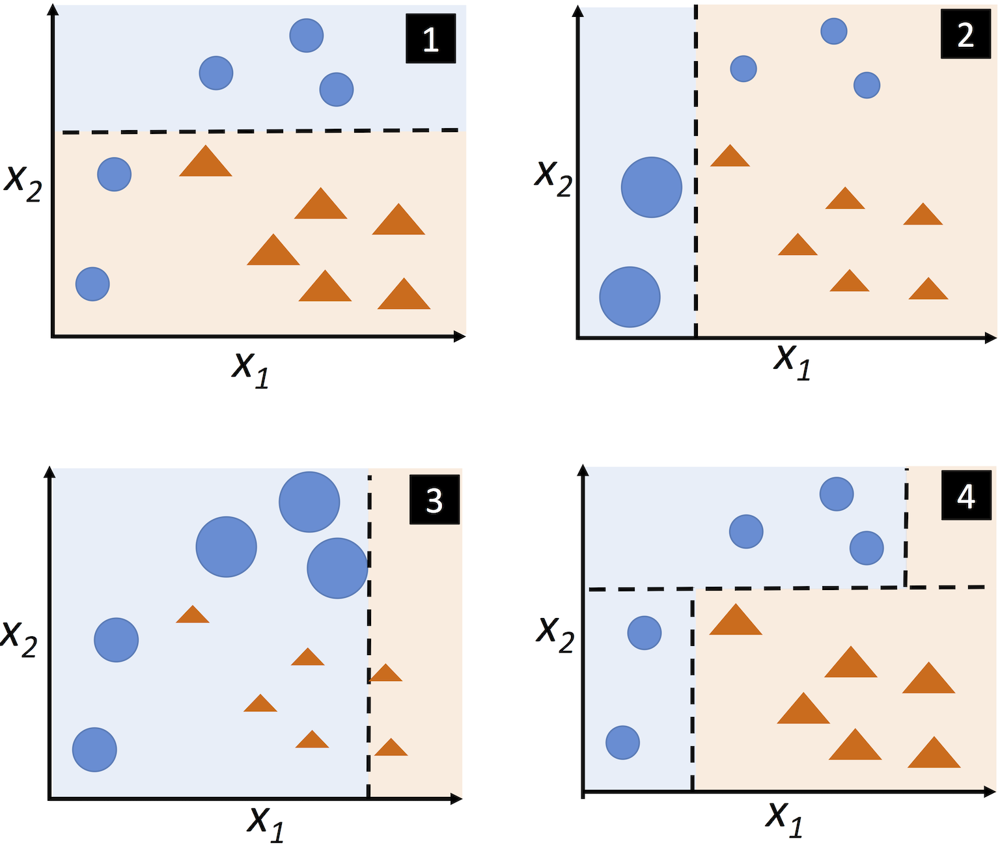
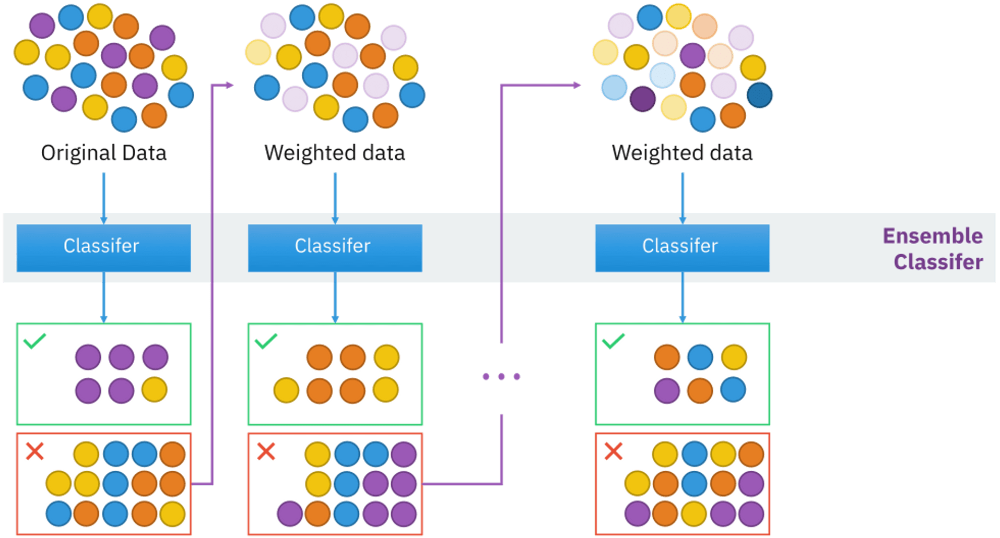
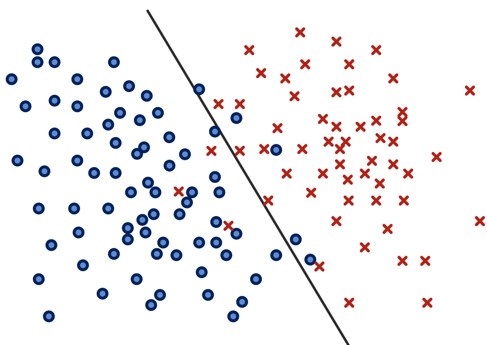
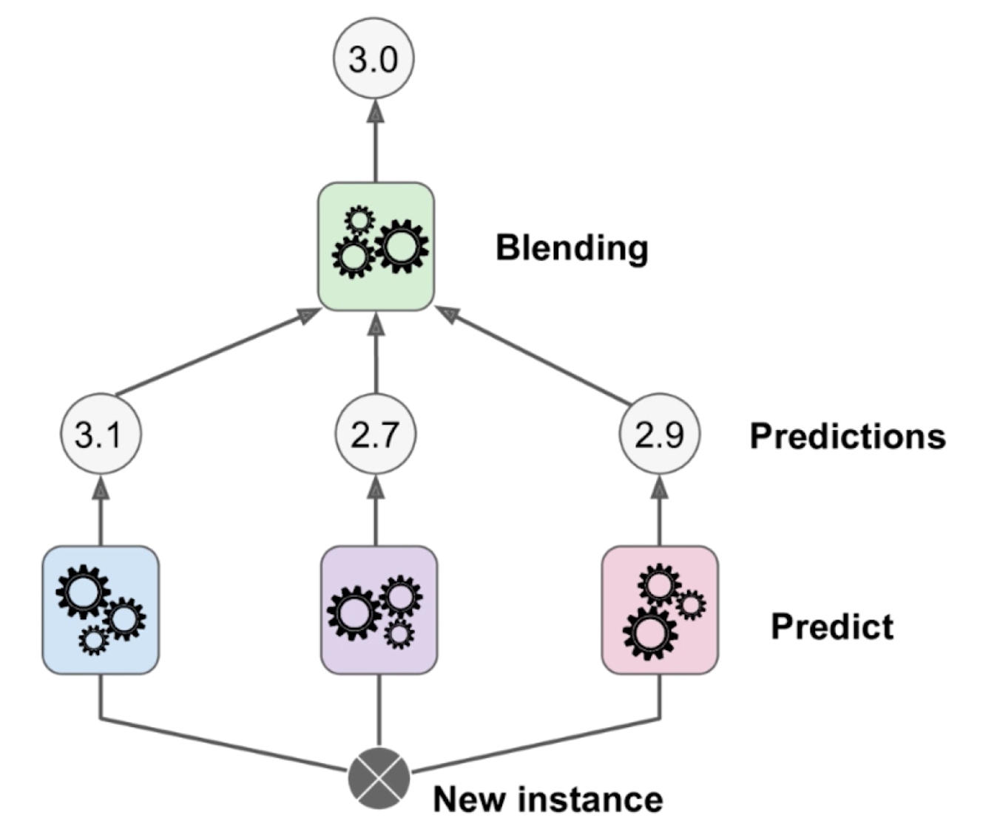
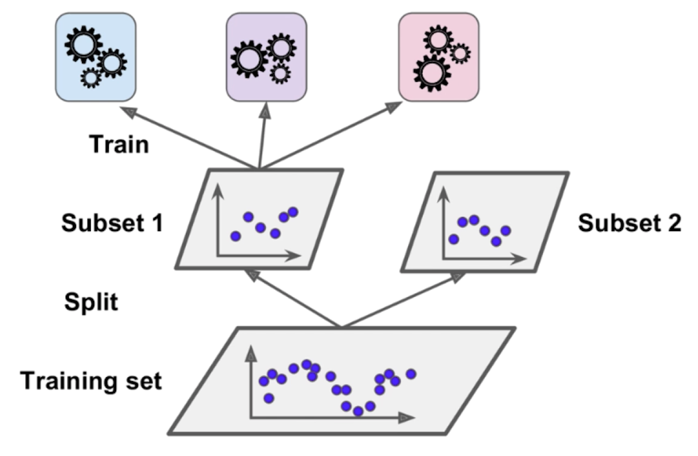
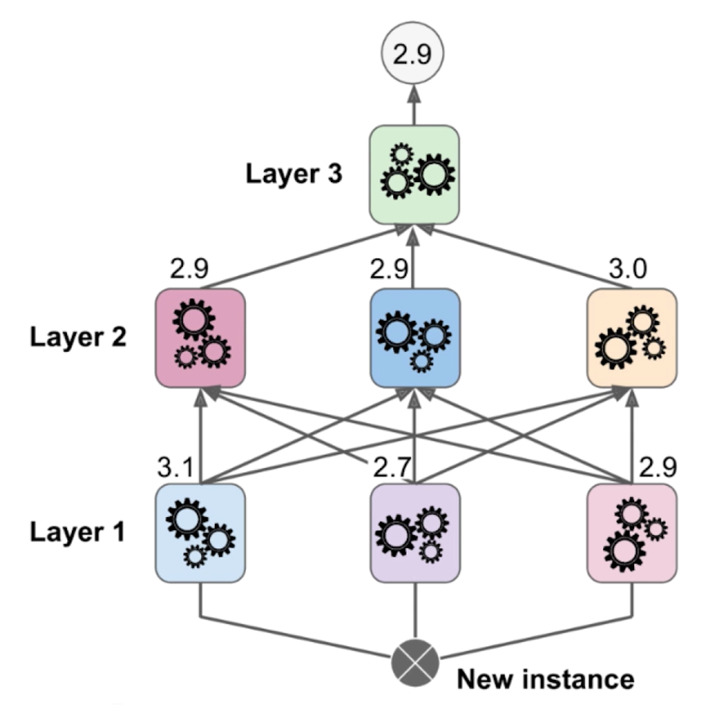

# 集成学习

集成学习是一种机器学习方法，通过组合多个基本模型，以达到更好的整体性能。



* 使用不同的算法训练模型，如：逻辑回归、KNN和SVM。
* 最后用投票（少数服从多数）的方式确定分类。

> [!tip]
>
> 思考如下二分类问题？

|      | 模型1 | 模型2 | 模型3 | 模型4 | 模型5 |
| ---- | ----- | ----- | ----- | ----- | ----- |
| A    | 99%   | 49%   | 40%   | 90%   | 30%   |
| B    | 1%    | 51%   | 60%   | 10%   | 70%   |

* 模型 1，4投票A（两票），模型2，3，5投票B（三票）。
* 模型 1，4投票A的概率更高，更确定；模型2，3，5投票B概率低，不确定。

> [!important]
>
> 为了是集成方式更合理，使用概率作为投票的权重（计算概率的平均值）。

投票权重的计算：

* $A=\frac15(0.99+0.49+0.4+0.9+0.3)=0.616$。
* $B=\frac15(0.01+0.51+0.6+0.1+0.7)=0.384$。
* A的概率更高，选择A类更合理。

> [!warning]
>
> 投票的权重方式：要求每一个模型都能评估概率。

获得分离概率

1. 逻辑回归：计算Sigmod函数值。
2. KNN：可以计算加权值的比重。
3. 决策树：叶子节点中数据的比例。
4. SVM：计算点到分界面的距离。

> [!note]
>
> 使用集成学习对sk-learn癌症数据进行分类：
>
> 1. 集成的模型包括：KNN、逻辑回归、决策树和SVM。
> 2. 比较投票式和权重式两种模型。

## 集成更多模型

> [!tip]
>
> 每个模型的准确率为75%，集成用投票的方式集成11个模型后，准确率是多少？

假设各模型预测互相独立且为二分类问题：

* 11个模型投票时由于是奇数，不会出现平局。
* 只要有至少 6 个模型预测正确。

$$
P(X \ge 6) = \sum_{k=6}^{11} \binom{11}{k} (0.75)^k (0.25)^{11-k}=95.22\%
$$

> [!attention]
>
> 训练模型时，不能保证每个模型都正确。

在训练子模型时，模型之间差异越大越好。反映在模型训练时，即数据和特征的随机性越大越好。

1. 需要创建更多的子模型。
2. 子模型之间应该有差异性。

> [!important]
>
> 每个子模型只训练一部分样本数据。

训练子模型的抽样方式：

1. 放回取样（Bagging），更常用。
2. 不放回取样（Pasting）。如果数据量有限，只能分很少的模型。
3. 训练子模型可以针对样本抽样，也可以针对特征抽样，还可以针对样本和特征同时抽样。

放回取样将导致一部分样本很有可能没有被取到：

* 可以证明平均约有37%的样本没有取到。
* 可以使用这部分样本来做测试数据集。

> [!warning]
>
> 虽然可以集成很多机器学习算法，但是从投票角度看，仍然不够多。

### 随机森林

使用决策树进行集成学习的方式被称作随机森林。

* 随机森林方法，可以有效抑制单棵决策树的噪音，所以不需要剪枝。
* 随机森林方法唯一关心的是决策树个数$k$。

决策树个数范围

1. 数量过少`[2, 10]`：模型方差较高，随机抽样带来的波动大，预测结果不稳定。
2. 数量适中`[50, 200]`：准确率快速提升，性能提升显著。
3. 数量足够多大于300。
4. 决策树增长可以按10~20棵为单位。
5. 观察决策树个数和准确率稳定的区域。



> [!note]
>
> 使用随机森林方法对sk-learn中的手写数字识别进行分类，使用网格搜索测试决策树的个数。

> [!warning]
>
> 集成学习也可以解决回归问题。

## Boosting

集成多个模型，每个模型逐步增加模型的效果



Boosting算法在1990年提出，其步骤如下：

1. 从训练数据集$D$中，无放回的随机抽取样本，组成样本子集$d_1$。
2. 使用$d_1$训练弱分类器$C_1$。
3. 使用分类器$C_1$对子集$d_1$进行分类。
4. 分类器$C_1$对子集$d_1$分类错误的样本$d_1^{\text{False}}$。
5. 从训练数据集$D$中，无放回的随机抽取样本，抽取完成后加入一半的$d_1^{\text{False}}$，构成数据集$d_2$。
6. 使用$d_2$训练弱分类器$C_2$
7. 找出模型$C_1, C_2$预测不同的样本，构成$d_3$。
8. 使用$d_3$训练分类器$C_3$。
9. 通过绝对多数投标机制组合若分类器$C_1, C_1, C_3$。

> [!tip]
>
> 为什么选择弱分类器？

假设有$n$子个模型，每个模型的的准确率有51%的准确率。可以证明如下结果：

1. 如果有1个子模型，整体准确率为51%。
2. 如果有3个子模型，整体准确率为$0.51^3+C_3^2\cdot0.51^2\cdot 0.49 = 51.5\%$​。
3. 如果有500个子模型，整体准确率为$\sum_{i=251}^{500}C_3^i\cdot0.51^i\cdot 0.49^{500-i}=65.6\%$。

当每个子模型的准确率为60%时，500个子模型，整体准确率为$\sum_{i=251}^{500}C_3^i\cdot0.6^i\cdot 0.4^{500-i}=99.999\%$。

### AdaBoosting

AdaBoosting使用完整的训练数据训练若分类器，每次迭代中重定义训练样本权重，不断从错误中学习，以此构建一个强学习器。



AdaBoosting中调整训练样本权重：

1. 初始训练AdaBoosting分类器
   * 所有训练样本具有相同的权重。
   * 使用该数据训练决策树桩。决策树桩（Decision Stump）指的是深度仅为1的决策树，是常用的弱分类器。
   * 分解面如子图 $(1)$ 所示。
2. 重新分配样本权重
   * 为两个错误样本分配更大权重。
   * 降低正确分类的样本权重。
   * 重新训练决策树桩。
   * 新训练的决策树桩，将更关注具有较大权重的训练样本。
3. 重复上面权重调整过程。
4. 通过加权绝对多数投标机制组合弱分类器。

AdaBoosting训练过需要训练更多的弱分离器



> [!warning]
>
> 1. AdaBoosting的弱分类器可以是：决策树桩、逻辑回归、支持向量机等。
> 2. Adaboosting算法训练中不进行采样，只调整数据的权重。

二分类模型中AdaBoosting标签表示为$y\in\{1,-1\}$，AdaBoosting算法流程：

1. 初始化权重，满足条件$\sum_{i=1}^m t^{(i)} = 1$且$t^{(i)}>0$，所以$t^{(i)}=\frac{1}{m}$。
2. 重复如下流程，直到错误率达到指定阈值或迭代足够多轮：
   1. 在加权数据上训练若分类器$C_j$。
   2. 使用分类器$C_j$预测类别标签$\hat{y}$。
   3. 计算加权错误率：$\varepsilon =w\cdot (\hat{y}\ne y )$。
   4. 计算系数：$\alpha_j=0.5ln\frac{1-\varepsilon }{\varepsilon}$
   5. 更新权重$t^{(i)}:=t^{(i)}\exp{(-\alpha_j\hat{y}_iy_i)}$
   6. 归一化权重$t^{(i)}:=\frac{t^{(i)}}{\sum_{i=1}^{m} t^{(i)}}$
3. 最终的预测结构为

$$
\hat{y}=\text{sign}\left( \sum_{j=1}^r \alpha_jC_j(X) \right)
$$

### 梯度Boosting

梯度Boosting构建了一系列的决策树：

1. 每棵树都拟合前一棵树的误差，该误差是真实标签与预测标签之间的差异。
2. 之所以被称为梯度Boosting，是因为这些更新是基于损失函数的梯度。
3. 每一棵决策树都是一棵回归树，预测一个连续的值，分类任务也使用回归树。


> [!warning]
>
> 由于设计机制的限制，梯度Boosting一般只使用决策树为弱分类器，最大深度通常到3~6。

对于二分类模型$y\in\{1,0\}$，假设存在函数$f$，对于任意特征$\mathbf{x}$满足映射
$$
t=f(\mathbf{x}),\quad t\in(-\infty, +\infty)
$$
通过Sigmoid函数转化
$$
p = \frac{1}{1+e^{-t}} = \frac{1}{1+e^{-f(\mathbf{x})}}, \quad p\in(0, 1)
$$
定义损失函数$L$
$$
\begin{aligned}
L(y,p) &= -y\log(p)-(1-y)\log(1-p)\\
L(y,t) &= -y\log\left(\frac{1}{1+e^{-t}}\right)
-(1-y)\log\left(1-\frac{1}{1+e^{-t}}\right)
\end{aligned}
$$

* 损失函数$L$用于计算真实标签与概率估计之间的差异。

损失函数的导数可以表示为
$$
\frac{\partial L(y, t)}{\partial t} = p - y
$$
**初始化模型**

找到一个常量预测值$v$，使得损失函数$\sum_{i=1}^mL(y,t)$最小。数学上可以证明

$$
v = \ln \left( \frac{\text{正样本数量}}{\text{负样本数量}} \right)
$$
初始向量$t_0$是$m$个$v$构成的向量。

**训练子模型**

迭代训练$H$轮$(j=1, 2, \dots,H)$：

1. 计算预测标签和真实标签之间的差值，这个值称为残差
$$
r_j^{(i)}=-\left[ \frac{\partial L(y^{(i)}, t)}{\partial t} \right]_{t=t^{(i)}_{j-1}}
$$

* 其中$r_j^{(i)}\in(-1, 1)$，预测正确残差越小，预测错误残差越大。

2. 使用残差代替$y$标签，训练数据为样本点$(x^{(i)}, r_j^{(i)})$，训练决策树$C_j$。假设该树将样本空间划分为$K$个不相交的叶子节点区域 $R_{jk}$（$k=1, \dots, K$）。
3. 对于每个 叶子节$R_{jk}$，计算出如下值

$$
\gamma_{jk} = \arg\min_\gamma \sum_{x_i \in R_{jk}} L(y_i, f_{j-1}(\mathbf{x}^{(i)})+ \gamma) \tag1
$$

* 其中$f_{j-1}(\mathbf{x}^{(i)})$可以表示为$t_{j-1}^{(i)}$。
* $\gamma$是任意值公式 $(1)$ 的含义是：从所有可能的$\gamma$值中，挑出让损失函数总和达到最小值的特定 $\gamma$ 值。
* 其中$\gamma_{j}$表示一个向量长度为$K$，其中一个元素为$\gamma_{jk}$。
* 跳过数学证明可得计算公式如下

$$
\gamma_{jk} = \frac{\sum_{\mathbf{x}^{(i)} \in R_{jk}} \left( y^{(i)} - p_{j-1}^{(i)} \right)}{\sum_{\mathbf{x}^{(i)} \in R_{jk}} p_{j-1}^{(i)} \left( 1 - p_{j-1}^{(i)} \right)}
$$

* $\gamma_{jk}$表示当前这棵树在某个叶节点区域内，对旧模型预测进行的“统一修正量”。
* $\gamma_{jk}$表达了当前叶子结点中所有样本的修改正方。

4. 更新向量$t$

$$
t_j^{(i)} = t_{j-1}^{(i)} +\eta \gamma_{jk},\quad i\in R_{jk}
$$

* $\eta$是学习率，是一个超参数。
* 其中$t=f(\mathbf{x})$，所以上面公式可以表示为

$$
f_j(\mathbf{x}^{(i)}) = f_{j-1}(\mathbf{x}^{(i)}) +\eta \gamma_{jk},\quad i\in R_{jk}
$$

**预测模型**
$$
t^{(i)} = t_0^{(i)} +\eta \sum_{j=1}^H \gamma_{j,k_j(i)}
$$

* 其中$k_j(i)$表示样 $\mathbf{x}^{(i)}$被第$j$棵树划分到的叶节点编号。

将$t^{(i)}$带入Sigmoid函数根据概率值，划分最终的类别。

> [!warning]
>
> 上面整个算法过程引入了$t=f(\mathbf{x})$函数，但是完全没有去求$f(\mathbf{x})$的表达式。

基于梯度Boosting原理，开发的算法库：

* sk-learn中有梯度Boosting原生库。
* XGBoost函数库。
* LightGBM函数库。

```shell
pip install lightgbm
pip install xgboost
```

|          | 目标优化     | 树生长策略 | 分裂点查找 | 样本采样     | 特征优化         |
| -------- | ------------ | ---------- | ---------- | ------------ | ---------------- |
| XGBoost  | 泰勒二阶展开 | 按层生长   | 预排序     | 随机子采样   | 列抽样           |
| LightGBM | 泰勒二阶展开 | 按叶子生长 | 基于直方图 | 单边梯度采样 | 压缩高维稀疏特征 |

* XGBoost和LightGBM修改了步骤3中$\gamma_{jk}$的计算。

### Boosting算法的本质

直观理解：把更多的注意力分配给当前模型预测得不好的数据。

> [!important]
>
> 机器学习的困难是区分混合重叠数据，所以应该把更多的权重分配给这样的数据。



Boosting算法：

1. 不试图一步到位造出一个完美的大模型。
2. 组合一堆小模型排成队。
3. 每一个新模型都专门去拟合前面所有模型加起来还剩下的误差，最终把误差一点点削减到零。

## Stacking

堆叠集成学习（Stacking）的策略，在于将多个预测模型的输出值作为训练集输入到另一个预测模型并将该模型的输入结果作为最后的集成学习输出。

### Blending算法



1. 使用三个算法计算进行预测，预测的结果是可以是类别标签、概率或连续的值。
2. 把输出结果作为特征，输入新模型，使用新模型进行判断。

Blending的训练：



1. 把训练数据集分成两份。
2. 第一份数据用来训练三个模型。
3. 第二份数据，输入训练好的这三个模型中，获得输出结果。
4. 使用上面的输出结果和对应的标签训练第二个模型。

### Stacking算法



通过K折交叉验证的方式分别训练模型

1. 训练Layer 1：
   * 使用原始训练数据集$(X_{train}, y_{train})$交叉验证的方式训练3个模型。
   * 得到结果矩阵$\hat{Y}^{(1)}$。
2. 训练Layer 2：
   * 将Layer 1的预测矩阵$\hat{Y}^{(1)}$作为特征，标签$y_{train}$保持不变，组合成新数据集$(\hat{Y}^{(1)}, y_{train})$。
   * 同样通过K折交叉验证，得到针对Layer 2的预测矩阵$\hat{Y}^{(2)}$。
3. 训练 Layer 3：
   * 将Layer 2的预测矩阵$\hat{Y}^{(2)}$ 作为特征，与原始标签$y_{train}$组合成 $(\hat{Y}^{(2)}, y_{train})$。
   * 选用一个较为简单的模型如：逻辑回归，在全量$\hat{Y}^{(2)}$特征上进行拟合。

上面的模型与神经网络十分类似，网络中每个神经元是一个算法。
