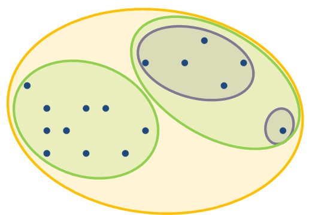
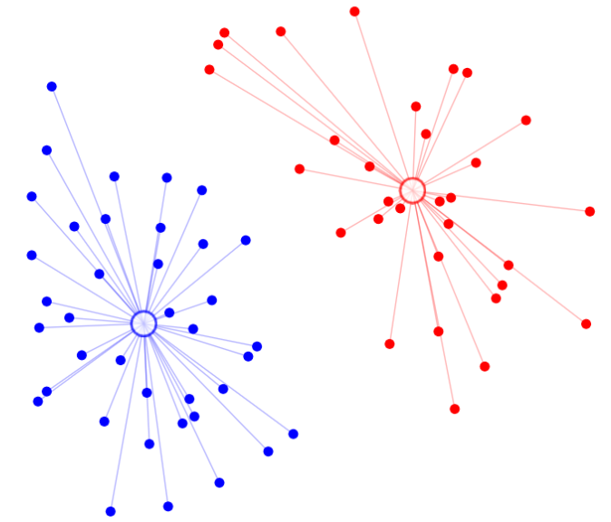
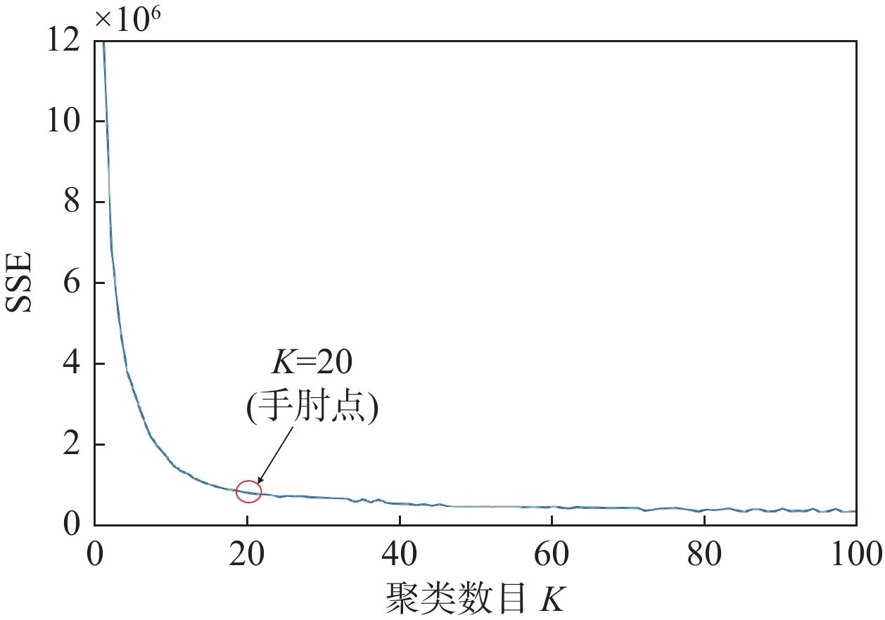
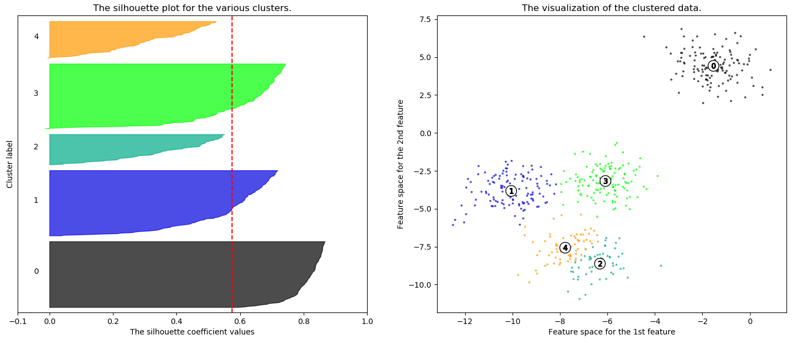
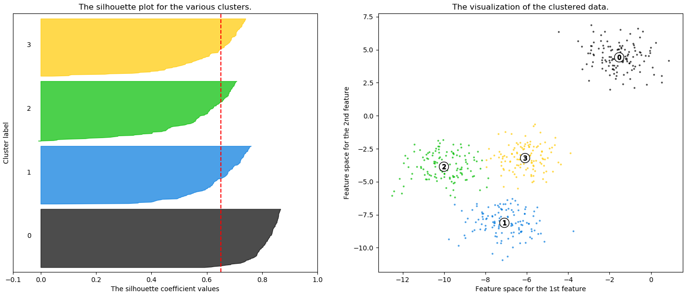

# 聚类算法

聚类分析是一种无监督学习算法，可以在数据标签未知的情况下发现数据中的隐藏结构。

聚类算法的应⽤：

* ⽤户画像、⼴告推荐、新闻聚类、信⽤卡异常消。
* 图像分割、降维、识别。
* 离群点检测。

聚类方法的分类：

* 硬聚类：每个样本都要分给一个具体的簇。
* 软聚类（模糊聚类）：可以把样本分给一个或多个簇。

## K均值

实现聚类算法首先可以度量两个样本的相似性，K均值（K-means）算法一般采用欧式距离平方作为相似性度量指标。

在$n$维空间中样本$\mathbf{x}^{(a)}$和样本$\mathbf{x}^{(b)}$的相似度表示为：
$$
d(\mathbf{x}^{(a)},\mathbf{x}^{(b)}) = \sum_{i=1}^{n} (x_i^{(a)} - x_i^{(b)})^2 = \left\Vert{} \mathbf{x}^{(a)} - \mathbf{x}^{(b)} \right\Vert{}_2^2
$$

> [!warning]
>
> K均值算法不写预先指定簇的数量K（超参数）。

$m$个样本$n$维特征的K均值算法的步骤：

1. 初始化：从所有样本中随机挑选$K$个样本作为初始簇的中心，称之为质心。
2. 分配簇：
   * 计算样本$\mathbf{x}^{(i)}$到每个质心的距离$d(\mathbf{x}^{(i)},\mu^{(k)})$。
   * 将每个样本分配给最近的质心$\mu^{(k)}$，其中$k\in \{1,\cdots, K\}$。
3. 更新质心：计算每个簇$C_k$内所样本的算术平均值

$$
\mu^{(k)} := \frac{1}{\vert{}C_k\vert{}} \sum_{\mathbf{x}^{(i)} \in C_k} \mathbf{x}^{(i)} = \frac{1}{\vert{}C_k\vert{}} \begin{bmatrix} \sum_{\mathbf{x}^{(i)} \in C_k} x_1^{(i)} \\ \sum_{\mathbf{x}^{(i)} \in C_k} x_2^{(i)} \\ \vdots \\ \sum_{\mathbf{x}^{(i)} \in C_k} x_n^{(i)} \end{bmatrix}
$$

* $C_k$是第$k$个簇中所有样本的集合。
* $\vert{}C_k\vert{}$是该簇内样本的总数量。

4. 终止迭代，重复步骤2和步骤3，直到满足下列条件：
   * 所有样本的分配标签不再发生变化。
   * 质心移动距离或SSE的变化量低于预设阈值。
   * 迭代次数达到预设的最大次数。

### 平方误差和

平方误差和（Sum of Squared Errors），计算的是所有样本点到其所属簇质心的平方距离之和
$$
\text{SSE} = 
\sum_{k=1}^{K} 
\sum_{\mathbf{x}^{(i)} \in C_k} 
d(\mathbf{x}^{(i)},\mu^{(k)})
$$

* 物理意义：衡量簇内样本的紧密程度。
* 数值含义：在同一个K值条件下，SSE越小，说明簇内样本越紧密，聚类效果越好。

> [!important]
>
> SSE的变化量低于预设阈值时也可以停止迭代。

### K均值++

经典K均值算法，初始化时随机选择质心，如果质心不合适，会导致聚类效果差或收敛速度慢。K均值++（K-means++）的提出就是为了改善这一问题。

K均值++算法的初始化过程如下：

1. 初始化空集$M$，用来存储$k$个质心。
2. 随机选择第一个质心：从原始数据集$X$中随机挑选一个样本点$\mu^{(1)}$，将其加入集合$M$中（即 $M = \{\mu^{(1)}\}$）。
3. 对于不在$M$中的每一个样本点$\mathbf{x}^{(i)}$，计算与$\mathbf{x}^{(i)}$距离最近的那一个质心的距离平方$\min d(\mathbf{x}^{(i)},\mu^{(k)})$：
   * 对于样本点$\mathbf{x}^{(i)}$，从多个质心中选一个。
   * 每一个样本点$\mathbf{x}^{(i)}$，都对应着一个质心$\mu^{(k)}$和一个最小距离$\min d(\mathbf{x}^{(i)},\mu^{(k)})$。
4. 根据这个距离挑选下一个质心，计算如下值：

$$
P(\mathbf{x}^{(i)}) = \frac{\min d(\mathbf{x}^{(i)}, \mu^{(k)})}{\sum_{\mathbf{x}^{(j)} \notin M} \min d(\mathbf{x}^{(j)}, \mu^{(k)})}, \quad  \mathbf{x}^{(i)} \notin M
$$

* 根据概率分布$P$进行加权随机抽样，来选择下一个质心。

> [!warning]
>
> 如果每次都直接选$P$最大的点，极易选中极端噪点或离群点，所以应该P的概率来选择。

5. 重复步骤3和4直到选出$K$个质心。
6. 继续运行经典的K均值算法。

## 评价聚类结果

无监督学习的主要问题是真实了类别未知。

> [!tip]
>
> 如何选择合适的类别$K$？

### 肘方法

分别计算$K\in (1, m)$的SEE并绘制图像，其中$m$为样本数量。

* 肘拐点表面：随着分类数的增加带来的回报增长缓慢，所以合适的$K$值应该在拐点处。

### 轮廓系数法

轮廓系数法（Silhouette Coefficient）是评估聚类效果最常用的内部指标之一。轮廓系数同时考量了“簇内紧密度”与“簇间分离度”。

轮廓系数法的计算步骤：

1. 对于每个样本点$\mathbf{x}^{(i)}$计算簇内不相识度$a(i)$：

$$
a(i) = \frac{1}{\vert{}C_A\vert{} - 1} \sum_{\mathbf{x}^{(j)} \in C_A, j \neq i} d(\mathbf{x}^{(i)}, \mathbf{x}^{(j)})
$$

* 样本点总数为 $\vert{}C_A\vert{}$
* 分母为$\vert{}C_A\vert{} - 1$，是因为计算平均值时要排除样本点$i$自身。
* $\mathbf{x}^{(j)} \in C_A, j \neq i$同一簇内不同的样本点。

2. 对于每个样本点$\mathbf{x}^{(i)}$计算簇间不相似度$b(i)$：

$$
d(\mathbf{x}^{(i)}, C_k) = \frac{1}{\vert{}C_k\vert{}} \sum_{\mathbf{x}^{(j)} \in C_k} d(\mathbf{x}^{(i)}, \mathbf{x}^{(j)}),\quad \mathbf{x}^{(i)} \notin C_k
$$

* 遍历所有其他外部簇，取其中平均距离最小的那个值$$b(i) = \min d(\mathbf{x}^{(i)}, C_k)$$：

3. 样本点$\mathbf{x}^{(i)}$的轮廓系数定义为

$$
s(i) = \frac{b(i) - a(i)}{\max(a(i), b(i))}
$$

* 整个人工数据集的最终轮廓系数，则是所有样本点$s(i)$的平均值。

轮廓系数的取值范围为$[-1, 1]$

| 取值区间  | 聚类效果判断 | 几何含义                                                     |
| --------- | ------------ | ------------------------------------------------------------ |
| 接近 $+1$ | 效果极佳     | $b(i) \gg a(i)$，样本离自己簇很近，离其他簇很远，分类非常合理。 |
| 接近 $0$  | 界限模糊     | $b(i) \approx a(i)$，样本恰好处于两个簇的交界重叠区域，可分可不分。 |
| 接近 $-1$ | 聚类错误     | $b(i) \ll a(i)$，样本离其他簇反而比离自己簇更近，说明被误分到了错误的簇中。 |

轮廓系数图

* 图形的横坐标是轮廓系数。
* 纵坐标是样本序号，每一个样本都对应一个$s(i)$，样本那簇排列，每个簇内样本的系数值按从小到大排列。
* 红色虚线表示全量数据的全局平均轮廓系数。
* 观察轮廓系数图的三大标准：
  * 所有簇的刀片峰值都突破了全局平均红线。
  * 各个簇的刀片厚度大致相当，说明各簇样本数量较均衡。
  * 几乎没有刀片延伸到$0$刻度左侧。

> [!note]
>
> 使用鸢尾花数据集进行聚类，分别绘制肘状图和轮廓系数图，比较不同$K$值的性能。
