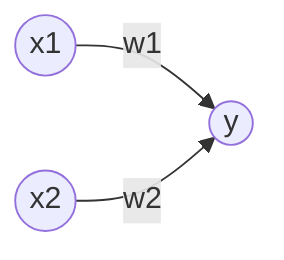

# 感知机

感知机是由美国学者Frank Rosenblatt在1957年提出的，是神经网络（深度学习）起源的算法之一，是一种线性二分类模型。感知机接收多个输入信号，输出一个信号。感知机的值只有1和0。



$x_1$和$x_2$输入信号，$y$是输出信号，$w_1$和$w_2$是权重，输入信号与权重的乘积超过某个界限时，输出为1，否则为0。

$$
y=
\begin{cases}
 0 & \text{ if } & w_1x_1+w_2x_2 \le \theta  \\
 1 & \text{ if } & w_1x_1+w_2x_2 >  \theta
\end{cases} \tag{1}
$$
> [!warning]
>
> 感知机中的权重表示输入信号的重要程度，权重越大，对应该权重的信号的重要性就越高。

使用感知机来模拟逻辑与。根据 公式 $(1)$ 所示，满足条件的参数有无数组，假设选择参数$(w_1, w_2,\theta)=(0.5, 0.5, 0.7)$。

```python
def AND(x1, x2):
    w1, w2, theta = 0.5, 0.5, 0.7
    tmp = x1*w1 + x2*w2
    if tmp <= theta:
        return 0
    elif tmp > theta:
        return 1
    
print(AND(0, 0))
print(AND(1, 0))
print(AND(0, 1))
print(AND(1, 1))
```

增加偏置项$b$ 公式 $(1)$ 可以表示为
$$
y=
\begin{cases}
 0 & \text{ if } & b+w_1x_1+w_2x_2 \le 0  \\
 1 & \text{ if } & b+w_1x_1+w_2x_2 >  0
\end{cases} \tag{2}
$$

> [!warning]
>
> 偏置$b$条件了神经元被激活的容易程度。

$w_1$、$w_2$和$b$统称为权重，使用Numpy优化上述过程。

```python
import numpy as np

def AND(x1, x2):
    x = np.array([x1, x2])
    w = np.array([0.5, 0.5])
    b = -0.7
    tmp = np.sum(w*x) + b
    if tmp <= 0:
        return 0
    else:
        return 1
    
print(AND(0, 0))
print(AND(1, 0))
print(AND(0, 1))
print(AND(1, 1))
```

使用感知机来模拟逻辑或

```python
def OR(x1, x2):
    x = np.array([x1, x2])
    w = np.array([0.5, 0.5])
    b = -0.2
    tmp = np.sum(w*x) + b
    if tmp <= 0:
        return 0
    else:
        return 1
    
print(OR(0, 0))
print(OR(1, 0))
print(OR(0, 1))
print(OR(1, 1))
```

使用感知机模拟逻辑**与非**（逻辑与的值取反）

```python
def NAND(x1, x2):
    x = np.array([x1, x2])
    w = np.array([-0.5, -0.5])
    b = 0.7
    tmp = np.sum(w*x) + b
    if tmp <= 0:
        return 0
    else:
        return 1
    
print(NAND(0, 0))
print(NAND(1, 0))
print(NAND(0, 1))
print(NAND(1, 1))
```

## 感知机的局限性

逻辑异或的值为

| $x_1$ | $x_2$ | $y$  |
| ----- | ----- | ---- |
| 0     | 0     | 0    |
| 1     | 0     | 1    |
| 0     | 1     | 1    |
| 1     | 1     | 0    |

单一的感知机无法实现逻辑异或，假设权重参数$(b, w_1, w_2)=(-0.5, 1, 1)$， 公式 $(2)$ 可表示为
$$
y=
\begin{cases}
 0 & \text{ if } & -0.5+x_1+x_2 \le 0  \\
 1 & \text{ if } & -0.5+x_1+x_2 >  0
\end{cases}
$$
比较逻辑与和逻辑或，逻辑异或在二维平面上可以表示如下图。


感知机的局限性就在于它只能表示由一条直线分割的空间。如何想分割逻辑异或，只能使用如下曲线。


### 多层感知机

虽然一层感知机不能表示异或，但是通过感知机的多层组合可以实现异或的运算。

| $x_1$ | $x_2$ | $s_1=\text{NAND}(x_1, x_2)$ | $s_2=\text{OR}(x_1, x_2)$ | $y=\text{AND}(S_1, S_2)$ |
| ----- | ----- | --------------------------- | ------------------------- | ------------------------ |
| 0     | 0     | 1                           | 0                         | 0                        |
| 1     | 0     | 1                           | 1                         | 1                        |
| 0     | 1     | 1                           | 1                         | 1                        |
| 1     | 1     | 0                           | 1                         | 0                        |

使用感知机来模拟逻辑异或

```python
def XOR(x1, x2):
    s1 = NAND(x1, x2)
    s2 = OR(x1, x2)
    y = AND(s1, s2)
    return y

print(XOR(0, 0))
print(XOR(1, 0))
print(XOR(0, 1))
print(XOR(1, 1))
```

多层感知机的结构如下


> **结论**：通过构造多层感知机，可以解决线性不可分的问题。

## PyTorch简介

[Pytorch](https://pytorch.org/)是由Facebook AI Research (FAIR)开发的开源深度学习框架，是一个基于Numpy的科学计算包，向它的使用者提供了两大功能。与Tensorflow对比，PyTorch在GitHub上的开源项目，数量和社区活跃度方面，略占优势，尤其在研究和学术领域。

* Hugging Face Transformers提供BERT、GPT-2、T5、RoBERTa等预训练模型，支持文本分类、翻译、生成等任务。
* 常用的开源大语言模型基于PyTorch
  * Deepseek官方推荐PyTorch。
  * Facebook开源模型LLaMA基于PyTorch。
* YOLO开源工具V5、V8、V11均基于PyTorch。
* Stable Diffusion基于 扩散模型（Diffusion Models）的文本到图像生成工具。
* FaceFusion高度真实感的换脸工具。
* LLM-Driver结合了大型语言模型（LLM）与自动驾驶任务。

> [!warning]
>
> 目前知名的开源项目，大多是基于PyTorch开发。

核心特点

* 动态计算图：计算图，在代码运行时动态构建，灵活性高，适合调试和研究。对比 TensorFlow 1.x 的静态图（Define-and-Run），PyTorch 更直观，适合快速实验。
* 张量计算：作为Numpy的替代者，向用户提供使用GPU强大功能的能力。
* 自动微分：自动计算梯度，简化反向传播。
* 模块化神经网络：做为一款深度学习的平台，向用户提供最大的灵活性和速度。
* GPU 加速（CUDA 支持）：只需简单命令即可实现GPU加速。
* 数据加载与预处理：使用`Dataset` 和 `DataLoader`方便数据批处理和多线程加载。

可视化

* 支持Tensorboard可视化分析。

模型仓库

* PyTorch提供了[PyTorch Hub](https://pytorch.org/hub/)官方模型仓库。
* [HuggingFace](https://huggingface.co/)：开源的AI工具库中的预训练模型。

学习资料

* 学习网站
  * [官方教程](https://pytorch.org/tutorials/)
  * [20天吃掉那只Pytorch](https://jackiexiao.github.io/eat_pytorch_in_20_days/)
  * [深入浅出PyTorch](https://datawhalechina.github.io/thorough-pytorch/index.html#)
* 学习书籍
  * [《PyTorch深度学习实战》](https://book.douban.com/subject/35776474/)

PyTorch的安装

* [安装命令](https://pytorch.org/get-started/locally/)
  * `torch`为PyTorch的核心包。
  * `torchvision`专为计算机视觉任务设计的扩展库。
  * `torchaudio`音频处理库。


模型的转换

* ONNX可以对不同框架模型进行转换，可以将Tensorflow模型转换为PyTorch模型。

## PyTorch基本语法

### 张量及其操作

张量（Tensors）是一种多为数组，它可以看做是矩阵和向量的推广。


> [!note]
>
> 高维的张量和矩阵之间是可以相互转换的，而张量的计算是以矩阵的计算为基础。

高维张量间的计算，最后两个维度视为矩阵，其它维度视为循环。假设有两个张量：

* A：形状 `(..., m, n)`
* B：形状 `(..., n, p)`

张量之间的运算

- A、B张量中每个样本：`A[i]` 是 `(m, n)` 矩阵，`B[i] 是`(n, p)` 矩阵
- 计算结果 `C[i] = A[i] @ B[i]`，形状为 `(m, p)`
- 最终结果C的形状：`(..., m, p)`

> [!warning]
>
> 最后两维之前的任意维度`...`必须相等，如果不相等，这两个张量通常无法直接进行运算。

在PyTorch中，张量的概念类似于Numpy中的`ndarray`数据结构，最大的区别在于Tensor可以利用GPU的加速功能。张量的类型为`tensor`，具有数据类型和形状。


使用PyTorch前，需要引入相关包

```python
import torch
```

### 基本方法

创建一个没有初始化的矩阵

```python
x = torch.empty(5, 3)
print(x)
```

> [!warning]
>
> 有些版本的PyTorch，创建一个未初始化的矩阵时，分配给矩阵的内存，包含残留数据。

随机初始化矩阵（标准高斯分布初始化数据）

```python
x = torch.rand(5, 3)
print(x)
```

创建一个全零矩阵，指定数据类型为`long`

```python
x = torch.zeros(5, 3, dtype=torch.long)
print(x)
```

直接通过数据创建张量。`tensor`可以封装不同类型的数据

```python
x = torch.tensor([2.5, 3.5])
print(x)
```

通过已有的张量，创建相同尺寸的新张量。

```python
x = x.new_ones(5, 3, dtype=torch.double)
print(x)

y = torch.randn_like(x, dtype=torch.float)
print(y)

```

得到张量的尺寸。`size()`方法返回的是一个元组，它支持一切元组的操作，如：拆包等。

```python
print(x.size())
print(y.size())
a, b = x.size()
print(a, b)
```

创建标量、向量和矩阵

```python
rank_0_tensor = torch.tensor(4)
print(rank_0_tensor)

rank_1_tensor = torch.tensor([2.0, 3.0, 4.0])
print(rank_1_tensor)

rank_2_tensor = torch.tensor([[1, 2], [3, 4], [5, 6]], dtype=torch.float16)
print(rank_2_tensor)
```


创建3维张量

```python
rank_3_tensor = torch.tensor([
    [[0, 1, 2, 3, 4],
     [5, 6, 7, 8, 9]],
    [[10, 11, 12, 13, 14],
     [15, 16, 17, 18, 19]],
    [[20, 21, 22, 23, 24],
     [25, 26, 27, 28, 29]],])
print(rank_3_tensor)
```


### 张量的运算

[加法操作](https://pytorch.org/docs/stable/generated/torch.add.html)

```python
print(x + y)
print(torch.add(x, y))
```

指定输出变量的加法操作

```python
result = torch.zeros(5, 3)
print(result)
torch.add(x, y, out=result)
print(result)
```

加法操作，原地置换（in-place）

```python
print(y)
y.add_(x)
print(y)
```

> [!warning]
>
> 原地置换会修改变量，所有原地置换操作函数，都有一个下划线的后缀，如：`x.copy_(y)`。

用类似于Numpy的方式对张量进行操作

```python
print(y[:, 1])
```

改变张量的形状`torch.view()`

* 操作需要保证数据元素的总数量不变。
* `-1`代表自动匹配个数。

```python
x = torch.randn(4, 4)
y = x.view(16)
z = x.view(-1, 8)
print(x.size(), y.size(), z.size())
```

如果张量中**只有一个元素**，可以用`item()`将值取出，作为一个python number。

```python
x = torch.randn(1)
print(x)
print(x.item())
```

> [!warning]
>
> `item()`常用在获取损失（loss）值时。获取Python列表[`tolist`](https://pytorch.org/docs/stable/generated/torch.Tensor.tolist.html)

### `tensor`和`ndarray`的转换

Torch的`tensor`和Numpy的`ndarray`共享底层的内存空间，因此改变其中一个的值，另一个也会随之被改变。

```python
a = torch.ones(5)
print(a)
```

将`tensor`转换为`ndarray`

```python
b = a.numpy()
print(b)
```

对其中一个进行加法操作，另一个也随之被改变。

```python
a.add_(1)
print(a)
print(b)
```

将`ndarray`转换为`tensor`

```python
a = np.ones(5)
b = torch.from_numpy(a)
print(a)
print(b)
print(20*'-')
np.add(a, 1, out=a)
print(a)
print(b)
```

使用`from_numpy`转换来的`tensor`和原始的`ndarray`共享底层数据。使用`torch.tensor`转换来的数据，会将数据重新复制一份。

> [!warning]
>
> 所有在CPU上的`tensor`，除了CharTensor，都可以转换为`ndarray`并可以反向转换。
