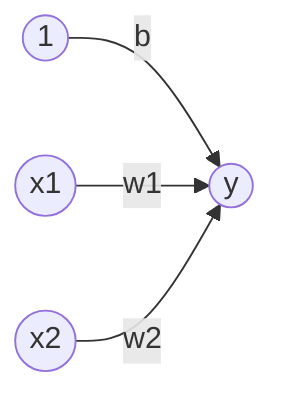

# 神经网络

人脑可以看做是一个生物神经网络，由众多神经元连接而成，各个神经元传递复杂的电信号。


* 树突接收到输入信号，然后对信号进行处理。
* 轴突输出信号。
* 如果神经元的电位超过了一个“阈值”，那么它就会被激活（即“兴奋”起来），向其他神经元发送化学物质。
* 人类神经元的激活是阶跃函数。

感知机可以模拟一个神经元的结构。1969年Marvin Minsky写了一本叫做《Perceptrons》的书，他提出了著名的两个观点：

1. 单层感知机没用，需要多层感知机来解决复杂问题。
2. 当时没有，有效的训练算法。


神经网络可以看做是多层感知机构成网络系统，每一个感知机即为一个神经元。上图中神经元共有三层：

1. 第一层为输入层。
2. 第二层为隐藏层。
3. 第三层为输出层。

由于只有**隐层和输出层**的计算用到了参数，所以上述网络也称**二层神经网络**（神经网络的层数，一般是指除去输入层的层数）。对于每个神经元的表示如下

$$
y=
\begin{cases}
 0 & \text{ if } & b+w_1x_1+w_2x_2 \le 0  \\
 1 & \text{ if } & b+w_1x_1+w_2x_2 >  0
\end{cases}
$$
引入函数$h(x)$化简上式可以得到
$$
y=h\left(b+w_1x_1+w_2x_2\right)\tag{1}
$$
上式的网络结构可以表示为



输入信号的转换函数$h(x)$可以表示为
$$
h(x)=
\begin{cases}
 0 & \text{ if } & x \le 0  \\
 1 & \text{ if } & x >  0
\end{cases}
$$
即输入神经元的汇总结果小于0时，输出是0；大于0时，输出是1。

## 激活函数

函数$h(x)$可以将输入信号的总和转换为输出信号，这个函数称为**激活函数（activation function）**。激活函数的作用，输入值为多少时有输出。上面的公式可以整理如下
$$
a = b + w_1x_1+w_2x_2 \\
y=h(a)
$$
上述计算过程用图形表示


在神经网络中，每个神经元（或节点）实际的计算过程如上图，但是在绘制网状图时，通常会省略神经元结构内部的绘制。上述$h(x)$作为激活函数是一个阶跃函数，输出只有0和1两个值。

### sigmoid函数

由于阶跃函数不可导，无法计算梯度。所以神经网络中经常使用的一个激活函数是sigmoid函数
$$
h(x)=\frac{1}{1+e^{-x}}
$$

PyTorch来构建神经网络，主要工具都在`torch.nn`包中。绘制函数的曲线如下

```python
import torch
from torch import nn

x = torch.from_numpy(np.linspace(-10, 10, 100)) 
y = nn.Sigmoid()(x)
plot_fun(x, y)
```

上述函数计算时，输入与输入是相同维度的张量。sigmoid函数特性：

* 阶跃函数只能返回0或1，sigmoid函数可以返回连续值。
* sigmoid函数出处可导，阶跃函数在0点处不可导。
* 输入越小，输出越接近于0；输出越大，输出越接近于1。
* sigmoid函数和阶跃函数都是非线性函数。
* sigmoid函数容易产生梯度消失现象。

> [!attention]
>
> 神经网络的激活函数必须使用非线性函数。

假设激活函数是线性函数
$$
h(x) = cx
$$
对于三层的神经网络有
$$
y(x)=h(h(h(x))) \Rightarrow y(x)=c\times c \times c \times x \Rightarrow y(x)=ax \quad a=c^3
$$
这与一层的感知机是相同的。

> [!warning]
>
> 通过给网络输出增加激活函数，实现引入非线性因素，使得网络模型可以逼近任意函数，提升网络对复杂问题的拟合能力。

### ReLU函数

ReLU是在sigmoid函数之后引入的激活函数，ReLU函数表示为
$$
h(x) = 
\left\{\begin{matrix}
 x & (x > 0) \\
 0 & (x \le 0)
\end{matrix}\right.
$$
* ReLU能够在x>0时保持梯度不衰减，从而缓解梯度消失问题。
* 部分输入会落入小于0区域，导致对应权重无法更新。这种现象被称为“神经元死亡”。

```python
x = torch.from_numpy(np.linspace(-10, 10, 100)) 
y = nn.ReLU()(x)
plot_fun(x, y)
```

### tanh激活函数

Tanh叫做双曲正切函数
$$
h(x)=\frac{e^x-e^{-x}}{e^x+e^{-x}}
$$
* Tanh以0为中心的，收敛速度要比Sigmoid快，减少迭代次数。
* Tanh函数也会产生梯度消失现象。

```python
x = torch.from_numpy(np.linspace(-10, 10, 100)) 
y = nn.Tanh()(x)
plot_fun(x, y)
```

> [!note]
>
> 思考如下的激活函数有何优缺点

1. 分段函数

$$
h(x)=\begin{cases}
x^2 & \text{ if } x\ge0 \\
-x^2 & \text{ if } x<0
\end{cases}
$$

2. 周期函数$h(x)=\sin(x)$。

## 简单神经网络的实现

使用Numpy实现如下神经网络结构的前向计算


上述是一个三层神经网络

* 有两个隐层，每层分别有3个神经元和2个神经元。
* 输出层有两个神经元，结果为二分类。

将偏置神经元加入到网络中，上述网络结构可以表示为


神经元$a_1^{(1)}$的计算可以表示为
$$
a_1^{(1)}=w^{(1)}_{11}x_1+w^{(1)}_{12}x_2+b^{(1)}_1
$$

* $a_j^{(i)}$表示第$i$层，第$j$个神经元。
* $w^{(i)}_{jk}$表示第$i$层的权重，$j$表示链接第$i$层的第$j$个神经元，$k$表示链接前一层的第$k$个神经元。
* $b_j^{(i)}$表示第$i$层，第$j$个神经元的偏置。

使用矩阵运算来表示第一层的整个计算过程
$$
A^{(1)}=XW^{(1)}+B^{(1)}
$$

* $A^{(1)}$表示第一层所有神经元

$$
A^{(1)}=\left(a_1^{(1)}, a_2^{(1)} , a_3^{(1)}\right)
$$

* $X$表示输入

$$
X=\left(x_1, x_2 \right)
$$

* $B^{(1)}$表示为一层所有的偏置

$$
B^{(1)}=\left(b_1^{(1)}, b_2^{(1)} , b_3^{(1)}\right)
$$

* $W^{(1)}$表示第一层计算的全部权重

$$
W^{(1)}=
\begin{pmatrix}
 w^{(1)}_{11} & w^{(1)}_{21} & w^{(1)}_{31}\\
 w^{(1)}_{12} & w^{(1)}_{22} & w^{(1)}_{32}
\end{pmatrix}
$$

### 模拟神经网络的传递过

使用数据模拟神经网络的前向传递过程，第一层网络计算如下

```python
x = torch.tensor([1.0, 0.5])
print(x.shape)
x = x.unsqueeze(0)
print(x.shape)

W1 = torch.tensor([[0.1, 0.3, 0.5], [0.2, 0.4, 0.6]])
B1 = torch.tensor([0.1, 0.2, 0.3])
print(W1.shape)
print(B1.shape)

A1 = torch.mm(x, W1) + B1
Z1 = nn.Sigmoid()(A1)
print(A1)
print(Z1)
```

[`unsqueeze`](https://docs.pytorch.org/docs/stable/generated/torch.unsqueeze.html#torch-unsqueeze)在指定位置插入新张量，改变张量的维度。pytorch计算时，可以多个样本同时进行。第一层网络的计算图


第二层网络的计算过程如下

```python
W2 = torch.tensor([[0.1, 0.4], [0.2, 0.5], [0.3, 0.6]])
B2 = torch.tensor([0.1, 0.2])
print(W2.shape)
print(B2.shape)

A2 = torch.mm(Z1, W2) + B2
Z2 = nn.Sigmoid()(A2)
print(A2)
print(Z2)
```

第二层网络的计算图


第三层网络的计算过程

```python
def identity_function(x):
    return x

W3 = np.array([[0.1, 0.3], [0.2, 0.4]])
B3 = np.array([0.1, 0.2])

A3 = np.dot(Z2, W3) + B3
Y = identity_function(A3)

print(Y)
```

最后一程网络的激活函数不在是sigmoid函数，采用的是恒等函数输出。第三层的网络计算图


将上述过程封装成函数为

```python
def init_network():
    network = {}
    network['W1'] = torch.tensor([[0.1, 0.3, 0.5], 
                                  [0.2, 0.4, 0.6]])
    network['b1'] = torch.tensor([0.1, 0.2, 0.3])
    network['W2'] = torch.tensor([[0.1, 0.4], 
                                  [0.2, 0.5], 
                                  [0.3, 0.6]])
    network['b2'] = torch.tensor([0.1, 0.2])
    network['W3'] = torch.tensor([[0.1, 0.3], 
                                  [0.2, 0.4]])
    network['b3'] = torch.tensor([0.1, 0.2])
    return network

def forward(network, x):
    W1, W2, W3 = network['W1'], network['W2'], network['W3']
    b1, b2, b3 = network['b1'], network['b2'], network['b3']
    
    a1 = torch.mm(x, W1) + b1
    z1 = nn.Sigmoid()(a1)
    a2 = torch.mm(z1, W2) + b2
    z2 = nn.Sigmoid()(a2)
    a3 = torch.mm(z2, W3) + b3
    y = identity_function(a3)
    return y

network = init_network()
x = torch.tensor([1.0, 0.5]).unsqueeze(0)
y = forward(network, x)
print(y)
```

## 输出层的设计

神经网络可以用在分类问题和回归问题上，不过需要根据情况改变输出层的激活函数。一般而言，回归问题用恒等函数，分类问题用softmax函数。

* 恒等函数会将输入按原样输出。

### softmax函数

分类问题使用的softmax函数公式如下
$$
y_k=\frac{e^{a_k}}{\sum_{i=1}^{n}e^{a_i}}
$$

* $e^{a_k}$表示第$k$神经元的输入值$a_k$的指数值。

softmax函数和单函数输出对比如下


为避免计算时，产生的溢出问题，进行如下变换
$$
y_k=
\frac{e^{a_k}}{\sum_{i=1}^{n}e^{a_i}}=
\frac{e^{-c}*e^{a_k}}{e^{-c}*\sum_{i=1}^{n}e^{a_i}}=
\frac{e^{a_k-c}}{\sum_{i=1}^{n}e^{a_i-c}}
$$
针对上面的公式实现softmax函数如下

```python
x = torch.tensor([0.3, 2.9, 4.0])
y = nn.Softmax(dim=0)(x)
print(y)
print(torch.sum(y))
```

使用softmax函数计算出来的结果有如下特征：

1. 函数的输出值的总和是1。
2. 各个元素之间的大小关系也不会改变。

所以在类别判断时，softmax函数的输出可以被看做是每个类别的概率。

> [!warning]
>
> 神经网络中进行的处理有推理 （inference）和学习（Learning）两个阶段：
>
> * 推理是指使用训练好的神经网络模型对新的输入数据进行预测或分类。
>* 学习是指通过训练数据调整神经网络的参数，使模型能够更好地拟合数据。

## 激活函数的选择


对于隐藏层

1. 优先选择ReLu激活函数。
2. 如果ReLu效果不好，那么尝试其他激活，如Leaky ReLu等。
3. 如果你使用了Relu， 需要注意一下Dead Relu问题， 避免出现大的梯度从而导致过多的神经元死亡。
4. 不要使用sigmoid激活函数，可以尝试使用tanh激活函数。

对于输出层

1. 二分类问题选择sigmoid激活函数。
2. 多分类问题选择softmax激活函数。
3. 回归问题选择identity激活函数

