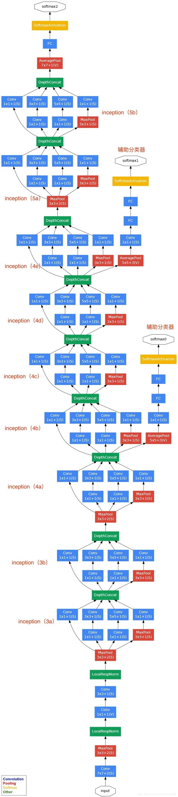

# GoogLeNet

GoogLeNet在加深度的同时做了结构上的创新，引入了一个叫做Inception的结构来代替之前的卷积加激活的经典组件。GoogLeNet在ImageNet分类比赛上的Top-5错误率降低到了6.7%。


相关论文：[Going Deeper with Convolutions](https://arxiv.org/pdf/1409.4842)

## 网络构建

### Inception结构

GoogLeNet中的基础卷积块叫作Inception块，结构如下


Inception块里有4条并行的线路。最后，将每条线路的输出在通道维上连结，并向后进行传输。其中，$1\times1$的卷积，没有考虑在特征图局部信息之间的关系，它的作用主要是：

* 实现跨通道的交互和信息整合。
* 卷积核通道数的降维和升维，减少网络参数。
* $1\times1$卷积核后通常跟随激活函数，因此它不仅是一个线性变换，还引入了非线性，增强了模型的表达能力。


1. 直接使用$3\times3$卷积参数量：$3\times3\times192\times32=55296$
2. 使用$1\times1$卷积核，再使用$3\times3$，计算公式：$1\times1\times192\times32+3\times3\times32\times32=15360$

定义Inception块如下

```python
import torch
from torch import nn
from utils import ConvRelu

class Inception(nn.Module):
    def __init__(self, in_channels, ch1x1, ch3x3, ch5x5, pool_proj):
        super().__init__()
        self.branch1 = ConvRelu(in_channels, ch1x1, kernel_size=1)

        self.branch2 = nn.Sequential(
            ConvRelu(in_channels, ch3x3[0], kernel_size=1),
            ConvRelu(ch3x3[0], ch3x3[1], kernel_size=3, padding=1)
        )

        self.branch3 = nn.Sequential(
            ConvRelu(in_channels, ch5x5[0], kernel_size=1),
            ConvRelu(ch5x5[0], ch5x5[1], kernel_size=5, padding=2)
        )

        self.branch4 = nn.Sequential(
            nn.MaxPool2d(kernel_size=3, stride=1, padding=1),
            ConvRelu(in_channels, pool_proj, kernel_size=1)
        )

    def forward(self, x):
        branch1 = self.branch1(x)
        branch2 = self.branch2(x)
        branch3 = self.branch3(x)
        branch4 = self.branch4(x)
        return torch.cat([branch1, branch2, branch3, branch4], 1)


inception = Inception(192, 64, (96, 128), (16, 32), 32)
print(inception)
```

### 辅助输出

```python
from utils import LinerRelu

class InceptionAux(nn.Module):
    def __init__(self, in_channels, dropout=0.5):
        super(InceptionAux, self).__init__()
        self.avgpool = nn.AdaptiveAvgPool2d((1, 1))
        self.conv = nn.Sequential(
            ConvRelu(in_channels, 128, kernel_size=1),
            nn.Flatten()
        )
        self.fc = nn.Sequential(
            LinerRelu(128, 64, dropout=dropout),
            nn.Linear(64, 10)
        )

    def forward(self, x):
        x = self.avgpool(x)
        x = self.conv(x)
        x = self.fc(x)
        return x

aux = InceptionAux(512)
print(aux)
```

### 全局平均池化

GoogLeNet使用全局平均池化层，来替代Flatten。将特征图每一通道中所有像素值相加后求平均，得到就是GAP的结果，在将其送入后续网络中进行计算。


PyTorch中使用函数`nn.AdaptiveAvgPool2d((1, 1))`来实现全局平均池化，`(1, 1)`表示池化后特征图的尺寸。

### 创建GoogLeNet

GoogLeNet网络结构为



整体网络结构，实现为

```python
class GoogLeNet(nn.Module):
    def __init__(self, dropout=0.5):
        super().__init__()
        self.b1 = nn.Sequential(
            ConvRelu(3, 64, kernel_size=7, stride=2, padding=3),
            nn.MaxPool2d(kernel_size=3, stride=2, padding=1)
        )

        self.b2 = nn.Sequential(
            ConvRelu(64, 64, kernel_size=1),
            ConvRelu(64, 192, kernel_size=3, padding=1),
            nn.MaxPool2d(kernel_size=3, stride=2, padding=1)
        )

        self.b3 = nn.Sequential(
            Inception(192, 64, (96, 128), (16, 32), 32),
            Inception(256, 128, (128, 192), (32, 96), 64),
            nn.MaxPool2d(kernel_size=3, stride=2, padding=1)
        )

        self.b4a = Inception(480, 192, (96, 208), (16, 48), 64)
        self.aux1 = InceptionAux(512, dropout=dropout)
        self.b4bcd = nn.Sequential(
            Inception(512, 160, (112, 224), (24, 64), 64),
            Inception(512, 128, (128, 256), (24, 64), 64),
            Inception(512, 112, (144, 288), (32, 64), 64),
        )
        self.aux2 = InceptionAux(528, dropout=dropout)
        self.b4e = nn.Sequential(
            Inception(528, 256, (160, 320), (32, 128), 128),
            nn.MaxPool2d(kernel_size=3, stride=2, padding=1)
        )

        self.b5 = nn.Sequential(
            Inception(832, 256, (160, 320), (32, 128), 128),
            Inception(832, 384, (192, 384), (48, 128), 128),
            nn.AdaptiveAvgPool2d((1, 1)),
            nn.Flatten()
        )
        self.fc = nn.Linear(1024, 10)

    def forward(self, x):
        x = self.b1(x)
        x = self.b2(x)
        x = self.b3(x)
        x = self.b4a(x)
        aux1 = self.aux1(x)
        x = self.b4bcd(x)
        aux2 = self.aux2(x)
        x = self.b4e(x)
        x = self.b5(x)
        x = self.fc(x)
        return x, aux1, aux2
      
from torchinfo import summary
summary(GoogLeNet(), (1, 3, 32, 32))
```

### 训练模型

导入数据

```python
from torchvision import datasets
from utils import train_val_split
from utils import PackDataset
from torchvision import transforms

full = datasets.CIFAR10(root="./data", train=True, download=True)
test = datasets.CIFAR10(root="./data", train=False, download=True)
train, valid = train_val_split(full, seed=666)

train_data = PackDataset(train, transform=transforms.ToTensor())
valid_data = PackDataset(valid, transform=transforms.ToTensor())
test_data = PackDataset(test, transform=transforms.ToTensor())
```

由于模型中增加了辅助输出，重新定义损失函数

```python
class LossWithAux(nn.Module):
    def __init__(self):
        super().__init__()
        
    def forward(self, pred, target):
        main_pred, aux1_pred, aux2_pred = pred
        main_loss = nn.functional.cross_entropy(main_pred, target)
        aux1_loss = nn.functional.cross_entropy(aux1_pred, target)
        aux2_loss = nn.functional.cross_entropy(aux2_pred, target)
        return main_loss + 0.3 * aux1_loss + 0.3 * aux2_loss
```

使用网格搜索寻找最优参数组合

```python
import json
from utils import control_callbacks
from sklearn.model_selection import ParameterGrid
import torch
from skorch import NeuralNetClassifier
from skorch.helper import predefined_split

epochs = 20
param_grid = {
    'lr': [0.005, 0.001, 0.0005, 0.0001],
    'dropout': [0.5, 0.3, 0.2]
}

results = {
    'best_params': None,
    'best_acc': 0.0,
    'all_results': []
}

calls = control_callbacks(epochs, check_dir='./data/alex-checkpoints', show_bar=False)
for params in ParameterGrid(param_grid):
    print(f"\nTraining with params: {params}")
    vgg = GoogLeNet(params['dropout'])
    net = NeuralNetClassifier(
        vgg,
        criterion=LossWithAux,
        optimizer=torch.optim.Adam,
        lr=params['lr'],
        batch_size=2048,
        max_epochs=epochs,
        train_split=predefined_split(valid_data),
        device='cuda' if torch.cuda.is_available() else 'cpu',
        callbacks=calls,
        classes=list(range(10)),
    )
    net.fit(X=train_data, y=None)
    valid_acc = max(net.history[:, 'valid_acc'])
    current_result = {'params': params, 'valid_acc': valid_acc}
    results['all_results'].append(current_result)

    if valid_acc > results['best_acc']:
        results['best_acc'] = valid_acc
        results['best_params'] = params

    print(f"\nBest params: {results['best_params']}, best acc: {results['best_acc']}")

with open('./data/hyperparam_results.json', 'w') as f:
    json.dump(results, f, indent=2)
```

最优的参数组合为`lr=0.001`、`dropout=0.2`，使用图像增强的方法训练模型

```python
from utils import trans_aug

epochs = 100
gnet = GoogLeNet(0.2)
calls = control_callbacks(epochs, check_dir='./data/alex-checkpoints', show_bar=False)
full_data = PackDataset(full, transform=trans_aug())
net = NeuralNetClassifier(
    gnet,
    criterion=LossWithAux,
    optimizer=torch.optim.Adam,
    lr=0.001,
    optimizer__weight_decay=5e-4,
    batch_size=2048,
    max_epochs=epochs,
    train_split=predefined_split(test_data),
    device='cuda' if torch.cuda.is_available() else 'cpu',
    callbacks=calls,
    classes=list(range(10)),
    iterator_train__num_workers=8,
    iterator_train__pin_memory=True,
)
net.fit(full_data, y=None)
```

绘制训练曲线和混淆矩阵

```python
from utils import plot_history, check_result

plot_history(net)
check_result(net, test_data)
```

> [!warning]
>
> 为了提升网络的的性能，可以计算出全部像素的均值和方差，将像素值转换为标准正态分布。

### Inception结构的改进

GoogLeNet是以InceptionV1为基础进行构建的，所以GoogLeNet也叫做InceptionNet，在随后的⼏年⾥，研究⼈员对GoogLeNet进⾏了数次改进， 就又产生了InceptionV2、V3、V4等版本。

1. InceptionV2。大卷积核拆分为小卷积核，将V1中的5x5的卷积用两个3x3的卷积替代，从而增加网络的深度，减少了参数。


2. InceptionV3。将n×n卷积分割为1×n和n×1两个卷积。


## 处理自定义数据集

### 读取训练数据

使用PyTorch的`ImageFolder`工具处理自己分类数据，数据集组织结构如下

```
owner_data
├── test
│   ├── cat
│   ├── dog
│   └── forg
└── train
    ├── cat
    ├── dog
    └── forg
```

读取训练数据和测试数据

```python
from torchvision.datasets import ImageFolder

train_root = './owner_data/train/'
test_root = './owner_data/test/'

trans = transforms.Compose([
  transforms.Resize((224,224)), transforms.ToTensor()
])

train = ImageFolder(train_root, transform=trans)
test = ImageFolder(test_root, transform=trans)
```

* 使用`ImageFolder`导入数据后，会根据文件夹的数量，自动给每一类数据分配标签。
* 使用`Compose`将数据转换成张量形式。

### 使用模型推理

创建类别标签与名称的映射表

```python
print("CIFAR-10 Classes:")
classes = {}
for i, class_name in enumerate(full.classes):
    classes[i] = class_name
print(f"{i}: {classes}")
```

从网上下载一张照片

```python
from PIL import Image
from IPython.display import display

img_src = Image.open('./data/dome1.jpeg')
display(img_src)
```

将图转换为`tensor`格式，并压缩到$32\times32$的大小

```python
from utils import show_tensor_image

test_transform = transforms.Compose([transforms.Resize((32, 32)), transforms.ToTensor()])
img = test_transform(img_src)
show_tensor_image(img)
print(img.shape)
img = img.unsqueeze(0)
print(img.shape)
```

* `unsqueeze(0)`在图像前面增加一个批次的维度

读取模型数据，并进行预测

```python
device = torch.device('cuda' if torch.cuda.is_available() else 'cpu')
checkpoint = torch.load('./data/checkpoints/best_model.pt', map_location=device)
load_model = GoogLeNet(0.2)
load_model.to(device)
load_model.load_state_dict(checkpoint)

with torch.no_grad():
    img = img.to(device)
    pred = load_model(img)
    print(pred)
    pred = pred[0].argmax(dim=1)
    print("类别是: ",  classes[pred.item()])
```


 
