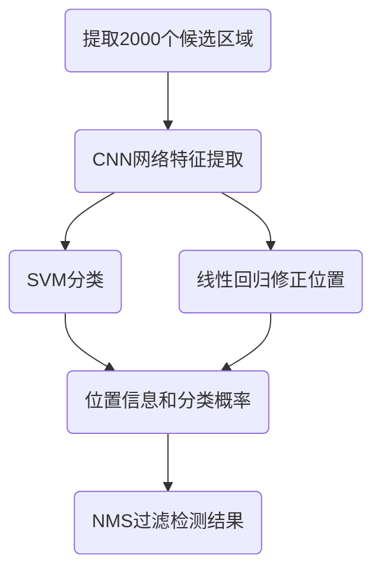
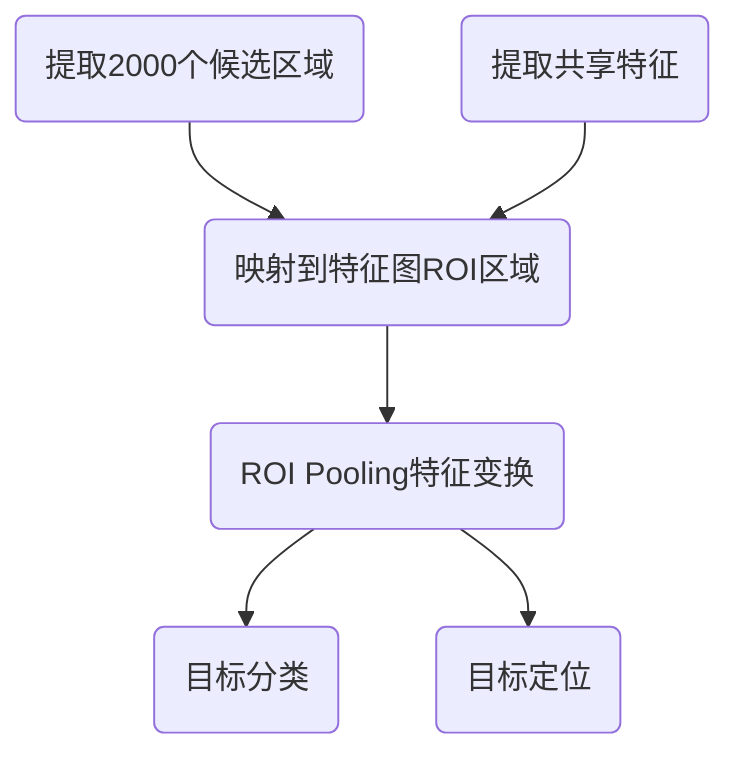

# R-CNN网络

## Overfeat模型

Overfeat方法使用滑动窗口进行目标检测，滑动窗口使用固定宽度和高度的矩形区域，在图像上扫描，并将扫描结果送入到神经网络中进行分类。下图展示了Overfeat的扫描过程，将所有的扫描结果送入网络中进行分类，得到最终的汽车的检测结果。

这种方法类似一种暴力穷举的方式，会消耗大量的计算力，并且由于窗口大小问题可能会造成效果不准确。

## R-CNN模型

R-CNN网络是2014年提出的，该网络不再使用暴力穷举的方法，而是使用候选区域方法（region proposal method）创建目标检测的区域来完成目标检测的任务，R-CNN是以深度神经网络为基础的目标检测的模型 ，以R-CNN为基点，后续的Fast R-CNN、Faster R-CNN模型都延续了这种目标检测思路。

相关论文：[Rich feature hierarchies for accurate object detection and semantic segmentation](https://arxiv.org/pdf/1311.2524)

### 算法流程

1. 候选区域生成：使用选择性搜索（Selective Search）的方法找出图片中可能存在目标的侯选区域。
2. 候选区域归一化：将每个候选区域归一化到固定尺寸（如227×227），以便输入到CNN中。
3. CNN网络提取特征：选取预训练卷积神经网络（AlexNet或VGG）用于进行特征提取。
4. 目标分类：训练支持向量机（SVM）来辨别目标物体和背景，对每个类别，都要训练一个二元SVM。
5. 边界框回归：使用线性回归模型对候选区域的边界框进行修正，使其更接近真实目标框的位置。

### 候选区域生成

选择性搜索（SelectiveSearch）中，采用了聚类的方法。通过计算颜色、边界、纹理等信息的相似度进行聚类，将相似的区域合并，最终生成候选区域。这些区域要远远少于传统的滑动窗口的穷举法产生的候选区域。

选择性搜索，在一张图片上约能提取出2000个侯选区域，需要注意的是这些候选区域的长宽不固定。 

### 特征提取

采用预训练模型（AlexNet或VGG）在生成的候选区域上进行特征提取，将提取好的特征保存在磁盘中，用于后续步骤。

使用CNN提取候选区域的特征向量时，需要接受固定长度的输入，所以需要对候选区域做一些尺寸上的修改。利用微调后的CNN网络，提取每一个候选区域的特征，获取一个4096维的特征，一幅图像就是$2000\times4096$维特征存储到磁盘中。

### 目标分类

分类器使用SVM分类器，对于多分类任务采用[One vs Rest](https://hughxusu.github.io/lesson-ai/#/a-base/06-%E9%80%BB%E8%BE%91?id=ovr%ef%bc%88one-vs-rest%ef%bc%89)方式进行分类。

1. 训练过程：对于每个类别，正样本是该类别的标注区域，负样本是其他类别的标注区域以及背景区域。
2. 测试过程：对于每个候选区域，所有类别的SVM模型会分别计算一个分类得分。最终，选择得分最高的类别作为该候选区域的预测类别。
3. 背景被视为一个特殊的类别，通常也会训练一个独立的SVM模型来区分背景和非背景区域。

对于N分类任务，需要训练包括背景在内的N+1个SVM分类器。

### 目标定位修正

通过选择性搜索获取的目标位置不是非常的准确，需要借助CNN提取的特征进修正。使用CNN特征，训练一个线性回归模型，用于预测标注位置和选择性搜索结果间的偏移。

通过该回归模型对候选区域偏移进行预测，将偏移值添加到候选区域上，通过调整之后得到更精确的位置。

### 算法总结

1. 训练阶段多，训练耗时，包括：微调CNN网络、训练SVM、训练边框回归器。
2. 预测速度慢：使用GPU、VGG16模型处理一张图像需要47秒。
3. 占用磁盘空间大：5000张图像产生几百G的特征文件。
4. 数据的形状变化：候选区域要经过缩放来固定大小，无法保证目标的不变形。

## Fast R-CNN模型

鉴于R-CNN存在的问题，2015年提出了一个改善模型：Fast R-CNN。 Fast R-CNN主要在几个方面进行了改进：

1. 使用CNN网络，对整张图进行特征提取，将候选区域映射到特征图上，这样就避免了重复处理。
2. 通过ROI Pooling将不同尺寸候选区域的特征，变换成固定大小的特征图。
3. 使用全连接层和softmax层进行分类（不再使用 SVM）。
4. 边界框回归模块被设计为网络中的一个全连接层，整个网络（包括分类和回归分支）是端到端训练的。

相关论文：[Fast R-CNN](https://arxiv.org/pdf/1504.08083)

### 算法流程

1. 候选区域生成：使用选择性搜索方法，与R-CNN一样。
2. CNN网络特征提取：将整张图像输入到CNN网络中，得到共享特征图，并将候选区域位置，从原图映射到共享特征图上。
3. ROI Pooling：将候选区域在共享特征图上的特征，变换成固定大小的特征图。
4. 目标检测：
   * 全连接层加Softmax，对候选区域进行分类。
   * 每个类别输出四个实数值，来确定目标的位置。

### ROI Pooling

1. 从共享特征图上，根据候选区域在原图中的坐标，通过比例变换映射到特征图上的对应位置。
2. 对于每个映射后的ROI，将其划分为固定数量的子区域（例如：$2 \times 2$个格子）。
3. 每个格子的尺寸可能不是整数，因此会涉及边界取整的操作。
4. 对每个子区域，进行最大池化操作，提取该区域内的最大响应值。
5. 将所有子区域池化得到的数值拼接，形成固定尺寸（例如 $2 \times 2 \times C$，其中 $C$ 为通道数）的特征图。

### 目标分类和定位

网络的最后为两个同级层

* K+1个类别（K个类别和一个背景）的SoftMax分类层。
* 边框的回归层。

### 模型训练

在Fast R-CNN提出多任务训练的方法，来训练两种输出。其损失函数可以表示为两个部分
$$
L=L_{cls}+\lambda L_{reg}
$$

1. $L_{cls}$交叉熵损失（Softmax 分类）。
2. $L_{reg}$ Smooth L1 损失（边界框回归，仅计算正样本）。

端到端训练，相比R-CNN提高了效率和精度。

### 算法总结

相比于R-CNN网络，Fast R-CNN在目标检测识别的速度和精度上都有提升，不足之处是，候选区域提取方法耗时较长，而且和目标检测网络是分离的，并不是端到端的。

