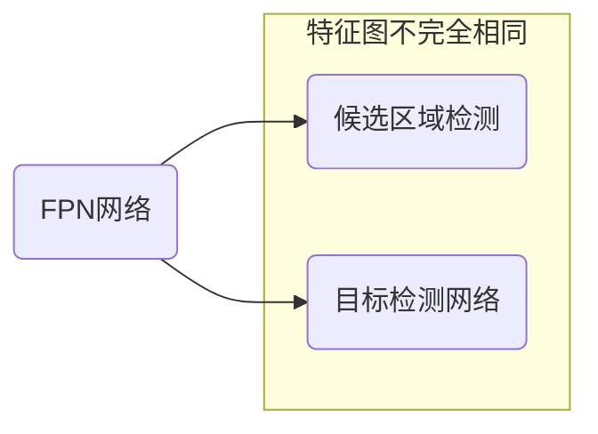
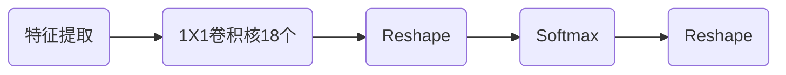
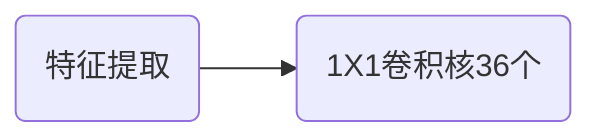

# Faster R-CNN网络

相关论文：[Faster R-CNN: Towards Real-Time Object Detection with Region Proposal Networks](https://arxiv.org/pdf/1506.01497)

## 基本思想

在R-CNN和Fast R-CNN的基础上，在2016年提出了Faster R-CNN网络模型，该将候选区域的生成、特征提取、目标分类及目标定位整合在了一个网络中，综合性能有较大提高。

Faster R-CNN可以看成是区域生成网络（RPN）与Fast R-CNN的组合：

* 区域生成网络，替代选择性搜索，生成候选区域。
* Fast R-CNN用来进行目标检测。

1. Backbone：由CNN卷积神经网络构成，常用的是VGG和resnet，用来提取图像的特征图。特征图被用于后续RPN层生成候选区域和ROIPooling层中。
2. RPN网络：用于生成候选区域。
3. Roi Pooling：与Fast R-CNN网络中一样，得到候选区域的特征。
4. 目标分类与回归：与Fast R-CNN网络中一样，使用两个同级层，完成目标的分类和定位。

R-CNN系列网络的速度比较

## 模型结构详解

### 主干网络（backbone）

backbone一般为VGG，ResNet进行特征提取（优先选择ResNet），将最后的全连接层舍弃，得到特征图送入后续网络中进行处理。一般的特性处理如下

在特征提取中，还可以引入FPN结构，将多个特征图逐个送入到后续网络中，特征提取如下

FPN结构的作用，是低分辨率的特征图进行上采样并和高分辨率的特征图融合，提升检测精度。

FPN网络获取多个特征图后

* 输入RPN网络中的特征图
* 输入目标检测网络的特征图并不完全相同 。

> [!warning]
>
> 通过FPN结构得到的多尺度特征图中，高阶特征用于检测大的物体，低阶特征用于检测小的物体。

### RPN网络

RPN网络用于代替选择性搜索的方法，生成候选区域。

1. 生成一系列的固定参考框anchors，覆盖图像的任意位置，然后送入后续网络中进行分类和回归。
2. 分类分支：通过softmax分类判断anchor中是否包含目标。
3. 回归分支：计算目标框对于anchors的偏移量，以获得精确的候选区域。
4. Proposal层：则负责综合分类和回归结果，获取候选区域，同时剔除太小和超出边界的候选区域。

#### anchors

目标检测中，预设一组不同尺度、不同长宽比的固定参考框，覆盖所有位置， 每个参考框负责检测与其交并比大于阈值 （常用0.5或0.7）的目标，每个参考框的中心区域称为anchor。anchor技术，将候选区域生成问题转换为，这个固定参考框中有没有目标、目标框偏离参考框多远。假设参考框尺度为32、64、128，长宽比为1:1、1:2、2:1

参考框的大小（如32像素）是相对于原图，特征提取会对图像进行下采样

* 假设输入图像大小：$512 \times 512$
* 主干网络提取的特征图大小：$32 \times 32$
* 下采样倍数

$$
\text{stride}=\frac{\text{原图尺寸}}{\text{特征图尺寸}}=\frac{512}{32}=16
$$

这意味着特征图上的1个像素点，对应原图上的$16 \times 16$个像素区域。假设参考框=32像素，特征图的stride是16，在特征图上的大小计算

$$
\frac{32}{\text{stride}}=\frac{32}{16}=2
$$

也就是说，这个anchor在特征图上相当于$2 \times 2$的区域。图像的下采样关系如下

媒体特征在原图上对于的参考框如图所示

对于FPN网络获取的多个特征图，会将不同尺寸的参考框映射在不同尺度的特征图上。

#### RPN分类

一幅图像，经过特征提取后，得到$H\times W$大小的特征图。如果anchor=9，则分类流程如下

1. $1 \times 1$卷积核得到特征图为`[batchsize,H,W,18]`
2. Reshape将特征图转换为`[batchsize,9*H,W,2]`，然后使用SoftMax分类。
3. 使用SoftMax分类后，再将特征图Reshape到`[batchsize,H,W,18]`

#### RPN回归

在回归问题中会对候选框的位置进行修正。如果anchor=9，则分类流程如下

预测值为，anchor与真实值之间的平移量。

#### Proposal层

Proposal层负责综合分类和回归的结果，层处理流程如下：

1. 利用回归的结果对所有的anchors进行修正，得到修正后的检测框。
2. 根据分类的softmax输出的概率值，由大到小对检测框进行排序，提取前6000个结果。
3. 限定超出图像边界的检测框为图像边界，防止候选区域超出图像边界。

4. 对剩余的检测框进行非极大值抑制NMS。
5. Proposal层的输出，是对应输入网络图像尺度的，归一化后坐标值`[x1, y1, x2, y2]`。

### ROIPooling

ROIPooling的方法与Fast R-CNN一致。对于使用了，FPN网络产生了多个尺度特征图：

* 大尺度ROI使用低分辨率特征
* 小尺度ROI使用高分辨率特征

## FasterRCNN的训练

整个训练过程分为四步：

1. 训练RPN网络：使用ImageNet预训练的模型初始化，并端到端微调RPN网络输出结果。
2. 训练识别网络：利用第一步RPN生成的建议框，训练一个单独的检测网络（类似于Fast R-CNN），这个检测网络，同样是由ImageNet预训练模型初始化，这时候两个网络还没有共享卷积层。
3. 上一步的训练主干网络模型，固定共享的卷积层，微调RPN独有的层，现在两个网络共享卷积层了。
4. 保持共享的卷积层固定，使用新的RPN输出结果，微调fc层。这样，两个网络共享相同的卷积层，构成一个统一的网络。

### RPN网络的训练

训练RPN时，需要标记参考框的正负样本：

* 标注框与参考框的IOU>0.7，标记为正样本，值为1。
* 标注框与参考框的IOU<0.3，标记为负样本，值为0。
* 负样本仅用于计算分类损失（背景类别），不计算回归损失。
* 其它参考框忽略，不参与网络的训练。

#### RPN损失函数

$$
L=L_{cls}+\lambda L_{reg}
$$

其中

* $L_{cls}$用于分类目标/背景。
* $L_{reg}$只对正样本计算边框回归误差，负样本不计算回归损失。
* 一般取$\lambda = 1$，使得分类损失和回归损失对训练的贡献相等。

#### 分类损失函数$L_{cls}$（交叉熵损失）

$$
L_{cls}
=\frac{1}{N_{cls}}\sum_i
\left( -p_i\log \hat{p}_i-(1-p_i)\log (1-\hat{p}_i) \right)
$$

其中

* $\hat{p}_i$是RPN预测的Anchor分类概率。
* $p_i$是Anchor的真实标签（1或0）。
* $N_{cls}$正样本和负样本的数量。

#### 回归损失$L_{reg}$（Smooth L1损失）

只对正样本计算回归损失，优化4个回归参数$t_x$、$t_y$、$t_w$、$t_h$，参数的计算公式为
$$
t_x=\frac{x-x_a}{w_a},\quad  t_y=\frac{y-y_a}{h_a},\quad
t_x=\log\left(\frac{w}{w_a}\right), \quad
t_h=\log\left(\frac{h}{h_a}\right)
$$
其中

* $(x,y,w,h)$是标注框的坐标。
* $(x_a,y_a,w_a,h_a)$是Anchor Box的坐标。

使用Smooth L1损失计算回归误差
$$
L_{reg}
=\frac{1}{N_{reg}}\sum_{i\in \text{positive}}
\sum_{j\in (x,y,w,h)}\text{smooth}_{L_1}\left(t_j^i-\hat{t}_j^i\right)
$$
其中

* $\hat{t}_j^i$ 是 RPN 预测的回归参数。
* $t_j^i$是Ground Truth的目标值。
* $N_{\text{reg}}$ 是正样本数量。

Smooth L1公式
$$
\text{smooth}_{L_1}(x)=
\left\{\begin{matrix}
0.5x^2  & \left|x\right| < 1 \\
\left|x\right|-0.5 & \left|x\right| \ge 1
\end{matrix}\right. 
$$
这样可以减少异常值对回归的影响，提高稳定性。

#### 训练过程

1. 随机采样256个anchor，计算损失函数，尽量保证采样的正负anchor的比例是1:1。
2. 主干网络，使用ImageNet分类预训练的模型，来初始化。
3. 新网络层，通过从均值为0、标准差为0.01的高斯分布，来随机初始化。
4. 采用带动量的随机梯度下降算法对网络进行训练。

### Fast R-CNN网络的训练

使用RPN网络收集到的候选区域、ImageNet预训练的卷积网络特征，对Fast R-CNN网络进行训练。

- 候选框与标注框$\text{IOU}\ge0.5$标注为正样本，类别是标注类别。
- 候选框与标注框$\text{IOU}<0.5$的候选区域设为负样本，类别值为0。

#### 损失函数

$$
L(p,u,t^u,v)=L_{cls}(p,u)+\lambda[u\ge 1]L_{loc}\left(t^u,v\right)
$$

* $u$目标分类值，$v$目标位置。
* $p$输出在K+1个类别上的概率值（使用softmax层进行分类），$p=\left(p_0,p_1,…,p_k\right)$。
* $t^u$表分类目标的位置偏移量$t^u=\left(t^u_x,t^u_y,t^u_w,t^u_h\right)$，计算方式与RPN网络中一样。
* $L_{cls}$是交叉熵损失函数，$L_{loc}$是smooth L1损失函数。
* 当$u\ge 1$表示除了背景外的所有分类计算回归损失（0分类为背景分类）。

#### 训练过程

1. 对所有正样本根据IOU值进行排序，每张图片取前256个区域，选择64个正样本数据。
2. 用于Softmax分类、回归的全连接层，使用方差为0.01和0.001的零均值高斯分布初始化，偏置初始化值0。
3. 特征提取使用ImageNet的预训练数据。
4. 使用梯度下降算法进行优化。

### 共享卷积训练

使用上述微调后的主干网络微调RPN层

1. 固定共享的卷积层。
1. 只微调RPN独有的层。

两个网络共享卷积层，并得到了一系列新的候选框。固定共享的卷积层，使用新的候选框，微调Fast R-CNN的fc层。

## 端到端的训练

Faster R-CNN还有一种端到端的训练方式，可以一次完成训练。将RPN loss与Fast RCNN loss相加，然后进行梯度下降优化，更新参数。
$$
L=L_{RPN-cls}+L_{RPN-reg}+L_{FastRCNN-cls}+L_{FastRCNN-reg}
$$

1. 根据实验对比，端到端训练的mAP通常比分部训练高1%~3%。
2. 端到端训练的总耗时通常比分部训练减少30%~50%。
3. 分阶段训练和端到端训练的比较
   * 分阶段调试，适合初学者。调试友好，流程繁琐，效率低。
   * 流程统一，适合快速部署。调试复杂，资源要求高。

