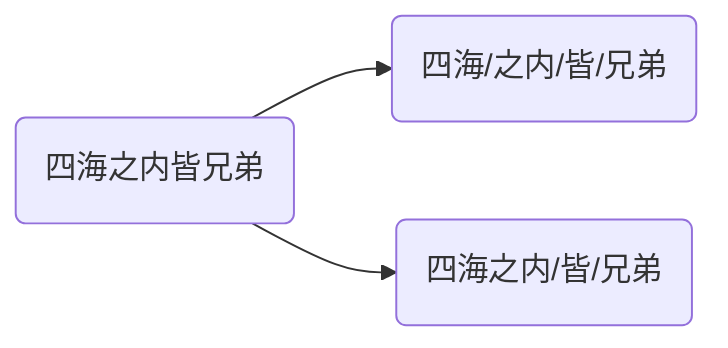

# 文本预处理

文本语料在输送给模型前，一般需要一系列的预处理工作，才能符合模型输入的要求，如：将文本转化成模型需要的张量，规范张量的尺寸等，而且科学的文本预处理环节还将有效指导模型超参数的选择，提升模型的评估指标。


> [!warning]
>
> 在实际生产应用中，最常使用的两种语言是中文和英文。

## 文本处理的基本方法

### 分词

**分词**就将文本序列分成单个单词或子词，这些统称为[tokens](https://huggingface.co/glossary#token)。

* 中文词汇没有形式上的分界符，分词就是找到词汇的分界符。



* 英文则侧重处理形态变化和特殊符号，如：running$\to$run，unhappy$\to$un/happy


分词的作用：词作为语言语义理解的最小单元，是人类理解文本语言的基础。因此也是解决NLP领域，高阶任务（如机器翻译、文本生成）的基础环节。

Python中常用的分词工具jieba，安装`pip install jieba`

* 支持多种分词模式：精确模式、全模式和搜索引擎模式。
* 支持中文繁体分词。
* 支持用户自定义词典。

jiaba分词的使用。

```python
import jieba

content = '四海之内皆兄弟'

results = jieba.cut(content, cut_all=False) # 将返回一个生成器对象
print(results) 
```

`cut_all=False`精确模式：试图将句子最精确地切开，适合文本分析。默认`cut_all=False`。

```python
results = jieba.lcut(content, cut_all=False) # 将返回一个列表
print(results) 
```

`cut_all=True`全模式：把句子中，所有可能词语都扫描出来，速度快，但不能消除歧义。

```python
results = jieba.lcut(content, cut_all=True)
print(results)
```

搜索引擎模式：在精确模式的基础上，对长词再次切分，提高召回率，适合用于搜索引擎分词。

```python
results = jieba.lcut_for_search(content)
print(results)
```

中文繁体分词。

```python
content = "煩惱即是菩提，我暫且不提"
results = jieba.lcut(content)
print(results)
```

自定义词典：可以定义专业名称，提升整体的识别准确率。

```
云计算 5 n
李小福 2 nr
easy_install 3 eng
好用 300
韩玉赏鉴 3 nz
八一双鹿 3 nz
```

每一行分三部分，词语、词频（可省略）、[词性](/z-others/05-nlp.md)（可省略），用空格隔开，顺序不可颠倒。

```python
# 未加入自定义词典
print(jieba.lcut("八一双鹿更名为八一南昌篮球队！"))

# 加入自定义词典
jieba.load_userdict("./userdict.txt")
print(jieba.lcut("八一双鹿更名为八一南昌篮球队！"))
```

### 命名实体识别

**命名实体**：通常我们将人名、地名、机构名等专有名词统称命名实体。如：周杰伦、黑山县、24辊方钢矫直机。命名实体识别（Named Entity Recognition），简称NER，就是识别出一段文本中可能存在的命名实体。

```
鲁迅, 浙江绍兴人, 五四新文化运动的重要参与者, 代表作朝花夕拾.
鲁迅(人名) / 浙江绍兴(地名)人 / 五四新文化运动(专有名词) / 重要参与者 / 代表作 / 朝花夕拾(专有名词)
```

同词汇一样，命名实体也是人类理解文本语言的基础，也是解决NLP领域，高阶任务的基础环节。

### 词性标注

**词性**：语言中对词的一种分类方法，以语法特征为主要依据，兼顾词汇意义对词进行划分的结果，常见的词性有14种，如: 名词、动词、形容词等。**词性标注**（Part-Of-Speech tagging），简称POS，就是标注出一段文本中每个词汇的词性。

使用jieba进行中文词性标注

```python
import jieba.posseg as pseg
pseg.lcut("我爱北京天安门")
```

## 文本张量表示方法

将一段文本使用张量进行表示

* 词汇为表示成向量，称作词向量，再由各个词向量，按顺序组成矩阵表示文本。
* 将句子表示成向量，称为句向量。

> [!note]
>
> [大模型靠啥理解文字？通俗解释：词嵌入embedding]( https://www.bilibili.com/video/BV1bfoQYCEHC/?share_source=copy_web&vd_source=aa661569ff3138d0b604d53a96184bf2)

将文本表示成张量（矩阵）形式，能够使语言文本，作为计算机程序的输入，从而进行解析工作。

文本张量表示的方法：one-hot编码、Word2vec、Word Embedding。

### one-hot编码

又称独热编码，将每个词表示成具有n个元素的向量，这个词向量中只有一个元素是1，其他元素都是0，不同词汇元素为0的位置不同，其中n的大小是整个语料中不同词汇的总数。

使用TorchText，TorchText是PyTorch生态中专注于自然语言处理（NLP）的库，提供文本数据预处理工具（如分词、词汇表构建、批处理等），简化NLP模型的开发流程。安装`pip install torchtext`

使用`torchtext`实现one-hot

```python
from torchtext.vocab import vocab
from collections import Counter

vocab_set = ["唐三藏", "孙悟空", "猪八戒", "沙和尚", "白龙马"]

counter = Counter(vocab_set)
vocab_obj = vocab(counter, specials=[])
print(vocab_obj['唐三藏'])
```

* [`collections.Counter`](https://docs.python.org/zh-cn/3.13/library/collections.html#collections.Counter)是一个高效的工具，用于统计可哈希对象的频率。
* `torchtext.vocab`中的[`vocab`](https://docs.pytorch.org/text/stable/vocab.html#id1)通过`Counter`和`OrderedDict`手动构建词汇表，返回`Vocab`。对大规模语料，不建议手动构造`Vocab`

`Vocab`对象默认数据不是one-hot编码，生成one-hot编码

```python
import torch

for token in vocab_set:
    token_idx = vocab_obj[token]
    one_hot = torch.zeros(len(vocab_set))
    one_hot[token_idx] = 1
    print(token, "的one-hot编码为:", one_hot.tolist())
```

保存数据模型

```python
torch.save(vocab_obj, "./pytorch_vocab.pt")
```

加载和使用模型

```python
loaded_vocab = torch.load("./pytorch_vocab.pt")
print(type(loaded_vocab))

token = "唐三藏"
idx = loaded_vocab[token]
one_hot = torch.zeros(len(vocab_set))
one_hot[idx] = 1
print(token, "的one-hot编码为:", one_hot.tolist())
```

one-hot编码的特点：

* 优势：操作简单，容易理解。
* 劣势：完全割裂了词与词之间的联系，而且在大语料集下，向量极度稀疏。

### word2vec

word2vec是一种流行的将词汇表示成向量的无监督训练方法，该过程将构建神经网络模型，将网络参数作为词汇的向量表示，它包含CBOW和Skip-Gram两种训练模式。


上面分词结果的One-Hot编码为：

* 四海$\to[1, 0, 0, 0]$
* 之内$\to[0, 1, 0, 0]$
* 皆$\to[0, 0, 1, 0]$
* 兄弟$\to[0, 0, 0, 1]$

#### CBOW模式

给定一段用于训练的文本语料，再选定某段长度（窗口）作为研究对象，使用上下文词汇预测目标词汇。

使用矩阵$W_{4\times3}^{(1)}$与One-Hot相乘，其中4表示词表的大小，3表示词向量的维度。
$$
x_{1\times4}\cdot W_{4\times3}^{(1)} = h_{1\times 3}
$$
根据窗口的大小，对上下文词向量取平均，得到隐藏层向量
$$
h_{1\times 3}^{\text{之内}}=\frac{h_{1\times 3}^{\text{四海}}+h_{1\times 3}^{\text{皆}}}{2}
$$
隐藏层向量$h$与输出矩阵$W_{3\times4}^{(2)}$相乘，得到词表得分
$$
h_{1\times 3}\cdot W_{3\times4}^{(2)}=s_{1\times 5}
$$
使用softmax将得分转换为概率分布，计算目标词的概率
$$
P(\text{之内})=\frac{e^{s_2}}{\sum_{i=1}^{4}e^{s_i}}
$$
根据“之内”$\to[0, 1, 0, 0]$，计算交叉熵损失
$$
L=-log(P(\text{之内}))
$$
通过反向传播算法不断跟新$W_{4\times3}^{(1)}$和$W_{3\times4}^{(2)}$矩阵，训练过程与神经网络训练方式相同。训练完成后嵌入矩阵$W_{4\times3}^{(1)}$，即为全部的词向量。

#### Skip-Gram模式

给定一段用于训练的文本语料，再选定某段长度（窗口）作为研究对象，使用目标词汇预测上下文词汇。

使用矩阵$W_{4\times3}^{(1)}$将词汇转换为词向量，过程与CBOW模式一致。分别使用两个$W_{3\times4}^{(2)}$估计前面的词和后面的词。


使用softmax将得分转换为概率分布，计算前后两个词的概率。分别计算前后两个词的交叉熵损失，通过反向传播算法不断跟新$W_{4\times3}^{(1)}$和2个$W_{3\times4}^{(2)}$矩阵，训练过程与神经网络训练方式相同。训练完成后嵌入矩阵$W_{4\times3}^{(1)}$，即为全部的词向量。

#### 词向量的训练

可以使用[fasttext](https://fasttext.cc/)工具进行词向量的训练。

### Word Embedding

通过一定的方式将词汇映射到指定维度（一般是更高维度）的空间。广义的word embedding包括所有密集词汇向量的表示方法。在word2vec中CBOW模式与Skip-Gram模式训练出嵌入矩阵$W^{(1)}$就是word embedding。

## 预处理的其它方法

### 文本数据分析

文本数据分析，能够有效辅助理解数据语料，快速检查出语料可能存在的问题，并指导之后模型训练过程中一些超参数的选择。常用的几种文本数据分析方法：

* 标签数量分布
* 句子长度分布
* 词频统计与关键词词云

使用中文酒店评论语料，来进行文本数据分析。

#### 标签数量分析

```python
import seaborn as sns
import pandas as pd
import matplotlib.pyplot as plt

train = pd.read_csv("./samples/train.tsv", sep="\t")
test = pd.read_csv("./samples/test.tsv", sep="\t")

fig, (ax1, ax2) = plt.subplots(1, 2, figsize=(12, 5))

config = {
    'palette': 'Set2',
    'width': 0.3,
    'legend': False,
    'hue': 'label',
    'x': 'label'
}

sns.countplot(x='label', data=train, ax=ax1)
ax1.set_title("Train Data")

sns.countplot(x='label', data=test, ax=ax2)
ax2.set_title("Test Data")

plt.tight_layout()
plt.show()
```

在深度学习模型评估中，一般使用准确率作为评估指标，若想将准确率的基线定义在50%左右，则需要正负样本比例维持在1:1左右，否则就要进行必要的数据增强或数据删减。上述样本略有不均衡。

> [!warning]
>
> 不同的数据类型，分析标签类型的方法有所不同，要具体问题具体分析。

#### 句子长度统计

获取训练集和测试集的句子长度分布

```python
train["sentence_length"] = train["sentence"].map(len)
test["sentence_length"] = test["sentence"].map(len)

fig, axes = plt.subplots(2, 2, figsize=(14, 8))

sns.countplot(x="sentence_length", data=train, ax=axes[0, 0])
axes[0, 0].set_title("Train Sentence Length Count Distribution")
axes[0, 0].set_xticks([])

sns.histplot(train["sentence_length"], kde=True, ax=axes[1, 0])
axes[1, 0].set_title("Train Sentence Length Histogram")
axes[1, 0].set_yticks([])

sns.countplot(x="sentence_length", data=test, ax=axes[0, 1])
axes[0, 1].set_title("Test Sentence Length Count Distribution")
axes[0, 1].set_xticks([])

sns.histplot(test["sentence_length"], kde=True, ax=axes[1, 1])
axes[1, 1].set_title("Test Sentence Length Histogram")
axes[1, 1].set_yticks([])

plt.tight_layout()
plt.show()
```

通过绘制句子长度分布图，可以得知我们的语料中大部分句子长度的分布范围，因为模型的输入要求为固定尺寸的张量，合理的长度范围，对之后进行句子截断补齐（规范长度）起到关键的指导作用。上图中大部分句子长度的范围大致为20-250之间。

获取训练集和验证集的正负样本长度散点分布

```python
fig, (ax1, ax2) = plt.subplots(1, 2, figsize=(14, 6))

sns.stripplot(y='sentence_length', x='label', data=train, ax=ax1, **config)
ax1.set_title("Train Data")

sns.stripplot(y='sentence_length', x='label', data=test, ax=ax2, **config)
ax2.set_title("Test Data")

plt.tight_layout()
plt.show()
```

通过查看正负样本长度散点图，可以有效定位异常点的出现位置，辅助人工语料审查。上图中，在训练集正样本中出现了异常点，它的句子长度近3500左右，需要人工核查。

#### 词频与关键词词云

统计数据集词汇总数数量

```python
import jieba
from itertools import chain

train_vocab = set(chain(*map(lambda x: jieba.lcut(x), train["sentence"])))
print("训练集共包含不同词汇总数为：", len(train_vocab))

valid_vocab = set(chain(*map(lambda x: jieba.lcut(x), test["sentence"])))
print("训练集共包含不同词汇总数为：", len(valid_vocab))
```

[`chain`](https://docs.python.org/zh-cn/3.12/library/itertools.html#itertools.chain)函数可以将多个序列首尾接在一起，返回一个迭代器，进行遍历。

绘制高频词云，需要使用`wordcloud`工具包，安装改工具包`pip install wordcloud`。统计样本上的高频形容词

```python
import jieba.posseg as pseg

def get_a_list(text):
    r = []
    for g in pseg.lcut(text):
        if g.flag == "a":
            r.append(g.word)
    return r

train_p = train[train["label"]==1]["sentence"]
train_p_a = chain(*map(lambda x: get_a_list(x), train_p))

train_n = train[train["label"]==0]["sentence"]
train_n_a = chain(*map(lambda x: get_a_list(x), train_n))
```

使用[WordCloud](https://amueller.github.io/word_cloud/generated/wordcloud.WordCloud.html#wordcloud.WordCloud)绘制词云

```python
from wordcloud import WordCloud

def get_word_cloud(keywords_list):
    wordcloud = WordCloud(font_path="./SimHei.ttf", max_words=100, background_color="white")
    keywords_string = " ".join(keywords_list)
    wordcloud.generate(keywords_string)

    plt.figure()
    plt.imshow(wordcloud, interpolation="bilinear")
    plt.axis("off")
    plt.show()
    
get_word_cloud(train_p_a)
get_word_cloud(train_n_a)
```

根据高频形容词词云显示，可以对当前语料质量进行简单评估，同时对违反语料标签含义的词汇进行人工审查和修正，来保证绝大多数语料符合训练标准。

### 文本特征处理

#### n-gram特征

给定一段文本序列，其中n个词或字的相邻共现特征即n-gram特征，常用的n-gram特征是bi-gram和tri-gram特征，分别对应n为2和3。
$$
\text{四海/之内/皆/兄弟}\to[1, 20, 34, 41]
$$
增加bi-gram特征后向量变为
$$
\text{四海/之内/皆/兄弟}\to[1, 20, 34, 41, 1000, 1001, 1002]
$$

> [!attention]
>
> 传统n-gram已被神经网络取代，n-gram在轻量级任务（如拼写纠错）中仍有价值。

#### 文本长度规范

一般模型的输入需要等尺寸大小的矩阵，因此在进入模型前需要对每条文本数值映射后的长度进行规范，此时将根据句子长度分布分析出覆盖绝大多数文本的合理长度，对超长文本进行截断，对不足文本进行补齐（一般使用数字0），这个过程就是文本长度规范。

```python
import torch
import torch.nn.functional as F


def padding(x_train, cut_len):
    x_train = [seq[:cut_len] for seq in x_train]
    padded = [F.pad(torch.tensor(seq, dtype=torch.long), (0, cut_len - len(seq)), value=0) for seq in x_train]
    return torch.stack(padded)  

x_train = [[1, 23, 5, 32, 55, 63, 2, 21, 78, 32, 23, 1],
           [2, 32, 1, 23, 1]]

res = padding(x_train, 10)
print(res)
```

* pytorch中文本长度规范需要手动编写函数。
* 文长度规范选择句子长度分布，覆盖90%左右语料的最短长度。
* 文本长度规范一般在将分词映射为特征后进行处理。

### 文本数据增强

**回译数据增强**，目前是文本数据增强方面，效果较好的增强方法，一般基于翻译接口，将文本数据翻译成另外一种语言（一般选择小语种），之后再翻译回原语言。即可认为得到与与原语料同标签的新语料，新语料加入到原数据集中即可认为是对原数据集数据增强。

如果翻译后词汇重复量比较高，进行连续的多语言翻译，如：中文-->韩文-->日语-->英文-->中文，根据经验，最多只采用3次连续翻译，更多的翻译次数将产生效率低下，语义失真等问题。

> [!warning]
>
> 具体操作需要依赖选择的API接口。
