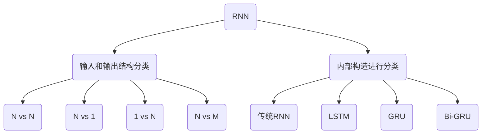

# 循环神经网络（RNN）

## 认识RNN模型

RNN（Recurrent Neural Network），中文称作循环神经网络，它一般以序列数据为输入，通过网络内部的结构设计有效捕捉序列之间的关系特征，一般也是以序列形式进行输出。

RNN单层网络结构


以时间步对RNN进行展开后的单层网络结构


RNN的循环机制使模型隐层上一时间步产生的结果，能够作为当下时间步输入的一部分（当下时间步的输入除了正常的输入外还包括上一步的隐层输出）对当下时间步的输出产生影响。

### RNN模型的作用

因为RNN结构能够很好利用序列之间的关系，因此针对自然界具有连续性的输入序列,，如：人类的语言，语音等进行很好的处理，广泛应用于NLP领域的各项任务，如文本分类、情感分析、意图识别、机器翻译等。

使用RNN进行文本的意图识别，首先需要对文本序列进行基本的分词，每次输入RNN只有一个词，如："What time is it ?"


首先将单词"What"输送给RNN，它将产生一个输出01


继续将单词"time"输送给RNN，但此时RNN不仅仅利用"time"来产生输出02，还会使用来自上一层隐层输出01作为输入信息。


重复这样的步骤，直到处理完所有的单词。


最后，将最终的隐层输出05进行处理来解析用户意图。


### RNN模型的分类



1. N vs N：RNN最基础的结构形式，输入和输出序列是等长的。由于这个限制的存在，使其适用范围比较小，可用于生成等长度的合辙诗句。


2. N vs 1：输入是一个序列，输出是一个单独的值。使用sigmoid或者softmax进行处理，这种结构经常被应用在文本分类问题上。


3. 1 vs N：输入作用于每次的输出之上，这种结构可用于将图片生成文字任务等。


4. N vs M：这是一种不限输入输出长度的RNN结构，它由编码器和解码器两部分组成。两者的内部结构都是某类RNN，它也被称为seq2seq架构。输入数据首先通过编码器，最终输出一个隐含变量c，之后最常用的做法是使用这个隐含变量c作用在解码器进行解码的每一步上，以保证输入信息被有效利用。


seq2seq架构最早被提出应用于机器翻译，因为其输入输出不受限制，如今也是应用最广的RNN模型结构。在机器翻译、阅读理解、文本摘要等众多领域都进行了非常多的应用实践。

## 经典RNN模型

传统RNN的内部结构


单个RNN模块，输入有两部分，分别是$h(t-1)$（上一时间步的隐层输出）和$x(t)$（此时间步的输入），它们进入RNN结构体后，会将二者进行拼接，形成新的张量$[x(t), h(t-1)]$，之后这个新的张量将通过一个全连接层，该层使用tanh作为激活函数，最终得到该时间步的输出$h(t)$，它将作为下一个时间步的输入和$x(t+1)$一起进入结构体，以此类推。


数学表示为
$$
h_t=\tanh(W_t[X_t, h_{t-1}]+b_t)
$$
tanh函数的值域为[-1, 1]。

> [!warning]
>
> * 在传统神经网络中，“隐藏层”是指输入与输出之间的非线性变换层。
> * 在RNN中，“隐藏层”是每个时间步都会重复执行的那一层计算逻辑。

#### RNN实现

[`RNN`](https://docs.pytorch.org/docs/stable/generated/torch.nn.RNN.html#rnn)结构包含在`torch.nn`模块中

```python
import torch
from torch import nn

rnn = nn.RNN(5, 6, 1)
input = torch.randn(4, 1, 5)
h0 = torch.zeros(1, 1, 6)
output, hn = rnn(input, h0)
print(input)
print(output)
print(hn)
```

* `input`输入数据：2-序列token数量（时间步长度）；1-样本数据量；5-特征长度（一个token用多少特征向量表示）。
  * 四海/之内/皆/兄弟：一条样本；有4个词；每个词用5维向量表示。
* `h0`初始隐藏层：1-循环层的数量；3-样本数据量；6-隐藏层的维度；一般可以设置为0
* `output`是所有时间步的隐藏状态。
* `h_n`是最后一个时间步的隐藏状态。

经典RNN的特点：

* 内部结构简单，对计算资源要求低，在短序列任务上性能和效果都表现优异。
* 在解决长序列之间的关联时，经常出现梯度消失或爆炸。

## RNN结构变体

### LSTM

LSTM（Long Short-Term Memory）也称长短时记忆结构，是传统RNN的变体。


LSTM内部结构可以分解为：遗忘门、输入门、细胞状态和输出门

#### 遗忘门


$$
f_t=f_t=\sigma\left(W_f\left[h_{t-1},x_t\right]+b_f\right) 
$$
首先将当前时间步输入$x(t)$与上一个时间步隐含状态$h(t-1)$拼接，得到$[x(t), h(t-1)]$。然后通过一个全连接层做变换，最后通过sigmoid函数进行激活得到$f(t)$。遗忘门表示，根据当前时间步输入和上一个时间步隐含状态$h(t-1)$，来决定遗忘多少上一层的细胞状态，所携带的过往信息。

#### 输入门


$$
\left\{\begin{array}{lll} 
i_t=\sigma\left(W_i\left[h_{t-1},x_t\right]+b_i\right)   \\
\widetilde{C}_t=\tanh\left(W_C\left[h_{t-1},x_t\right]+b_C\right)  
\end{array}\right.
$$
输入门得到的是当前的细胞状态，而不是像经典RNN一样得到的是隐含状态。

#### 细胞状态


$$
C_t=f_tC_{t-1}+i_t\widetilde{C}_t
$$
细胞状态更新过程就是对遗忘门和输入门的应用。

#### 输出门


$$
\left\{\begin{array}{lll} 
o_t=\sigma\left(W_o\left[h_{t-1},x_t\right]+b_o\right)   \\
h_t=o_t\tanh(C_t)  
\end{array}\right.
$$
整个输出门的过程, 就是为了产生隐含状态$h(t)$。

#### Bi-LSTM

Bi-LSTM即双向LSTM，是将LSTM应用两次且方向不同，再将两次得到的LSTM结果进行拼接作为最终输出。这种结构能够捕捉语言语法中一些特定的前置或后置特征，增强语义关联，但是模型参数和计算复杂度也随之增加了一倍。


#### LSTM的实现

[`LSTM`](https://docs.pytorch.org/docs/stable/generated/torch.nn.LSTM.html#torch.nn.LSTM)结构包含在`torch.nn`模块中

```python
lstm = nn.LSTM(5, 6, 1)
input = torch.randn(4, 1, 5)
h0 = torch.zeros(1, 1, 6)
c0 = torch.zeros(1, 1, 6)

output, (hn, cn) = lstm(input, (h0, c0))
print(input)
print(output)
print(hn)
print(cn)
```

`h0`初始隐藏层；`c0`初始细胞状态。

LSTM的特点：

* 能够有效捕捉长序列之间的语义关联。
* 缓解梯度消失或爆炸现象，不能杜绝这些现象。
* 内部结构相对较复杂，因此训练效率低。

### GRU

GRU（Gated Recurrent Unit）也称门控循环单元结构，它也是传统RNN的变体。


$$
\left\{\begin{array}{lll} 
z_t=\sigma\left(W_z\left[h_{t-1},x_t  \right]\right)  \\
r_t=\sigma\left(W_r\left[h_{t-1},x_t  \right]\right)  \\
\widetilde{h}_t=\tanh\left(W\left[r_th_{t-1},x_t  \right] \right) \\
h_t=\left(1-z_t\right)h_{t-1}+z_t\widetilde{h}_t 
\end{array}\right.
$$

* $r_t$称为重置门：代表控制上一时间步传来的信息有多少可以被利用。
* $z_t$称为更新门：更新门有能力保留之前的结果，当门值趋于1时，输出就是新的$h(t)$；而当门值趋于0时，输出就是上一时间步的$h(t-1)$。

#### Bi-GRU

Bi-GRU与Bi-LSTM的逻辑相同，都是不改变其内部结构，而是将模型应用两次且方向不同，再将两次得到的LSTM结果进行拼接作为最终输出。

#### GRU的实现

[`GRU`](https://docs.pytorch.org/docs/stable/generated/torch.nn.GRU.html#torch.nn.GRU)结构包含在`torch.nn`模块中

```python
gru = nn.GRU(5, 6, 1)
input = torch.randn(4, 1, 5)
h0 = torch.zeros(1, 1, 6)
output, hn = gru(input, h0)

print(input)
print(output)
print(hn)
```

GRU的特点：

* 同LSTM一样能够有效捕捉长序列之间的语义关联，缓解梯度消失或爆炸现象，不能杜绝这些现象。
* 结构和计算要比LSTM更简单。
* 不可并行计算。

