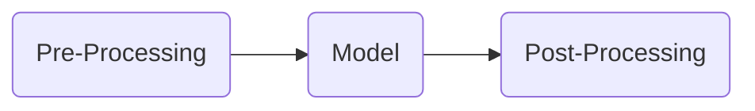
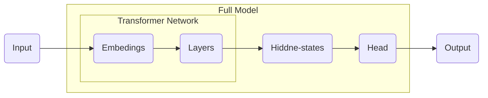

# 预训练模型

预训练模型是一种机器学习模型，它是在大规模数据上进行通用训练后得到的模型，这些模型可以针对特定任务进行进一步调整和优化。

* 无监督预训练：利用未标注的海量数据（如互联网文本、图像），通过自监督任务（如掩码、预测、对比）学习通用特征。
* 监督预训练：在有标注的大规模数据上训练（如 ImageNet 的分类标签），但标注成本较高。

自然语言处理领域的预训练模型：BERT、GPT（Generative Pre-trained Transformer）系列。


## Bert

Bert（Bidirectional Encoder Representation from Transformers）是2018年10月由Google AI研究院提出的一种预训练模型。

相关论文：[Pre-training of Deep Bidirectional Transformers for Language Understanding](https://arxiv.org/pdf/1810.04805)


Bert分三个主要模块：

* 最底层黄色标记的Embedding模块。
* 中间层蓝色标记的Transformer模块。
* 最上层绿色标记的预微调模块。

### 文本输入


- Token Embeddings是词嵌入张量，第一个单词是CLS标志。可以用于之后的分类任务。
- Segment Embeddings是句子分段嵌入张量，是为了服务后续的两个句子为输入的预训练任务。
- Position Embeddings是位置编码张量，此处注意和传统的Transformer不同，是通过学习得出来的。
- 整个Embedding模块的输出张量就是这3个张量的直接加和结果。

### Transformer模块

Bert中只使用了经典Transformer架构中的Encoder部分，并采用了双向Transformer模块。

### 预训练任务

BERT包含两个预训练任务，是一种自监督学习（self - supervised learning）的方式。

1. Masked LM 
   1. 在原始训练文本中，随机的抽取15%的token作为参与MASK任务的对象。
   2. 在这些被选中的token中，数据生成器并不是把它们全部变成[MASK]，而是有下列3种情况：
      * 在80%的概率下，用[MASK]标记替换该token，比如my dog is hairy -> my dog is [MASK]
      * 在10%的概率下，用一个随机的单词替换token，比如my dog is hairy -> my dog is apple
      * 在10%的概率下，保持该token不变，比如my dog is hairy -> my dog is hairy

2. Next Sentence Prediction
   1. 所有参与任务训练的语句都被选中作为句子A。
      * 其中50%的B是原始文本中真实跟随A的下一句话。（标记为IsNext，代表正样本）
      * 其中50%的B是原始文本中随机抽取的一句话。（标记为NotNext，代表负样本）

### 模型微调

Bert需要针对不同的下游任务进行模型微调。


### Bert模型特点

1. Bert的优点
   1. 通过预训练，可以是模型适用不同的下游任务。
   2. 并行化处理同时能捕捉长距离的语义和结构依赖。
2. Bert的缺点
   1. BERT模型过于庞大，参数太多。
   2. BERT目前给出的中文模型中，是以字为基本token单位。
   3. 模型的收敛的速度慢，训练周期长。

## ELMo模型

ELMo（Embeddings from Language Models）模型是2018年3月由华盛顿大学提出的一种预训练模型。

相关论文：[Deep contextualized word representations](https://arxiv.org/pdf/1802.05365)


ELMo分三个主要模块：

* 最底层黄色标记的Embedding模块。
  * 最底层的词嵌入采用CNN对字符级进行编码。
* 中间层蓝色标记的两部分双层LSTM模块。
* 最上层绿色标记的词向量表征模块。

ELMo模型的预训练任务：基于传统的语言模型任务，通过预测单词在上下文中的出现概率来学习语言的统计规律，是一种自回归（auto - regression）的方式。

## GPT系列模型

GPT系列模型是OpenAI公司提出的一种语言预训练模型，GPT模型是在Bert模型之前提出的。

### GPT 1

相关论文：[Improving Language Understanding by Generative Pre-Training](https://www.mikecaptain.com/resources/pdf/GPT-1.pdf)


* Bert采用了Transformer的Encoder模块，而GPT采用了Transformer的Decoder模块。
* GPT采用Decoder模块中去掉了，交叉注意力模块。
*  GPT的架构中采用了12个Decoder Block。
* 使用了masked self-attention代替了一般的self-attention。
* Bert会同时利用上下文的信息，GPT采用的是单向Transformer模型。


使用Mask矩阵可以实现，后向预测


GPT 1的预训练任务是：因果语言建模（Causal Language Modeling, CLM）。给定一段文本序列，模型需要根据序列中前面的单词预测下一个单词。

### GPT 2

相关论文：[Language Models are Unsupervised Multitask Learners](https://cdn.openai.com/better-language-models/language_models_are_unsupervised_multitask_learners.pdf)


在GPT 2中模型优化：

* 更大的模型参数
* 改进的 LayerNorm 位置

| 维度         | GPT-1                       | GPT-2                              |
| ------------ | --------------------------- | ---------------------------------- |
| **模型规模** | 1.17亿参数，12层Transformer | 15亿参数，48层Transformer          |
| **训练数据** | 5GB BooksCorpus             | 40GB WebText，更丰富的互联网文本   |
| **任务模式** | 依赖微调解决特定任务        | 零样本学习，仅通过 Prompt 实现泛化 |
| **能力边界** | 单一语言建模                | 通用语言理解、生成多种内容         |

GPT-1 的词汇表大小约为40000，GPT-2 的词汇表大小为 50257，每一个词都会被转换为Token IDs。

```
[My dog is cute!] => [101, 2023, 2004, 234, 6429, 999, 102]
```


输入到transformer模块中的张量就是，词嵌入矩阵与位置编码矩阵加和结果。

### GPT模型的输出

当输入序列通过Transformer的所有层后，最后一个Transformer模块会输出一个形状为`[batch_size, seq_len, hidden_dim]`的张量


将Transformer的输出张量$H$与词嵌入矩阵的转置$W_e^T$相乘，得到形状为`[batch_size, seq_len, vocab_size]`的张量。


计算的数学公式为
$$
\begin{array}{lll} 
\left[\text{batch-size}, \text{seq-len}, \text{hidde-dim}\right]  
\times \left[ \text{hidden-dim}, \text{vocab-size}\right] \\
\to \left[1, 1024, 1024\right] \times \left[1024, 50257\right]=\left[1, 1024, 50257\right]
\end{array}
$$
* $\text{seq-len}=1024$是句子的长度。
* $\text{vocab-size}=50257$表示$1024$个位子，对于$50257$个词，每个词的概率。
* 生成过程中可以选择每个概率最大的词，也可以从概率最高的几个词中随机选择。

## Hugging Face Transformers

[Hugging Face](https://huggingface.co/) 是全球领先的开源人工智能平台，核心产品与服务包括

* Transformers库。
* Datasets库：提供了上千个公开数据集。
* Tokenizers 库：高效文本分词库。
* Hugging Face Hub：模型共享平台。

[Hugging Face Transformers](https://huggingface.co/docs/transformers/zh/index)是一个 Python库，允许用户下载和训练机器学习（ML）模型。它最初被创建用于开发语言模型，现在功能已扩展到包括多模态、计算机视觉和音频处理等其他用途的模型。

* 提供广泛的预训练模型，如BERT、GPT、T5等，适用于各种NLP任务。
* 提供了便于快速下载和使用的API。
* 强大的社区支持，集成最新的研究成果。
* 支持多种深度学习框架，如PyTorch、TensorFlow。

```shell
pip install 'transformers[torch]' # 安装已Pytorch为底层的transformers
```

Transformers会将将模型或其他工具保存在本地，可以在环境变量中统一修改缓存位置，在`~/.zshrc`中添加

```
export TRANSFORMERS_CACHE="/new/cache/path"
```

### Pipeline API

`pipeline`为模型提供了建议的推理接口，Pipeline API中包装着多种管道。`pipeline`的处理流程



* Pre-Processing包括：分词、词向量转化等。
* Model：模型识别，输出概率。
* Post-Processing：下游任务的处理，生成结果，如：分类标签、词的概率。

[`pipeline`对应的任务](https://huggingface.co/docs/transformers/zh/task_summary)

### AutoClasses

[AutoClasses](https://huggingface.co/docs/transformers/v4.52.3/en/model_doc/auto)是一组强大的自动化工具类。它们的核心功能是根据标识符加载模型、分词器等工具。

常用的是`AutoModel`和`AutoTokenizer`加载模型和分词器。



* 绝大多数预训练模型Transformer Network结构相似，参数可以复用。
* Full Model的隐藏层与Head负责下游任务如：情感分类、机器对话等。

