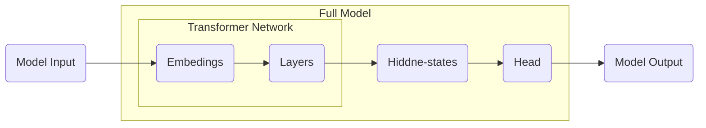

# Hugging Face

[Hugging Face](https://huggingface.co/) 是全球领先的开源人工智能平台，核心产品与服务包括

* Transformers库。
* Datasets库：提供了上千个公开数据集。
* Tokenizers 库：高效文本分词库。
* Hugging Face Hub：模型共享平台。

[Hugging Face Transformers](https://huggingface.co/docs/transformers/zh/index)是一个 Python库，允许用户下载和训练机器学习（ML）模型。它最初被创建用于开发语言模型，现在功能已扩展到包括多模态、计算机视觉和音频处理等其他用途的模型。

* 提供广泛的预训练模型，如BERT、GPT、T5等，适用于各种NLP任务。
* 提供了便于快速下载和使用的API。
* 强大的社区支持，集成最新的研究成果。
* 支持多种深度学习框架，如PyTorch、TensorFlow。

```shell
pip install 'transformers[torch]' # 安装已Pytorch为底层的transformers
```

Transformers会将将模型或其他工具保存在本地，可以在环境变量中统一修改缓存位置，在`~/.zshrc`中添加

```
export TRANSFORMERS_CACHE="/new/cache/path"
```

## Pipeline API

`pipeline`是使用模型进行推理的一种简单方法。这些pipelines是抽象了库中大部分复杂代码的对象，提供了一个专用于多个任务的简单API。`pipeline`的处理流程


* Pre-Processing包括：分词、词向量转化等。
* Model：模型识别，输出概率。
* Post-Processing：下游任务的处理，生成结果，如：分类标签、词的概率。

`pipeline`支持的常见任务


[`pipeline`支持的完整任务列表](https://huggingface.co/docs/transformers/zh/task_summary)

手动设置transformers模型下载路径

```python
import os

os.environ['HF_HOME'] = './data/hf'
os.environ['HF_HUB_CACHE'] = './data/hf/hub'
```

### 文本分类任务

```python
from transformers import pipeline

pipe = pipeline("sentiment-analysis")
pipe("早餐不好,服务不到位,晚餐无西餐,早餐晚餐相同,房间条件不好,餐厅不分吸烟区.房间不分有无烟房.")
```

> [!warning]
>
> `sentiment-analysis`的默认模型是[DistilBERT base uncased finetuned SST-2](https://huggingface.co/distilbert/distilbert-base-uncased-finetuned-sst-2-english)，一般不推荐使用默认模型。默认模型并未针对中文做太多训练，中文分类效果不佳。

使用[IMDB影评数据测试模型](https://www.kaggle.com/datasets/lakshmi25npathi/imdb-dataset-of-50k-movie-reviews)

```python
sentence = "What an absolutely stunning movie, if you have 2.5 hrs to kill, watch it, you won't regret it, it's too much fun!"
pipe(sentence)

sentence = "Kind of drawn in by the erotic scenes, only to realize this was one of the most amateurish and unbelievable bits of film I've ever seen."
pipe(sentence)
```

批处理数据

```python
text_list = [
    "This a fantastic movie of three prisoners who become famous.",
    "A wonderful little production.",
    "This movie made it into one of my top 10 most awful movies."
]

pipe(text_list)
```

### 分词

常见的分词任务是：命名实体识别（NER）和词性标注（POS）

```python
sentence = "Hugging Face is a French company based in New York City."
classifier = pipeline(task="ner")
result = classifier(sentence)
print(*result, sep='\n')
```

合并实体

```python
classifier = pipeline(task="ner", grouped_entities=True)
result = classifier(sentence)
print(*result, sep='\n')
```

### 问答任务

* 提取式：给定一个问题和一些上下文，答案是引用原文。
* 抽象式：给定一个问题和一些上下文，答案根据上下文生成，并不显示存在。

```python
question_answerer = pipeline(task="question-answering")
result = question_answerer(
    question="What is the name of the repository?",
    context="The name of the repository is huggingface/transformers",
)

print(
    f"score: {round(preds['score'], 4)}, start: {preds['start']}, end: {preds['end']}, answer: {preds['answer']}"
)
```

### 摘要

摘要（summarization）从较长的文本中创建一个较短的版本，同时尽可能保留原始文档的大部分含义。摘要有两种类型：

* 提取式：从原始文本中识别和提取最重要的句子。
* 抽象式：从原始文本生成目标摘要（可能包括不在输入文档中的新单词）。

```python
summarizer = pipeline(task="summarization", model="t5-base", min_length=8, max_length=32)
summarizer(
    "In this work, we presented the Transformer, the first sequence transduction model based entirely on attention, replacing the recurrent layers most commonly used in encoder-decoder architectures with multi-headed self-attention. For translation tasks, the Transformer can be trained significantly faster than architectures based on recurrent or convolutional layers. On both WMT 2014 English-to-German and WMT 2014 English-to-French translation tasks, we achieve a new state of the art. In the former task our best model outperforms even all previously reported ensembles."
)
```

[`model="google-t5/t5-base"`](https://huggingface.co/google-t5/t5-base)指定了T5模型，可以根据[模型仓库](https://huggingface.co/models)中的列表，选择不同的模型。

> [!warning]
>
> `pipeline`同样支持语言与视觉模型，但所有模型都是基于Transformer，在语音和视频领域同样有，基于Transformer的模型。

## Pipelines进阶

`pipeline`中Transformer的模型结构



* 绝大多数预训练模型Transformer Network结构相似，参数可以复用。
* Full Model的隐藏层与Head负责下游任务如：情感分类、机器对话等。

### 调用大语言模型

1. 使用[GPT-2](https://huggingface.co/openai-community/gpt2)实现文本生成

```python
prompt = "Python is the best programming language."

generator = pipeline(task="text-generation", model="openai-community/gpt2")
generator(prompt)
```

设置文本生成返回条数

```python
generator = pipeline(
    task="text-generation", model="openai-community/gpt2", num_return_sequences=3
)
result = generator(prompt)
print(*result, sep='\n')
```

设置条数同时，控制文本生成最大长度

```python
result = generator(prompt, num_return_sequences=2, max_new_tokens=16)
print(*result, sep='\n')
```

2. 使用[BERT-Base-Chinese](https://huggingface.co/google-bert/bert-base-chinese)实现中文补全

```python
fill_mask = pipeline(task="fill-mask", model="google-bert/bert-base-chinese")
fill_mask("python是最[MASK]的编程语言")
```

设置文本补全的条数

```python
fill_mask("python是[MASK]的编程语言", top_k=3)
```

## AutoClasses

[AutoClasses](https://huggingface.co/docs/transformers/v4.52.3/en/model_doc/auto)是一组强大的自动化工具类。它们的核心功能是加载Hugging Face的预训练模型、分词器等工具。常用的是`AutoModel`和`AutoTokenizer`加载模型和分词器。

```python
from transformers import AutoTokenizer, AutoModel

model_name = "google-bert/bert-base-chinese"
tokenizer = AutoTokenizer.from_pretrained(model_name)
model = AutoModel.from_pretrained(model_name)
```

### 查看文本编码

分词

```python
sequence = "四海之内皆兄弟"
tokens = tokenizer.tokenize(sequence)
print(tokens)
```

词表映射

```python
token_ids = tokenizer.convert_tokens_to_ids(tokens)
print(token_ids)
```

端到端处理（将句子分词后直接转换为词表映射）

```python
token_ids_e2e = tokenizer.encode(sequence)
print(token_ids_e2e)
```

将词表映射还原为token

```python
print(tokenizer.decode(token_ids))
print(tokenizer.decode(token_ids_e2e))
```

编解码多段文本

```python
sequence_batch = ["秦时明月汉时关", "万里长征人未还"]
token_ids_batch = tokenizer.encode(sequence_batch)
print(tokenizer.decode(token_ids_batch))
```

### 查看词表大小

```python
len(tokenizer.vocab.keys())
```

查看词表部分内容

```python
from itertools import islice

for key, value in islice(tokenizer.vocab.items(), 10):
    print(f"{key}: {value}")
```

