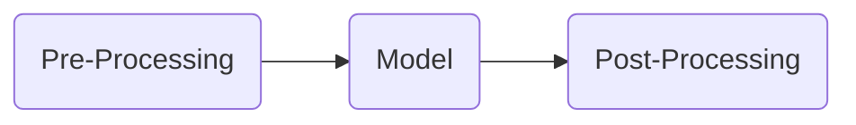
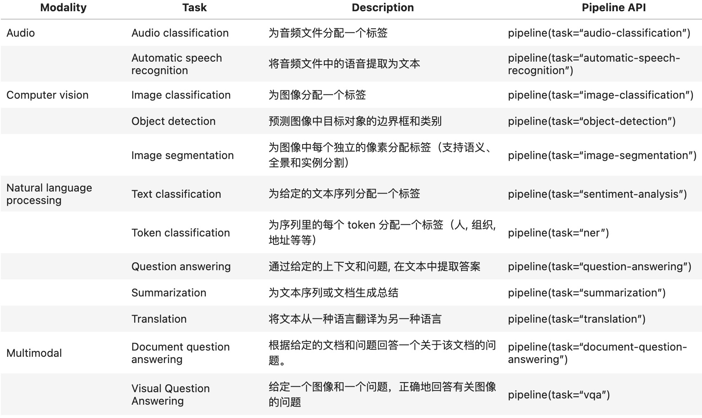
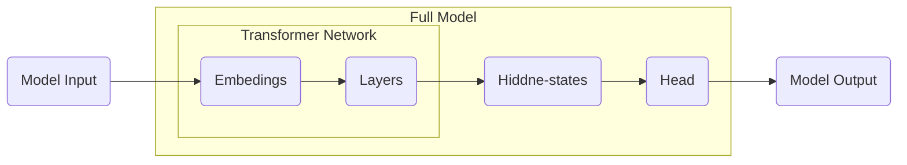

# Hugging Face Transformers

[Hugging Face](https://huggingface.co/) 是全球领先的开源人工智能平台，核心产品与服务包括

* Transformers库。
* Datasets库：提供了上千个公开数据集。
* Tokenizers 库：高效文本分词库。
* Hugging Face Hub：模型共享平台。

[Hugging Face Transformers](https://huggingface.co/docs/transformers/zh/index)是一个 Python库，允许用户下载和训练机器学习（ML）模型。它最初被创建用于开发语言模型，现在功能已扩展到包括多模态、计算机视觉和音频处理等其他用途的模型。

* 提供广泛的预训练模型，如BERT、GPT、T5等，适用于各种NLP任务。
* 提供了便于快速下载和使用的API。
* 强大的社区支持，集成最新的研究成果。
* 支持多种深度学习框架，如PyTorch、TensorFlow。

```shell
pip install 'transformers[torch]' # 安装已Pytorch为底层的transformers
```

Transformers会将将模型或其他工具保存在本地，可以在环境变量中统一修改缓存位置，在`~/.zshrc`中添加

```
export TRANSFORMERS_CACHE="/new/cache/path"
```

## Pipeline API

`pipeline`是使用模型进行推理的一种简单方法。这些pipelines是抽象了库中大部分复杂代码的对象，提供了一个专用于多个任务的简单API。`pipeline`的处理流程



* Pre-Processing包括：分词、词向量转化等。
* Model：模型识别，输出概率。
* Post-Processing：下游任务的处理，生成结果，如：分类标签、词的概率。

`pipeline`支持的常见任务



[`pipeline`支持的完整任务列表](https://huggingface.co/docs/transformers/zh/task_summary)

Transformer的模型结构



* 绝大多数预训练模型Transformer Network结构相似，参数可以复用。
* Full Model的隐藏层与Head负责下游任务如：情感分类、机器对话等。

### Pipeline的基本使用

手动设置transformers模型下载路径

```python
import os

os.environ['HF_HOME'] = './data/hf'
os.environ['HF_HUB_CACHE'] = './data/hf/hub'
```

1. 文本分类任务

```python
from transformers import pipeline

pipe = pipeline("sentiment-analysis")
pipe("早餐不好,服务不到位,晚餐无西餐,早餐晚餐相同,房间条件不好,餐厅不分吸烟区.房间不分有无烟房.")
```

> [!warning]
>
> `sentiment-analysis`的默认模型是[DistilBERT base uncased finetuned SST-2](https://huggingface.co/distilbert/distilbert-base-uncased-finetuned-sst-2-english)，一般不推荐使用默认模型。默认模型并未针对中文做太多训练，中文分类效果不佳。

使用[IMDB影评数据测试模型](https://www.kaggle.com/datasets/lakshmi25npathi/imdb-dataset-of-50k-movie-reviews)

```python
sentence = "What an absolutely stunning movie, if you have 2.5 hrs to kill, watch it, you won't regret it, it's too much fun!"
pipe(sentence)

sentence = "Kind of drawn in by the erotic scenes, only to realize this was one of the most amateurish and unbelievable bits of film I've ever seen."
pipe(sentence)
```

批处理数据

```python
text_list = [
    "This a fantastic movie of three prisoners who become famous.",
    "A wonderful little production.",
    "This movie made it into one of my top 10 most awful movies."
]

pipe(text_list)
```

2. Token分类

在任何NLP任务中，文本都经过预处理，将文本序列分成单个单词或子词。这些被称为[tokens](https://huggingface.co/glossary#token)。Token分类将每个`token`分配一个来自预定义类别集的标签。两种常见的Token分类是：

* 命名实体识别（NER）：根据实体类别（如组织、人员、位置或日期）对`token`进行标记。NER在生物医学设置中特别受欢迎，可以标记基因、蛋白质和药物名称。
* 词性标注（POS）：根据其词性（如名词、动词或形容词）对标记进行标记。POS对于帮助翻译系统了解两个相同的单词如何在语法上不同很有用（作为名词的银行与作为动词的银行）。

```python
sentence = "Hugging Face is a French company based in New York City."
classifier = pipeline(task="ner")
preds = classifier(sentence)
print(preds)
```

合并实体

```python
classifier = pipeline(task="ner", grouped_entities=True)
preds = classifier(sentence)
print(preds)
```

3. 问答任务
   * 提取式：给定一个问题和一些上下文，答案是在上下文中查找。
   * 抽象式：给定一个问题和一些上下文，答案根据上下文生成，并不显示存在。

```python
```


### AutoClasses

[AutoClasses](https://huggingface.co/docs/transformers/v4.52.3/en/model_doc/auto)是一组强大的自动化工具类。它们的核心功能是根据标识符加载模型、分词器等工具。

常用的是`AutoModel`和`AutoTokenizer`加载模型和分词器。


* 绝大多数预训练模型Transformer Network结构相似，参数可以复用。
* Full Model的隐藏层与Head负责下游任务如：情感分类、机器对话等。