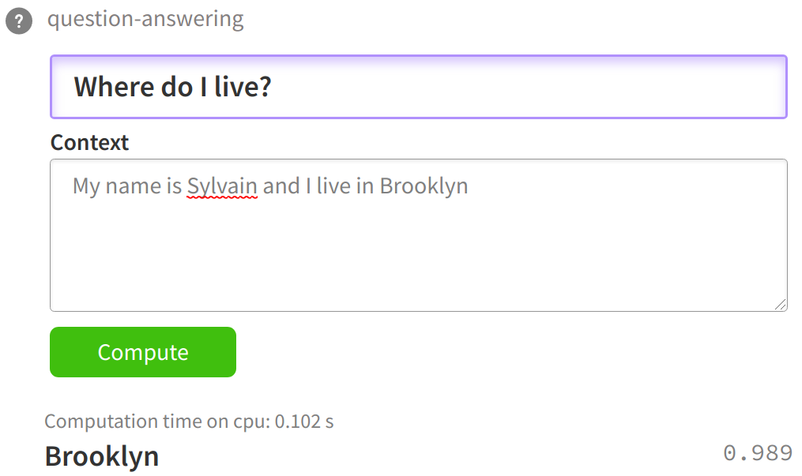
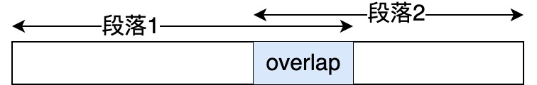

# 模型微调入门

## Hugging Face Datasets

[`Datasets`](https://huggingface.co/docs/datasets/index)是一个用于访问和共享音频、计算机视觉和自然语言处理（NLP）任务数据集的Python库，可以方便加载[Hugging Face上的数据集](https://huggingface.co/datasets)。安装`Datasets`包

```shell
pip install datasets
```

* [如何创建自己的`Datasets`](https://huggingface.co/docs/datasets/create_dataset)
* [上传数据到Hugging Face](https://huggingface.co/docs/datasets/upload_dataset)

> [!warning]
>
> `Datasets`使用生成器创建数据集，得到一个可迭代对象。

### 下载训练数据

[`Yelp/yelp_review_full`](https://huggingface.co/datasets/Yelp/yelp_review_full)数据集包括来自Yelp的评论，该数据集主要用于文本分类。有650,000个训练样本和50,000个测试样本。

```python
from datasets import load_dataset

dataset = load_dataset("Yelp/yelp_review_full", cache_dir="./data/hf/datasets")
print(dataset)
```

* `cache_dir="./data/hf/datasets"`指定文件的下载路径。

打印一条数据

```python
print(dataset["train"][0])
```

随机显示10条数据

```python
import random
import pandas as pd
import datasets
from IPython.display import display, HTML

def show_random_elements(dataset, num_examples=10):
    assert num_examples <= len(dataset), "Can't pick more elements than there are in the dataset."
    picks = []
    for _ in range(num_examples):
        pick = random.randint(0, len(dataset)-1)
        while pick in picks:
            pick = random.randint(0, len(dataset)-1)
        picks.append(pick)

    df = pd.DataFrame(dataset[picks])
    for column, typ in dataset.features.items():
        if isinstance(typ, datasets.ClassLabel):
            df[column] = df[column].transform(lambda i: typ.names[i])
    display(HTML(df.to_html()))

show_random_elements(dataset["train"])
```

### 数据预处理

下载数据集到本地后，使用Tokenizer来处理文本，对于长度不等的输入数据，可以使用填充（padding）和截断（truncation）策略来处理。`Datasets`的`map`方法，支持一次性在整个数据集上应用预处理函数。

设置下载环境

```python
import os
from transformers import AutoTokenizer
from transformers import AutoModelForSequenceClassification
from transformers import TrainingArguments
import numpy as np
import evaluate
from transformers import Trainer

os.environ['HF_HOME'] = './data/hf'
os.environ['HF_HUB_CACHE'] = './data/hf/hub'
```

使用[`google-bert/bert-base-cased`](https://huggingface.co/google-bert/bert-base-cased)的模型对数据进行预处理。

```python
model_name = 'google-bert/bert-base-cased'
tokenizer = AutoTokenizer.from_pretrained(model_name)

def tokenize_function(examples):
    return tokenizer(examples["text"], padding="max_length", truncation=True)

tokenized_datasets = dataset.map(tokenize_function, batched=True)
```

* `tokenize_function`对数据进行了预处理，长的数据截断，短的数据补0。

显示处理后的数据

```python
show_random_elements(tokenized_datasets["train"], num_examples=1)
```

### 抽样数据

随机抽样1000条数据，用于模型微调

```python
small_train_dataset = tokenized_datasets["train"].shuffle(seed=42).select(range(1000))
small_eval_dataset = tokenized_datasets["test"].shuffle(seed=42).select(range(1000))
```

* `shuffle`随机重新排列数据。

## 模型微调

### 模型微调模块`Trainer`

Transformers Trainer模块可以用于模型微调

```python
from transformers import Trainer

trainer = Trainer(
    model=model,                          # 微调的模型名称
    args=training_args,                   # 训练参数
    train_dataset=dataset["train"],       # 训练数据集
    eval_dataset=dataset["test"],         # 测试数据集
    compute_metrics=compute_metrics,      # 模型评估的指标
)

trainer.train()
```

* 完整的[`training_args`](https://huggingface.co/docs/transformers/v4.36.1/en/main_classes/trainer#transformers.TrainingArguments)，所以的参数都有默认值。

### 指标评估`Evaluate`

[Evaluate](https://huggingface.co/docs/evaluate/index)库是一个用于轻松评估机器学习模型和数据集的Python库。安装Evaluate包

```python
pip install evaluate
```

[Evaluate包含的评估指标](https://huggingface.co/evaluate-metric/spaces?p=0)，可以使用Evaluate库构造compute_metrics，用于模型微调过程的评测。也可供用于模特微调后测试集的总体评测。

### 微调BERT模型

加载BERT模型

```python
model = AutoModelForSequenceClassification.from_pretrained(model_name, num_labels=5)
```

设置训练参数

```python
model_dir = "./data/hf/models/bert-base-cased-finetune-yelp"
training_args = TrainingArguments(
    output_dir=model_dir, 
    per_device_train_batch_size=16, 
    num_train_epochs=5, 
    logging_strategy="epoch",
    eval_strategy="epoch"
)
print(training_args)
```

定义评估指标

```python
metric = evaluate.load("accuracy")

def compute_metrics(eval_pred):
    logits, labels = eval_pred
    predictions = np.argmax(logits, axis=-1)
    return metric.compute(predictions=predictions, references=labels)
```

训练模型

```python
trainer = Trainer(
    model=model,
    args=training_args,
    train_dataset=small_train_dataset,
    eval_dataset=small_eval_dataset,
    compute_metrics=compute_metrics,
)

trainer.train()
```

重新抽取100条数据测试模型

```python
small_test_dataset = tokenized_datasets["test"].shuffle(seed=64).select(range(100))
trainer.evaluate(small_test_dataset)
```

保存训练后的模型

```python
trainer.save_model(model_dir)
```

保存训练状态，保存到`output_dir`目录下。

```python
trainer.save_state()
```

训练状态中包括一些关键信息，可以根据保存的状态恢复，并继续训练。

### 模型微调的流程

1. 整理数据集（决定了模型的上限）。
2. 数据预处理。
3. 配置训练超参数（模型微调的核心）。
4. 设置训练评估指标。
5. 训练模型。
6. 训练完成后，测试训练结果。
7. 模型保存。

## 上下文的问答任务

模型是通过提取上下文的子串来回答问题的，而不是生成新的文本。



使用[斯坦福问答数据集（SQuAD）](https://rajpurkar.github.io/SQuAD-explorer/)训练微调模型。SQuAD是一个阅读理解数据集，数据出自维基百科文章。

### 数据处理

下载[`squad_v2`](https://huggingface.co/datasets/rajpurkar/squad_v2)数据

```python
dataset = load_dataset(
    "rajpurkar/squad_v2", cache_dir="./data/hf/datasets"
)
print(dataset)
print(dataset["train"][0])
```

显示数据格式

```python
show_random_elements(dataset["train"], num_examples=3)
```

这里微调的问答模型为[`distilbert/distilbert-base-uncased`](https://huggingface.co/distilbert/distilbert-base-uncased)，加载分词器

```python
model_name = 'distilbert/distilbert-base-uncased'
tokenizer = AutoTokenizer.from_pretrained(model_name)
tokens = tokenizer("What is your name?", "My name is Sylvain.")
print(*[f"{k}: {v}" for k, v in tokens.items()], sep="\n")
```

> [!note]
>
> 在问答任务中，当上下文长度超过模型最大句子长度时，通常会被截断，但是如果答案在截断部分之内，将会造成答案丢失，所以使用Tokenizer来处理文本时，不能简单采用截断处理。

这里文本预处理，一般将一段上下文拆分为两段。



`distilbert-base-uncased`模型处理的文本最大长度为384，筛选一个样本

```python
max_length = 384  # 最大文本长度
doc_stride = 128  # 截断时填充的文本长度
example = next(
    example for example in dataset["train"]
    if len(tokenizer(example["question"], example["context"])["input_ids"]) > max_length
)
print(*[f"{k}: {v}" for k, v in example.items()], sep="\n")
```

截断上下文不保留超出部分

```python
len_truncate = len(
    tokenizer(
        example["question"], 
        example["context"],
        max_length=max_length,
        truncation="only_second"
    )["input_ids"]
)
print(len_truncate)
```

* `truncation="only_second"`仅在第二个序列`example["context"]`超出最大长度时进行截断，`example["question"]`而保持第一个序列完整。

截断为多个文档列表

```python
tokenized_example = tokenizer(
    example["question"],
    example["context"],
    max_length=max_length,
    truncation="only_second",
    return_overflowing_tokens=True,
    stride=doc_stride
)
print([len(x) for x in tokenized_example["input_ids"]])
for x in tokenized_example["input_ids"][:2]:
    print(tokenizer.decode(x))
```

* `return_overflowing_tokens=True`当输入文本`question + context`的长度超过`max_length`时，自动将超长部分分割成多个块，并返回所有块的信息。
* `stride=doc_stride`控制分块之间的重叠token数量，避免因硬截断导致关键信息（如答案）被切分到两个块之间。

返回每个token对应原始文本中的字符级偏移量（起始和结束位置）。

```python
tokenized_example = tokenizer(
    example["question"],
    example["context"],
    max_length=max_length,
    truncation="only_second",
    return_overflowing_tokens=True,
    return_offsets_mapping=True,
    stride=doc_stride
)
print(tokenized_example["offset_mapping"][0][:100])
```

* 返回值：一个列表，每个元素是一个二元组`(start, end)`，表示该token在原始文本中的字符位置范围。
  * `start`：token 在原始文本中的起始字符索引。
  * `end`：token 在原始文本中的结束字符索引。

根据偏移量打印字符串

```python
first_token_id = tokenized_example["input_ids"][0][1]
offsets = tokenized_example["offset_mapping"][0][1]
print(example["question"])
print(
    tokenizer.convert_ids_to_tokens([first_token_id])[0], 
    example["question"][offsets[0]:offsets[1]]
)
```

使用`sequence_ids`可以区分token的来源编号

```python
sequence_ids = tokenized_example.sequence_ids()
print(sequence_ids)
```

查看答案是否在拆分后的段落中

```python
answers = example["answers"]
start_char = answers["answer_start"][0]
end_char = start_char + len(answers["text"][0])

token_start_index = 0
while sequence_ids[token_start_index] != 1:
    token_start_index += 1

token_end_index = len(tokenized_example["input_ids"][0]) - 1
while sequence_ids[token_end_index] != 1:
    token_end_index -= 1

offsets = tokenized_example["offset_mapping"][0]
if (offsets[token_start_index][0] <= start_char and offsets[token_end_index][1] >= end_char):
    while token_start_index < len(offsets) and offsets[token_start_index][0] <= start_char:
        token_start_index += 1
    start_position = token_start_index - 1
    while offsets[token_end_index][1] >= end_char:
        token_end_index -= 1
    end_position = token_end_index + 1
    print(start_position, end_position)
else:
    print("答案不在此特征中。")

print(tokenizer.decode(
    tokenized_example["input_ids"][0][start_position: end_position+1]
))
print(answers["text"][0])
```

填充的策略为

* 对于没有超过最大长度的文本，填充补齐长度。
* 对于需要左侧填充的模型，交换question和context顺序

将上面的预训练过程封装成函数

```python
pad_on_right = tokenizer.padding_side == "right"

def prepare_train_features(examples):
    examples["question"] = [q.lstrip() for q in examples["question"]]
    tokenized_examples = tokenizer(
        examples["question" if pad_on_right else "context"],
        examples["context" if pad_on_right else "question"],
        truncation="only_second" if pad_on_right else "only_first",
        max_length=max_length,
        stride=doc_stride,
        return_overflowing_tokens=True,
        return_offsets_mapping=True,
        padding="max_length",
    )

    sample_mapping = tokenized_examples.pop("overflow_to_sample_mapping")
    offset_mapping = tokenized_examples.pop("offset_mapping")

    tokenized_examples["start_positions"] = []
    tokenized_examples["end_positions"] = []

    for i, offsets in enumerate(offset_mapping):
        input_ids = tokenized_examples["input_ids"][i]
        cls_index = input_ids.index(tokenizer.cls_token_id)
        sequence_ids = tokenized_examples.sequence_ids(i)
        sample_index = sample_mapping[i]
        answers = examples["answers"][sample_index]
        
        if len(answers["answer_start"]) == 0:
            tokenized_examples["start_positions"].append(cls_index)
            tokenized_examples["end_positions"].append(cls_index)
        else:
            start_char = answers["answer_start"][0]
            end_char = start_char + len(answers["text"][0])
            token_start_index = 0
            while sequence_ids[token_start_index] != (1 if pad_on_right else 0):
                token_start_index += 1

            token_end_index = len(input_ids) - 1
            while sequence_ids[token_end_index] != (1 if pad_on_right else 0):
                token_end_index -= 1

            if not (offsets[token_start_index][0] <= start_char and offsets[token_end_index][1] >= end_char):
                tokenized_examples["start_positions"].append(cls_index)
                tokenized_examples["end_positions"].append(cls_index)
            else:
                while token_start_index < len(offsets) and offsets[token_start_index][0] <= start_char:
                    token_start_index += 1
                tokenized_examples["start_positions"].append(token_start_index - 1)
                while offsets[token_end_index][1] >= end_char:
                    token_end_index -= 1
                tokenized_examples["end_positions"].append(token_end_index + 1)
    return tokenized_examples
```

使用上面的函数对数据进行预处理

```python
tokenized_datasets = dataset.map(
    prepare_train_features, batched=True, remove_columns=dataset["train"].column_names
)
```

* `batched=True`批量处理数据，避免数据过大，内存不够。
* `remove_columns=dataset["train"].column_names`移除到无用列。

### 微调模型

读取微调模型

```python
from transformers import AutoModelForQuestionAnswering

model = AutoModelForQuestionAnswering.from_pretrained(model_name)
```

设置微调模型参数

```python
batch_size=64
model_dir = "./data/hf/models/distilbert-base-uncased-finetuned-squad"

args = TrainingArguments(
    output_dir=model_dir,
    eval_strategy = "epoch",
    learning_rate=2e-5,
    per_device_train_batch_size=batch_size,
    per_device_eval_batch_size=batch_size,
    num_train_epochs=3,
    weight_decay=0.01,
)
```

定义数据容器，数据整理器将训练数据整理为批次数据，用于模型训练时的批次处理。

```python
from transformers import default_data_collator

data_collator = default_data_collator
```

训练模型

```python
trainer = Trainer(
    model,
    args,
    train_dataset=tokenized_datasets["train"],
    eval_dataset=tokenized_datasets["validation"],
    data_collator=data_collator,
    tokenizer=tokenizer,
)
trainer.train()
```

保存训练结果

```python
model_to_save = trainer.save_model(model_dir)
```

### 评估微调结果

加载测试数据

```python
import numpy as np
from collections import OrderedDict

raw_datasets = load_dataset("rajpurkar/squad_v2", cache_dir="./data/hf/datasets")
pad_on_right = tokenizer.padding_side == "right"

def prepare_validation_features(examples):
    examples["question"] = [q.lstrip() for q in examples["question"]]
    tokenized_examples = tokenizer(
        examples["question" if pad_on_right else "context"],
        examples["context" if pad_on_right else "question"],
        truncation="only_second" if pad_on_right else "only_first",
        max_length=max_length,
        stride=doc_stride,
        return_overflowing_tokens=True,
        return_offsets_mapping=True,
        padding="max_length",
    )
    sample_mapping = tokenized_examples.pop("overflow_to_sample_mapping")
    tokenized_examples["example_id"] = []

    for i in range(len(tokenized_examples["input_ids"])):
        sample_index = sample_mapping[i]
        tokenized_examples["example_id"].append(examples["id"][sample_index])
        tokenized_examples["offset_mapping"][i] = [
            o if sequence_id == (1 if pad_on_right else 0) else None
            for o, sequence_id in zip(
                tokenized_examples["offset_mapping"][i],
                tokenized_examples.sequence_ids(i)
            )
        ]
    return tokenized_examples

tokenized_validation = raw_datasets["validation"].map(
    prepare_validation_features,
    batched=True,
    remove_columns=raw_datasets["validation"].column_names
)
```

加载微调后的模型

```python
tokenizer = AutoTokenizer.from_pretrained(model_dir)
model = AutoModelForQuestionAnswering.from_pretrained(model_dir)

trainer = Trainer(
    model=model,
    args=args,
    tokenizer=tokenizer,
    eval_dataset=tokenized_datasets["validation"]
)
```

预测测试数据

```python
raw_predictions = trainer.predict(tokenized_validation)
```

统计预测结果

```python
def postprocess_qa_predictions(examples, features, raw_predictions, n_best_size=20, max_answer_length=30):
    all_start_logits, all_end_logits = raw_predictions
    example_id_to_index = {k["id"]: i for i, k in enumerate(examples)}
    features_per_example = [[] for _ in range(len(examples))]

    for i, feature in enumerate(features):
        example_index = example_id_to_index[feature["example_id"]]
        features_per_example[example_index].append(i)

    predictions = OrderedDict()

    for example_index, example in enumerate(examples):
        feature_indices = features_per_example[example_index]
        context = example["context"]
        valid_answers = []
        for feature_index in feature_indices:
            start_logits = all_start_logits[feature_index]
            end_logits = all_end_logits[feature_index]
            offset_mapping = features[feature_index]["offset_mapping"]
            input_ids = features[feature_index]["input_ids"]

            cls_index = input_ids.index(tokenizer.cls_token_id)
            feature_null_score = start_logits[cls_index] + end_logits[cls_index]
            start_indexes = np.argsort(start_logits)[-1: -n_best_size - 1: -1].tolist()
            end_indexes = np.argsort(end_logits)[-1: -n_best_size - 1: -1].tolist()

            for start_index in start_indexes:
                for end_index in end_indexes:
                    if (
                        start_index >= len(offset_mapping)
                        or end_index >= len(offset_mapping)
                        or offset_mapping[start_index] is None
                        or offset_mapping[end_index] is None
                    ):
                        continue
                    if end_index < start_index or end_index - start_index + 1 > max_answer_length:
                        continue
                    start_char = offset_mapping[start_index][0]
                    end_char = offset_mapping[end_index][1]
                    valid_answers.append({
                        "score": start_logits[start_index] + end_logits[end_index],
                        "text": context[start_char: end_char]
                    })

        if valid_answers:
            best_answer = sorted(valid_answers, key=lambda x: x["score"], reverse=True)[0]
        else:
            best_answer = {"text": ""}

        predictions[example["id"]] = best_answer["text"]

    return predictions

formatted_predictions = postprocess_qa_predictions(
    raw_datasets["validation"],
    tokenized_validation,
    raw_predictions.predictions
)

metric = evaluate.load("squad_v2")

references = [
    {"id": ex["id"], "answers": ex["answers"]}
    for ex in raw_datasets["validation"]
]

predictions_for_metric = [
    {"id": k, "prediction_text": v, "no_answer_probability": 0.0}
    for k, v in formatted_predictions.items()
]

results = metric.compute(predictions=predictions_for_metric, references=references)

print("Evaluation Results:")
print(f"F1: {results['f1']:.2f}")
print(f"Exact Match: {results['exact']:.2f}")
```

