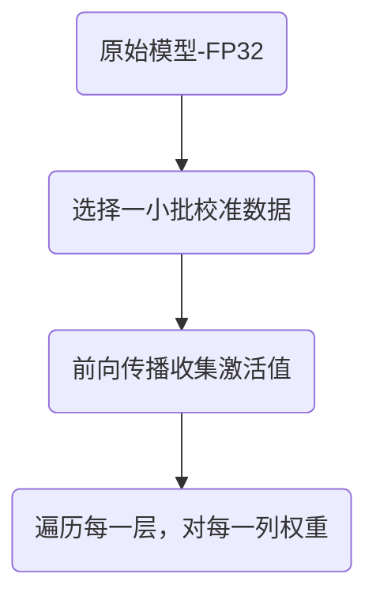

# 模型量化

量化（Quantization）是一种通过降低模型参数的数值精度来减少计算资源占用、提升推理速度的技术，同时尽可能保持模型性能。其核心思想是用更少的比特（如4-bit、8-bit）表示原始模型中的高精度浮点数（如FP32），从而显著减少模型大小和内存需求。

模型的初始权重为FP32

* 如果将模型量化为FP16，则可以将模型大小减半。即需要一半的 GPU 显存即可加载量化后的模型。
* 如果将模型量化为8位整数，大约只需要四分之一的显存开销。
* 如果将模型量化为4位数据，大约只需要八分之一的显存开销。

模型参数计算

1. 参数总量：一般6.7B模型指一个含有大约6.7Billion（67亿）个参数的模型。
2. 一般模型默认使用FP16计算。
3. 显存总量

$$
\text{显存总量}
=\text{参数总量}\times\text{显存大小}
=67\text{亿}\times2\text{字节}
=13.4\times10^9\text{字节}
$$

4. 换算单位$1\text{GB}\approx 10^9$，模型显存大小约为13.4GB。

[Transformers中可以使用的量化方法](https://huggingface.co/docs/transformers/quantization/overview)

## GPTQ

[GPTQ](https://arxiv.org/pdf/2210.17323)是一种后训练量化方法，它的核心思想是：在不需要重新训练模型的情况下，通过对量化误差的梯度估计，寻找尽可能减小量化误差的量化参数和权重表示，以尽量保持模型精度。

1. 读取原始模型（FP32权重）

