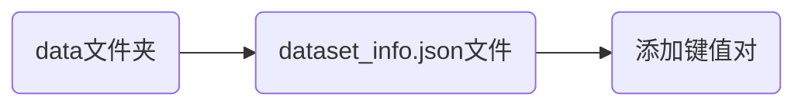

# 大模型微调实践

大模型有多重微调工具

* [Hugging Face PEFT库](https://huggingface.co/docs/peft/index)基于Hugging Face生态，配置和训练过程复杂。
* Llama-Factory提供零代码Web UI，一站式图形化操作。
* DeepSpeed是由微软推出的深度学习优化库，专为超大规模模型设计。
* Axolotl将整个微调工作流都浓缩在一个YAML文件中，可复现性极佳。
* Unsloth通过重写内核，显著提升训练速度，大幅降低显存占用，操作复杂。

## Llama-Factory使用

| 依赖库           | 一般要求 (参考)                      | 严格版本限制 (参考)                             | 说明                                                     |
| :--------------- | :----------------------------------- | :---------------------------------------------- | :------------------------------------------------------- |
| **Transformers** | ≥4.41.218                            | ≥4.41.2, ≤4.48.3, !=4.46.*, !=4.47.*, !=4.48.01 | 核心依赖，版本兼容性要求高，不建议使用不符合要求的版本。 |
| **Python**       | ≥3.8, 推荐 3.10 或 3.11248           | -                                               |                                                          |
| **PyTorch**      | ≥1.13.1, 推荐 2.2.0+28               | 需与CUDA版本匹配26                              | 需根据你的CUDA版本选择合适的PyTorch。                    |
| **CUDA**         | 11.6, 推荐 12.1+28                   | -                                               | 通常通过PyTorch的版本间接指定。                          |
| **其他依赖**     | accelerate, peft, datasets, trl 等28 | -                                               | LLaMA Factory 通常会处理这些依赖的安装。                 |

使用腾讯云重点cloud studio安装Llama-Factory


创建开发环境，升级torch环境

```python
pip install torch==2.7.1 torchvision==0.22.1 torchaudio==2.7.1 --index-url https://download.pytorch.org/whl/cu128
```

* `torch`版本为2.7.1，`torchvision`和`torchaudio`的版本应用与之配合。
* cuda版本为12.8.

> [!warning]
>
> 删除文件夹下的所有文件，包括隐藏文件

clone Llama-Factory项目

```shell
git clone --depth 1 https://github.com/hiyouga/LLaMA-Factory.git .
```

* `.`表示clone到当前的根目录下，不创建子文件夹。
* `--depth 1`深度为1，只克隆最近的一次提交。

安装Llama-Factory

```python
pip install -e ".[torch,metrics]"
```

* `".[torch,metrics]"`中的`.`表示安装当前目录的内容；`[torch,metrics]`可选依赖组。
* `-e`将包以"开发模式"安装到当前环境中

验证是否安装成功

```shell
llamafactory-cli version 
```

查看命令安装路径

```shell
which llamafactory-cli
```

启动webui

```shell
llamafactory-cli webui
```

访问webui

```shell
https://jwbded.ap-singapore.cloudstudio.work/         # 如果浏览器访问cloud studio地址为
https://jwbded--7860.ap-singapore.cloudstudio.work/   # 访问端口--7860
```

### 设置训练数据



数据格式

大模型微调（Fine-tuning）常用的数据格式主要源自指令微调（Instruction Tuning）和对话式训练（Chat/Dialogue Tuning）的研究体系。虽然没有一个“统一标准”，但业内已经形成了一些事实上的通用格式规范，并由不同机构/论文提出。

## 训练数据

### 微调的数据格式

#### Alpaca Format

核心思想：Instruction + Input + Output 三元组。最常见的指令微调格式，被大量开源项目沿用（如LoRA、QLoRA）。

```json
{
  "instruction": "给我解释一下牛顿第一定律。",
  "input": "",
  "output": "牛顿第一定律指在没有外力时，物体保持静止或匀速直线运动。"
}
```

| 字段          | 含义                                     | 是否必须 | 类比         |
| ------------- | ---------------------------------------- | -------- | ------------ |
| `instruction` | 给模型的任务说明（告诉模型“你要干什么”） | 必须     | 题目要求     |
| `input`       | 任务需要的额外材料或上下文               | 可选     | 题目所给材料 |
| `output`      | 模型应该生成的答案（示范答案）           | 必须     | 标准答案     |

```json
{
	"instruction": "总结下面这段文字",
	"input": "小熊在森林里迷路了，他遇到了好心的小兔子……",
	"output": "小熊迷路后得到小兔子帮助的故事。", 
}
```

#### Self-Instruct Format

结构与Alpaca类似，但通常有更详细的task描述。

```json
{
  "task": "Rewrite",
  "instruction": "请改写下面的句子。",
  "input": "天空是蓝色的。",
  "output": "蓝天清澈湛蓝。"
}
```

* `task`一条数据的任务语义说明，是元信息，不用于训练。Self-Instruct的训练数据都是大模型生成的，生成时同时生成了task，用于标记训练数据的用途。

#### Dolly Format

将任务分为7大类

1. Closed QA（封闭问答）：基于给定参考文本（通常是维基百科段落）提问，要求回答是事实性的。 
2. Open QA（开放问答）：根据通用世界知识回答问题，不强制给出参考文本。
3. Information Extraction（信息提取）：从给定段落中提取关键信息，比如列出实体、关键词、列表。
4. Summarization（摘要）：给一段文字（例如维基百科段落）让标注者总结成简短摘要。 
5. Brainstorming（头脑风暴）：给出一个开放性提示，让人/模型想出很多可能性，比如 “和朋友周末可以做什么活动”。
6. Classification（分类）：对一段文本或一系列实体进行分类，例如情感分类、类型判断等。 
7. Creative Writing（创意写作 / 生成）：创造性写作任务，如写诗、写信、故事、开放式内容生成。

```json
{
  "instruction": "总结下面的文本。",
  "context": "大模型微调需要大量高质量指令数据……",
  "response": "该文本描述了大模型微调需要高质量指令数据。",
  "category": "Summarization"
}

```

#### ShareGPT Format

训练对话模型，主要针对多轮对话。

```json
{
  "conversations": [
    {"from": "human", "value": "你好"},
    {"from": "assistant", "value": "你好，请问有什么可以帮你？"}
  ]
}

```

* `from`标记说话者角色。
* `value`对话的内容。

#### ChatML Format

明确角色（system / user / assistant）

```json
[
  {"role": "system", "content": "你是一个有用的助手"},
  {"role": "user", "content": "帮我写一首诗"},
  {"role": "assistant", "content": "……诗……"}
]
```

* `"role": "system"`表示系统提示，设定规则、角色、语气等。

#### Instruction-Tuning JSON Format

多轮对话的训练格式

```json
{
  "input_text": "Translate to English: 你好",
  "target_text": "Hello"
}
```

#### SFT Format

多轮对话的训练格式

```json
{
  "messages": [
    {"role": "user", "content": "世界上最高的山是什么?"},
    {"role": "assistant", "content": "珠穆朗玛峰。"}
  ]
}
```

### 数据模版

Llama-Factory不会直接使用你提供的原始JSON字段

#### Alpaca

JSON数据格式如下

```json
{
  "instruction": "讲一个小熊的故事",
  "input": "你是一个儿童教育专家",
  "output": "从前有一只小熊，它住在森林里……"
}
```

 Llama-Factory中的alpaca模版

```
### Instruction:
讲一个小熊的故事

### Input:
你是一个儿童教育专家

### Response:
从前有一只小熊，它住在森林里……
```

#### ChatML

JSON数据格式如下

```json
{
  "messages": [
    {"role": "user", "content": "讲一个小兔子的故事."},
    {"role": "assistant", "content": "从前有一只小兔子……"}
  ]
}
```

 Llama-Factory中的chatml模版

```
<|im_start|>system
You are a helpful assistant.<|im_end|>

<|im_start|>user
讲一个小兔子的故事.<|im_end|>

<|im_start|>assistant
从前有一只小兔子……<|im_end|>
```

#### Deepseek模版

```
<s><｜User｜>
讲一个小兔子的故事

<｜Assistant｜>
从前有一只小兔子……</s>
```

> [!warning]
>
> 如果训练DeepSeek-R1/DeepSeek-V3，可以使用ChatML模板，二者是高度兼容的格式。

## 大模型微调的理解

### 大模型微调在做什么

微调（SFT）的目标就是让大模型在给定输入下生成的输出，尽可能和训练样本中的`output` 、一致。两者越相似，损失越小；越不相似，损失越大。

* 微调主要使用交叉熵损失函数。
* 要求模型在生成每一个token时，预测的概率分布尽量“靠近”训练集中`output`的正确token。

让预训练模型在特定任务/风格上变得更“确定”和“服从你的示范”。监督微调就是“示范学习”。

* 通过训练数据告诉模型：对于这个输入，正确答案长这样。
* 模型的任务就是让自己的输出尽量接近示范。
* 越接近，损失越小；越远，损失越大。

### 微调的数据需求

目前，学术界和工业界都还在探索中，并没有一个可以精确计算模型尺度和微调模型所需数据量的公式。普遍认为
$$
\text{数据质量}\gg \text{数据数量}
$$

> [!warning]
>
> 几百条精心策划的高质量数据，其效果可能远超数万条嘈杂的数据。

* “对齐税”：指令微调主要支付的是“对齐税”，即教会模型如何与人交互，而不是灌输新知识。因此，它不需要预训练那样海量的数据。
* 涌现拐点：研究发现，存在一个数据量的拐点，超过这个点后，性能提升会急剧放缓。
* 边际收益递减法则：几乎所有研究都观察到，性能随数据量增加而提升，但提升曲线是严格递减的。最初的几千条数据带来的提升最大，之后成千上万条数据可能只带来微乎其微的改进。

1. 模型参数规模的影响。模型越大，为充分激发其能力所需的数据量也越多。

   * 小模型（<1B）：可能需要数千到数万条数据才能看到稳定的指令跟随能力。

   * 中等模型（7B-13B）：这是最常见的微调尺度。几千条到几万条高质量数据通常就能产生非常好的效果。

   * 大模型（>70B）：可能需要数万到数十万条数据才能饱和其性能。


2. 数据质量的影响。高质量数据的特征：

   * 多样性：覆盖不同的任务类型（问答、摘要、创作、推理、编码等）。

   * 复杂性：包含简单和复杂的指令。

   * 真实性与准确性：回答内容正确、无害。

   * 格式规范：回答风格符合期望（如简洁、详细、风趣等）。


[LIMA论文](https://arxiv.org/pdf/2305.11206)（2023）中，仅用1000条精心挑选的高质量指令数据进行微调65B模型（LLaMA）。这表明，一旦模型通过预训练获得了足够的知识，指令微调更像是一个“触发开关”，而不是一个“教学过程”。

