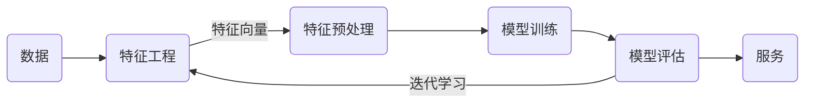
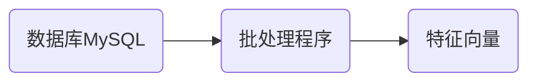

# 人工智能概述

人工智能指的是使计算机系统能够完成通常需要人类智能的任务的技术和方法。具体任务包括学习、推理、问题解决、感知和语言理解等。

## 人工智能应用场景

人工智能技术已经广泛的应用于生产及生活的各个领域

1. 大语言模型：DeepSeek
   * 自然语言理解：信息抽取、语义分析
   * 文本生成：内容创作、客服、教育辅导
   * 轮对话与问答：在线客服、智能助理
   * 代码理解与编写
3. 自动驾驶：
   * 环境感知**：识别车道、行人、交通标志。  **
   * 路径规划：实时导航与避障决策。  
   * 控制优化：车辆控制，如：[百度Apollo自动驾驶平台](https://www.apollo.auto/apollo-self-driving)
4. 推荐系统：
   * 电商推荐：根据用户行为推荐商品（如亚马逊、淘宝）。  
   * 内容推荐：视频/音乐/新闻推送（如Netflix、抖音）。  
   * 广告定向投放：精准匹配用户兴趣。  
5. 机器人控制
   * 自主导航：送餐机器人、仓储机器人（如：Amazon Robotics）。  
   * 物体抓取：工业机械臂精准操作。  
   * 人机协作：服务机器人（如送餐、导览）

## 人工智能发展历程

1956年8月，在美国达特茅斯学院举办了“人工智能研究夏季项目”的会议，提出了人工智能（AI）这一概念，此次会议被广泛认为是人工智能领域的起点。自1956年以来，人工智能技术发展虽经历了一些挑战，但仍取得了显著的进展。


### 图灵测试（Turing Test）


由英国计算机科学家图灵提出的一种测试方法，用于判断机器是否具有智能。如果一台机器能够通过自然语言与人类进行对话，使对话的另一方无法辨别出其是机器还是人类，那么这台机器就被认为具有智能。

> [!warning]
>
> 当前的人工智能技术，虽然已经获得的重大的进步和广泛的应用，但是距离真正的人工智能还相去甚远。

## 人工智能的主要分支

1. 计算机视觉（Computer Vision）
   * 图像分类：识别图片中的物体类别（如猫、狗、车辆）。  
   * 目标检测：定位并识别图像中的多个物体（如YOLO、Faster R-CNN）。  
   * 人脸识别：身份验证、安防监控（如Face ID）。  
   * 图像生成：生成逼真图像（如GAN、DALL·E）。  
   * 视频分析：行为识别、视频内容审核。  
   * 医学影像诊断：CT/MRI图像分析（如肺癌检测）。
2. 自然语言处理（Natural Language Processing, NLP）
   * 机器翻译：跨语言实时翻译（如Google Translate）。  
   * 文本生成：自动撰写文章、代码（如GPT系列）。  
   * 情感分析：分析用户评论的正负面情绪。  
   * 问答系统：智能客服（如ChatGPT）、知识库查询。  
   * 聊天机器人：人机对话交互（如Siri、小冰）。  
3. 语音识别与合成
   * 语音转文字：语音助手（如Alexa、小爱同学）、会议记录。  
   * 文字转语音（TTS）：有声书、语音导航。  
   * 声纹识别：身份认证、个性化服务。  
4. 推荐系统
   * 电商推荐：根据用户行为推荐商品（如亚马逊、淘宝）。  
   * 内容推荐：视频/音乐/新闻推送（如Netflix、抖音）。  
   * 广告定向投放：精准匹配用户兴趣。  
5. 机器人
   * 自动驾驶：车道、行人识别，车辆控制。
   * 人机协作：服务机器人（如送餐、导览）。
   * 自主导航：仓储机器人路径规划（如Amazon Robotics）。
   * 物体抓取：工业机械臂精准操作。  
6. 专家系统：**把人类的知识转化为模型。**
   * 医疗健康：医学影像诊断、个性化治疗或药物研发。
   * 金融科技：股票预测、信用评分、量化交易。
   * 艺术创意：AI绘画、音乐创作、视频生成。
   * 工业制造：缺陷检测、设备故障预警与寿命预测、供应链优化。
   * 气候与环境：气象预测、生态监测。
   * 游戏与强化学习：游戏AI设计、虚拟角色训练、自动化测试。

## 人工智能、机器学习和深度学习


人工智能、机器学习和深度学习的关系：

- 机器学习是人工智能的一个实现途径。
- 深度学习是机器学习的一个方法发展而来。

### 什么是机器学习

机器学习是通过数据和经验自动改进系统性能的技术，其目标是让计算机能够从数据中自动学习并改进性能，而无需明确的指令编程。

> [!note]
>
> 如何将垃圾邮件进行分类？


传统的计算机解决问题思路：编写一个规则，定义“垃圾邮件”，让计算机执行。

人为定义规则存在的问题：

1. 定义规则是一个很困的的过程。
2. 规则之间可能会产生冲突。
3. 规则会不断变化。

机器学习解决问题的思路：收集一定量的数据，分别标注数据为正常邮件和垃圾邮件，让计算机根据标注数据学习出垃圾邮件的规则。

机器学习算法的优点：

1. 解决了人为定义规则的难题。
2. 规则的变化可以通过标注更多的数据来体现。

机器学习算法的缺点：

1. 依赖大量标记数据。
2. 计算资源需求大。

机器学习本质是从数据中自动分析获得模型，并利用模型对未知数据进行预测。


## 人工智能三要素


* 算法：定义了机器如何处理信息、学习模式、进行推理和决策。
* 数据：可以理解为人工智能的“燃料”，是算法训练、测试和验证的基础。
* 算力：可以支持复杂的算法运算和大规模数据处理。
  * CPU主要适合IO密集型的任务
  * GPU主要适合计算密集型任务

[CPU和GPU的区别](http://www.sohu.com/a/201309334_468740)

## 机器学习工作流程



机器学习工作流程总结

1. 获取数据：包括样本和标签。

2. 数据基本处理：处理原始数据中的异常值，如：样本或标签缺失。

3. 特征工程：把原始数据提炼为机器可以处理的数据。

4. 机器学习（模型训练）：使用特征向量和标签训练模型。

5. 模型评估
   * 结果达到要求，上线服务没有达到要求，重新上面步骤


### 数据

[鸢尾花数据集](https://www.kaggle.com/datasets/uciml/iris)由Fisher收集整理，并发表在1936年的经典论文[《多重测量在分类学问题中的应用》](https://onlinelibrary.wiley.com/doi/epdf/10.1111/j.1469-1809.1936.tb02137.x)中。


论文收集了三种鸢尾花，每个品种50个样本，希望找到一个判别式可以分类三种鸢尾花。

数据集包含：样本（花朵）和样本标签（花朵的类别）。

### 特征工程

特征是数据的不同属性或测量值，可以反映数据集的某些现象。特征工程是指从原始数据中提取、转换和选择特征，以便于更好的反映数据集中的现象。

> [!note]
>
> [大模型靠啥理解文字？通俗解释：词嵌入embedding]( https://www.bilibili.com/video/BV1bfoQYCEHC/?share_source=copy_web&vd_source=aa661569ff3138d0b604d53a96184bf2)


如果想用一个判别式来对鸢尾花数据集进行分类，首先应该把数据集数字化。对于鸢尾花数据集，分别测量了两种特征花瓣（petal）和萼片（sepal）的数据。

```
Iris plants dataset
--------------------
**Data Set Characteristics:**
:Number of Instances: 150 (50 in each of three classes)
:Number of Attributes: 4 numeric, predictive attributes and the class
:Attribute Information:
    - sepal length in cm
    - sepal width in cm
    - petal length in cm
    - petal width in cm
    - class:
            - Iris-Setosa
            - Iris-Versicolour
            - Iris-Virginica
```

数据集一般可以看做为一个表格结构：

- 一行数据我们称为一个样本。
- 一列数据我们称为一个特征，是样本数据的一种属性。
- 每一行数据都有一个类别标签。

| sepal length (cm) | sepal width (cm) | petal length (cm) | petal width (cm) | class       | label |
| ----------------- | ---------------- | ----------------- | ---------------- | ----------- | ----- |
| 5.1               | 3.5              | 1.4               | 0.2              | Setosa      | 0     |
| 7. 0              | 3.2              | 4.7               | 1.4              | Versicolour | 1     |
| 6.3               | 3.3              | 6.0               | 2.5              | Virginica   | 2     |

数学上可以将数据集的全部特征看做一个矩阵，记为 $X$ 称作特征矩阵。

第 $i$ 个样本的全部特征表示为 $X^{(i)}$，第  $i$ 个样本的第 $j$  个特征表示为 $X^{(i)}_j$。$X$ 的行数表示样本的数量，$X$​ 的列数表示特征的数量。

最后一列label是类别的数字化表示，可以作为判别式的计算结果。通常使用 $y$ 表示，第 $i$ 个样本的标签表示为 $y^{(i)}$。

特征工程包含内容：

- 特征提取：从任意数据（如：文本或图像）抽象出数字特征的过程，这个过程通常是指定规则得到的。
- 特征转换：将原始特征通过某种转换或映射，生成新的特征。
- 特征降维：将高维数据投影到低维空间，以减少特征的数量，同时尽量保留数据的关键信息。

互联网应用特征提取的流程



特征是从原始数据中采集的部分信息，一定存在信息的损失。

> [!warning]
>
> 数据只有转化为特征才能进行学习，无法量化的数据，就无法**优化**。
>
> 数据和特征决定了机器学习的上限，而模型和算法只是逼近这个上限而已。——吴恩达

### 数据预处理

对数据进行缺失值、异常值的处理。

### 训练模型

机器学习模型训练是一个从数据中学习并构建模型以进行预测或决策的过程。

将鸢尾花的特征绘制在二维平面上


由样本数据特征组成的空间称为特征空间（Feature Space），特征空间可以 $n$​ 维空间。

对于鸢尾花数据集，就是找到一个可以区分不同类别鸢尾花的判别式，对于任意的特征向量 $x$ 可以计算出 $y \in[0, 1, 2]$
$$
y = f(x)
$$
这个函数就是要训练的模型。

寻找这个函数的方法：

1. 通过数学证明。
2. 通过数据训练，计算出 $f$​ 的参数，如：极大似然估计就是一种方法。

### 模型评估

评价模型，在未知数据上的性能。模型评估的指标：

1. 分类模型评：正确率（Accuracy）、准确率（Precision）、召回率（Recall）、F1-score、AUC指标和ROC曲线等。
1. 回归模型评估：均方根误差、相对平方误差、平均绝对误差、相对绝对误差等。
1. 过拟合、欠拟合等。

模型评估是指导模型优化的重要手段。

> [!attention]
>
> 在后面的章节中不会再明确的区分数据和特征的区别，提到数据也指数据的特征。有时也称样本。

## 机器学习的任务分类


### 监督学习

利用带标签的数据来训练模型，以便预测新的、未见过的数据。这类方法非常适合有明确输入和输出关系的问题。

* 分类任务：预测数据所属的类别。

  * 二分类任务。如：垃圾邮件分类、肿瘤良性或恶性判断。

  * 多分类任务。如：[手写数字识别](https://docs.ultralytics.com/zh/datasets/classify/mnist/)、鸢尾花数据分类。

* 回归任务：预测连续数值。如：房价预测。
  * 回归任务可以简化为分类任务。


### 无监督学习

不依赖于带标签的数据。目标是从数据中发现潜在的模式、结构或关系，而无需事先知道数据的类别或目标值。

* 聚类：是将数据点分成若干个群组（簇），使得同一簇中的数据点彼此相似，而不同簇中的数据点差异较大。例如：电商网站对用户进行标记。
* 特征降维：减少数据的维度，同时保留尽可能多的有用信息。特征降维能够降低数据的复杂性，提升模型的性能和计算效率。

> [!attention]
>
> 监督学习更符合人类的认知过程，现实应用中，绝大多数任务都是监督学习。

### 半监督学习

利用一部分标注数据和大量未标注数据进行训练，以提高模型的泛化能力。

* 弱标签：标签不一定正确。
* 伪标签：标签是通过聚类获得。
* 一部分有标签一部分无标签。

### 强化学习

通过与环境的交互学习最佳策略，以最大化累积的奖励。增强学习非常适合自动驾驶和机器人类任务。


## 机器学习的本质

机器学习与传统算法的区别在于，机器学习算法给出的答案是不确定的，具有一定统计意义的结果。

> [!note]
>
> 机器学习的结果真的可靠么？它在多大程度上能反应真实结果。

2001年，Michele Banko的论文[Scaling to Very Very Large Corpora for Natural Language Disambiguation](https://aclanthology.org/P01-1005.pdf)


不同类型的算法随着数据量的增加，性能都得到显著的提升，绝大多数算法最终的结果趋同。

> [!warning]
>
> 机器学习的当前发展阶段是以大数据驱动的。
