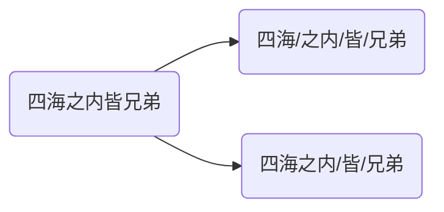

# 文本预处理

文本语料在输送给模型前，一般需要一系列的预处理工作，才能符合模型输入的要求，如：将文本转化成模型需要的张量，规范张量的尺寸等，而且科学的文本预处理环节还将有效指导模型超参数的选择，提升模型的评估指标。


> [!warning]
>
> 在实际生产应用中，最常使用的两种语言是中文和英文。

## 文本处理的基本方法

### 分词

**分词**就是将连续的字序列按照一定的规范重新组合成词序列的过程。

* 中文词汇没有形式上的分界符，分词就是找到词汇的分界符。



* 英文则侧重处理形态变化和特殊符号，如：running$\to$run，unhappy$\to$un/happy


分词的作用：词作为语言语义理解的最小单元，是人类理解文本语言的基础。因此也是解决NLP领域，高阶任务（如机器翻译、文本生成）的基础环节。

Python中常用的分词工具jieba，安装`pip install jieba`

* 支持多种分词模式：精确模式、全模式和搜索引擎模式。
* 支持中文繁体分词。
* 支持用户自定义词典。

jiaba分词的使用。

```python
import jieba

content = '四海之内皆兄弟'

results = jieba.cut(content, cut_all=False) # 将返回一个生成器对象
print(results) 
```

`cut_all=False`精确模式：试图将句子最精确地切开，适合文本分析。默认`cut_all=False`。

```python
results = jieba.lcut(content, cut_all=False) # 将返回一个列表
print(results) 
```

`cut_all=True`全模式：把句子中，所有可能词语都扫描出来，速度快，但不能消除歧义。

```python
results = jieba.lcut(content, cut_all=True)
print(results)
```

搜索引擎模式：在精确模式的基础上，对长词再次切分，提高召回率，适合用于搜索引擎分词。

```python
results = jieba.lcut_for_search(content)
print(results)
```

中文繁体分词。

```python
content = "煩惱即是菩提，我暫且不提"
results = jieba.lcut(content)
print(results)
```

自定义词典：可以定义专业名称，提升整体的识别准确率。

```
云计算 5 n
李小福 2 nr
easy_install 3 eng
好用 300
韩玉赏鉴 3 nz
八一双鹿 3 nz
```

每一行分三部分，词语、词频（可省略）、[词性](/z-others/05-nlp.md)（可省略），用空格隔开，顺序不可颠倒。

```python
# 未加入自定义词典
print(jieba.lcut("八一双鹿更名为八一南昌篮球队！"))

# 加入自定义词典
jieba.load_userdict("./userdict.txt")
print(jieba.lcut("八一双鹿更名为八一南昌篮球队！"))
```

### 命名实体识别

**命名实体**：通常我们将人名、地名、机构名等专有名词统称命名实体。如：周杰伦、黑山县、24辊方钢矫直机。命名实体识别（Named Entity Recognition），简称NER，就是识别出一段文本中可能存在的命名实体。

```
鲁迅, 浙江绍兴人, 五四新文化运动的重要参与者, 代表作朝花夕拾.
鲁迅(人名) / 浙江绍兴(地名)人 / 五四新文化运动(专有名词) / 重要参与者 / 代表作 / 朝花夕拾(专有名词)
```

同词汇一样，命名实体也是人类理解文本语言的基础，也是解决NLP领域，高阶任务的基础环节。

### 词性标注

**词性**：语言中对词的一种分类方法，以语法特征为主要依据，兼顾词汇意义对词进行划分的结果，常见的词性有14种，如: 名词、动词、形容词等。**词性标注**（Part-Of-Speech tagging），简称POS，就是标注出一段文本中每个词汇的词性。

使用jieba进行中文词性标注

```python
import jieba.posseg as pseg
pseg.lcut("我爱北京天安门")
```

## 文本张量表示方法

将一段文本使用张量进行表示

* 词汇为表示成向量，称作词向量，再由各个词向量，按顺序组成矩阵表示文本。
* 将句子表示成向量，称为句向量。

<div style="width: 800px; height: 450px; margin: 0 auto;">  <iframe     style="width: 100%; height: 100%; left: 0; top: 0;"     src="//player.bilibili.com/player.html?isOutside=true&aid=114237791802919&bvid=BV1bfoQYCEHC&cid=29106113058&p=1&autoplay=0"     scrolling="no"     border="0"    frameborder="no"     framespacing="0"     allowfullscreen="true">  </iframe></div>

将文本表示成张量（矩阵）形式，能够使语言文本，作为计算机程序的输入，从而进行解析工作。

文本张量表示的方法：one-hot编码、Word2vec、Word Embedding。

### one-hot编码

又称独热编码，将每个词表示成具有n个元素的向量，这个词向量中只有一个元素是1，其他元素都是0，不同词汇元素为0的位置不同，其中n的大小是整个语料中不同词汇的总数。

使用TorchText，TorchText是PyTorch生态中专注于自然语言处理（NLP）的库，提供文本数据预处理工具（如分词、词汇表构建、批处理等），简化NLP模型的开发流程。安装`pip install torchtext`

使用`torchtext`实现one-hot

```python
from torchtext.vocab import vocab
from collections import Counter

vocab_set = ["唐三藏", "孙悟空", "猪八戒", "沙和尚", "白龙马"]

counter = Counter(vocab_set)
vocab_obj = vocab(counter, specials=[])
print(vocab_obj['唐三藏'])
```

* [`collections.Counter`](https://docs.python.org/zh-cn/3.13/library/collections.html#collections.Counter)是一个高效的工具，用于统计可哈希对象的频率。
* `torchtext.vocab`中的[`vocab`](https://docs.pytorch.org/text/stable/vocab.html#id1)通过`Counter`和`OrderedDict`手动构建词汇表，返回`Vocab`。对大规模语料，不建议手动构造`Vocab`

`Vocab`对象默认数据不是one-hot编码，生成one-hot编码

```python
import torch

for token in vocab_set:
    token_idx = vocab_obj[token]
    one_hot = torch.zeros(len(vocab_set))
    one_hot[token_idx] = 1
    print(token, "的one-hot编码为:", one_hot.tolist())
```

保存数据模型

```python
torch.save(vocab_obj, "./pytorch_vocab.pt")
```

加载和使用模型

```python
loaded_vocab = torch.load("./pytorch_vocab.pt")
print(type(loaded_vocab))

token = "唐三藏"
idx = loaded_vocab[token]
one_hot = torch.zeros(len(vocab_set))
one_hot[idx] = 1
print(token, "的one-hot编码为:", one_hot.tolist())
```

one-hot编码的特点：

* 优势：操作简单，容易理解。
* 劣势：完全割裂了词与词之间的联系，而且在大语料集下，向量极度稀疏。

### word2vec

word2vec是一种流行的将词汇表示成向量的无监督训练方法，该过程将构建神经网络模型，将网络参数作为词汇的向量表示，它包含CBOW和Skip-Gram两种训练模式。


上面分词结果的One-Hot编码为：

* 四海$\to[1, 0, 0, 0]$
* 之内$\to[0, 1, 0, 0]$
* 皆$\to[0, 0, 1, 0]$
* 兄弟$\to[0, 0, 0, 1]$

#### CBOW模式

给定一段用于训练的文本语料，再选定某段长度（窗口）作为研究对象，使用上下文词汇预测目标词汇。

使用矩阵$W_{4\times3}^{(1)}$与One-Hot相乘，其中4表示词表的大小，3表示词向量的维度。
$$
x_{1\times4}\cdot W_{4\times3}^{(1)} = h_{1\times 3}
$$
根据窗口的大小，对上下文词向量取平均，得到隐藏层向量
$$
h_{1\times 3}^{\text{之内}}=\frac{h_{1\times 3}^{\text{四海}}+h_{1\times 3}^{\text{皆}}}{2}
$$
隐藏层向量$h$与输出矩阵$W_{3\times4}^{(2)}$相乘，得到词表得分
$$
h_{1\times 3}\cdot W_{3\times4}^{(2)}=s_{1\times 5}
$$
将得分转换为概率分布，计算目标词的概率
$$
P(\text{之内})=\frac{e^{s_2}}{\sum_{i=1}^{4}e^{s_i}}
$$
根据“之内”$\to[0, 1, 0, 0]$，计算交叉熵损失
$$
L=-log(P(\text{之内}))
$$
通过反向传播算法不断跟新$W_{4\times3}^{(1)}$和$W_{3\times4}^{(2)}$矩阵，训练过程与神经网络训练方式相同。训练完成后嵌入矩阵$W_{4\times3}^{(1)}$，即为全部的词向量。

#### Skip-Gram模式

给定一段用于训练的文本语料，再选定某段长度（窗口）作为研究对象，使用目标词汇预测上下文词汇。
