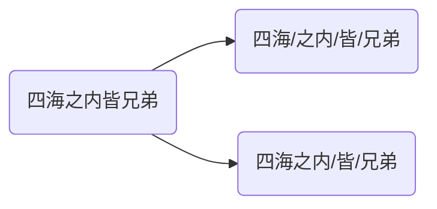

# 文本预处理

文本语料在输送给模型前，一般需要一系列的预处理工作，才能符合模型输入的要求，如：将文本转化成模型需要的张量，规范张量的尺寸等，而且科学的文本预处理环节还将有效指导模型超参数的选择，提升模型的评估指标。


> [!warning]
>
> 在实际生产应用中，最常使用的两种语言是中文和英文。

## 文本处理的基本方法

### 分词

**分词**就是将连续的字序列按照一定的规范重新组合成词序列的过程。

* 中文词汇没有形式上的分界符，分词就是找到词汇的分界符。



* 英文则侧重处理形态变化和特殊符号，如：running$\to$run，unhappy$\to$un/happy


分词的作用：词作为语言语义理解的最小单元，是人类理解文本语言的基础。因此也是解决NLP领域，高阶任务（如机器翻译、文本生成）的基础环节。

Python中常用的分词工具jieba，安装`pip install jieba`

* 支持多种分词模式：精确模式、全模式和搜索引擎模式。
* 支持中文繁体分词。
* 支持用户自定义词典。

jiaba分词的使用。

```python
import jieba

content = '四海之内皆兄弟'

results = jieba.cut(content, cut_all=False) # 将返回一个生成器对象
print(results) 
```

`cut_all=False`精确模式：试图将句子最精确地切开，适合文本分析。默认`cut_all=False`。

```python
results = jieba.lcut(content, cut_all=False) # 将返回一个列表
print(results) 
```

`cut_all=True`全模式：把句子中，所有可能词语都扫描出来，速度快，但不能消除歧义。

```python
results = jieba.lcut(content, cut_all=True)
print(results)
```

搜索引擎模式：在精确模式的基础上，对长词再次切分，提高召回率，适合用于搜索引擎分词。

```python
results = jieba.lcut_for_search(content)
print(results)
```

中文繁体分词。

```python
content = "煩惱即是菩提，我暫且不提"
results = jieba.lcut(content)
print(results)
```

自定义词典：可以定义专业名称，提升整体的识别准确率。

```
云计算 5 n
李小福 2 nr
easy_install 3 eng
好用 300
韩玉赏鉴 3 nz
八一双鹿 3 nz
```

每一行分三部分，词语、词频（可省略）、[词性](/z-others/05-nlp.md)（可省略），用空格隔开，顺序不可颠倒。

```python
# 未加入自定义词典
print(jieba.lcut("八一双鹿更名为八一南昌篮球队！"))

# 加入自定义词典
jieba.load_userdict("./userdict.txt")
print(jieba.lcut("八一双鹿更名为八一南昌篮球队！"))
```

### 命名实体识别

**命名实体**：通常我们将人名、地名、机构名等专有名词统称命名实体。如：周杰伦、黑山县、24辊方钢矫直机。命名实体识别（Named Entity Recognition），简称NER，就是识别出一段文本中可能存在的命名实体。

```
鲁迅, 浙江绍兴人, 五四新文化运动的重要参与者, 代表作朝花夕拾.
鲁迅(人名) / 浙江绍兴(地名)人 / 五四新文化运动(专有名词) / 重要参与者 / 代表作 / 朝花夕拾(专有名词)
```

同词汇一样，命名实体也是人类理解文本语言的基础，也是解决NLP领域，高阶任务的基础环节。

### 词性标注

**词性**：语言中对词的一种分类方法，以语法特征为主要依据，兼顾词汇意义对词进行划分的结果，常见的词性有14种，如: 名词、动词、形容词等。**词性标注**（Part-Of-Speech tagging），简称POS，就是标注出一段文本中每个词汇的词性。

使用jieba进行中文词性标注

```python
import jieba.posseg as pseg
pseg.lcut("我爱北京天安门")
```

