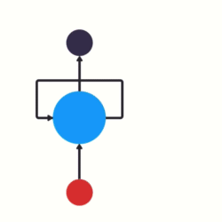
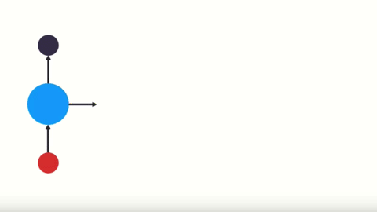
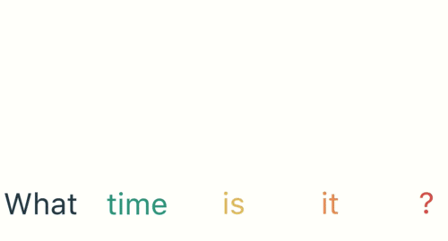
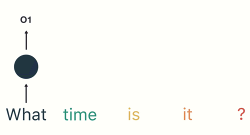
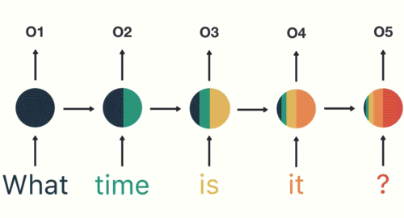
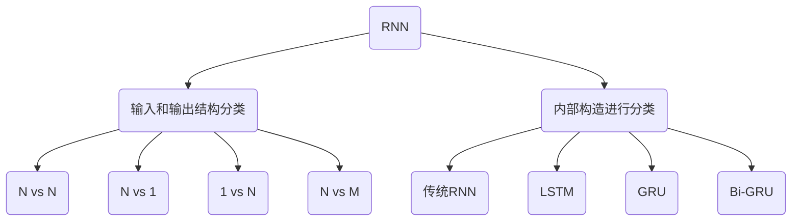
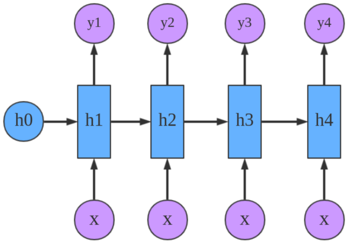
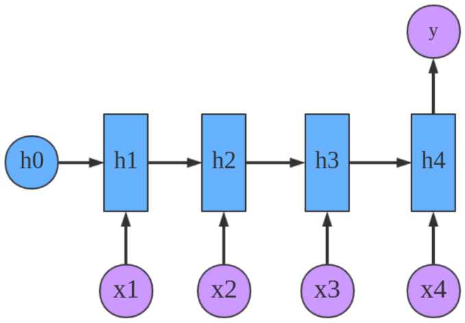
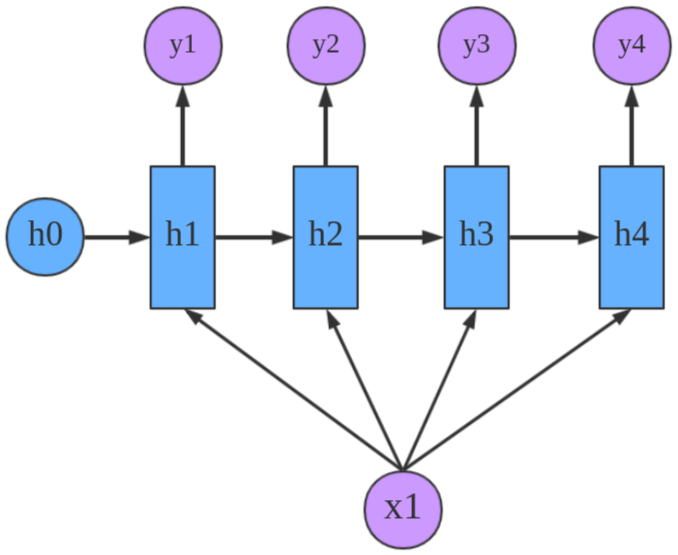
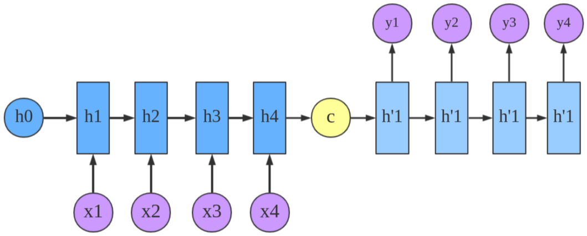

# 循环神经网络（RNN）

## 认识RNN模型

RNN（Recurrent Neural Network），中文称作循环神经网络，它一般以序列数据为输入，通过网络内部的结构设计有效捕捉序列之间的关系特征，一般也是以序列形式进行输出。

RNN单层网络结构

以时间步对RNN进行展开后的单层网络结构

RNN的循环机制使模型隐层上一时间步产生的结果，能够作为当下时间步输入的一部分（当下时间步的输入除了正常的输入外还包括上一步的隐层输出）对当下时间步的输出产生影响。

### RNN模型的作用

因为RNN结构能够很好利用序列之间的关系，因此针对自然界具有连续性的输入序列,，如：人类的语言，语音等进行很好的处理，广泛应用于NLP领域的各项任务，如文本分类、情感分析、意图识别、机器翻译等。

使用RNN进行文本的意图识别，首先需要对文本序列进行基本的分词，每次输入RNN只有一个词，如："What time is it ?"

首先将单词"What"输送给RNN，它将产生一个输出01

继续将单词"time"输送给RNN，但此时RNN不仅仅利用"time"来产生输出02，还会使用来自上一层隐层输出01作为输入信息。

重复这样的步骤，直到处理完所有的单词。

最后，将最终的隐层输出05进行处理来解析用户意图。

### RNN模型的分类

1. N vs N：RNN最基础的结构形式，输入和输出序列是等长的。由于这个限制的存在，使其适用范围比较小，可用于生成等长度的合辙诗句。

2. N vs 1：输入是一个序列，输出是一个单独的值。使用sigmoid或者softmax进行处理，这种结构经常被应用在文本分类问题上。

3. 1 vs N：输入作用于每次的输出之上，这种结构可用于将图片生成文字任务等。

4. N vs M：这是一种不限输入输出长度的RNN结构，它由编码器和解码器两部分组成。两者的内部结构都是某类RNN，它也被称为seq2seq架构。输入数据首先通过编码器，最终输出一个隐含变量c，之后最常用的做法是使用这个隐含变量c作用在解码器进行解码的每一步上，以保证输入信息被有效利用。

seq2seq架构最早被提出应用于机器翻译，因为其输入输出不受限制，如今也是应用最广的RNN模型结构。在机器翻译、阅读理解、文本摘要等众多领域都进行了非常多的应用实践。

## 传统RNN模型
