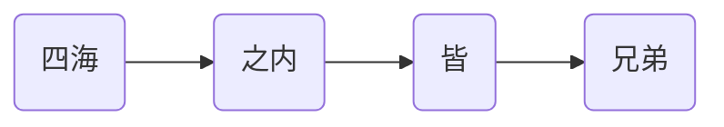
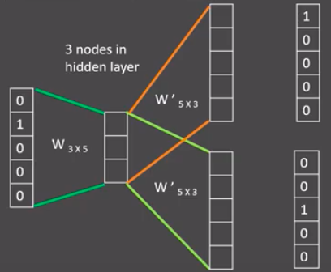

# 文本张量表示方法

将一段文本使用张量进行表示

* 词汇为表示成向量，称作词向量，再由各个词向量，按顺序组成矩阵表示文本。
* 将句子表示成向量，称为句向量。

<div style="width: 800px; height: 450px; margin: 0 auto;">  <iframe     style="width: 100%; height: 100%; left: 0; top: 0;"     src="//player.bilibili.com/player.html?isOutside=true&aid=114237791802919&bvid=BV1bfoQYCEHC&cid=29106113058&p=1&autoplay=0"     scrolling="no"     border="0"    frameborder="no"     framespacing="0"     allowfullscreen="true">  </iframe></div>

将文本表示成张量（矩阵）形式，能够使语言文本，作为计算机程序的输入，从而进行解析工作。

文本张量表示的方法：one-hot编码、Word2vec、Word Embedding。

## one-hot编码

又称独热编码，将每个词表示成具有n个元素的向量，这个词向量中只有一个元素是1，其他元素都是0，不同词汇元素为0的位置不同，其中n的大小是整个语料中不同词汇的总数。

使用TorchText，TorchText是PyTorch生态中专注于自然语言处理（NLP）的库，提供文本数据预处理工具（如分词、词汇表构建、批处理等），简化NLP模型的开发流程。安装`pip install torchtext`

使用`torchtext`实现one-hot

```python
from torchtext.vocab import vocab
from collections import Counter

vocab_set = ["唐三藏", "孙悟空", "猪八戒", "沙和尚", "白龙马"]

counter = Counter(vocab_set)
vocab_obj = vocab(counter, specials=[])
print(vocab_obj['唐三藏'])
```

* [`collections.Counter`](https://docs.python.org/zh-cn/3.13/library/collections.html#collections.Counter)是一个高效的工具，用于统计可哈希对象的频率。
* `torchtext.vocab`中的[`vocab`](https://docs.pytorch.org/text/stable/vocab.html#id1)通过`Counter`和`OrderedDict`手动构建词汇表，返回`Vocab`。对大规模语料，不建议手动构造`Vocab`

`Vocab`对象默认数据不是one-hot编码，生成one-hot编码

```python
import torch

for token in vocab_set:
    token_idx = vocab_obj[token]
    one_hot = torch.zeros(len(vocab_set))
    one_hot[token_idx] = 1
    print(token, "的one-hot编码为:", one_hot.tolist())
```

保存数据模型

```python
torch.save(vocab_obj, "./pytorch_vocab.pt")
```

加载和使用模型

```python
loaded_vocab = torch.load("./pytorch_vocab.pt")
print(type(loaded_vocab))

token = "唐三藏"
idx = loaded_vocab[token]
one_hot = torch.zeros(len(vocab_set))
one_hot[idx] = 1
print(token, "的one-hot编码为:", one_hot.tolist())
```

one-hot编码的特点：

* 优势：操作简单，容易理解。
* 劣势：完全割裂了词与词之间的联系，而且在大语料集下，向量极度稀疏。

## word2vec

word2vec是一种流行的将词汇表示成向量的无监督训练方法，该过程将构建神经网络模型，将网络参数作为词汇的向量表示，它包含CBOW和Skip-Gram两种训练模式。



上面分词结果的One-Hot编码为：

* 四海$\to[1, 0, 0, 0]$
* 之内$\to[0, 1, 0, 0]$
* 皆$\to[0, 0, 1, 0]$
* 兄弟$\to[0, 0, 0, 1]$

### CBOW模式

给定一段用于训练的文本语料，再选定某段长度（窗口）作为研究对象，使用上下文词汇预测目标词汇。

使用矩阵$W_{4\times3}^{(1)}$与One-Hot相乘，其中4表示词表的大小，3表示词向量的维度。
$$
x_{1\times4}\cdot W_{4\times3}^{(1)} = h_{1\times 3}
$$
根据窗口的大小，对上下文词向量取平均，得到隐藏层向量
$$
h_{1\times 3}^{\text{之内}}=\frac{h_{1\times 3}^{\text{四海}}+h_{1\times 3}^{\text{皆}}}{2}
$$
隐藏层向量$h$与输出矩阵$W_{3\times4}^{(2)}$相乘，得到词表得分
$$
h_{1\times 3}\cdot W_{3\times4}^{(2)}=s_{1\times 5}
$$
使用softmax将得分转换为概率分布，计算目标词的概率
$$
P(\text{之内})=\frac{e^{s_2}}{\sum_{i=1}^{4}e^{s_i}}
$$
根据“之内”$\to[0, 1, 0, 0]$，计算交叉熵损失
$$
L=-log(P(\text{之内}))
$$
通过反向传播算法不断跟新$W_{4\times3}^{(1)}$和$W_{3\times4}^{(2)}$矩阵，训练过程与神经网络训练方式相同。训练完成后嵌入矩阵$W_{4\times3}^{(1)}$，即为全部的词向量。

### Skip-Gram模式

给定一段用于训练的文本语料，再选定某段长度（窗口）作为研究对象，使用目标词汇预测上下文词汇。

使用矩阵$W_{4\times3}^{(1)}$将词汇转换为词向量，过程与CBOW模式一致。分别使用两个$W_{3\times4}^{(2)}$估计前面的词和后面的词。



使用softmax将得分转换为概率分布，计算前后两个词的概率。分别计算前后两个词的交叉熵损失，通过反向传播算法不断跟新$W_{4\times3}^{(1)}$和2个$W_{3\times4}^{(2)}$矩阵，训练过程与神经网络训练方式相同。训练完成后嵌入矩阵$W_{4\times3}^{(1)}$，即为全部的词向量。

### 词向量的训练

可以使用fasttext工具进行词向量的训练[`fasttext.train_unsupervised`](https://fasttext.cc/docs/en/unsupervised-tutorial.html)可以用来训练词向量，

```python
model = fasttext.train_unsupervised('data/fil9', "cbow", dim=300, epoch=1, lr=0.1, thread=8)
```

*  默认为使用`skipgram`训练模型，可以设置`cbow`。
* `'data/fil9'`训练数据；`dim=300`生成的词向量维度；`thread=8`训练使用的线程数。

`model.get_nearest_neighbors('四海')`可以查找相似的词汇。

## Word Embedding

通过一定的方式将词汇映射到指定维度（一般是更高维度）的空间。广义的word embedding包括所有密集词汇向量的表示方法。在word2vec中CBOW模式与Skip-Gram模式训练出嵌入矩阵$W^{(1)}$就是word embedding。