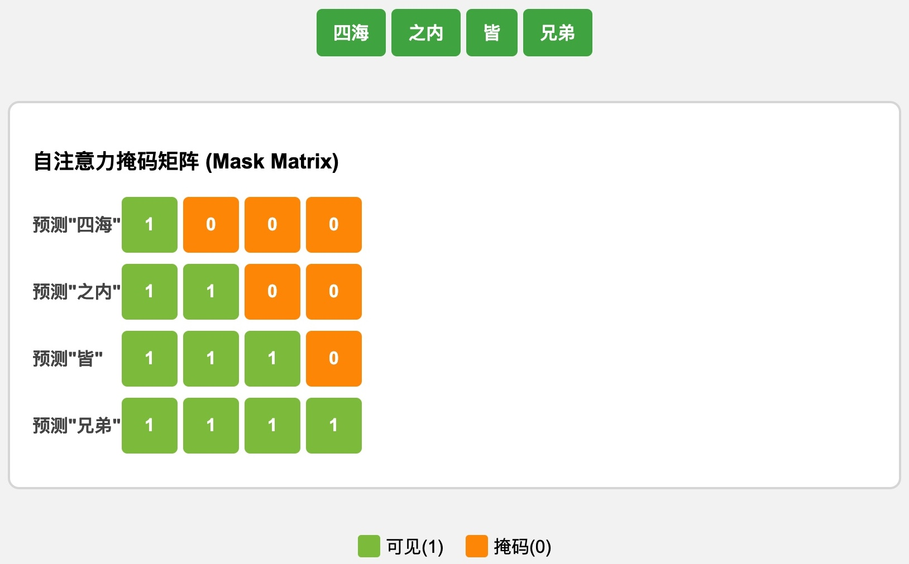
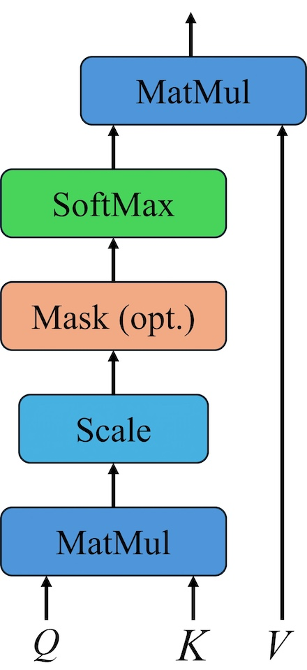

# Transformer

Transformer是一种深度学习架构，2017年由Google Brain团队发表在论文["Attention Is All You Need"](https://arxiv.org/pdf/1706.03762)中。Transformer架构的出现彻底改变了NLP领域的发展。目前的主流大语言模型都是基于Transformer架构。

基于seq2seq架构的transformer模型可以完成NLP领域研究的典型任务，如：机器翻译、文本生成等。同时又可以构建预训练语言模型，用于不同任务的迁移学习。Transformer有两个显著的优势：

* Transformer能够利用分布式GPU进行并行训练，提升模型训练效率。
* 在分析预测更长的文本时，捕捉间隔较长的语义关联效果更好。

## 认识Transformer架构

下面以文本翻译为例来解释Transformer架构


Transformer总体架构包括：

* 输入部分
  * 源文本嵌入层，及其位置编码器
  * 目标文本嵌入层，及其位置编码器
* 输出部分：线性层和softmax层
* 编码器
  * 由N个编码器层堆叠而成
  * 每个编码器层由两个子层连接结构组成
  * 第一个子层包括：一个多头自注意力子层和规范化层以及一个残差连接
  * 第二个子层包括：一个前馈全连接子层和规范化层以及一个残差连接
* 解密器
  * 由N个解码器层堆叠而成
  * 每个解码器层由三个子层连接结构组成
  * 第一个子包括：一个多头**自注意力**子层和规范化层以及一个残差连接
  * 第二个子包括：一个多头注意力子层和规范化层以及一个残差连接
  * 第三个子包括：一个前馈全连接子层和规范化层以及一个残差连接

## 输入部分

无论是源文本嵌入，还是目标文本嵌入，都是为了将文本中词汇的数字表示转变为向量表示，希望在这样的高维空间捕捉词汇间的关系。

使用[`nn.Embedding`](https://docs.pytorch.org/docs/stable/generated/torch.nn.Embedding.html#embedding)转化词向量

```python
import torch
from torch import nn

embedding = nn.Embedding(10, 3)
input = torch.LongTensor([[1, 2, 4, 5],[4, 3, 2, 9]])
embedding(input)
```

* `embedding`空间共包含10个词，每个词是3维向量。
* `input`输入数据，包含两个句子，每个句子有4个词，数字表示词在整个词空间的编号。

```python
embedding = nn.Embedding(10, 3, padding_idx=0)
input = torch.LongTensor([[0, 2, 0, 5]])
embedding(input)
```

* `padding_idx=0`如果单词在词空间的编号等于该值，则向量为0。

对`nn.Embedding`进行封装，创建嵌入类

```python
import math

class Embeddings(nn.Module):
    def __init__(self, d_model, vocab):
        super(Embeddings, self).__init__()
        self.lut = nn.Embedding(vocab, d_model)
        self.d_model = d_model

    def forward(self, x):
        return self.lut(x) * math.sqrt(self.d_model)
    
d_model = 512
vocab = 1000
x = torch.LongTensor([[100,2,421,508],[491,998,1,221]])
emb = Embeddings(d_model, vocab)
embr = emb(x)
print("embr:", embr)
```

* 将词嵌入乘以`math.sqrt(self.d_model)`可以增大词嵌入的幅度，使其与位置编码的尺度大致保持一致，从而确保在两者相加时，它们能够对模型提供均衡的信息。
* 改善注意力机制的稳定性。这种缩放操作是一种数值稳定性和信息平衡的策略。

### 位置编码器

因为在Transformer的编码器结构中，并没有针对词汇位置信息的处理，因此需要在Embedding层后加入位置编码器，将词汇位置不同可能会产生不同语义的信息加入到词嵌入张量中，以弥补位置信息的缺失。

[`torch.unsqueeze`](https://docs.pytorch.org/docs/stable/generated/torch.unsqueeze.html#torch-unsqueeze)返回在指定位置插入一个维度为 1 的新张量。

```python
x = torch.tensor([1, 2, 3, 4])
print(torch.unsqueeze(x, 0))
print(torch.unsqueeze(x, 1))
```

位置编码的计算利用了正弦和余弦函数的周期性，能够让模型轻松学习到相对位置信息。位置编码的实现

```python
class PositionalEncoding(nn.Module):
    def __init__(self, d_model, dropout, max_len=5000):
        super(PositionalEncoding, self).__init__()
        self.dropout = nn.Dropout(p=dropout)

        pe = torch.zeros(max_len, d_model)
        position = torch.arange(0, max_len, dtype=torch.float).unsqueeze(1) 
        div_term = torch.exp(torch.arange(0, d_model, 2, dtype=torch.float) 
                             * -(math.log(10000.0) / d_model))
        pe[:, 0::2] = torch.sin(position * div_term)
        pe[:, 1::2] = torch.cos(position * div_term)
        pe = pe.unsqueeze(0)
        self.register_buffer('pe', pe)

    def forward(self, x):
        x = x + self.pe[:, :x.size(1)]
        return self.dropout(x)

dropout = 0.1
max_len=60

x = embr
pe = PositionalEncoding(d_model, dropout, max_len)
pe_result = pe(x)
print("pe_result:", pe_result)
```

* `pe`是一个`max_len`$\times$`d_model`的矩阵，偶数行呗$\sin$值填充，奇数行被$\cos$值填充。

绘制词向量中特征的分布曲线

```python
import matplotlib.pyplot as plt
import numpy as np

plt.figure(figsize=(15, 5))
pe = PositionalEncoding(20, 0)
y = pe(torch.zeros(1, 100, 20))
plt.plot(np.arange(100), y[0, :, 4:8].data.numpy(), linewidth=2)
plt.legend(["dim %d"%p for p in [4,5,6,7]], fontsize=15)
plt.show()
```

- 每条颜色的曲线代表某一个词汇中的特征在不同位置的含义。
- 保证同一词汇随着所在位置不同，它对应位置嵌入向量会发生变化。
- 正弦波和余弦波的值域范围都是1到-1，这又很好的控制了嵌入数值的大小，有助于梯度的快速计算。

## 编码器部分

编码器部一般是由N个编码器层堆叠而成。

### 掩码张量

掩码张量（Mask Tensor）主要作用是控制模型在计算注意力时对序列中某些位置的“可见性”或“关注度”。它告诉模型哪些部分应该被“看到”并参与注意力计算，哪些部分应该被“忽略”。



使用[`np.triu`](https://numpy.org/doc/stable/reference/generated/numpy.triu.html#numpy.triu)来实现掩码功能

```python
mat = [[1,2,3], [4,5,6], [7,8,9], [10,11,12]]

print(np.triu(mat, k=-1))
print(np.triu(mat, k=0))
print(np.triu(mat, k=1))
```

掩码张量的实现

```python
def subsequent_mask(size):
    attn_shape = (1, size, size)
    subsequent_mask = np.triu(np.ones(attn_shape), k=1).astype('uint8')
    return torch.from_numpy(1 - subsequent_mask)

size = 4
sm = subsequent_mask(size)
print("sm:", sm)
```

### 注意力机制

[注意力机制的根本目标](https://zh.d2l.ai/chapter_attention-mechanisms/attention-cues.html)：想办法构造一个权重分布，使得模型在进行预测或生成某个输出时，有选择地赋予输入序列中某些部分更大的权重，而对其他不那么相关的部分赋予较小的权重。注意力的计算规则
$$
\text{Attention}\left(Q, K, V\right)=
\text{softmax}\left(\frac{QK^T}{\sqrt{d_k} }\right)V
$$
注意力机制在网络中表示为




她把水从水壶倒进杯子里，直到它满了。
她把水从水壶倒进杯子里，直到它空了。
