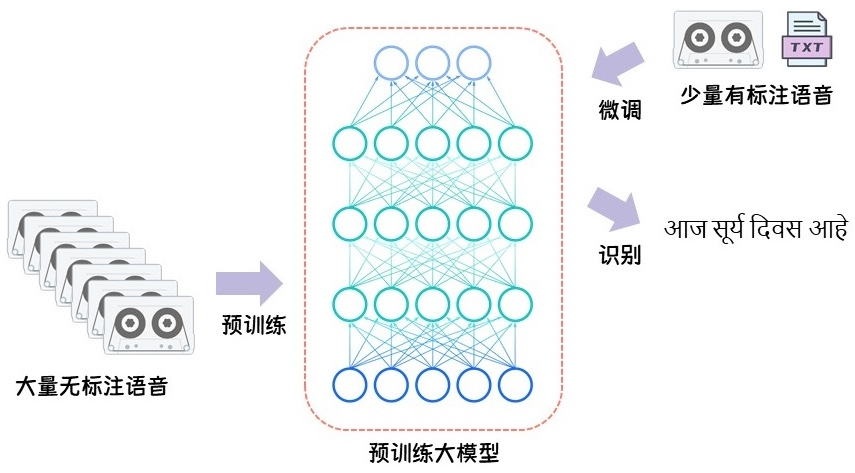
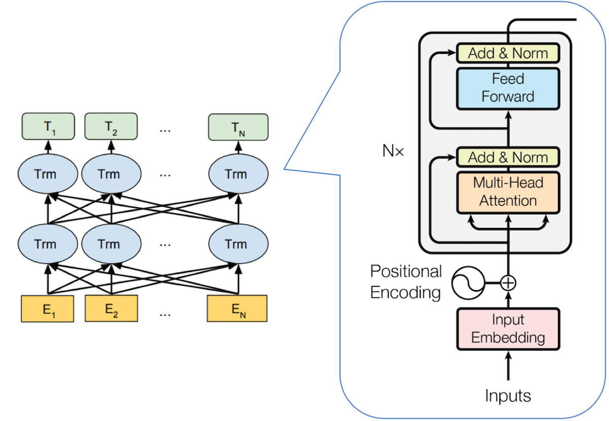
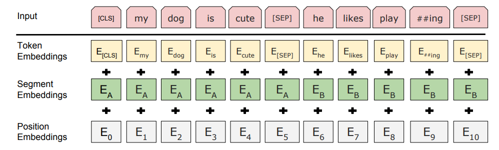
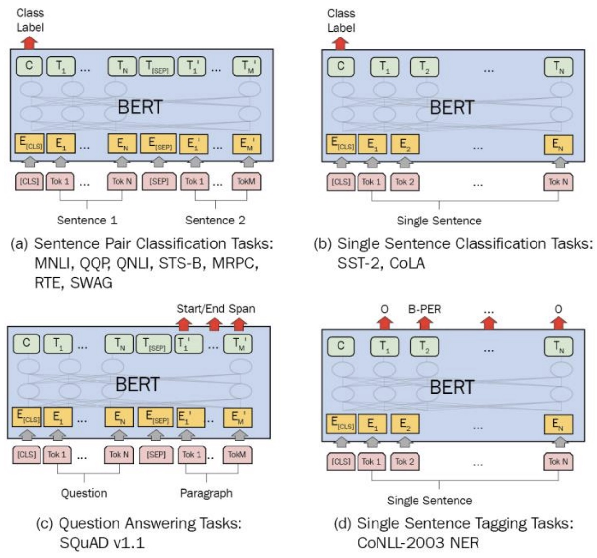

# 预训练模型

预训练模型是一种机器学习模型，它是在大规模数据上进行通用训练后得到的模型，这些模型可以针对特定任务进行进一步调整和优化。

* 无监督预训练：利用未标注的海量数据（如互联网文本、图像），通过自监督任务（如掩码、预测、对比）学习通用特征。
* 监督预训练：在有标注的大规模数据上训练（如 ImageNet 的分类标签），但标注成本较高。

自然语言处理领域的预训练模型：BERT、GPT（Generative Pre-trained Transformer）系列。

## Bert

Bert（Bidirectional Encoder Representation from Transformers）是2018年10月由Google AI研究院提出的一种预训练模型。

相关论文：[Pre-training of Deep Bidirectional Transformers for Language Understanding](https://arxiv.org/pdf/1810.04805)

### 文本输入

- Token Embeddings是词嵌入张量，第一个单词是CLS标志。可以用于之后的分类任务。
- Segment Embeddings是句子分段嵌入张量，是为了服务后续的两个句子为输入的预训练任务。
- Position Embeddings是位置编码张量，此处注意和传统的Transformer不同，是通过学习得出来的。
- 整个Embedding模块的输出张量就是这3个张量的直接加和结果。

### Transformer模块

Bert中只使用了经典Transformer架构中的Encoder部分，并采用了双向Transformer模块。

### 预训练任务

BERT包含两个预训练任务

1. Masked LM 
   1. 在原始训练文本中，随机的抽取15%的token作为参与MASK任务的对象。
   2. 在这些被选中的token中，数据生成器并不是把它们全部变成[MASK]，而是有下列3种情况：
      * 在80%的概率下，用[MASK]标记替换该token，比如my dog is hairy -> my dog is [MASK]
      * 在10%的概率下，用一个随机的单词替换token，比如my dog is hairy -> my dog is apple
      * 在10%的概率下，保持该token不变，比如my dog is hairy -> my dog is hairy

2. Next Sentence Prediction
   1. 所有参与任务训练的语句都被选中作为句子A。
      * 其中50%的B是原始文本中真实跟随A的下一句话。（标记为IsNext，代表正样本）
      * 其中50%的B是原始文本中随机抽取的一句话。（标记为NotNext，代表负样本）

### 模型微调

Bert需要针对不同的下游任务进行模型微调。

### Bert模型特点

1. Bert的优点
   1. 通过预训练，可以是模型适用不同的下游任务。
   2. 并行化处理同时能捕捉长距离的语义和结构依赖。
2. Bert的缺点
   1. BERT模型过于庞大，参数太多。
   2. BERT目前给出的中文模型中，是以字为基本token单位。
   3. 模型的收敛的速度慢，训练周期长。
