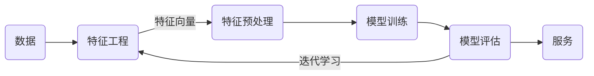

# 人工智能概述

人工智能指的是使计算机系统能够完成通常需要人类智能的任务的技术和方法。具体任务包括学习、推理、问题解决、感知和语言理解等。

## 人工智能发展历程

1956年8月，在美国达特茅斯学院举办了“人工智能研究夏季项目”的会议，提出了人工智能（AI）这一概念，此次会议被广泛认为是人工智能领域的起点。自1956年以来，人工智能技术发展虽经历了一些挑战，但仍取得了显著的进展。


### 图灵测试（Turing Test）

由英国计算机科学家图灵提出的一种测试方法，用于判断机器是否具有智能。如果一台机器能够通过自然语言与人类进行对话，使对话的另一方无法辨别出其是机器还是人类，那么这台机器就被认为具有智能。

> 当前的人工智能技术虽然已经获得的重大的进步和广泛的应用，但是距离真正的人工智能还相去甚远。

## 人工智能应用场景

1. 自然语言处理
   * 机器翻译：利用机器的力量自动将一种自然语言（源语言）的文本翻译成另一种语言（目标语言）。
   * 语音识别：识别语音并将其转换成文本的技术。
   * 语言合成：将文本转换为人类语音的过程来生成自然、流畅的语音。
   * 人机对话：人类与计算机通过自然语言进行交互。
   * 文本挖掘：用于理解、组织和分类结构化或非结构化文本文档。其涵盖的主要任务有句法分析、情绪分析和垃圾信息检测。
2. 计算机视觉
   * 图片分类：将输入的图像分配到一个或多个预定义的类别中。
   * 目标识别：在图像或视频中检测和识别一个或多个目标对象，并标注其所在位置和类别。
   * 目标分割：将图像中的目标区域精确地分割出来，并将每个像素标记为特定类别的一项任务。
   * 图片生成：使用计算机算法生成新的图像内容，涵盖从图像的创建、编辑到风格转换等多种任务。
   * 人脸识别：用于识别或验证图像或视频中的人脸身份。
   * 自动驾驶：不依赖人工驾驶的情况下，自动完成驾驶操作，包括导航、加速、减速、转向和停车等功能。
3. 机器人：研究的是机器人的设计、制造、运作和应用，以及控制它们的计算机系统、传感反馈和信息处理。

## 人工智能、机器学习和深度学习


人工智能、机器学习和深度学习的关系：

- 机器学习是人工智能的一个实现途径。
- 深度学习是机器学习的一个方法发展而来。

### 什么是机器学习

机器学习是通过数据和经验自动改进系统性能的技术，其目标是让计算机能够从数据中自动学习并改进性能，而无需明确的指令编程。

> [!note]
>
> 如何将垃圾邮件进行分类？


传统的计算机解决问题思路：编写一个规则，定义“垃圾邮件”，让计算机执行。

人为定义规则存在的问题：

1. 定义规则是一个很困的的过程。
2. 规则之间可能会产生冲突。
3. 规则会不断变化。

机器学习解决问题的思路：收集一定量的数据，分别标注数据为正常邮件和垃圾邮件，让计算机根据标注数据学习出垃圾邮件的规则。

机器学习算法的优点：

1. 解决了人为定义规则的难题。
2. 规则的变化可以通过标注更多的数据来体现。

机器学习算法的缺点：

1. 依赖大量标记数据。
2. 计算资源需求大。

机器学习本质是从数据中自动分析获得模型，并利用模型对未知数据进行预测。


## 人工智能三要素


* 算法：定义了机器如何处理信息、学习模式、进行推理和决策。
* 数据：可以理解为人工智能的“燃料”，是算法训练、测试和验证的基础。
* 算力：可以支持复杂的算法运算和大规模数据处理。
  * CPU主要适合IO密集型的任务
  * GPU主要适合计算密集型任务

[CPU和GPU的区别](http://www.sohu.com/a/201309334_468740)

## 机器学习工作流程



机器学习工作流程总结

1. 获取数据：包括样本和标签。

2. 数据基本处理：处理原始数据中的异常值，如：样本或标签缺失。

3. 特征工程：把原始数据提炼为机器可以处理的数据。

4. 机器学习（模型训练）：使用特征向量和标签训练模型。

5. 模型评估

   - 结果达到要求，上线服务

   - 没有达到要求，重新上面步骤

### 数据

[鸢尾花数据集](https://www.kaggle.com/datasets/uciml/iris)由Fisher收集整理，并发表在1936年的经典论文[《多重测量在分类学问题中的应用》](https://onlinelibrary.wiley.com/doi/epdf/10.1111/j.1469-1809.1936.tb02137.x)中。


论文收集了三种鸢尾花，每个品种50个样本，希望找到一个判别式可以分类三种鸢尾花。

数据集包含：样本（花朵）和样本标签（花朵的类别）。

### 特征工程

特征是数据的不同属性或测量值，可以反映数据集的某些现象。

特征工程是指从原始数据中提取、转换和选择特征，以便于更好的反映数据集中的现象。

如果想到达一个判别式来对鸢尾花数据集进行分类，首先应该把数据集数字化。对于鸢尾花数据集，分别测量了两种特征花瓣（petal）和萼片（sepal）的数据。

```shell
Iris plants dataset
--------------------
**Data Set Characteristics:**
:Number of Instances: 150 (50 in each of three classes)
:Number of Attributes: 4 numeric, predictive attributes and the class
:Attribute Information:
    - sepal length in cm
    - sepal width in cm
    - petal length in cm
    - petal width in cm
    - class:
            - Iris-Setosa
            - Iris-Versicolour
            - Iris-Virginica
```

数据集一般可以看做为一个表格结构：

- 一行数据我们称为一个样本。
- 一列数据我们称为一个特征，是样本数据的一种属性。
- 每一行数据都有一个类别标签。

| sepal length (cm) | sepal width (cm) | petal length (cm) | petal width (cm) | class       | label |
| ----------------- | ---------------- | ----------------- | ---------------- | ----------- | ----- |
| 5.1               | 3.5              | 1.4               | 0.2              | Setosa      | 0     |
| 7. 0              | 3.2              | 4.7               | 1.4              | Versicolour | 1     |
| 6.3               | 3.3              | 6.0               | 2.5              | Virginica   | 2     |

数学上可以将数据集的全部特征看做一个矩阵，记为 $X$ 称作特征矩阵。

第 $i$ 个样本的全部特征表示为 $X^{(i)}$，第  $i$ 个样本的第 $j$  个特征表示为 $X^{(i)}_j$。$X$ 的行数表示样本的数量，$X$​ 的列数表示特征的数量。

最后一列label是类别的数字化表示，可以作为判别式的计算结果。通常使用 $y$ 表示，第 $i$ 个样本的标签表示为 $y^{(i)}$。

区分不同类别鸢尾花的判别式，表示为：
$$
y^{(i)} = f(X^{(i)})
$$
根据鸢尾花数据的特征绘制散点图


由样本数据特征组成的空间称为特征空间（Feature Space），特征空间可以 $n$​ 维空间。

> [!warning]
>
> 数据只有转化为特征才能进行学习，无法量化的数据，就无法**优化**。

特征工程包含内容

- 特征提取：从任意数据（如：文本或图像）抽象出数字特征的过程，这个过程通常是指定规则得到的。
- 特征转换：将原始特征通过某种转换或映射，生成新的特征。
- 特征降维：将高维数据投影到低维空间，以减少特征的数量，同时尽量保留数据的关键信息。

互联网应用特征提取的流程


### 数据预处理

对数据进行缺失值、去除异常值等处理。

### 机器学习

选择合适的算法对模型进行训练


意义：会直接影响机器学习的效果

> 数据和特征决定了机器学习的上限，而模型和算法只是逼近这个上限而已。


### 模型评估

对训练好的模型进行评估

## 机器学习的算法

根据数据集组成不同，可以把机器学习算法分为：监督学习、无监督学习、半监督学习、强化学习

### 监督学习

输入数据是由输入特征值和目标值所组成。

* 函数的输出可以是一个连续的值（称为回归）
* 输出是有限个离散值（称作分类）

### 无监督学习

输入数据是由输入特征值组成，没有目标值

* 输入数据没有被标记，也没有确定的结果。样本数据类别未知。
* 需要根据样本间的相似性对样本集进行类别划分。

### 半监督学习

训练集同时包含有标记样本数据和未标记样本数据。

### 强化学习

自动进行决策，并且可以做连续决策，通过惩罚函数得到更好的训练结果。

## 模型评估

### 分类模型

评估标准：准确率、精确率、召回率、F1-score、AUC指标等。

### 回归模型评估

评估标准：均方根误差、相对平方误差、平均绝对误差、相对绝对误差

### 拟合

模型评估用于评价训练好的的模型的表现效果，其表现效果大致可以分为两类：欠拟合、过拟合。

#### 欠拟合

因为机器学习到的特征太少了，模型学习的太过粗糙，连训练集中的样本数据特征关系都没有学出来。

#### 过拟合

所建的机器学习模型或者是深度学习模型在训练样本中表现得过于优越，导致在测试数据集中表现不佳。

