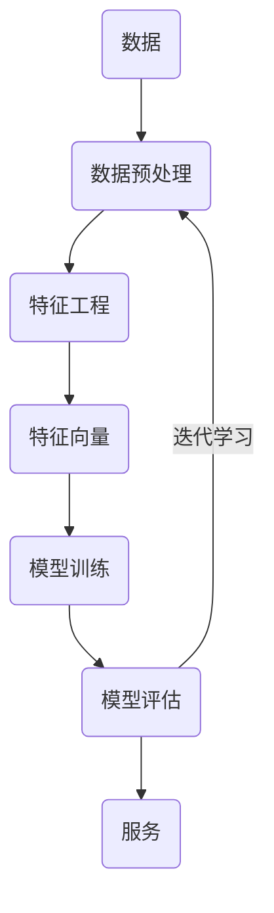

# 人工智能概述

人工智能指的是使计算机系统能够完成通常需要人类智能的任务的技术和方法。具体任务包括学习、推理、问题解决、感知和语言理解等。

## 人工智能发展历程

1956年8月，在美国达特茅斯学院举办了“人工智能研究夏季项目”的会议，此次会议被广泛认为是人工智能领域的起点。自1956年以来，人工智能技术发展虽经历了一些挑战，但仍取得了显著的进展。

### 图灵测试（Turing Test）

由英国数学家和计算机科学家图灵提出的一种测试方法，用于判断机器是否具有智能。

图灵测试的核心思想是通过对话来判断机器是否具有智能。具体来说，如果一台机器能够通过自然语言与人类进行对话，使对话的另一方无法辨别出其是机器还是人类，那么这台机器就被认为具有智能。

> 当前的人工智能技术虽然已经获得的重大的进步和广泛的应用，但是距离真正的人工智能还相去甚远。

## 人工智能、机器学习和深度学习

人工智能、机器学习和深度学习的关系：

- 机器学习是人工智能的一个实现途径。
- 深度学习是机器学习的一个方法发展而来。

## 人工智能三要素

* 算法：定义了机器如何处理信息、学习模式、进行推理和决策。
* 数据：可以理解为人工智能的“燃料”，是算法训练、测试和验证的基础。
* 算力：可以支持复杂的算法运算和大规模数据处理。
  * CPU 主要适合IO密集型的任务
  * GPU 主要适合计算密集型任务

[CPU和GPU的区别](http://www.sohu.com/a/201309334_468740)

## 人工智能应用场景

1. 自然语言处理
   * 机器翻译：利用机器的力量自动将一种自然语言（源语言）的文本翻译成另一种语言（目标语言）。
   * 语音识别：识别语音并将其转换成文本的技术。
   * 语言合成：
   * 人机对话：
   * 文本挖掘/分类：用于理解、组织和分类结构化或非结构化文本文档。其涵盖的主要任务有句法分析、情绪分析和垃圾信息检测。
2. 计算机视觉
   * 图片分类：
   * 图标分割：
   * 自动驾驶：
   * 图像处理：
   * 图像形成：
   * 人脸识别：
3. 机器人：研究的是机器人的设计、制造、运作和应用，以及控制它们的计算机系统、传感反馈和信息处理。

## 机器学习工作流程

机器学习是从数据中自动分析获得模型，并利用模型对未知数据进行预测。

### 工作流程

机器学习工作流程总结

1. 获取数据

2. 数据基本处理

3. 特征工程

4. 机器学习（模型训练）

5. 模型评估

   - 结果达到要求，上线服务

   - 没有达到要求，重新上面步骤

#### 获取数据

数据集一般可以看做为一个表格结构：

- 一行数据我们称为一个样本
- 一列数据我们成为一个特征
- 有些数据有目标值（标签值）

数据类型构成：

- 数据类型一：特征值+目标值（目标值是连续的和离散的）
- 数据类型二：只有特征值，没有目标值

数据分割：

- 机器学习一般的数据集会划分为两个部分：
  - 训练数据：用于训练，构建模型
  - 测试数据：在模型检验时使用，用于评估模型是否有效
- 划分比例：
  - 训练集：70% 80% 75%
  - 测试集：30% 20% 25%

#### 数据基本处理

即对数据进行缺失值、去除异常值等处理。

#### 特征工程

> 无法量化的事情，就无法优化。

图像的量化：每个像素的颜色值（R、G、B）。彩色图像可以转换为灰度图像。

电商用户画像：

1. 性别：
   * 1-男，0-女
   * [0, 1]-男，[1, 0]-女
2. 年龄：
   * 0~100 岁
   * [0, 15) [15, 40) [40, 60) [60, 100]

特征工程是使用专业背景知识和技巧处理数据，使得特征能在机器学习算法上发挥更好的作用的过程。

意义：会直接影响机器学习的效果

> 数据和特征决定了机器学习的上限，而模型和算法只是逼近这个上限而已。

特征工程包含内容

- 特征提取：将任意数据（如文本或图像）转换为可用于机器学习的数字特征。
- 特征转换：通过一些转换函数将特征数据转换成更加适合算法模型的特征数据过程。
- 特征降维：指在某些限定条件下，降低随机变量(特征)个数，得到一组“不相关”主变量的过程

#### 机器学习

选择合适的算法对模型进行训练

#### 模型评估

对训练好的模型进行评估

## 机器学习的算法

根据数据集组成不同，可以把机器学习算法分为：监督学习、无监督学习、半监督学习、强化学习

### 监督学习

输入数据是由输入特征值和目标值所组成。

* 函数的输出可以是一个连续的值（称为回归）
* 输出是有限个离散值（称作分类）

### 无监督学习

输入数据是由输入特征值组成，没有目标值

* 输入数据没有被标记，也没有确定的结果。样本数据类别未知。
* 需要根据样本间的相似性对样本集进行类别划分。

### 半监督学习

训练集同时包含有标记样本数据和未标记样本数据。

### 强化学习

自动进行决策，并且可以做连续决策，通过惩罚函数得到更好的训练结果。

## 模型评估

### 分类模型

评估标准：准确率、精确率、召回率、F1-score、AUC指标等。

### 回归模型评估

评估标准：均方根误差、相对平方误差、平均绝对误差、相对绝对误差

### 拟合

模型评估用于评价训练好的的模型的表现效果，其表现效果大致可以分为两类：欠拟合、过拟合。

#### 欠拟合

因为机器学习到的特征太少了，模型学习的太过粗糙，连训练集中的样本数据特征关系都没有学出来。

#### 过拟合

所建的机器学习模型或者是深度学习模型在训练样本中表现得过于优越，导致在测试数据集中表现不佳。

